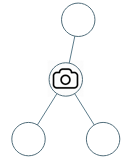
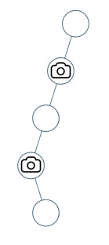

## 56. 合并区间 🌟🌟

[力扣链接](https://leetcode.cn/problems/merge-intervals/description/) 🌟🌟

### 题目描述

给出一个区间的集合，请合并所有重叠的区间。

示例 1:

- 输入: intervals = [[1,3],[2,6],[8,10],[15,18]]
- 输出: [[1,6],[8,10],[15,18]]
- 解释: 区间 [1,3] 和 [2,6] 重叠, 将它们合并为 [1,6].

示例  2:

- 输入: intervals = [[1,4],[4,5]]
- 输出: [[1,5]]
- 解释: 区间 [1,4] 和 [4,5] 可被视为重叠区间。
- 注意：输入类型已于 2019 年 4 月 15 日更改。 请重置默认代码定义以获取新方法签名。

### 解题思路

类似上篇 [452. 用最少数量的箭引爆气球](./greedy-algorithmc-code4.md/#452-用最少数量的箭引爆气球-)和[435. 无重叠区间](./greedy-algorithmc-code4.md/#435-无重叠区间-)

题解：

1. 按起始点从小到大排序
2. 如果 `intervals[i][0] <= intervals[i - 1][1]`，即当前左边界小于上一个右边界，则一定有重叠
3. 合并区间，更新右边界为 `Math.max(intervals[i][1], intervals[i - 1][1])`，合并为 `[intervals[i - 1][0], max(intervals[i - 1][1], intervals[i][1])]`
4. 没有重叠，则直接添加进数组

```js
var merge = function (intervals) {
  intervals.sort((a, b) => a[0] - b[0])
  const result = []
  // 初始化前一个区间为排序后的第一个区间
  let preInterval = intervals[0]
  for (let i = 1; i < intervals.length; i++) {
    const curInterval = intervals[i]

    // 判断当前区间是否与前一个区间重叠
    if (curInterval[0] <= preInterval[1]) {
      // 合并区间：更新前一个区间的结束点为两者中的较大值
      preInterval[1] = Math.max(curInterval[1], preInterval[1])
    } else {
      // 无重叠时，将前一个区间加入结果，并更新为当前区间
      result.push(preInterval)
      preInterval = curInterval
    }
  }

  // 将最后一个合并后的区间加入结果
  result.push(preInterval)
  return result
}
```

#### 示例

输入：`[[1,3],[2,6],[8,10],[15,18]]`  
执行过程：

1. 排序后顺序不变
2. 合并 `[1,3]` 和 `[2,6]` → `[1,6]`
3. `[8,10]` 与前一个区间无重叠，`[1,6]`加入结果
4. `[15,18]` 无重叠，`[8,10]`加入结果
5. `[15,18]`加入结果

输出：`[[1,6],[8,10],[15,18]]`

## 738.单调递增的数字 🌟🌟

[力扣链接](https://leetcode.cn/problems/monotone-increasing-digits/) 🌟🌟

### 题目描述

给定一个非负整数  N，找出小于或等于  N  的最大的整数，同时这个整数需要满足其各个位数上的数字是单调递增。

（当且仅当每个相邻位数上的数字  x  和  y  满足  x <= y  时，我们称这个整数是单调递增的。）

示例 1:

- 输入: N = 10
- 输出: 9

示例 2:

- 输入: N = 1234
- 输出: 1234

示例 3:

- 输入: N = 332
- 输出: 299

说明: N  是在  [0, 10^9]  范围内的一个整数。

### 解题思路

#### 暴力法

从当前数字递减，挨个判断是否为递增

```js
// 判断一个数字的各位上是否是递增
const checkNum = (num) => {
  let max = 10
  while (num) {
    let t = num % 10
    if (max >= t) max = t
    else return false
    num = Math.floor(num / 10)
  }
  return true
}

const monotoneIncreasingDigits = (N) => {
  for (let i = N; i > 0; i--) {
    // 从大到小遍历
    if (this.checkNum(i)) return i
  }
  return 0
}
```

#### 贪心法

举例：如果 N=98，一旦出现 num[i - 1] > num[i]时，首先给 num[i-1]--，然后 num[i]给为 9，这个数就是 89，满足最大的单调递增整数。

**遍历方式如何确定？**

1. 思考如果从前往后遍历，遇到 `num[i - 1] > num[i]` 时，如果让 `num[i - 1]--`，此时可能出现 `num[i - 1] < num[i - 2]`，如数字 332，从前往后遍历会变为 329，不符合
2. 从后往前遍历，遇到 `num[i] < num[i + 1]` 时，如果让 `num[i]--`，此时不会影响前面的数字，如数字 332，从后往前遍历先变为 329，继续遍历为 299，符合

**注意：找到最前面是递减的位置，然后让这个位置的数减一，后面位置都为 9，这样保证数值尽可能大**

如：100，从后往前遍历，找到递减的位置为 1，后面位置都为 9，即为 99

```js
var monotoneIncreasingDigits = function (n) {
  n = n
    .toString()
    .split('')
    .map((item) => +item)

  const len = n.length
  // 第一个递减的位置flag
  let flag = Infinity
  for (let i = len - 1; i > 0; i--) {
    if (n[i - 1] > n[i]) {
      flag = i
      n[i - 1]--
      n[i] = 9
    }
  }
  // 将flag 之后的所有位设为9，保证数值尽可能大
  for (let i = flag; i < n.length; i++) {
    n[i] = 9
  }

  return +n.join('')
}
```

## 968.监控二叉树 🌟🌟🌟

[力扣链接](https://leetcode.cn/problems/binary-tree-cameras/description/) 🌟🌟🌟

### 题目描述

给定一个二叉树，我们在树的节点上安装摄像头。

节点上的每个摄影头都可以监视其父对象、自身及其直接子对象。

计算监控树的所有节点所需的最小摄像头数量。

示例 1：



- 输入：[0,0,null,0,0]
- 输出：1
- 解释：如图所示，一台摄像头足以监控所有节点。

示例 2：



- 输入：[0,0,null,0,null,0,null,null,0]
- 输出：2
- 解释：需要至少两个摄像头来监视树的所有节点。 上图显示了摄像头放置的有效位置之一。

提示：

- 给定树的节点数的范围是 [1, 1000]。
- 每个节点的值都是 0。

### 解题思路

二叉树与贪心法的结合 ❗️❗️❗️

#### 如何放置摄像头？

- 摄像头覆盖上中下三层
- 摄像头不会放在头节点，浪费一个
- 摄像头不会放在叶子节点，浪费一堆
- 摄像头放在叶子节点的父节点，充分利用摄像头
- 应使用后序遍历

  ```js
  function traverse(root) {
    if (!root) return

    traverse(root.left)
    traverse(root.right)

    // 处理中间节点
  }
  ```

**局部最优：让叶子节点的父节点安装摄像头，所有摄像头最少**
**全局最优：放置最少的摄像头**

#### 如何隔两个节点放一个摄像头

需要状态转移，首先有三种状态：

- 0: 该节点无覆盖
- 1: 该节点被覆盖，但没有安装摄像头
- 2: 该节点被覆盖，且安装摄像头

为使摄像头最少，应该叶子节点的父节点安装摄像头，那么**空节点就应该是有覆盖状态**

- 如果空节点为无覆盖状态，那么叶子节点需要放置摄像头
- 如果空节点为有摄像头状态，那么叶子节点的父节点就没必要放置摄像头

- 递归的终止条件

  ```js
  // 空节点，有覆盖
  if (!cur) return 1
  ```

- 单层处理逻辑

  - 情况 1：左右节点都有覆盖

    左右孩子都有覆盖，那么此时中间节点就应该是无覆盖状态

    ```js
    if (left === 1 && right === 1) return 0
    ```

  - 左右节点至少一个无覆盖状态

    中间节点必须安装摄像头

    ```js
    if (left === 0 || right === 0) {
      result++
      return 2
    }
    ```

  - 左右节点至少一个有摄像头

    此时中间节点应该是有覆盖状态

    ```js
    if (left === 2 || right === 2) return 1
    ```

  - 头节点无覆盖状态

    递归结束后，需要判断根节点覆盖状态，如果无覆盖，则 result++

    ```js
    if (root === 0) result++
    ```

```js
var minCameraCover = function (root) {
  let result = 0
  const traverse = (cur) => {
    // 空节点，该节点有覆盖
    if (cur === null) return 1

    let left = traverse(cur.left)
    let right = traverse(cur.right)
    // 左右节点都被覆盖
    if (left === 1 && right === 1) return 0
    // 至少一个无覆盖
    if (left === 0 || right === 0) {
      result++
      return 2
    }
    // 至少一个有摄像头
    if (left === 2 || right === 2) return 1
  }

  // 根节点无覆盖状态
  if (traverse(root) === 0) {
    result++
  }

  return result
}
```
