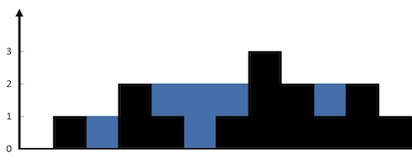
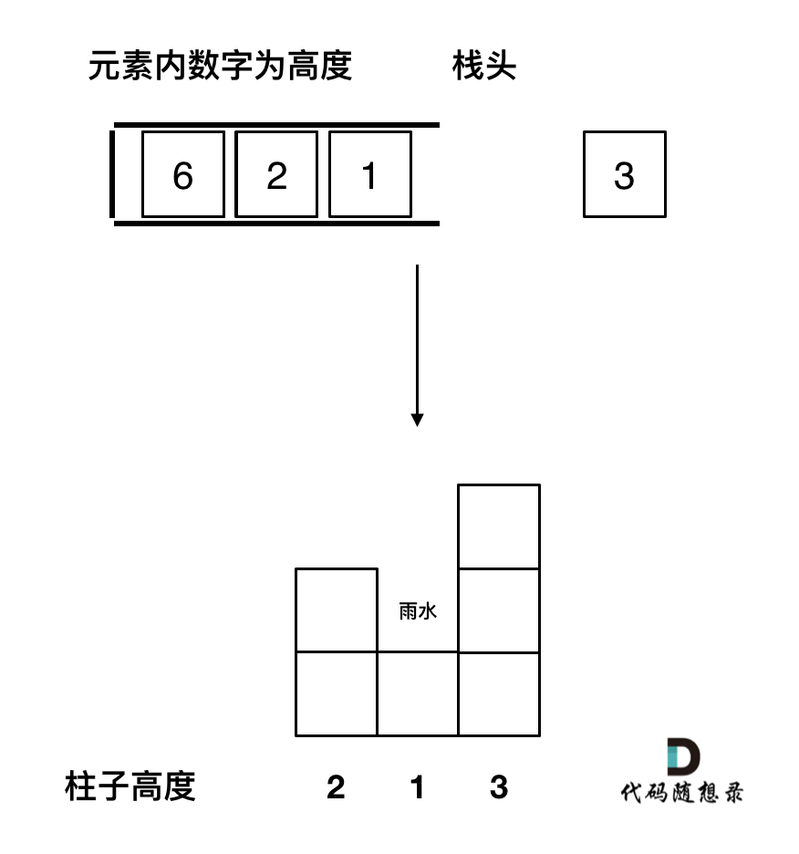
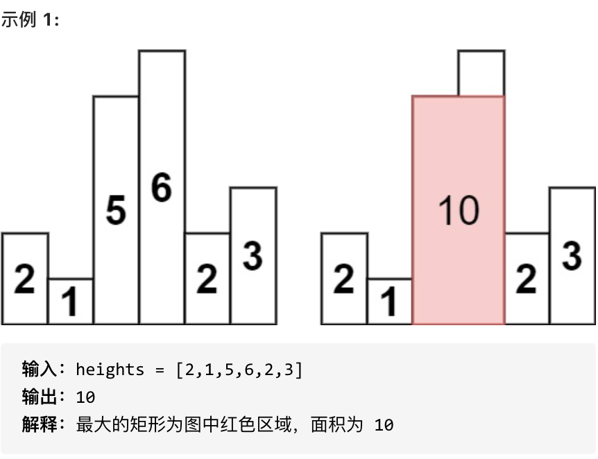
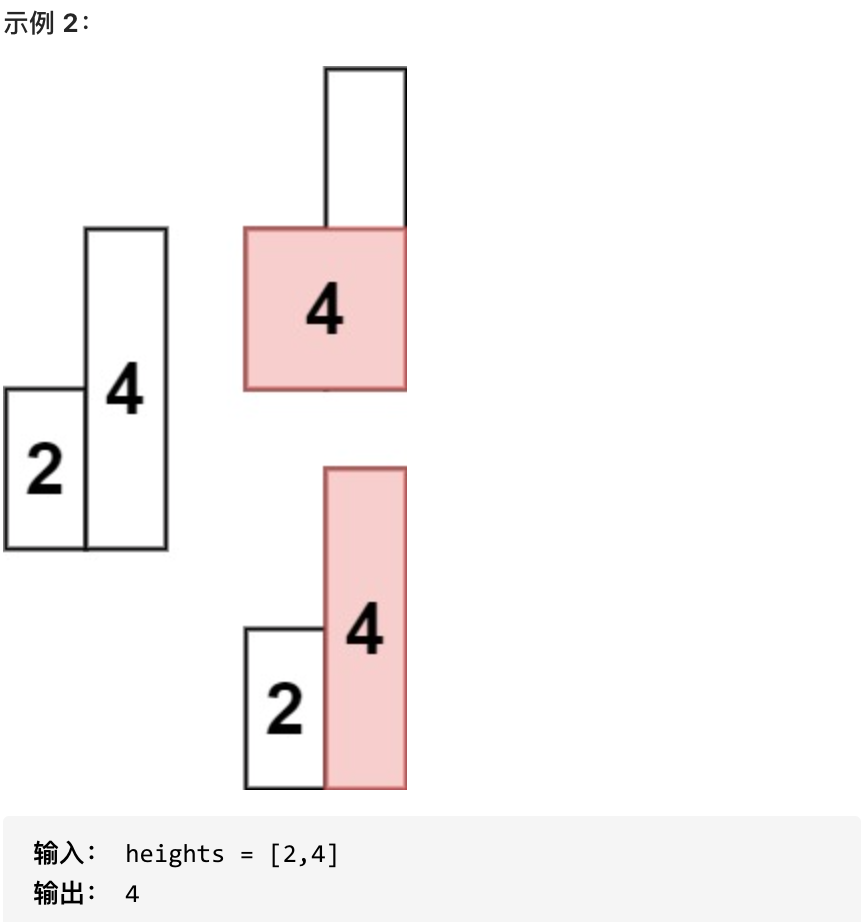

## 42. 接雨水 🌟🌟

[力扣链接](https://leetcode.cn/problems/trapping-rain-water/) 🌟🌟

### 题目描述

给定 n 个非负整数表示每个宽度为 1 的柱子的高度图，计算按此排列的柱子，下雨之后能接多少雨水。

示例 1：



- 输入：height = [0,1,0,2,1,0,1,3,2,1,2,1]
- 输出：6
- 解释：上面是由数组 [0,1,0,2,1,0,1,3,2,1,2,1] 表示的高度图，在这种情况下，可以接 6 个单位的雨水（蓝色部分表示雨水）。

示例 2：

- 输入：height = [4,2,0,3,2,5]
- 输出：9

### 解题思路

对每个柱子 i，找出其左侧最高柱子 leftMax 和右侧最高柱子 rightMax，当前柱子积水量取决于其左右两边最高柱子的较小值减去当前柱子的高度

```js
Math.min(leftMax, rightMax) - height[i]
```

#### 暴力法

遍历每个位置 i，找到左边最大值和右边最大值，计算每个位置的积水量，累加总和。

- 左边最大值：**从 0 到 i-1 中的最大值**
- 右边最大值：**从 i+1 到末尾的最大值**
- 计算每个位置的积水量

```js
var trap = function (height) {
  const len = height.length
  let total = 0

  for (let i = 1; i < len - 1; i++) {
    let leftMax = 0
    let rightMax = 0
    for (let j = 0; j < i; j++) {
      leftMax = Math.max(leftMax, height[j])
    }
    for (let j = i; j < len; j++) {
      rightMax = Math.max(rightMax, height[j])
    }

    const h = Math.min(leftMax, rightMax) - height[i]
    if (h > 0) total += h // 注意只有h大于零的时候，在统计到总和中
  }
  return total
}
```

暴力法：O(n^2)

#### 双指针优化

- 是对暴力法的优化，暴力法需要得到柱子 i 两边的最高高度 leftMax 和 rightMax
- maxLeft 数组用于记录每个柱子 i 左边的最高高度

  从左到右遍历，每个柱子的左边最大高度是：

  - 当前柱子的高度 height[i] 和
  - 它左边柱子的最大高度 maxLeft[i - 1] 的较大值

- maxRight 数组用于记录每个柱子 i 右边的最高高度

  从右到左遍历，每个柱子的右边最大高度是：

  - 当前柱子的高度 height[i] 和
  - 它右边柱子的最大高度 maxRight[i + 1] 的较大值

```js
//双指针
var trap = function (height) {
  const len = height.length
  if (len <= 2) return 0 // 如果柱子数量小于等于2，无法形成积水，直接返回0

  const maxLeft = new Array(len).fill(0) // 用于记录每个柱子左边的最大高度
  const maxRight = new Array(len).fill(0) // 用于记录每个柱子右边的最大高度

  // 记录每个柱子左边柱子的最大高度
  maxLeft[0] = height[0] // 第一个柱子的左边最大高度就是它自己
  for (let i = 1; i < len; i++) {
    maxLeft[i] = Math.max(height[i], maxLeft[i - 1]) // 当前柱子的左边最大高度是它左边柱子的最大高度和它自身高度的较大值
  }

  // 记录每个柱子右边柱子的最大高度
  maxRight[len - 1] = height[len - 1] // 最后一个柱子的右边最大高度就是它自己
  for (let i = len - 2; i >= 0; i--) {
    maxRight[i] = Math.max(height[i], maxRight[i + 1]) // 当前柱子的右边最大高度是它右边柱子的最大高度和它自身高度的较大值
  }

  // 求和
  let sum = 0 // 用于记录总的积水量
  for (let i = 0; i < len; i++) {
    let count = Math.min(maxLeft[i], maxRight[i]) - height[i] // 当前柱子上方的积水量是左右两边最大高度的较小值减去当前柱子的高度
    if (count > 0) sum += count // 如果积水量大于0，则累加到总积水量中
  }

  return sum // 返回总积水量
}
```

#### 单调栈

1. 与暴力法不同，单调栈是按照行来计算积水量
2. 栈头到栈尾是递增的

   - 一旦发现添加的柱子高度大于栈头元素，则出现凹槽
   - 此时栈头元素就是凹槽的底部，栈头第二个元素就是凹槽的左柱子，当前元素就是凹槽的右柱子

3. 遇到相同高度的柱子，则弹出旧的，加入新的，因为要求宽度的时候，需要有最右边的柱子来计算

处理逻辑：

- 当前遍历柱子高度小于栈顶元素高度 height[i] < height[stack.top()]

  当前元素入栈

- 当前遍历柱子高度等于栈顶元素高度 height[i] == height[stack.top()]

  - 需要先将旧元素出栈
  - 新元素再入栈

- 当前遍历柱子高度大于栈顶元素高度 height[i] > height[stack.top()]

  出现凹槽
  

  - 弹出栈顶元素，弹出的元素就是凹槽的底部
  - 弹出栈顶第二个元素，弹出的元素就是凹槽的左边柱子
  - 当前元素就是凹槽的右边柱子

  ```js
  const min = stack.pop() // 弹出栈顶元素，凹槽底部
  const left = stack[stack.length - 1] // 栈顶第二个元素，凹槽左边柱子
  // 当前槽的高度
  const h =
    Math.min(
      height[i],
      height[left] // 右边柱子和栈顶元素的较小值
    ) - height[mid]
  // 当前槽的宽度 = 凹槽右边的下标 - 凹槽左边的下标 - 1
  const w = i - left - 1
  sum = h * w
  ```

```js
var trap = function (height) {
  const len = height.length
  let total = 0
  const stack = []
  stack.push(0)

  for (let i = 1; i < len; i++) {
    while (stack.length && height[i] > height[stack[stack.length - 1]]) {
      const mid = stack.pop()
      if (stack.length) {
        const left = stack[stack.length - 1]
        const h = Math.min(height[i], height[left]) - height[mid]
        const w = i - stack[stack.length - 1] - 1 // 注意减一，只求中间宽度
        total += h * w
      }
    }
    stack.push(i)
  }

  return total
}
```

## 84.柱状图中最大的矩形 🌟🌟

[力扣链接](https://leetcode.cn/problems/largest-rectangle-in-histogram/) 🌟🌟

### 题目描述

给给定 n 个非负整数，用来表示柱状图中各个柱子的高度。每个柱子彼此相邻，且宽度为 1 。

求在该柱状图中，能够勾勒出来的矩形的最大面积。




- 1 <= heights.length <=10^5
- 0 <= heights[i] <= 10^4

### 解题思路

#### 暴力法

对每个柱子 i，向左右扩展找到第一个比它小的左边界 left 和右边界 right，当前柱子能形成的最大矩形面积为

```js
var largestRectangleArea = function (heights) {
  const n = heights.length

  let sum = 0

  for (let i = 0; i < n; i++) {
    let left = i - 1
    while (left >= 0 && heights[left] >= heights[i]) left--
    let right = i + 1
    while (right < n && heights[right] >= heights[i]) right++

    const w = right - left - 1
    sum = Math.max(sum, heights[i] * w)
  }
  return sum
}
```

#### 双指针优化

预处理每个柱子的左边界 left 和右边界 right，利用跳跃指针快速找到边界，避免重复遍历

```js
function largestRectangleAreaOptimized(heights) {
  const n = heights.length
  if (n === 0) return 0
  const left = new Array(n).fill(-1)
  const right = new Array(n).fill(n)

  // 预处理左边界
  for (let i = 1; i < n; i++) {
    let p = i - 1
    while (p >= 0 && heights[p] >= heights[i]) p = left[p]
    left[i] = p
  }

  // 预处理右边界
  for (let i = n - 2; i >= 0; i--) {
    let p = i + 1
    while (p < n && heights[p] >= heights[i]) p = right[p]
    right[i] = p
  }

  // 计算最大面积
  let maxArea = 0
  for (let i = 0; i < n; i++) {
    const width = right[i] - left[i] - 1
    maxArea = Math.max(maxArea, heights[i] * width)
  }
  return maxArea
}
```

#### 单调栈

- 区别：单调递减栈（栈头到栈底的顺序从大到小）
- 遇到比栈顶小的柱子时，弹出栈顶并计算以该高度为高的矩形面积，左边界为新的栈顶，右边界为当前索引

```js
function largestRectangleAreaMonotonicStack(heights) {
  heights = [0, ...heights, 0] // 添加哨兵简化代码
  let stack = []
  let maxArea = 0
  for (let i = 0; i < heights.length; i++) {
    while (stack.length && heights[i] < heights[stack[stack.length - 1]]) {
      const top = stack.pop()
      const left = stack[stack.length - 1]
      const width = i - left - 1
      maxArea = Math.max(maxArea, heights[top] * width)
    }
    stack.push(i)
  }
  return maxArea
}
```
