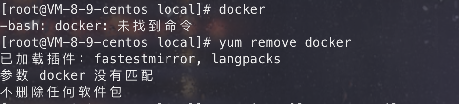
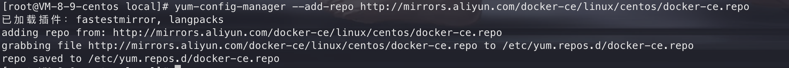
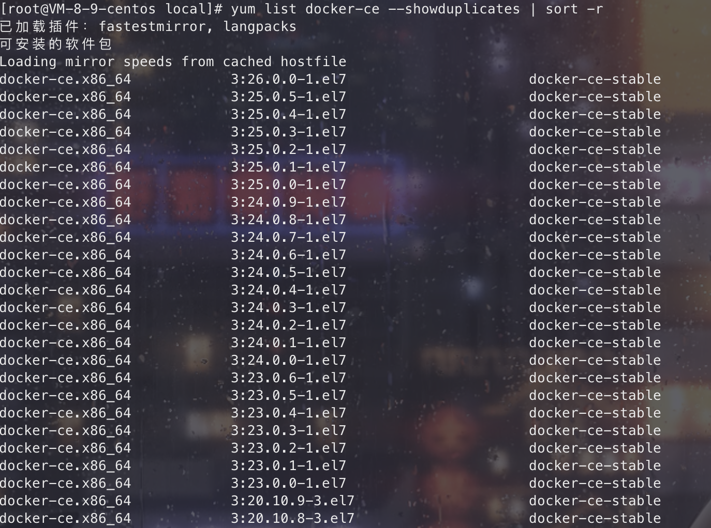
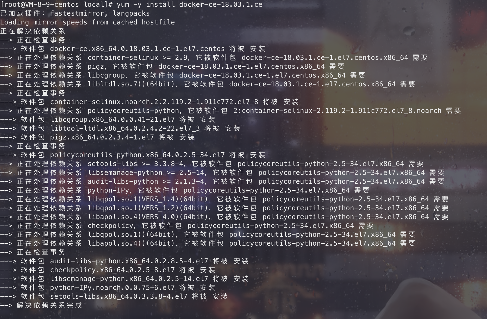
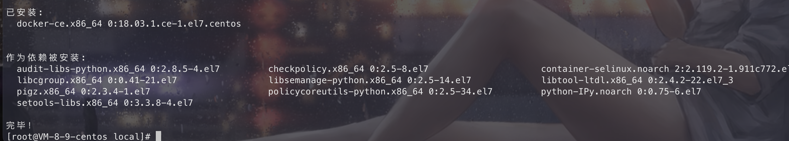

## 安装过程

安装前首先检查有无旧版本 docker，有则删除。

### 卸载旧版本

```bash
yum remove docker  docker-common docker-selinux docker-engine
```



### 安装需要的软件包

```bash
yum install -y yum-utils device-mapper-persistent-data lvm2
```

- yum-util 提供 yum-config-manager 功能
- device-mapper-persistent-data 和 lvm2 是 devicemapper 驱动依赖

### 设置 yum 像源

设置一个 yum 源，下面两个都可用

```bash
yum-config-manager --add-repo http://download.docker.com/linux/centos/docker-ce.repo（中央仓库）
yum-config-manager --add-repo http://mirrors.aliyun.com/docker-ce/linux/centos/docker-ce.repo（阿里仓库）
```



### 选择 docker 版本安装

#### 查看 docker 可用版本

```bash
yum list docker-ce --showduplicates | sort -r
```



#### 选择一个版本并安装：`yum install docker-ce-版本号`

```bash
yum -y install docker-ce-18.03.1.ce
```



### 安装完成

出现以下页面则说明安装完成。



## docker 启动

```bash
systemctl start docker
# 设置开机自启
systemctl enable docker
```

检查 docker 启动完成

```bash
docker version
```


如上，安装并启动成功。

## 安装 Docker Compose

Docker 是容器技术的核心，它提供了创建和运行容器的功能，而 Docker Compose 则是一个工具，它简化了多容器应用程序的部署和管理。
