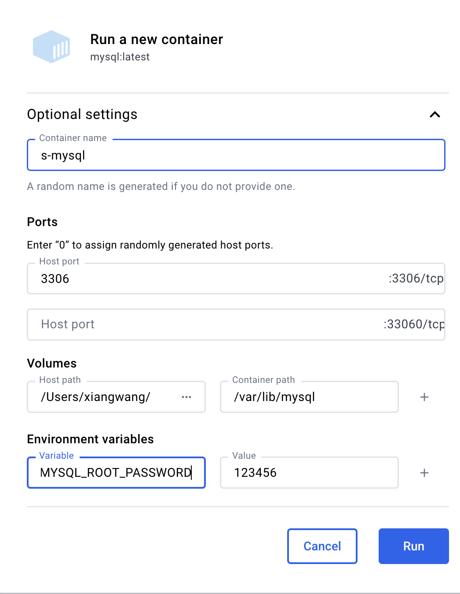
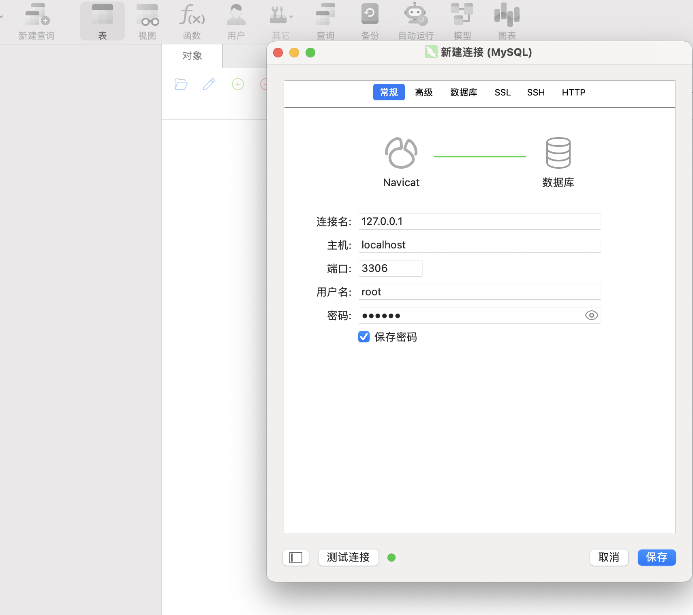
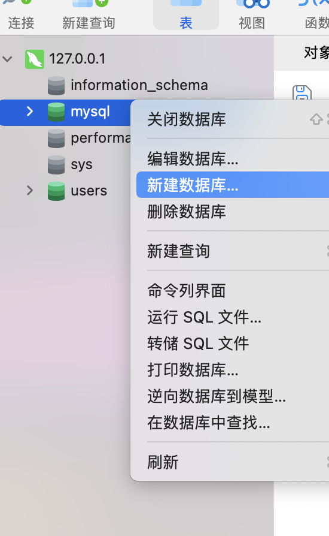
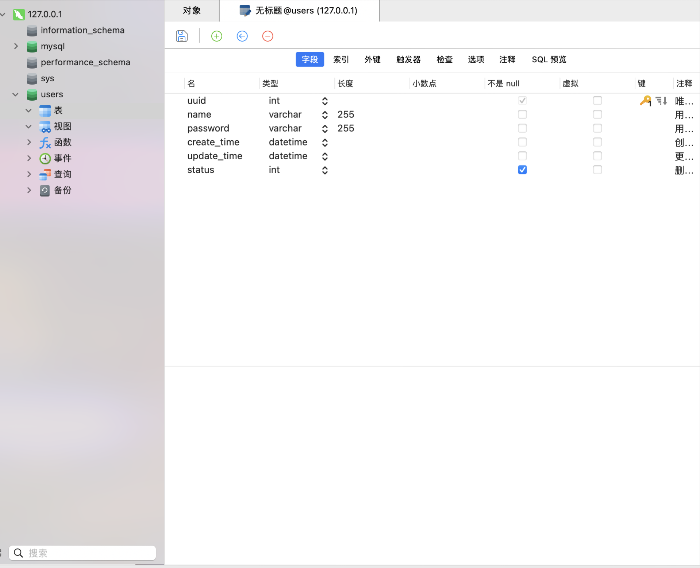
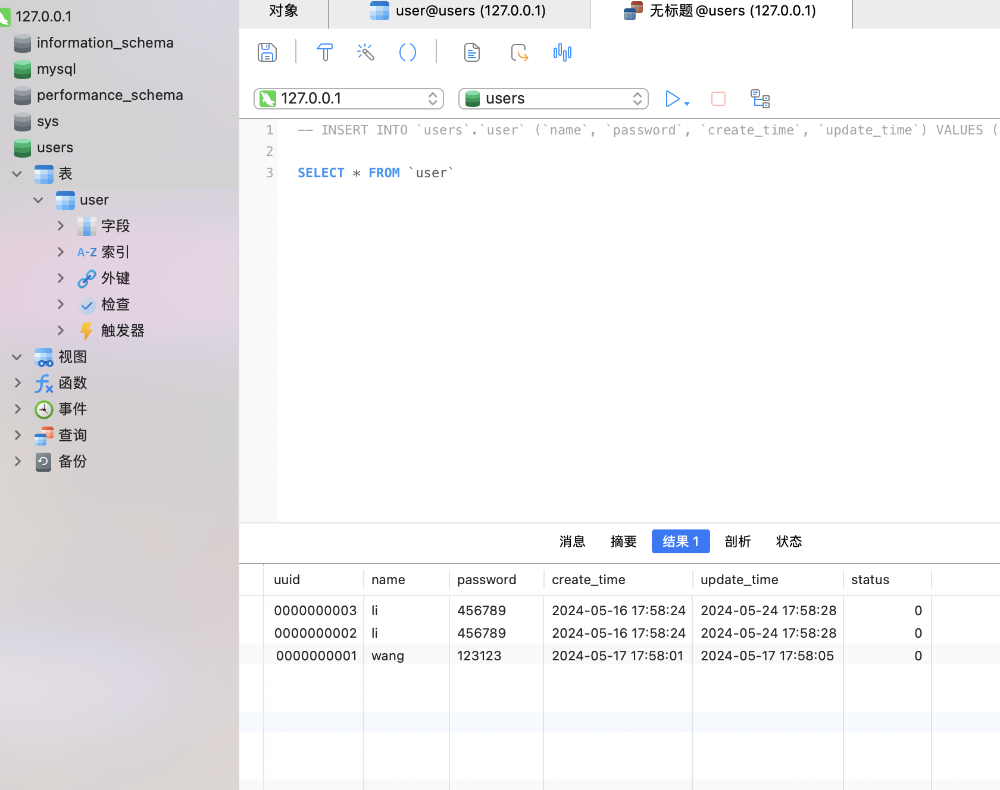

## 安装

通过 Docker 安装 mysql 镜像，完成后 run



`MYSQL_ROOT_PASSWORD` 参数是个必填项，用于指定 mysql 的密码，不填写启动会报错

## 连接工具

可以使用官方提供的免费版 [MySQL Workbench](https://dev.mysql.com/downloads/workbench/)，也可以找到破解版的 Navicat

连接数据库：



点击此按钮创建一个 schema，也就是一个数据库



mysql 中对应的关系如下：

一个连接 connection 可以创建多个数据库 schema，一个 schema 可以创建多个表 table

创建 schema 完成后，右键点击对应的 `表` 创建一个表



转成 sql 语句是这样：

```sql
INSERT INTO `users`.`user` (`name`, `password`, `create_time`, `update_time`) VALUES ('li', '456789', '2024-05-16 17:58:24', '2024-05-24 17:58:28')
```

接着查询所有数据，通过

```sql
SELECT * FROM `user`
```



还有修改和删除

```sql
UPDATE `hello-mysql`.`student` SET `email` = 'xxx@qq.com' WHERE (`id` = '10');
```
