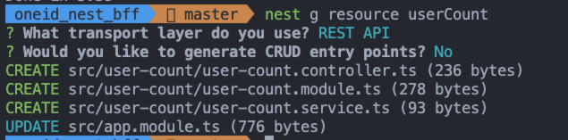

由于之前在 express 项目中直接使用的 mysql2 操作数据库，TypeORM 在 express 中不好添加，所以该用 nest 来实现。

## nest 搭建 bff 过程

### 1. 全局安装 nestjs/cli

```bash
npm install -g @nestjs/cli
```

### 2. 创建 nestjs 项目

```bash
nest new bff-project
```

通过 `pnpm start` 启动项目，此时在浏览器中直接输入 [http://localhost:3000/](http://localhost:3000/) 会出现 `Hello world`

修改 nest-cli.json，添加 generateOptions，设置 spec 为 false，这样生成代码的时候不会生成测试代码，和 nest g xxx --no-spec 效果一样

```json
{
  "$schema": "https://json.schemastore.org/nest-cli",
  "collection": "@nestjs/schematics",
  "generateOptions": {
    "spec": false
  },
  "sourceRoot": "src",
  "compilerOptions": {
    "deleteOutDir": true
  }
}
```

### 3. 安装 TypeORM 相关包

```bash
pnpm install --save @nestjs/typeorm typeorm mysql2
```

在 AppModule 引入 TypeOrmModule：

```js
import { Module } from '@nestjs/common'
import { TypeOrmModule } from '@nestjs/typeorm'
import { AppController } from './app.controller'
import { AppService } from './app.service'
import { UserCountModule } from './user-count/user-count.module'

@Module({
  imports: [
    TypeOrmModule.forRoot({
      type: 'mysql',
      host: '114.116.234.221',
      port: 3309,
      username: 'test_server_see',
      password: 'xxx',
      database: 'passport',
      synchronize: true,
      logging: true,
      entities: [],
      poolSize: 10,
      connectorPackage: 'mysql2',
      extra: {
        authPlugin: 'sha256_password',
      },
    }),
    UserCountModule,
  ],
  controllers: [AppController],
  providers: [AppService],
})
export class AppModule {}
```

### 4. 创建数据库表的 entity

使用命令生成 userCount 模块：

```bash
nest g resource userCount
```



可以看到此时生成的文件是没有 spec 相关的测试文件

1. 创建 entities 目录，新建 user-auth.entity.ts 文件。

   ```ts
   import {
     Entity,
     Column,
     PrimaryGeneratedColumn,
     CreateDateColumn,
     UpdateDateColumn,
   } from 'typeorm'

   @Entity('user_auth')
   export class UserAuth {
     @PrimaryGeneratedColumn()
     id: number

     @Column({ type: 'varchar', length: 50 })
     src: string

     @Column({ type: 'varchar', length: 128 })
     uuid: string

     @CreateDateColumn({ type: 'datetime', name: 'created_at' })
     createdAt: Date

     @UpdateDateColumn({ type: 'datetime', name: 'updated_at', nullable: true })
     updatedAt: Date

     @Column({ type: 'datetime', name: 'deleted_at', nullable: true })
     deletedAt: Date

     @Column({ type: 'tinyint', width: 4, name: 'display_flag' })
     displayFlag: number

     @Column({ type: 'varchar', length: 500, name: 'src_uuid' })
     srcUuid: string
   }
   ```

2. 在 AppModule 中导入并注册 UserAuth 实体类

   ```js
   // app.module.ts
   ....import { UserAuth } from './user-count/entities/user-auth.entity';

   @Module({
      imports: [
        TypeOrmModule.forRoot({
          type: 'mysql',
          host: '114.116.234.221',
          port: 3309,
          username: 'test_server_see',
          password: 'qmp20240126#dshk',
          database: 'passport',
          synchronize: false,
          logging: true,
          entities: [UserAuth],
          poolSize: 10,
          connectorPackage: 'mysql2',
          extra: {
            authPlugin: 'sha256_password',
          },
        }),
        UserCountModule,
      ],
      controllers: [AppController],
      providers: [AppService],
    })
    export class AppModule {}
   ```

   需要将 `synchronize: false,` 因为在库中已经有此表了，设置为 true 时会创建表

### 5. 使用实体类

在 service 层(user-count.service.ts)中使用 UserAuth 实体类来执行数据库操作
