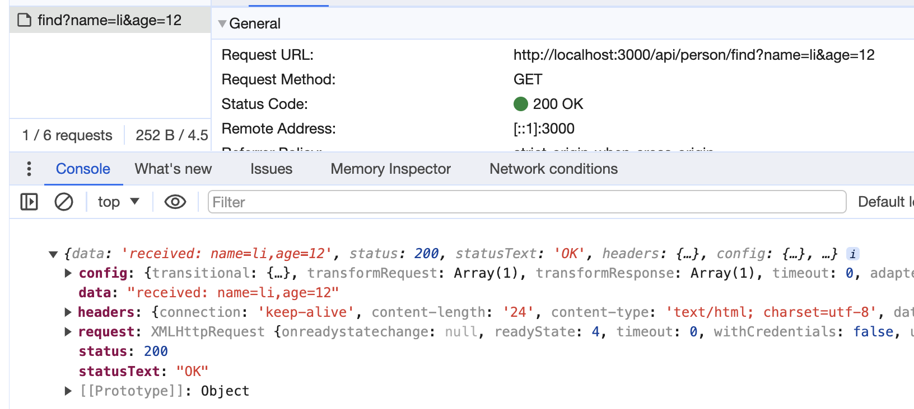

## 介绍

[Nest](https://nestjs.com/)是 Node 最流行的企业级服务端开发框架，内置并完全支持 TypeScript，提供了 IOC、AOP、微服务等架构特性。

Nest 底层使用 Express 或 Fastify，并做了一定程度的封。Nest 是前端同学尝试全栈开发的不二之选。

## Nest 项目初始化

Nest 项目初始化有两种方式：

1. 全局安装脚手架工具

   ```bash
   npm install -g @nestjs/cli
   nest new xxx
   ```

2. 直接使用 npx 安装

   ```bash
   npx @nestjs/cli new xxx
   ```

安装完成后，控制台输入`nest`查看可以执行的命令：


### 命令

#### new

用于初始化项目，更多配置可通过添加`-h`来查看帮助。接下来介绍的命令都可以通过`-h`来查看帮助。

```bash
# -h查看帮助
nest new -h
```


可以看到`new`命令支持多种选项的设置，通过简写大概大概就能看出他们的意思：

- --directory：指定创建目录
- --skip-git：跳过 git 的初始化
- --skip-install：跳过 npm install
- --package-manager：指定包管理工具，指定后初始化项目时不用选择
- --language：指定语言，默认为 typescript
- --strict：是否开启严格模式

#### generate

类似于 plop 这种，`generate`命令可以帮助我们快速生成模板代码，并且自动更新依赖

#### build

使用 tsc 或者 webpack 构建代码，默认使用 tsc 构建，通过`--webpack`切换为使用 webpack 进行打包

```bash
nest build --webpack
```

#### nest-cli.json

项目创建完成后，会生成`next-cli.json`文件，以上说的选项都可在这里进行配置。

如设置使用 webpack 进行打包，设置`"webpack": true`即可

```json
{
  "$schema": "https://json.schemastore.org/nest-cli",
  "collection": "@nestjs/schematics",
  "sourceRoot": "src",
  "compilerOptions": {
    "deleteOutDir": true,
    "webpack": true
  }
}
```

打包结果如下：


#### start

用于启动开发服务，可以通过`--watch`启动监听

#### info

查看项目信息，包括系统信息、 node、npm 和依赖版本


### 目录

项目初始化完成后，在 src 下存在 5 个文件：

```bash
.
├── app.controller.spec.ts
├── app.controller.ts
├── app.module.ts
├── app.service.ts
└── main.ts
```

#### main.ts

应用程序的入口文件，使用函数 `NestFactory.create(AppModule)` 创建 Nest 应用程序实例。

`AppModule`也就是根模块，可以类比为 Vue 的 App 根组件，`NestFactory.create`可以类比为 Vue 的`createApp`

#### app.module.ts

Nest 应用以模块 Module 为单元，Module 中包含两个核心：控制器和提供者。

App 模块即 Nest 应用的根模块，负责将所有的控制器和提供者组织到一起。

```ts
@Module({
  controllers: [AppController],
  providers: [AppService],
})
```

`@Module` 是装饰器语法，将 AppModule 类声明为一个模块。

#### app.controller.ts

App 模块的控制器层代码，用来接收 http 请求，调用服务层 service 处理后，返回响
应数据，**对应的 MVC 中的 C 层**

```ts
@Controller()
export class AppController {
  constructor(private readonly appService: AppService) {}

  @Get()
  getHello(): string {
    return this.appService.getHello()
  }
}
```

`@Controller` 装饰器将 AppController 声明为一个控制器
`@Get` 装饰器声明 getHello 是一个处理 Http 的 GET 请求的方法
`@Controller` 和 `@Get` 接收一个字符串用来拼接路由，如 `@Controller('hello')`和`@Get(world)`拼接出的路由就是`/hello/world`。示例代码默认为空，表示根路由`/`

#### app.service.ts

App 模块的服务层代码，主要用于处理业务逻辑，对应 MVC 中的 M 层

```ts
@Injectable()
export class AppService {
  getHello(): string {
    return 'Hello World!'
  }
}
```

`@Injectable` 装饰器将 AppService 声明为提供者

getHello 方法，返回字符串`Hello, World!`，在控制器 AppController 调用此方法，最终这个字符串返回给到浏览器。

### 运行项目

此时，我们通过`npm run start`启动项目，在浏览器中输入 `localhost:3000` 如下：


我们可以试着修改 AppController 中，添加不同的路由：

```ts
// app.controller.ts
@Controller()
export class AppController {
  constructor(private readonly appService: AppService) {}

  @Get()
  getHello(): string {
    return this.appService.getHello()
  }
  @Get('/random')
  getNum(): number {
    return this.appService.getNum()
  }
}
```

```ts
// app.service.ts
@Injectable()
export class AppService {
  getHello(): string {
    return 'Hello World!'
  }
  getNum(): number {
    return Math.random() * 10
  }
}
```

此时需要重新运行项目（更新不会立即生效，需要更新立即生效时使用`npm run start:dev`启动项目）

再次访问`localhost:3000/random`，如下


## Nest 构建 CRUD 项目

通过一个基础的 CRUD 项目来了解 Nest 的核心原理。

## Nest 实现五种 HTTP 数据传输方式

通过 `generate` 来快速创建 crud 模版代码：

```bash
nest generate resource person
```


接着执行 `npm run start:dev` 来启动项目，一个简单的 crud 项目就启动了，在控制台打印中可以看到有这些接口可以使用：


get 请求我们可以直接在浏览器中进行测试：


**访问静态资源**

如果想访问静态资源，需要在 main.ts 中进行设置

```ts
async function bootstrap() {
  const app = await NestFactory.create<NestExpressApplication>(AppModule)
  app.useStaticAssets('public', { prefix: '/static' })
  await app.listen(3000)
}
bootstrap()
```

接着在静态文件目录 public 下添加 index.html 文件，访问 `http://localhost:3000/static/index.html` 如下：


### url param

url param 就是将 url 直接写在 url 上，比如 `http://localhost:3000/api/person/12`，其中 `12` 就是路径中的参数（url param）

在 Nest 中通过 `@Get(':id')` 和 `@Param('id')` 配合拿到它。

如上面创建的`person`模块中：

```ts
@Get(':id')
findOne(@Param('id') id: string) {
  return `received id: ${id}`;
  // return this.personService.findOne(+id);
}
```

此时我们在浏览器地址栏直接输入 `http://localhost:3000/api/person/12`，便会得到以下结果：


或者在静态资源 `/public/index.html` 中通过 http 请求：

```js
async function urlParam() {
  const res = await axios.get('/api/person/1')
}
urlParam()
```

结果如下：


### query

query 同样是通过 url 来传递参数，通过 url 中 ？后面的用 & 分隔的字符串传递数据，比如 `http://localhost:3000/api/person/find?name=li&age=12`。

在 Nest 中通过 `@Query()` 可以获取到传递的参数。

```js
@Get('find')
find(@Query('name') name: string, @Query('age') age: number) {
  return `received: name=${name},age=${age}`;
}
@Get(':id')
findOne(@Param('id') id: string) {
  return `received id: ${id}`;
}
```

注意，我们新添加的 `find` 路由要放到 `:id` 路由的前面，因为 Nest 是从上往下匹配的，如果放在后面，那匹配的就是 `:id` 的路由。

此时我们可以直接通过 url 访问 `http://localhost:3000/api/person/find?name=li&age=12` 或者构造 http 请求：

```js
async function query() {
  const res = await axios.get('/api/person/find', {
    params: {
      name: 'li',
      age: 12,
    },
  })
}
query()
```

结果如下：



### form urlencoded

前面两种都是 get 请求，将传递的参数存放在 url 中，而接下来的几种数据传输方式都是 post 请求，将传递的参数存放在 body 中。

form urlencoded 是通过表单提交数据，就是将 query 的数据放在 body 中发送 post 请求提交。

通过表单提交的数据，会以 `application/x-www-form-urlencoded` 的格式提交，Nest 中可以通过 `@Body()` 解析请求体，注入到 `dto` 中，`dto` 就是 data transfer object，即封装传输数据的对象。

```js
export class CreatePersonDto {
  name: string
  age: number
}
```

```js
@Post()
body(@Body() createPersonDto: CreatePersonDto) {
  return `received: ${JSON.stringify(createPersonDto)}`;
}
```

构造 http 请求：

```js
async function formUrlEncoded() {
  const res = await axios.post(
    '/api/person',
    Qs.stringify({
      name: 'li',
      age: 12,
    }),
    {
      headers: { 'content-type': 'application/x-www-form-urlencoded' },
    }
  )
}
formUrlEncoded()
```

结果如下：


### form data

form data 大多用于传输文件，axios 中需要指定 content type 为 `multipart/form-data`，并且用 FormData 对象来封装传输的内容。

Nest 中要使用 `FilesInterceptor` 来处理其中的 binary 字段，用 `@UseInterceptors` 装饰器启用，配置 `dest` 为上传文件的目录，然后通过 `@UploadedFiles` 来读取，其余非文件字段用 `@Body` 来读取。

```js
@Post('file')
@UseInterceptors(AnyFilesInterceptor({
  dest: 'uploads/'
}))
body2(@Body() createPersonDto: CreatePersonDto, @UploadedFiles() files: Array<Express.Multer.File>) {
  return `received: ${JSON.stringify(createPersonDto)}`
}
```

构造 http 请求：

```html
<input id="fileInput" type="file" multiple />
<script>
  const fileInput = document.querySelector('#fileInput')

  async function formData() {
    const data = new FormData()
    data.set('name', 'li')
    data.set('age', 12)
    data.set('file1', fileInput.files[0])
    data.set('file2', fileInput.files[1])

    const res = await axios.post('/api/person/file', data, {
      headers: { 'content-type': 'multipart/form-data' },
    })
  }

  fileInput.onchange = formData
</script>
```

结果如下：


服务端成功接收到我们上传的文件，并且保存在配置的 `dest` 目录中：


### json

json 格式应该是最为常用的了，直接将 json 数据作为请求体发送，Nest 中通过 `@Body()` 来解析请求体，注入到 `dto` 中。

form urlencoded 和 json 都是从 body 取值，Nest 内部会根据 content type 做区分，使用不同的解析方式。

```js
@Post()
body(@Body() createPersonDto: CreatePersonDto) {
  return `received: ${JSON.stringify(createPersonDto)}`
}
```

构造 http 请求：

```js
async function json() {
  const res = await axios.post('/api/person', {
    name: 'li',
    age: 12,
  })
}
json()
```

结果如下：


这 5 种 http 的传输数据的方式覆盖了绝大多数开发场景，如果你想进阶全栈，理解这 5 种接口是首先要做到的。

## Nest 基础
