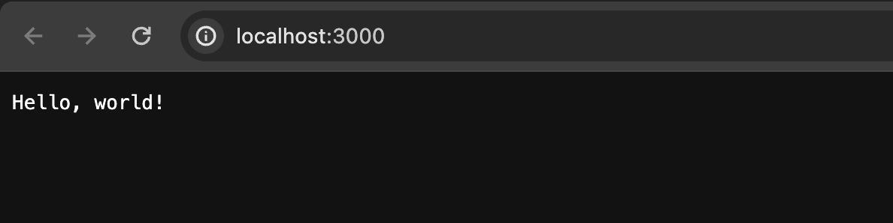

## 前言

在进行 Web 开发时，搭建一个本地服务是非常有用的。本地服务可以帮助你在开发过程中快速查看并测试你的网站或应用程序。Express 是一个流行的 Node.js web 框架，它提供了快速、灵活和简单的方式来构建 Web 应用程序和 API。下面介绍如何使用 Express 搭建一个简单的本地服务。

## “刀耕火种”时代

虽然有了框架的加持，写一个本地服务会非常轻松， 但是我们仍然也需要知道，它底层到底是怎么实现的，下面写一个基本的示例，看看不使用框架，应该怎么写：

### 编写代码

在 server.js 文件中编写以下代码：

```js
// server.js
const http = require('http');
const url = require('url');
const port = 3000;
// 创建服务
const server = http.createServer((req, res) => {
  const parsedUrl = url.parse(req.url, true);
  const path = parsedUrl.pathname;
  // 路由解析
  if (path === '/' &amp;&amp; req.method === 'GET') {
    res.writeHead(200, {'Content-Type': 'text/plain'});
    res.end('Hello, world!');
  } else if (path === '/about' &amp;&amp; req.method === 'GET') {
    res.writeHead(200, {'Content-Type': 'text/plain'});
    res.end('About us');
  } else {
    res.writeHead(404, {'Content-Type': 'text/plain'});
    res.end('404 Not Found');
  }
});
// 监听端口
server.listen(port, () => {
  console.log(`Server is running at http://localhost:${port}`);
});
```

### 启动服务器

在命令行中，进入你的项目目录，然后运行以下命令来启动服务器：

```bash
node server.js
```

现在，Node.js 服务器已经在本地运行，并且可以通过浏览器访问了。

### 在浏览器中访问

打开 Web 浏览器，并在地址栏中输入 http://localhost:3000，然后按下回车键，会看到浏览器显示 "Hello, world!"。



访问 about 路由


访问一个不存在的路由


## 使用 Express 搭建

上面的方式真的很原始，所有的逻辑都需要手动完成，针对大型项目开发而言，无疑是非常浪费时间和折磨的。

### 始化一个新项目

打开命令行界面，进入你想要创建项目的目录，然后运行以下命令来创建一个新的 Express 项目

```bash
npm init -y
npm install express --save
```

### 创建 Express 应用程序

创建一个新的 JavaScript 文件（例如 app.js），然后在文件中编写以下代码：

```js
const express = require('express')
const app = express()
const port = 3000
app.get('/', (req, res) => {
  res.send('Hello, world!')
})
app.get('/about', (req, res) => {
  res.send('About us')
})
app.listen(port, () => {
  console.log(`Server is running at http://localhost:${port}`)
})
```

### 启动服务器

在命令行中，进入项目目录，然后运行以下命令来启动 Express 服务器：

```bash
node app.js
```

## 对比一下

1. 我们不需要感知那么底层 去手动创建一个 httpServer, 对项目开发而言 是没多大用处且冗余的

2. 很明显的感受，我们不需要自己去做路由参数的解析，这是因为框架集成了“路由中间件”（Express 是一个路由和中间件 Web 框架，其自身功能最少。换句话说，Express 应用程序本质上是一系列中间件函数调用。）

3. 由于演示的是非常简单，可能并没有那么强烈的对比，但是可以试想一下，如果再有 cookie 处理、身份验证、日志记录、大量的路由处理等等，使用原生的写法，代码会很冗余。
