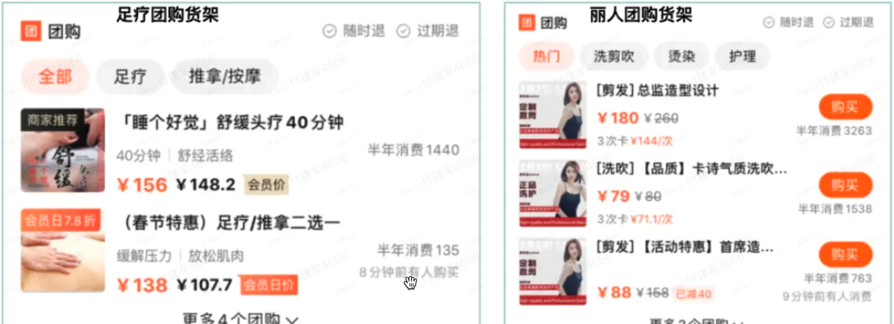

BFF 是一种 Web 架构，全名为 Backends For Frontends，即为服务于前端的后端。这个词来源于 Sam Newman 的一篇文章：[Pattern: Backends For Frontends](https://samnewman.io/patterns/architectural/bff/)。BFF 一般指的是在前端与后端之间加增加一个中间层。为什么要在前端和后端之间增加一个 BFF 层呢？
计算机科学家 David Wheeler 曾经说过一句话：All problems in computer science can be solved by another level of indirection.计算机科学中的所有问题都可以通过加一层来解决。因此，需要使用 BFF 的场景，肯定是普通的前后端开发模式遇到了部分问题。例如在 Sam Newman 的文章中就描述了 BFF 解决多个展示端的场景。

## 多端展示问题

在系统一开始开发的时候只考虑了 PC 网页端的设计，服务器端 API 是为了 PC 网页端而服务的。但是后来随着移动互联网的兴起，移动端开始流行，决定在原有服务端的基础上开发移动端 App，复用之前的 API，但是原有 API 是为了 PC 端设计的，并不符合移动端的需求。

1. PC 端的需求与移动端并不一定完全相同，现有接口无法满足所有移动端的新需求。
2. PC 端电脑性能强，可以并发请求多个接口或进行部分较复杂的数据处理，但是移动端性能低，如果使用同样的多个接口，由前端组装数据，页面展示可能会出现延迟和卡顿现象。
3. PC 端的屏幕较大，展示内容较多且全面。但是移动端屏幕小，展示内容较少。而且部分数据的获取并不容易，需要后端调用许多服务。如果移动端复用 PC 端接口，会获取和传输部分无用数据，不仅消耗服务端资源，还浪费网络带宽。

而且随着科技的发展和用户的需求，不同的展示端越来越多，在不仅在手机上会区分 Android 端，IOS 端，而且还会有平板电脑端，手机网页端，PC 网页端，PC 的 APP 端等等。这些端的页面设计各不相同，对于数据的需求也不相同。假设我们复用同一个服务端和 API 接口，如果出现不满足需求的场景就加接口加字段，那么随着这些不同客户端的开发和迭代，服务端会变的大而臃肿，效率低下。而且同一个接口提供给太多前端调用，涉及到太多的逻辑，复杂性越来越高。
因此，更好的方式是服务端对展示进行解耦，服务端只负责提供数据，有专门的展示端负责前端的展示业务。这里的展示端就是 BFF 层。

## 不同业务场景的展示模式差异

在某些业务中，客户端的类型只有一种，但是在不同的场景下，展示的模式有差异。比如在[美团的 BFF 实践](https://mp.weixin.qq.com/s/mhM9tfWBlIuMVkZQ-6C0Tw)中，不同行业的团购货架展示模块不同，是两套独立定义的产品逻辑，并且会各自迭代。

在这种业务场景下，虽然是同一个客户端，但是业务不同，需求的数据格式和类型也不同，因此遇到与上面多端展示类似的接口问题。