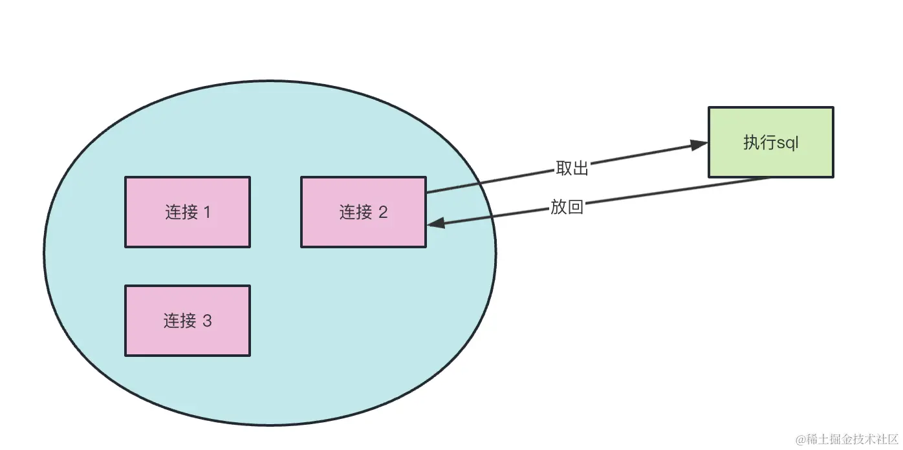
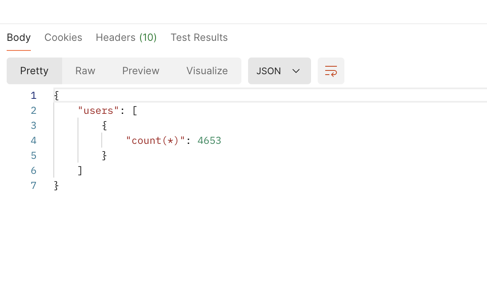

## 之前使用

### 封装接口调用函数

之前使用后端提供的接口进行数据库的增删改查：

```js
import request from '@lib/request.js'

/** 查询 */
export const selectDB = (body, headers) => {
  return request.post(`/db/${body.database}/select`, body, {
    headers: { token: headers.token },
  })
}

/** 修改 */
export const updateDB = (body, headers) => {}

/** 新增 */
export const insertDB = (body, headers) => {}
```

### 使用

```js
const _body = {
  database: database.qmp_data_sso.name,
  table: database.qmp_data_sso.table.qmp_user_info,
  column: [],
  where: {
    wheres: [{ column: 'display_flag', opt: '=', value: '1' }],
  },
}

return db.selectDB(_body, headers)
```

## mysql vs mysql2

[mysql 实现 MySQL 协议的纯 Node.js JavaScript 客户端](https://github.com/mysqljs/mysql?tab=readme-ov-file#install)

[mysql2 ⚡ 适用于 Node.js 的快速 mysqljs/mysql 兼容 mysql 驱动程序](https://github.com/sidorares/node-mysql2?tab=readme-ov-file#history-and-why-mysql2)

[MySQL2 的历史以及选择原因](https://sidorares.github.io/node-mysql2/zh-CN/docs/history-and-why-mysq2)

mysql2 是 mysql 包的升级版，有更多特性。

## express 使用 mysql2 基础配置

### 1. 安装依赖

```bash
yarn add mysql2
```

### 配置数据库连接池

可以通过 `createConnection` 在需要操作数据库的时候，建立连接，用完之后释放连接，但这样会浪费性能，因为数据库的连接建立还是很耗时的，而且一个连接也不够用。

这时候就需要连接池来管理数据库连接、提高 mysql 的使用性能并减少资源消耗：连接池会重用以前的连接而不是重新创建连接，保持打开而不是关闭。



连接池中放着好几个 mysql 的连接对象，用的时候取出来执行 sql，用完之后放回去，不需要断开连接。

创建一个数据库连接池并导出，以便在整个应用程序中共享使用：

```js
import {
  MYSQL_HOST,
  MYSQL_PORT,
  MYSQL_USER,
  MYSQL_PASSWORD,
} from '../../index.js'
import mysql from 'mysql2/promise'

const pool = mysql.createPool({
  host: MYSQL_HOST,
  port: MYSQL_PORT,
  user: MYSQL_USER,
  password: MYSQL_PASSWORD,
  database: 'passport',
  waitForConnections: true, //连接超额是否等待
  connectionLimit: 10, //一次创建的最大连接数
  queueLimit: 0, //可以等待的连接的个数
  maxIdle: 10, // 超过10个空闲会释放
  idleTimeout: 60000, // 空闲的连接需要多久断开
  enableKeepAlive: true,
  keepAliveInitialDelay: 0,
})

export default pool
```

数据库连接相关配置写在 config 中

连接池配置：

- connectionLimit：指定连接池中允许的最大连接数，比如 10，也就是同时最多使用 10 个，再多就需要排队
- queueLimit：指定当连接池中的连接已满时，请求排队等待的最大数量，设置为 0 时没有上限
- waitForConnections：指定是否等待可用连接。如果设置为 true，则在连接不足时请求将被排队，为 false 时直接报错
- maxIdle：指定最多有多少个空闲的，超过这个数量的空闲连接会被释放
- idleTimeout：空闲的连接需要多久断开
- enableKeepAlive、keepAliveInitialDelay：保持心跳用的，默认值即可

### 3. 使用连接池执行数据库操作

在模型层（model 层），使用连接池的 getConnection 方法获取连接，执行数据库操作需要释放连接，详见[官方文档](https://sidorares.github.io/node-mysql2/zh-CN/docs/examples/connections/create-pool)

```js
// 实现一个查询用户数量的接口
import pool from '@/config/database.js'

const UserCountModel = {
  async getAllUserCount() {
    let connection
    try {
      connection = await pool.getConnection()
      const [rows, filed] = await connection.query(
        'SELECT count(*) FROM user_info'
      )
      return rows
    } catch (error) {
      throw error
    } finally {
      if (connection) connection.release() // 释放连接回连接池
    }
  },
}
```

query 返回结果

- rows：数组，包含了查询结果的所有行数据。每一行数据通常是一个对象，具体结构取决于查询语句的结果。如果没有匹配的行，则 rows 是一个空数组 []。
- fields：数组，包含了查询结果的字段信息。每个字段对象通常包含字段的名称、类型等信息。如果查询结果不包含字段（例如 SELECT COUNT(\*)），则 fields 是 undefined。



注意事项

- 错误处理：务必在适当的地方捕获和处理数据库操作可能出现的错误，例如网络中断、SQL 错误等。

- 连接释放：使用 connection.release() 方法来释放连接回连接池，以便其他请求可以继续使用。

### 4. 在 Controller 层调用 Model 层的方法

```js
import UserCountModel from '@/models/userCountModel.js'

// 获取所有用户数量
export const getAllUserCount = async (req, res) => {
  try {
    const users = await UserCountModel.getAllUserCount()
    res.json(users)
  } catch (err) {
    res.status(500).json({ message: err.message })
  }
}
```

### 5. 通过路由调用 Controller 层

```js
import express from 'express'
import { getAllUserCount } from '@/controllers/userCountCountController.js'

const router = express.Router()

// GET /count 路由
router.get('/count', getAllUserCount)

export default router
```

### 报错集锦

#### node_modules/mysql2/node_modules/lru-cache/dist/cjs/index.js:781 this.#dispose?.(oldVal, k, 'set');

太坑了，必须把 mysql2 版本降到 3.0.0，不然报错

[解决方法](https://github.com/isaacs/node-lru-cache/issues/314)

## TypeORM

使用上述方法可以正常的在 node 中操作数据库，但一般不会这样直接执行 sql，而是会使用 ORM 框架。

ORM 是 Object Relational Mapping（对象关系映射）。就是把 mysql 这种关系型数据库的表映射成面向对象的 Class，表的字段映射成对象的属性映射，表与表的关联映射成属性的关联。

而 [TypeORM](https://typeorm.bootcss.com/) 就是用于 TypeScript 和 JavaScript 流行的 ORM 框架，兼容多种数据库。

TypeORM 特性

- 实体 (Entity)：定义数据库表的类。
- 仓库 (Repository)：用于访问实体的存储库。
- 迁移 (Migration)：管理数据库迁移。
- 查询生成器 (Query Builder)：以编程方式构建 SQL 查询。
- 数据映射和关系：支持一对一、一对多、多对多等关系。

### 使用步骤

#### 1. 安装依赖

```bash
npm install typeorm reflect-metadata
```

需要在应用程序的全局位置导入（例如在 app.ts 中）

```bash
import 'reflect-metadata'
```

#### 2. TypeORM 配置

ormconfig.json 是 TypeORM 的配置文件，用于配置数据库连接、实体、迁移等信息。

在项目根目录创建一个 ormconfig.json 文件，配置数据库连接：

```json
{
  "type": "mysql",
  "host": "localhost",
  "port": 3306,
  "username": "root",
  "password": "password",
  "database": "test",
  "synchronize": true,
  "logging": false,
  "entities": ["src/entity/**/*.ts"],
  "migrations": ["src/migration/**/*.ts"],
  "subscribers": ["src/subscriber/**/*.ts"]
}
```

- synchronize: 同步建表，也就是当 database 里没有和 Entity 对应的表的时候，会自动生成建表 sql 语句并执行。
- logging: 打印生成的 sql 语句
- entities: 是指定有哪些和数据库的表对应的 Entity

TypeORM 会自动读取项目根目录中的 ormconfig.json 文件来配置连接和其他设置。在代码中无需显式引用 ormconfig.json，TypeORM 会自动读取和使用该文件的配置。

#### 3. 创建数据库连接模块

在 src/config 目录中创建一个 datasource.js 文件，用于管理数据库连接：

```js
import 'reflect-metadata'
import { createConnection } from 'typeorm'

const connectDatabase = async () => {
  try {
    await createConnection()
    console.log('数据库链接建立成功')
  } catch (error) {
    console.error('连接数据库失败', error)
    throw error
  }
}

export default connectDatabase
```

#### 4. 创建实体 Entity

实体 (Entity) 是 TypeORM 映射到数据库表的类。每个实体类代表数据库中的一张表，类中的每个属性对应表中的一列。

如我们数据库有一个 user_info 表：


user_info 表具有以下列：

- id (主键)
- uuid (字符串)
- nickname
- avatar
- desc
- phone
- created_at (日期时间)
- updated_at
- deleted_at
- display_flag

我们创建一个对应的实体类 `src/entity/UserInfo.js`
