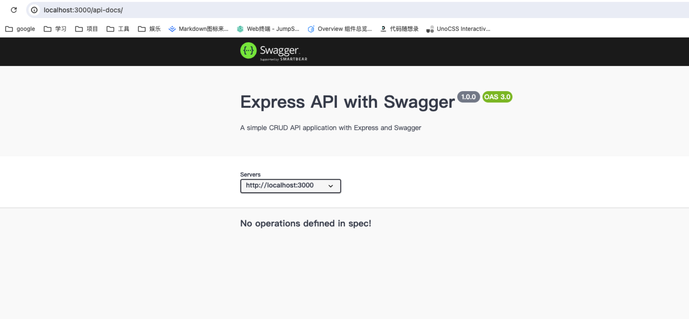

Swagger 是一个规范和完整的框架，用于生成、描述、调用和可视化 RESTful 风格的 Web 服务。

主要利用这两个包：

- [swagger-jsdoc](https://github.com/Surnet/swagger-jsdoc)：可以将注释中的 API 文档生成 Swagger 格式的文档
- [swagger-ui-express](https://github.com/scottie1984/swagger-ui-express)：在浏览器中展示接口文档

## 步骤

### 1. 安装 npm 包

```bash
npm install swagger-jsdoc swagger-ui-express
```

### 2. Swagger 配置

在项目根目录创建 `swagger/swaggerDocs.js` 配置文件，用于定义 swagger 配置：

```js
import swaggerJsdoc from 'swagger-jsdoc'

const swaggerOptions = {
  definition: {
    openapi: '3.0.0',
    info: {
      title: 'Express API with Swagger', //	title: API 的标题
      version: '1.0.0', // version: API 的版本号
      description: 'A simple CRUD API application with Express and Swagger', // description: API 的描述信息
    },
    servers: [
      {
        url: 'http://localhost:3000',
      },
    ],
  },
  apis: ['./routes/**/*.js'], // 使用了 './routes/**/*.js'，这会匹配 routes 文件夹及其所有子文件夹中的所有 .js 文件
}

const swaggerDocs = swaggerJsdoc(swaggerOptions)

export default swaggerDocs
```

通过这些配置，swagger-jsdoc 将扫描指定的路由文件，解析其中的 Swagger 注释，并生成对应的 Swagger 文档。这些文档可以通过 swagger-ui-express 在浏览器中进行可视化展示。

### 3. 在 app.js 引入 swagger

```js
// app.js
...
import swaggerUi from 'swagger-ui-express'
import swaggerDocs from './swagger/swaggerConfig'


// 使用 Swagger
app.use('/api-docs', swaggerUi.serve, swaggerUi.setup(swaggerDocs));
...
```

此时访问 `localhost:3000/api-docs` 就可以看到 Swagger 页面（还没有配置，所以接口为空）



### 4. 在 router 中配置接口文档信息

在路由文件中添加 Swagger 注释

Swagger 注释是一种在代码中嵌入文档信息的方式，用于描述 API 的各个方面，包括路径、方法、参数、响应等。Swagger 通过解析这些注释来生成 API 文档，因此注释的格式和规则非常重要。下面是 Swagger 注释的一些基本规则和常用标记：

基本规则

    1. 基本结构：
    •	Swagger 注释以 @swagger 或 @openapi 开头，后面紧跟着 YAML 或 JSON 格式的文档信息。
    2. 路径和方法：
    •	使用 @swagger 标记来描述 API 路径和方法。例如：

```js
/**
 * @swagger
 * /users:
 *   get:
 *     summary: 获取所有用户
 *     description: 返回所有用户列表
 */
```

3. 参数和响应：
   • 描述请求参数和响应体的结构和类型。可以使用 parameters 和 responses 来定义。

```js
/**
 * @swagger
 * /users:
 *   get:
 *     summary: 获取所有用户
 *     parameters:
 *       - name: id
 *         in: query
 *         required: true
 *         type: string
 *         description: 用户ID
 *     responses:
 *       '200':
 *         description: 成功获取用户列表
 *         schema:
 *           type: array
 *           items:
 *             $ref: '#/definitions/User'
 */
```

	5.	其他常用标记：
	•	@summary：API 摘要或简要描述。
	•	@description：详细描述 API 的作用和功能。
	•	@param：描述函数或方法的参数。
	•	@returns 或 @return：描述函数或方法的返回值。
	•	@deprecated：标记 API 已弃用。