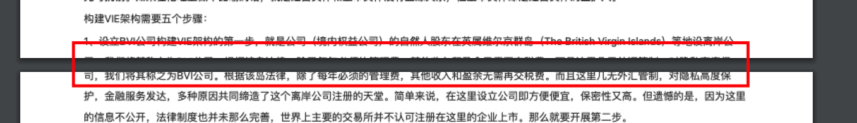

> 接上篇[富文本编辑器 html 内容转 word：html-docs-js 避坑指南](https://juejin.cn/post/7220244579671916604)，我们已经完成了 html 内容转 word 文档的> 需求，接着咱们看下图片和 pdf 的处理。

## 介绍下用到的库

### html2canvas

图片和 pdf 的转换都会用到[html2canvas](https://html2canvas.hertzen.com/)来完成，通过[官网](https://html2canvas.hertzen.com/documentation)上的介绍，我们可以总结一下它的特点：

1. 不需要后台支持，通过纯浏览器端”截图“；
2. 可对部分或整个网页进行“截图”；
3. 基于 DOM（遍历页面的 DOM），利用可用的信息构建屏幕截图；
4. 有些 css 属性未被支持，可查看[支持的 css 属性列表](https://html2canvas.hertzen.com/features/)；
5. 受同源策略影响；
6. 无法渲染 iframe，flash 等内容。

### jsPDF

pdf 的转换用到[jsPDF](https://github.com/parallax/jsPDF)，可以看看这个[demo](https://github.com/linwalker/render-html-to-pdf)，对 jsPDF 的介绍比较详细。

## 图片的转换

相比于 html 转 word 来说，图片和 pdf 的转换相对来说简单了许多，咱们来看下图片的转换过程，主要有以下几个步骤：

1. 克隆需要截图的 DOM 元素

   通过[cloneNode](https://developer.mozilla.org/zh-CN/docs/Web/API/Node/cloneNode)将需要克隆的节点生成一份副本，这一步的目的是：我们不能直接对原始 DOM 进行操作，因为会影响页面布局。所以可以修改克隆后的 DOM 节点，通过修改节点的样式（border、box-shadow 等）或修改节点宽高，达到我们想要的截图效果。

   ```js
   const cloneEle = ele.cloneNode(true)
   // 对克隆的节点进行操作
   cloneEle.style.xxx = ''
   ```

2. 通过 html2canvas 截图

   我们将第一步克隆到的 DOM 进行一个清理的动作，清理的作用是：移除不需要截图的 DOM 节点；将克隆的节点添加到 DOM 上，并返回新节点和删除节点的方法。删除节点`cleanHtmlRecover`方法用于在截图完成后移除 DOM 元素。

   接着使用 html2canvas 方法将 DOM 绘制为 canvas，通过调用 canvas 对象的 [toDataURL 方法](https://developer.mozilla.org/zh-CN/docs/Web/API/HTMLCanvasElement/toDataURL)将 canvas 转换成图片。

   这里需要为 html2canvas 提供第二个参数`useCORS: true`，开启使用 CORS 从服务器加载图像，不然如果图片不同源时就会导致一片白。更多参数配置请参考[configuration](https://html2canvas.hertzen.com/configuration)。

   ```js
   const cleanHtml = (ele: HTMLElement) => {
    // 移除不需要截图的DOM节点
    const selectElements = ele.querySelectorAll('select')
    selectElements.forEach((sel) => (sel.style.display = 'none'))
    const title = document.createElement('div')

    const warp = document.createElement('div')
    // 图片、pdf导出背景色不是白色
    warp.style.position = 'absolute'
    warp.style.zIndex = '-1'
    warp.append(ele)
    document.body.append(warp)
    return {
      warp,
      cleanHtmlRecover: () => {
        warp.remove()
      }
    }
   }
   const { warp, cleanHtmlRecover } = cleanHtml(cloneEle)
   return new Promise<void>((resolve) => {
    Html2canvas(warp, { useCORS: true })
      .then((canvas) => {
        // 生成截图
        const image = canvas.toDataURL('image/jpg')
        // 下载图片
      })
      .finally(() => {
        cleanHtmlRecover()
        resolve()
      })
   })
   ```

3. 下载图片

   上一步获取到转换后的图片后，就可以通过`a`标签的方式来下载图片，我们可以通过 dispatchEvent 来模拟点击事件完成下载。对 dispatchEvent 的其他使用可以看[这篇文章](https://juejin.cn/post/7184632272132735035)。

   ```js
   // 下载图片
   const a = document.createElement('a')
   a.download = filename
   a.href = canvas.toDataURL('image/jpg')
   const event = new MouseEvent('click')
   a.dispatchEvent(event)
   ```

## pdf 的转换

图片的导出已经完成，那么 pdf 的导出应该如何做呢？

一开始我们是用的[html2pdf-jspdf2](https://github.com/eKoopmans/html2pdf.js)，它就是使用 html2canvas 和 jsPDF 结合在一起，通过和 html2canvas 将 html 内容转为 canvas，再通过 jsPDF 将 canvas 转为 pdf。说几个我遇到的问题（可能是我用的不对）：

1. 在 JSPDF 中我设置了`format: 'a4'`，意思是使用 pdf 来导出，页面同样设置为 a4，但导出的 pdf 文件宽度显示不全；
2. 我们页面可以设置成 A3、A4、A5 几种特定纸张，并且支持设置宽高自定义纸张，但当我传入宽高后，发现得到的 pdf 文件不是我设置好的宽高；
3. 没有了，直接换库跑路 😄

遇到问题解决不了怎么办？找 leader，找 leader，还是找 leader

通过我们一阵商量，最终确定了一个方案：先用 html2canvas 将 html 转换为图片，再利用 jsPDF 提供的[addImage](http://raw.githack.com/MrRio/jsPDF/master/docs/module-addImage.html#~addImage)方法将图片贴到 pdf 中，因为图片导出目前是没有什么问题，而且展示效果也挺好，所以导出的 pdf 应该也不会有什么问题。

接下来就是和产品掰头环节，巴拉巴拉...，成功让他们改了需求。

最后看下实现过程：

html2canvas 的使用与前面生成图片一样，接着通过`generatePDF`生成 pdf。

```js
...
Html2canvas(warp, { useCORS: true })
  .then((canvas) => generatePDF(canvas, filename))
...
```

我们看下`generatePDF`的实现步骤：

1. 计算一页 A4 纸能显示当前 html 生成的 canvas 高度；
2. 如果 canvas 的高度未超过一页 A4 纸的显示高度，无需分页，直接贴图导出；
3. 否则需要分页打印，分页打印思路如下：
   1. 设置变量`leftHeight`记录剩余高度，打印完一页后 leftHeight 减去已经打印的 canvas 的高度 pageHeight，如果剩余高度大于 0，说明没打印完，通过[addPage()](http://raw.githack.com/MrRio/jsPDF/master/docs/jsPDF.html#addPage)增加分页继续打印；
   2. 设置变量`position`记录打印开始的距离头部的位置，打印完一页后 position 增加一页 A4 纸的高度继续打印。

最后贴上完整代码：

```ts
/** a4纸的尺寸 */
enum A4_PAPER_SIZE_ENUM {
  'width' = 595.28,
  'height' = 841.89,
}
const generatePDF = (canvas: HTMLCanvasElement, filename: string) => {
  const contentWidth = canvas.width
  const contentHeight = canvas.height
  // 一页pdf显示html页面生成的canvas高度
  const pageHeight =
    (contentWidth / A4_PAPER_SIZE_ENUM.width) * A4_PAPER_SIZE_ENUM.height
  // 未生成pdf的html页面高度
  let leftHeight = contentHeight
  // 页面偏移
  let position = 0
  const imgWidth = A4_PAPER_SIZE_ENUM.width
  const imgHeight = (A4_PAPER_SIZE_ENUM.width / contentWidth) * contentHeight
  const pageData = canvas.toDataURL('image/jpeg', 1.0)
  const PDF = new JsPDF('p', 'pt', 'a4')

  // 当内容未超过pdf一页显示的范围，无需分页
  if (leftHeight < pageHeight) {
    // addImage(pageData, 'JPEG', 左，上，宽度，高度)设置
    PDF.addImage(pageData, 'JPEG', 0, 0, imgWidth, imgHeight)
  } else {
    // 超过一页时，分页打印（每页高度841.89）
    while (leftHeight > 0) {
      PDF.addImage(pageData, 'JPEG', 0, position, imgWidth, imgHeight)
      leftHeight -= pageHeight
      position -= A4_PAPER_SIZE_ENUM.height
      if (leftHeight > 0) {
        PDF.addPage()
      }
    }
  }
  PDF.save(filename + '.pdf')
}
```

### 小瑕疵

这种方法有一点点小问题：分页的地方处理不太好，不会自动识别隔页处理，而只是比较粗暴的从中间被拆分，类似下面这张图。



## 总结

不管是工作还是学习中，都要有良好的“小记”习惯，将遇到的问题、解决的过程记录下来，最后整理成文，积累沉淀，不仅锻炼自己的文笔，同时拓宽知识面、帮助他人，在以后工作中遇到时也能更快的解决问题，实现业务需求；而不是做完就停滞了，下次遇到同样的问题还是处理不了。

以上就是本文的全部内容，希望这篇文章对你有所帮助，欢迎点赞和收藏🙏，如果发现有什么错误或者更好的解决方案及建议，欢迎随时联系。
