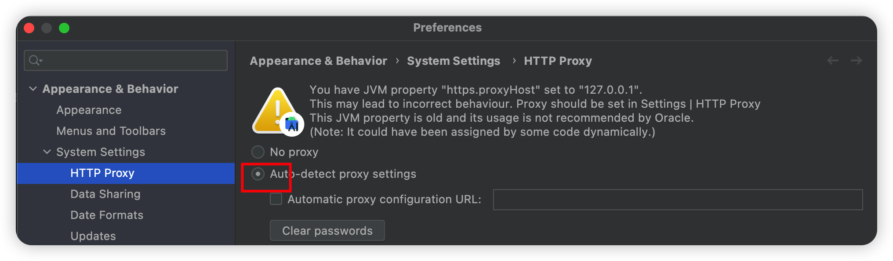
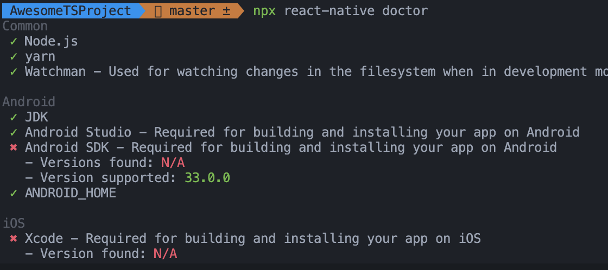
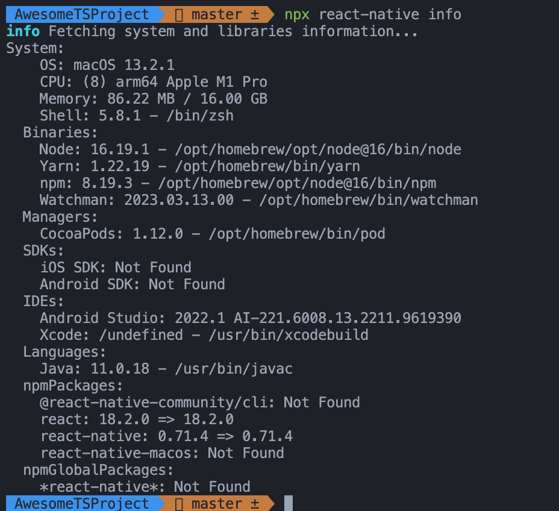

## 安装时选择 Custom 安装无法选择 platform



找到`Settings -> Preferences -> System Settings -> HTTP Proxy`，选择`Auto-detect proxy settings`自动检测代理设置即可，前提是需要稳定的代理软件

## 创建新项目报错


全局卸载`react native cli`即可

```bash
npm uninstall -g react-native-cli @react-native-community/cli
```

## 项目无法启动/或者报错时

输入以下命令查看环境问题

```bash
npx react-native doctor
# or
npx react-native info
```




## 查看

```js
adb devices
```

## error Failed to build iOS project. We ran "xcodebuild" command but it exited with error code 65...

