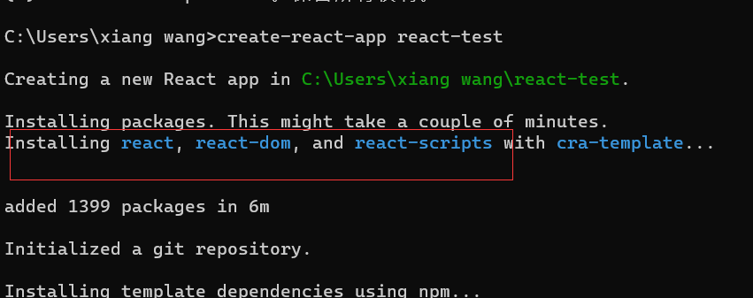
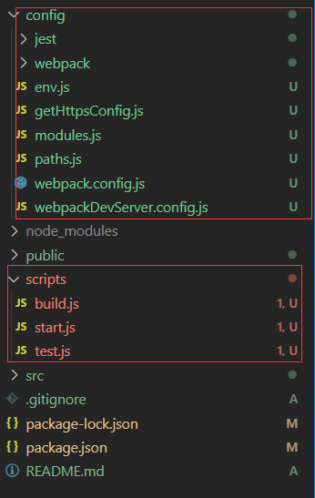

  
## create-react-app

react脚手架工具，简称cra[中文文档](https://create-react-app.bootcss.com/)

- 创建项目
  
  ```bash
  npx create-react-app my-app
  # 创建typescript项目
  npx create-react-app my-app --template typescript
  ```

  
  可以看到会同事下载react、react-dom、react-scripts这三个依赖包

- 易于维护
  
  更新构建工具只需要执行如下命令即可升级

  ```bash
  npm install react-scripts@latest
  ```

-
-

## 正确修改webpack配置
  
cra创建的项目不会有webpack配置，统一封装在react-scripts中，使用`npm run eject`可以将封装在react-scripts中webpack配置全部反编译到当前项目，下面这张图就是使用执行eject，可以看到多了很多配置文件，但是一个单项操作，eject后就无法恢复，所以做一些简单的配置，eject是没有必要的



### 使用react-app-rewired

[react-app-rewired](https://github.com/timarney/react-app-rewired)针对cra搭建的项目修改webpack配置，配合[customize-cra](https://github.com/arackaf/customize-cra)来实现自定义的配置

1. 安装依赖

   ```bash
   npm install react-app-rewired customize-cra -D
   ```

2. 修改scripts配置
  
   ```json
   "scripts": {
      "start": "react-app-rewired start",
      "build": "react-app-rewired build",
      "test": "react-app-rewired test",
      "eject": "react-scripts eject"
    },
   ```

3. 项目根目录创建`config-overrides.js`来对webpack配置进行扩展

### 使用react-app-rewired搭配customize-cra修改配置项

1. 添加Proxy配置、别名设置

   ```js
    const path = require("path");
    const {
      override,
      overrideDevServer,
      addWebpackAlias,
    } = require("customize-cra");

    // Proxy配置
    const devServerConfig = () => (config) => {
      return {
        ...config,
        // 服务开启gzip
        compress: true,
        proxy: {
          "/api": {
            target: "xxx",
            changeOrigin: true,
            pathRewrite: {
              "^/api": "",
            },
          },
        },
      };
    };
    module.exports = {
      webpack: override(
        // 设置别名
        addWebpackAlias({
          src: path.resolve(__dirname, "src"),
          apis: path.resolve(__dirname, "src/apis"),
          assets: path.resolve(__dirname, "src/assets"),
          styles: path.resolve(__dirname, "src/assets/styles"),
          pages: path.resolve(__dirname, "src/pages"),
          components: path.resolve(__dirname, "src/components"),
          utils: path.resolve(__dirname, "src/utils"),
        })
      ),
      // proxy配置
      devServer: overrideDevServer(devServerConfig()),
    };


   ```

2. 增加less支持

   ```bash
   yarn add less less-loader -D
   ```

   ```js
    const path = require("path");

    const {
      override,
      overrideDevServer,
      addWebpackAlias,
      addLessLoader
    } = require("customize-cra");

    // Proxy配置
    const devServerConfig = () => (config) => {
      ...
    };
    module.exports = {
      webpack: override(
        // 设置别名
        ...
        // less配置
        addLessLoader({
          lessOptions: {
            javascriptEnabled: true,
            cssModules: {
              localIdentName: '[path][name]__[local]--[hash:base64:5]', // if you use CSS Modules, and custom `localIdentName`, default is '[local]--[hash:base64:5]'.
            },
          },
        }),
      ),
      // proxy配置
      devServer: overrideDevServer(devServerConfig()),
    };

   ```

3. antd按需加载

   安装依赖

   ```bash
   npm i antd babel-plugin-import -D
   ```

   ```js
    const path = require("path");
    const {
      override,
      overrideDevServer,
      addWebpackAlias,
      addLessLoader,
      fixBabelImports,
    } = require("customize-cra");
    
    module.exports = {
      webpack: override(
        ...
        fixBabelImports("import", {
          libraryName: "antd",
          libraryDirectory: "es",
          style: true,
        }),
        // less配置
        addLessLoader({
          lessOptions: {
            javascriptEnabled: true,
            // antd主题定制https://ant.design/docs/react/customize-theme-cn#%E5%AE%9A%E5%88%B6%E6%96%B9%E5%BC%8F
            modifyVars: {
              'primary-color': '#1DA57A',
              'link-color': '#1DA57A',
              'border-radius-base': '2px',
            },
            cssModules: {
              localIdentName: "[path][name]__[local]--[hash:base64:5]", // if you use CSS Modules, and custom `localIdentName`, default is '[local]--[hash:base64:5]'.
            },
          },
        })
      ),
      ...
    };

   ```

4. 打包压缩

   ```bash
   npm install compression-webpack-plugin -D
   ```

   ```js
   ...
   const CompressionWebpackPlugin = require('compression-webpack-plugin');
   module.exports = {
      webpack: override(
        ...
        if (process.env.NODE_ENV === 'production') {
          // 添加js打包gzip配置
          config.plugins.push(
            new CompressionWebpackPlugin({
              test: /\.js$|\.css$/,
              threshold: 1024,
            }),
          )
        }
      ),
      ...
    };
   ```

5. 修改生产环境文件路径

  ```js
    module.exports = {
      webpack: override(
      (config) => {
        if (REACT_APP_ENVKEY === 'prod') {
          config.output.publicPath = 'https://app-s3.quickcep.com/';
        }
      })
    }
  ```

6. WebpackBar插件

   ```js
   const WebpackBar = require('webpackbar');
   module.exports = {
      webpack: override(
      (config) => {
        config.plugins.push(new WebpackBar());
      })
    }
   ```

### 项目优化

1. 添加react-hot-reloader实现局部刷新

   构建react项目默认使用webpack-dev-server实现热更新，修改移除会使整个页面刷新，使用react-hot-loader可以实现局部刷新

   ```bash
   npm install react-hot-loader react-app-rewire-hot-loader @hot-loader/react-dom -D
   ```

   在App.js中配置

   ```js
   import { hot } from 'react-hot-loader/root'
   ...
   const AppHot = process.env.NODE_ENV === 'development' ? hot(App) : App;
   export default AppHot
   ```

   webpack配置

   ```js
    const rewireReactHotLoader = require('react-app-rewire-hot-loader')
    const hotLoader = () => (config, env) => {
      config = rewireReactHotLoader(config, env)
      return config
    }

    module.exports = {
      webpack: override(
        hotLoader(),
      )
    }
   ```

2. 关闭sourceMap

   - 在.env中设置

     ```text
     GENERATE_SOURCEMAP=false
     ```

   - 在scripts中设置

      ```json
      "build": "GENERATE_SOURCEMAP=false react-app-rewired build"
      ```

   - webpack配置

     ```js
     config.devtool = config.mode === 'development' ? 'cheap-module-source-map' : false
     ```

3. 生成环境移除console.log

   ```js
   module.exports = {
      webpack: override(
      (config) => {
        if (config.optimization.minimizer) {
          config.optimization.minimizer.forEach(minimizer => {
            if (minimizer.constructor.name === 'TerserPlugin') {
              minimizer.options.terserOptions.compress.drop_console = true
            }
          })
        }
      })
    }
   
   ```

4.
