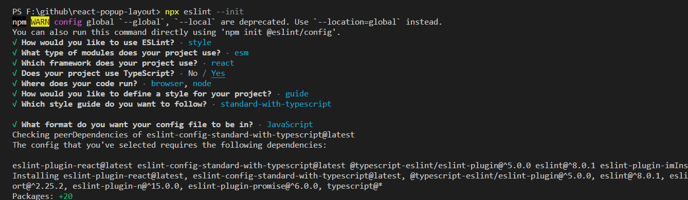
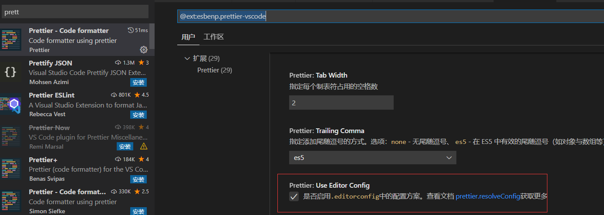
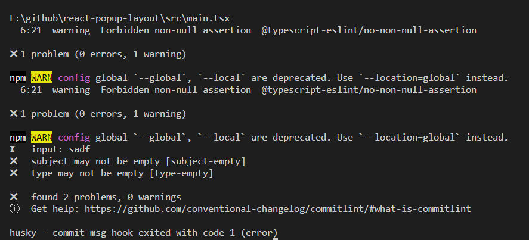

  
## Eslint配置

- 安装Eslint

  ```bash
  pnpm i eslint -D 
  # ESLint 专门解析 TypeScript 的解析器
  pnpm i @typescript-eslint/parser -D
  # 内置各种解析 TypeScript rules 插件
  pnpm i @typescript-eslint/eslint-plugin -D

  # eslint插件 命名方式eslint-plugin-<plugin-name>
  pnpm i babel-eslint eslint-plugin-react eslint-plugin-import -D 
  ```

- 创建eslint配置文件

  安装完成之后需要设置一个配置文件，可以通过命令行工具直接生成

  ```bash
  npx eslint --init
  ```

  
  会自动安装eslint-plugin-react等相关依赖<br/>
  完成后项目中会多出一个`.eslint.js`文件，eslint的配置文件

- 在package.json中添加脚本

  ```bash
  {
    "scripts": {
      "lint": "eslint src/**/*.{js,jsx,vue,ts,tsx} --fix",
    }
  }

  ```

- 添加.eslintignore文件

  ```markdown
  *.sh
  node_modules
  lib
  coverage
  *.md
  *.scss
  *.woff
  *.ttf
  src/index.ts
  dist
  ```

- 执行pnpm lint

- 报错问题处理
  - Error while loading rule '@typescript-eslint/dot-notation'，[stackoverflow](https://stackoverflow.com/questions/64116378/error-while-loading-rule-typescript-eslint-dot-notation)<br />
    配置parserOptions.project

    ```js
    parserOptions: {
      project: ['tsconfig.json'],
    },
    ```

  - Missing return type on function.

    ```js
    "@typescript-eslint/explicit-function-return-type": 0,
    ```

- eslint工作原理
  
  Eslint默认使用Espree解析javaScript代码，将代码转换为AST，然后拦截检测是否符合我们规定的书写方式，最后展示报错、警告等

## 配置prettier

- 安装

  ```bash
  pnpm i -D prettier eslint-config-prettier eslint-plugin-prettier
  ```

  - prettier: 核心模块
  - eslint-config-prettier: 关闭所有不必要或可能跟prettier产生冲突的规则
  - eslint-plugin-prettier: 可以让eslint使用prettier规则进行检查

- .eslint.js中添加extends配置

  ```js
  {
    "extends": [
        // 其他配置
        "plugin:prettier/recommended",
    ],
  }
  ```

- 根目录创建prettier.config.js文件

  ```js
  module.exports = {
    printWidth: 80,
    tabWidth: 2,
    bracketSpacing: true,
    arrowParens: "always",
    endOfLine: "auto",
    singleQuote: true,
    trailingComma: "none",
    semi: false,
    useTabs: false
  }
  ```

  一些配置的意思

  ```js
    // 字符串使用单引号
    singleQuote: true,
    // 每行末尾自动添加分号
    semi: true,
    // tab缩进大小,默认为2
    tabWidth: 2,
    // 使用tab缩进，默认false
    useTabs: false,
    // 对象中打印空格 默认true
    // true: { foo: bar }
    // false: {foo: bar}
    bracketSpacing: true,
    // 箭头函数参数括号 默认avoid 可选 avoid| always
    // avoid 能省略括号的时候就省略 例如x => x
    // always 总是有括号
    arrowParens: 'avoid',
    // 换行长度，默认80
    printWidth: 80,

  -----------------------以下内容为参考项--------------------------
  "prettier.printWidth": 100, // 超过最大值换行
  "prettier.tabWidth": 4, // 缩进字节数
  "prettier.useTabs": false, // 缩进不使用tab，使用空格
  "prettier.semi": true, // 句尾添加分号
  "prettier.singleQuote": true, // 使用单引号代替双引号
  "prettier.proseWrap": "preserve", // 默认值。因为使用了一些折行敏感型的渲染器（如GitHub comment）而按照markdown文本样式进行折行
  "prettier.arrowParens": "avoid", //  (x) => {} 箭头函数参数只有一个时是否要有小括号。avoid：省略括号
  "prettier.bracketSpacing": true, // 在对象，数组括号与文字之间加空格 "{ foo: bar }"
  "prettier.disableLanguages": ["vue"], // 不格式化vue文件，vue文件的格式化单独设置
  "prettier.endOfLine": "auto", // 结尾是 \n \r \n\r auto
  "prettier.eslintIntegration": false, //不让prettier使用eslint的代码格式进行校验
  "prettier.htmlWhitespaceSensitivity": "ignore",
  "prettier.ignorePath": ".prettierignore", // 不使用prettier格式化的文件填写在项目的.prettierignore文件中
  "prettier.jsxBracketSameLine": false, // 在jsx中把'>' 是否单独放一行
  "prettier.jsxSingleQuote": false, // 在jsx中使用单引号代替双引号
  "prettier.parser": "babylon", // 格式化的解析器，默认是babylon
  "prettier.requireConfig": false, // Require a 'prettierconfig' to format prettier
  "prettier.stylelintIntegration": false, //不让prettier使用stylelint的代码格式进行校验
  "prettier.trailingComma": "es5", // 在对象或数组最后一个元素后面是否加逗号（在ES5中加尾逗号）
  "prettier.tslintIntegration": false // 不让prettier使用tslint的代码格式进行校验
  ————————————
  ```

  添加.prettier.json后需要重启vscode，否则不会生效，另外需要在prettier的配置中使用`Use Editor Config`配置
  

- 配置package.json的scripts脚本

  ```json
  "format": "prettier --write \"src/**/*.ts\" \"src/**/*.tsx\"",
  ```

- 执行命令pnpm format

最终的eslint配置如下

```js
module.exports = {
  // 指定环境，比如是浏览器还是 Node，会提供一些预定义的全局变量
  env: {
    browser: true,
    es2021: true
  },
  // 要扩展的配置文件 共享配置后面的覆盖前面的
  extends: [
    'eslint:recommended',
    'standard-with-typescript',
    'plugin:react/recommended',
    'plugin:@typescript-eslint/recommended',
    'plugin:prettier/recommended'
  ],
  overrides: [],
  parserOptions: {
    parser: '@babel/eslint-parser',
    project: ['tsconfig.json'],
    ecmaVersion: 'latest',
    sourceType: 'module'
  },
  plugins: ['react', '@typescript-eslint'],
  settings: {
    react: {
      version: '18.0.0'
    }
  },

  /**
   * 配置规则
   * "off" 或 0 - 关闭规则
   * "warn" 或 1 - 开启规则，使用警告级别的错误：warn (不会导致程序退出),
   * "error" 或 2 - 开启规则，使用错误级别的错误：error (当被触发的时候，程序会退出)
   */
  rules: {
    quotes: [2, 'single'], //单引号
    'no-console': 0, //不禁用console
    'no-debugger': 2, //禁用debugger
    'no-var': 0, //对var警告
    semi: 0, //不强制使用分号
    'no-irregular-whitespace': 0, //不规则的空白不允许
    'no-trailing-spaces': 1, //一行结束后面有空格就发出警告
    'eol-last': 0, //文件以单一的换行符结束
    'no-unused-vars': [2, { vars: 'all', args: 'after-used' }], //不能有声明后未被使用的变量或参数
    'no-underscore-dangle': 0, //标识符不能以_开头或结尾
    'no-alert': 2, //禁止使用alert confirm prompt
    'no-lone-blocks': 0, //禁止不必要的嵌套块
    'no-class-assign': 2, //禁止给类赋值
    'no-cond-assign': 2, //禁止在条件表达式中使用赋值语句
    'no-const-assign': 2, //禁止修改const声明的变量
    'no-delete-var': 2, //不能对var声明的变量使用delete操作符
    'no-dupe-keys': 2, //在创建对象字面量时不允许键重复
    'no-duplicate-case': 2, //switch中的case标签不能重复
    'no-dupe-args': 2, //函数参数不能重复
    'no-empty': 2, //块语句中的内容不能为空
    'no-func-assign': 2, //禁止重复的函数声明
    'no-invalid-this': 0, //禁止无效的this，只能用在构造器，类，对象字面量
    'no-redeclare': 2, //禁止重复声明变量
    'no-spaced-func': 2, //函数调用时 函数名与()之间不能有空格
    'no-this-before-super': 0, //在调用super()之前不能使用this或super
    'no-undef': 2, //不能有未定义的变量
    'no-use-before-define': 2, //未定义前不能使用
    camelcase: 0, //强制驼峰法命名
    'jsx-quotes': [2, 'prefer-double'], //强制在JSX属性（jsx-quotes）中一致使用双引号
    'react/display-name': 0, //防止在React组件定义中丢失displayName
    'react/forbid-prop-types': [2, { forbid: ['any'] }], //禁止某些propTypes
    'react/jsx-boolean-value': 2, //在JSX中强制布尔属性符号
    'react/jsx-closing-bracket-location': 1, //在JSX中验证右括号位置
    'react/jsx-curly-spacing': [2, { when: 'never', children: true }], //在JSX属性和表达式中加强或禁止大括号内的空格。
    'react/jsx-indent-props': [2, 4], //验证JSX中的props缩进
    'react/jsx-key': 2, //在数组或迭代器中验证JSX具有key属性
    'react/jsx-max-props-per-line': [1, { maximum: 1 }], // 限制JSX中单行上的props的最大数量
    'react/jsx-no-bind': 0, //JSX中不允许使用箭头函数和bind
    'react/jsx-no-duplicate-props': 2, //防止在JSX中重复的props
    'react/jsx-no-literals': 0, //防止使用未包装的JSX字符串
    'react/jsx-no-undef': 1, //在JSX中禁止未声明的变量
    'react/jsx-pascal-case': 0, //为用户定义的JSX组件强制使用PascalCase
    'react/jsx-sort-props': 2, //强化props按字母排序
    'react/jsx-uses-react': 1, //防止反应被错误地标记为未使用
    'react/jsx-uses-vars': 2, //防止在JSX中使用的变量被错误地标记为未使用
    'react/no-danger': 0, //防止使用危险的JSX属性
    'react/no-did-mount-set-state': 0, //防止在componentDidMount中使用setState
    'react/no-did-update-set-state': 1, //防止在componentDidUpdate中使用setState
    'react/no-direct-mutation-state': 2, //防止this.state的直接变异
    'react/no-multi-comp': 2, //防止每个文件有多个组件定义
    'react/no-set-state': 0, //防止使用setState
    'react/no-unknown-property': 2, //防止使用未知的DOM属性
    'react/prefer-es6-class': 2, //为React组件强制执行ES5或ES6类
    'react/prop-types': 0, //防止在React组件定义中丢失props验证
    'react/react-in-jsx-scope': 2, //使用JSX时防止丢失React
    'react/self-closing-comp': 0, //防止没有children的组件的额外结束标签
    'react/sort-comp': 2, //强制组件方法顺序
    'no-extra-boolean-cast': 0, //禁止不必要的bool转换
    'react/no-array-index-key': 0, //防止在数组中遍历中使用数组key做索引
    'react/no-deprecated': 1, //不使用弃用的方法
    'react/jsx-equals-spacing': 2, //在JSX属性中强制或禁止等号周围的空格
    'no-unreachable': 1, //不能有无法执行的代码
    'comma-dangle': 2, //对象字面量项尾不能有逗号
    'no-mixed-spaces-and-tabs': 0, //禁止混用tab和空格
    'prefer-arrow-callback': 0, //比较喜欢箭头回调
    'arrow-parens': 0, //箭头函数用小括号括起来
    'arrow-spacing': 0 //=>的前/后括号
  }
}

```

## vscode配置

添加配置文件`.editorconfig`

```bash
root = true

[*]
indent_style = space
indent_size = 2
end_of_line = lf
charset = utf-8
trim_trailing_whitespace = true
insert_final_newline = true
```

目的：

- ESLint 配置目的是在代码提交时进行审核
- VSCode 插件目的是在编写代码时进行辅助（提醒、格式化）

## Husky + git hooks自动化提交验证

- 安装

  ```bash
  pnpm i husky lint-staged -D
  ```

- package.json添加husky脚本

  ```bash
  npm set-script prepare "husky install"
  ```

  执行此命令，package.json文件的scripts中，就会自动添加prepare

- 初始化husky，将git hooks钩子交由husky执行

  ```bash
  pnpm run prepare
  ```

  执行此命令，会在根目录下拆功能键.husky目录

- 添加pre-commit钩子

  ```bash
  npx husky add .husky/pre-commit "pnpm lint"
  ```

  .husky目录下会自动创建pre-commit钩子

- 修改hooks程序 .husky/pre-commit

  ```bash
  #!/bin/sh
  . "$(dirname "$0")/_/husky.sh"

  pnpm run lint
  ```

  如果不加run的话会报错

- 执行git add . git commit

  提交代码之前，pre-commit都会拦截 Git 的 commit 操作，然后运行lint命令进行代码检测，若检测到有违反校验规则的情况，则会返回错误，从而导致git commit失败。

- 安装lint-staged只校验暂存区文件
  
  ```bash
  npm install lint-staged --save-dev
  ```

  在package.json中添加配置即可，这样就不会所有文件都校验

  ```json
    "lint-staged": {
      "*.{ts,tsx,js,vue}": [
          "eslint --fix",
          "git add"
      ],
      "*.{vue,css,scss,less}": [
          "stylelint --fix",
          "git add"
      ]
    }
  ```

## commit规范

目前最为流行的提交信息规范来自于 Angular 团队

```
type：commit 的类型；
feat：新功能、新特性；
fix: 修改 bug；
perf：更改代码，以提高性能；
refactor：代码重构（重构，在不影响代码内部行为、功能下的代码修改）；
docs：文档修改；
style：代码格式修改, 注意不是 css 修改（例如分号修改）；
test：测试用例新增、修改；
build：影响项目构建或依赖项修改；
revert：恢复上一次提交；
ci：持续集成相关文件修改；
chore：其他修改（不在上述类型中的修改）；
release：发布新版本；
workflow：工作流相关文件修改。
```

配置commitlint提交时自动检查commit信息

- 安装commitlint

  ```bash
  pnpm i -D commitlint @commitlint/config-conventional
  ```

- 创建commitlint.config.js文件

  ```js
  module.exports = { extends: ['@commitlint/config-conventional'] };
  ```

- 添加commitline到githoos中

  ```bash
  npx husky add .husky/commit-msg npx --no -- commitlint --edit "$1"
  ```

- 配置完成后，commit提交测试如下
  
