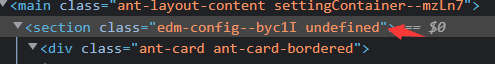
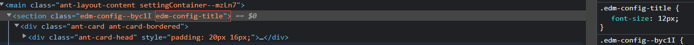

  
我们在react项目中使用CSS Module 的方式管理样式文件，而[classnames](https://github.com/JedWatson/classnames)就是为了更方便的使用CSS Module。

## 介绍

官方介绍是：一个简单的 JavaScript 实用程序，用于有条件地将类名连接在一起。<br />
在React中，当有多个类名变量需要添加到对应元素上，使用classnames可以更简单的实现。

### 安装

```bash
# npm
npm i classnames
# or Yarn (note that it will automatically save the package to your `dependencies` in `package.json`)
yarn add classnames
```

### 使用方法

- classNames 函数接受任意数量的参数，可以是字符串或对象。参数 'foo' 是 { foo: true } 的缩写。如果与给定键关联的值是虚假的，则该键将不会包含在输出中。

  ```js
  classNames('foo', 'bar'); // => 'foo bar'
  classNames('foo', { bar: true }); // => 'foo bar'
  classNames({ 'foo-bar': true }); // => 'foo-bar'
  classNames({ 'foo-bar': false }); // => ''
  classNames({ foo: true }, { bar: true, 'foo-bar': false }); // => 'foo bar'
  classNames({ foo: true, bar: true }); // => 'foo bar'

  var arr = ['b', { c: true, d: false }];
  classNames('a', arr); // => 'a b c'
  ```

  规则：
  - 简单类型，直接加到集合，('foo', 'bar')
  - 数组，判断元素真假，加到集合 ({ foo: true }, { bar: true, 'foo-bar': false })
  - 对象，判断value真假，加到集合 ['b', { c: true, d: false }]

- 可以通过es6的模板字符串绑定类名

  ```js
  let buttonType = 'primary';
  classNames({ [`btn-${buttonType}`]: true });
  ```

- 在react中使用
  
  ```js
  import classNames from 'classnames/bind';

  const Button = ({ isPressed, isHovered, label }) => {
    return (
      <button
        className={classNames({
          btn: true,
          'btn-pressed': isPressed,
          'btn-over': !isPressed && isHovered,
        })}>
        {label}
      </button>
    );
  };

  export default Button;

  ```

- 通过classnames/bind去实现类名对象合并，比使用styles方式定义样式简单，以CSS Module方式绑定类名，classnames只是绑定类名

  ```js
  // 未使用classnames/bind前
  import styles from './index.module.less';

  const Button = () => {
    return <div className={`${styles["config"]} ${styles["config__title"]}`}></div>
  }

  // 使用classnames/bind
  import classNames from 'classnames/bind';
  import styles from './index.module.less';
  const cx = classNames.bind(styles);

  const Button = () => {
    return <div className={cx('config', 'config__title')}></div>
  }
  ```

  **注意**
  - styles方式：如果`index.module.less`中配置了对应的样式，那么会使用CSS Module方式，如果未配置则会显示undefined
    
  - classnames/bind方式：如果`index.module.less`中配置了对应的样式，那么会使用CSS Module方式，如果未配置则会走全局样式
    
