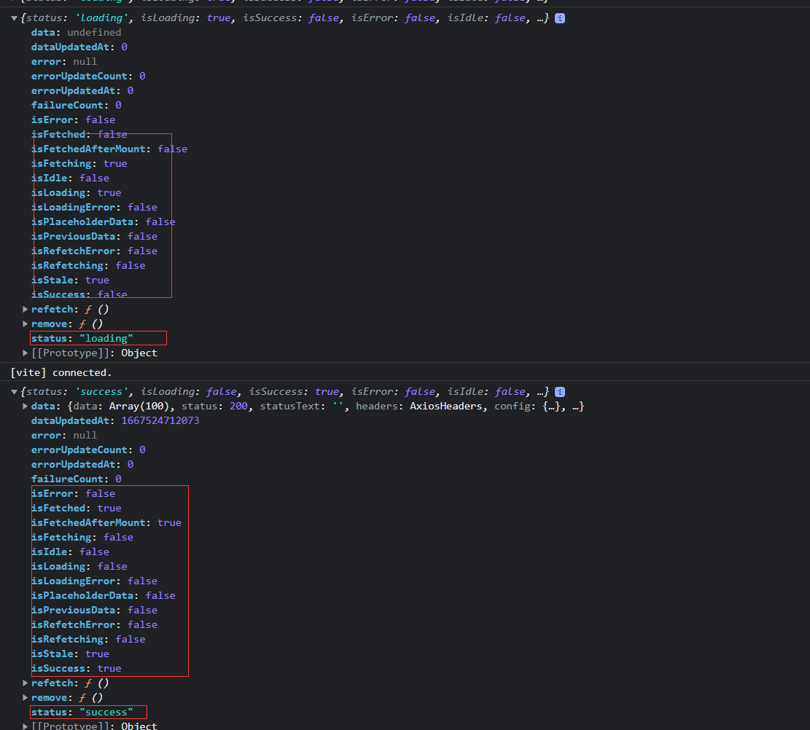
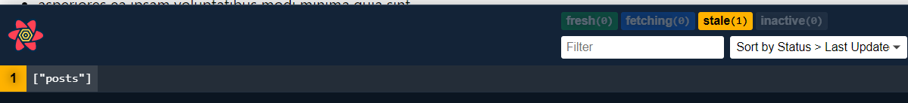
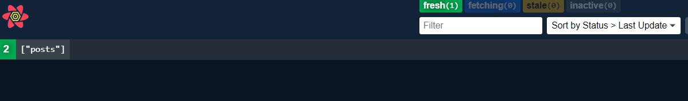
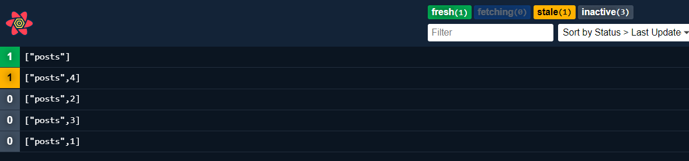

  
## 为什么要写这篇文章

1. 公司业务使用react-query，但目前只停留在“能用”的阶段，离真正会用并且灵活使用API还有很长距离

## react-query介绍

[react-query](https://github.com/TanStack/query)是React数据获取（date-fetch）库，在使用Hooks写组件时，发起异步请求时，不仅需要管理请求状态，而且还需要处理异步数据，为此要多写几个useState/useEffect来控制。

而react-query也是一个Hooks库，使用很少的代码完成对服务端的状态管理，而且大多数情况下使用查询`useQuery`和修改`useMutation`就可以了

我们知道redux可以轻松的管理客户端状态，但并不适合处理异步和服务端状态，服务端状态有以下比较复杂的点：

- 缓存...（数据未变化时不去请求）
- 知道数据何时“过时”
- 在后台更新“过时”的数据
- 分页、延迟加载等性能优化
- 结构化共享并存储查询结果

而react-query正是为此而生，可以方便的管理服务端的状态

## 安装

```bash
# use npm
npm i react-query
# use yarn
yarn add react-query
```

## 使用

1. 在App.tsx中创建全局实例`client`，并通过`QueryClientProvider`将`client`传递下去，用于管理所有请求

   ```tsx
   import './App.css'
    import {
      QueryClient,
      QueryClientProvider,
    } from 'react-query'
    import { ReactQueryDevtools } from 'react-query/devtools';
    import Demo1 from './components/Demo1'

    // 创建一个 client
    const queryClient = new QueryClient()
    function App() {
      return (
        // 提供client
        <QueryClientProvider client={queryClient}>
          {/* 添加devtools */}
          {process.env.NODE_ENV === 'development' ? (
            <ReactQueryDevtools initialIsOpen={false} position='bottom-right' />
          ) : (
            ''
          )}
          <Demo1 />
        </QueryClientProvider>
      )
    }

    export default App
   ```

2. 在组件中使用useQuery和useMutation，通过useQueryClient获取到全局QueryClient实例，调用api管理react-query的请求，如`queryClient.invalidateQueries('posts')`

   ```tsx
    import axios from 'axios';
    import { useMutation, useQuery, useQueryClient } from 'react-query';

    type dataType = {
      id: string
      title: string
    }
    const Demo1 = () => {
      // 访问App QueryClientProvider提供的client 
      const queryClient = useQueryClient();
      const query = useQuery('posts', () => axios.get('https://jsonplaceholder.typicode.com/posts'))
      console.log(query);
      const { data, isLoading, isError } = query;

      const { mutate } = useMutation(() => axios.delete('https://jsonplaceholder.typicode.com/posts/1'), {
        onSuccess: () => {
          // 错误处理和刷新
          queryClient.invalidateQueries('posts')
        },
      })
      
      if (isError) {
        return <div>error</div>;
      }
      if (isLoading) {
        return <div>loading</div>;
      }
      
      return (
        <>
          <button
            onClick={() => {
              mutate()
            }}
          >
            Delete
          </button>
        <ul>
          {(data?.data as unknown as dataType[])?.map(d => <li key={d.id}>{d.title}</li>)}
        </ul>
        </>
      )
    }

    export default Demo1
   ```

   

   - useQuery接收一个唯一键和一个返回Promise的函数以及config `[queryKey, queryFn, config]`，如`posts`在内部用于在整个程序中重新获取数据、缓存和共享查询等
   - 通过打印query会看到，React-Query将所有的请求中间状态进行封装
   - isFetching 或者 status === 'fetching' 类似于isLoading，不过每次请求时都为true，所以使用isFetching作为loading态更好
   - isLoading 或者 status === 'loading' 查询没有数据，正在获取结果中，只有“硬加载”时才为true，只要请求在cacheTime设定时间内，再次请求就会直接使用cache，即“isLoaindg = isFetching + no cached data”
   - isError 或者 status === 'error' 查询遇到一个错误，此时可以通过 error 获取到错误
   - isSuccess 或者 status === 'success' 查询成功，并且数据可用，通过 data 获取数据
   - isIdle 或者 status === 'idle' 查询处于禁用状态

示例：

```jsx
import {
  useQuery,
  useMutation,
  useQueryClient,
  QueryClient,
  QueryClientProvider,
} from 'react-query'
import { getTodos, postTodo } from '../my-api'

// 创建一个 client
const queryClient = new QueryClient()

function App() {
  return (
    // 提供 client 至 App
    <QueryClientProvider client={queryClient}>
      <Todos />
    </QueryClientProvider>
  )
}

function Todos() {
  // 访问 client
  const queryClient = useQueryClient()

  // 查询
  const query = useQuery('todos', getTodos)

  // 修改
  const mutation = useMutation(postTodo, {
    onSuccess: () => {
      // 错误处理和刷新
      queryClient.invalidateQueries('todos')
    },
  })

  return (
    <div>
      <ul>
        {query.data.map((todo) => (
          <li key={todo.id}>{todo.title}</li>
        ))}
      </ul>

      <button
        onClick={() => {
          mutation.mutate({
            id: Date.now(),
            title: 'Do Laundry',
          })
        }}
      >
        Add Todo
      </button>
    </div>
  )
}

render(<App />, document.getElementById('root'))
```

## 重要知识点

- refetchOnWindowFocus
  
  ```tsx
  const queryClient = new QueryClient({
    defaultOptions: {
      queries: {
        refetchOnWindowFocus: false,
      },
    },
  })
  ```

  refetchOnWindowFocus默认为true，用户短暂离开再返回应用页时，数据就会被标记为过时，这时react-query会在后台自动请求新的数据，通过设置refetchOnWindowFocus为false禁用

- query-keys
  
  - 字符串作为query-keys时，会在内部转换为数组

     ```ts
     useQuery('posts', ...) // queryKey === ['posts']
     ```

  - 数组作为queryKey，查询功能依赖于变量，类似于useEffect，则将其包含在查询键值中，尽量使用数组

     ```ts
     useQuery(["posts", postId], ...);
     ```

- query-functions

  任何一个返回Promise的函数

  ```js
  useQuery(["todos"], fetchAllTodos);
  useQuery(["todos", todoId], () => fetchTodoById(todoId));
  useQuery(["todos", todoId], async () => {
    const data = await fetchTodoById(todoId);
    return data;
  });
  // 通过解构queryKey可以拿到传递的query-keys
  useQuery(["todos", todoId], ({ queryKey }) => fetchTodoById(queryKey[1]), {
    enabled: false,
    retry: 3,
    select: data => {},
    onSuccess: data => {},
    onError: error => {}
    ...
  });
  ```

  useQuery的config配置有很多，[API](https://tanstack.com/query/v4/docs/reference/useQuery)

- 并行查询parallel-queries
  
  同时执行的查询

  ```js
  function App () {
    // 下面的查询将自动地并行执行
    const usersQuery = useQuery('users', fetchUsers)
    const teamsQuery = useQuery('teams', fetchTeams)
    const projectsQuery = useQuery('projects', fetchProjects)
    ...
  }
  ```

  React-query提供useQueries动态并行查询

  ```bash
  function App({ users }) {
    const userQueries = useQueries(
      users.map((user) => {
        return {
          queryKey: ["user", user.id],
          queryFn: () => fetchUserById(user.id),
        };
      }),
    );
  }
  ```

- 有依赖的查询 enabled

  具有相依性的query：当有多个query 设定相依性后，前一个query 必须成功执行并取得资料，下一个query 才会接续执行。

  开启/关闭查询：假设我们有一个定时查询，通过refetchInterval来实现，但是当一个弹窗打开的时候我们可以暂停这个查询，避免弹窗后面的内容发生变更。
  [demo](https://github.com/wang1xiang/react-query-demo/blob/master/src/components/Enabled/index.tsx)

- 缓存
  
  - useQuery和useInfiniteQuery生成的查询实例会立即将缓存数据视为过时（slate）的

    

  - staleTime（不新鲜时间） 默认0，可全局或单独配置，在此段时间内再次遇到相同key的请求，不会再去获取数据，直接从缓存中获取，isFetching也为false，如果设置为Infinity，则当前查询的数据只会获取一次，在整个网页的生命周期内缓存
  
  ```jsx
  useQuery('posts', axios => ('https://jsonplaceholder.typicode.com/posts'), {
    select: ({ data }) => {
      return data.data;
    },
    cacheTime: Infinity,
    staleTime: Infinity,
  });
  ```

  通过devTools可以看到此时数据是fresh状态
  

  这时候页面上的所有相同query-keys的请求都会被缓存起来，想要重新请求就需要清空缓存

  ```jsx
  queryClient.invalidateQueries('todos');
  ```

  - cacheTime（缓存时间） 数据在内存中的缓存时间，默认5分钟，在不设置slateTime时，如果缓存期内遇到相同key的请求，虽然会直接使用缓存数据呈现UI，但还是会获取新数据，待获取完毕后切换为新数据，isFetching为true；如果某个queryKey未被使用时，这个query就会进入inactive状态，如果在cacheTime设定的时间内未被使用的话，这个query及其data就会被清除

     

   可以看到此时`["post", 3]`和`["post", 2]`是inactive状态，过设定的cacheTime后会被清除

[参考资料](https://pjchender.dev/npm/npm-react-query/#custom-hooks)

[github仓库](https://github.com/wang1xiang/react-query-demo)
