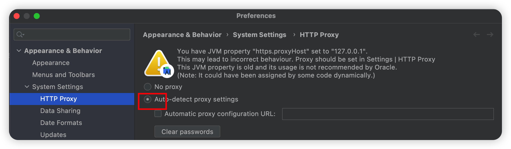

## 安装时选择 Custom 安装无法选择 platform



找到`Settings -> Preferences -> System Settings -> HTTP Proxy`，选择`Auto-detect proxy settings`自动检测代理设置即可，前提是需要稳定的代理软件

## ruby 环境升级到 2.7.6

react-native 需要 Ruby 2.7.6，mac 自带的是 2.6.0，需要重新安装 ruby

1. 安装 rvm

   ```bash
   curl -L get.rvm.io | bash -s stable
   source ~/.rvm/scripts/rvm
   # 查看rvm版本 2.7.6就可以
   rvm -v
   ```

2. 升级 ruby

   ```bash
   # 检查ruby版本是否是2.7.6
   ruby --version
   ```

## CocoaPods 依赖 ruby

CocoaPods 是一个负责管理 iOS 项目中第三方开源库的工具，进行 iOS 开发时免不了会使用第三方的开源库，所以需要 CocoaPods 来进行统一管理

需要安装完 ruby 后再安装 CocoaPods，如果已安装，删除重新安装

```bash
# homebrew安装的话
brew uninstall cocoapods
# 查看本地cocoapods相关
gem list --local | grep cocoapods
# 逐一删除
gem uninstall xxx

# 修改镜像
gem sources --remove https://rubygems.org/
gem sources --add https://gems.ruby-china.com/

# 重新安装cocoapods
gem install -n /usr/local/bin cocoapods -v 1.11.3
# 查看版本 显示1.11.3安装完成
pod --version

# 更新Podspec索引
cd ~/.cocoapods/repos
pod repo remove master
git clone https://mirrors.tuna.tsinghua.edu.cn/git/CocoaPods/Specs.git master
```

## 检查安卓和 ios 环境

运行 React Native 项目之前，需要配置好原生开发环境。即运行 iOS 需要正确安装和配置 Xcode 工具，运行 Android App 需要正确安装和配置 Android Studio 和 Android SDK Tools。 同时，为了能够正常的运行项目，还需要在项目运行之前启动模拟器或者真机设备。启动模拟器或真机后，我们可以使用如下的命令来查看连接情况。

查看 IOS 模拟器：打开 XCode -> Settings -> Platforms 可以看到如下所示

或者运行命令`xcrun simctl list devices`即可看到可用的 IOS 模拟器

```js

adb devices //查看可用的Android设备
```

## 创建新项目前卸载 cli

如果不卸载的话，会报错如下


全局卸载`react native cli`即可

```bash
npm uninstall -g react-native-cli @react-native-community/cli
```

## 创建新项目报错

```bash
npx react-native init AwesomeProject
```


报错信息如上时，指的是 IOS 的依赖通过 Cocoapods 下载时的路径不对，修改 ios/Podfile，在第一行添加以下代码

```js
source 'https://mirrors.tuna.tsinghua.edu.cn/git/CocoaPods/Specs.git'
```

完了执行 pod install

## pod install 报错解决


将 https://github.com/facebook/flipper.git 替换为 gitee 仓库


打开`~/.cocoapods/repos/master`文件件，全局替换此地址

完了继续执行`pod install`，如果

## Error installing boost / LibreSSL SSL_read: Connection reset by peer, errno 54

或者**boost**下载很慢时，参考[issues](https://github.com/CocoaPods/cocoapods-downloader/issues/69)

1. 在 master 里面全局搜索`https://boostorg.jfrog.io/artifactory/main/release/1.76.0/source/boost_1_76_0.tar.bz2`
2. 将第一步搜索到的地址替换为`https://downloads.sourceforge.net/project/boost/boost/1.76.0/boost_1_76_0.tar.gz?r=&ts=1513105136&use_mirror=kent`即可
3. 重新 pod install

直到出现如下图所示，安装完成


## 项目无法启动/或者报错时

输入以下命令查看环境问题

```bash
npx react-native doctor
# or
npx react-native info
```


## 启动过程报错 Unable to boot device in current state: Booted

```bash
# 关闭已经打开的虚拟机
xcrun simctl shutdown all
```

## error Failed to build iOS project. We ran "xcodebuild" command but it exited with error code 65.

## no bundle url present


