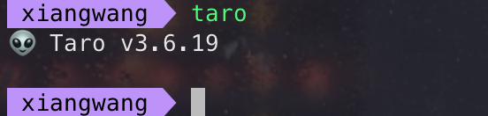
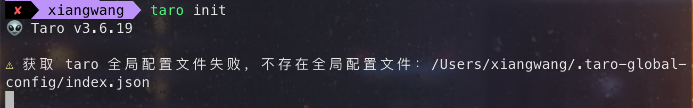
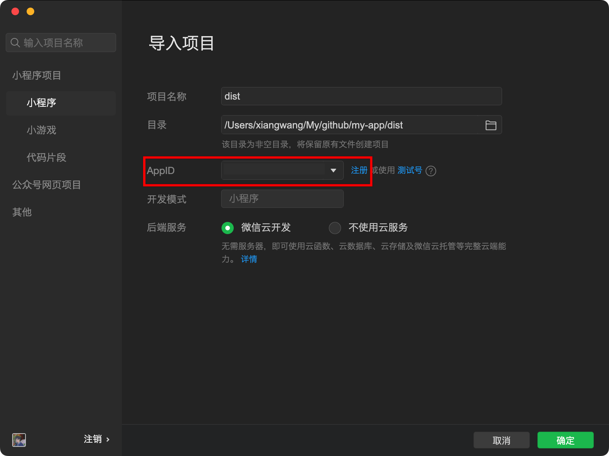
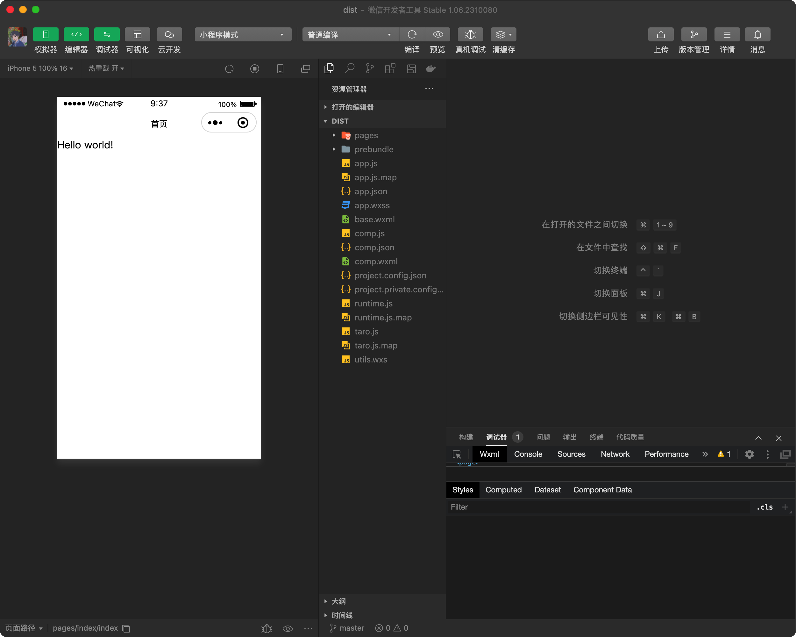

最快的上手方式就是开发一个简单的项目，然后有问题了再去查文档。

## 开发环境准备

目前 Taro 仅提供一种开发方式：安装 Taro 命令行工具（Taro CLI）进行开发。

```bash
# 全局安装 Taro CLI
npm i -g @tarojs/cli
# 不安装直接使用
$ npx @tarojs/cli init myApp
```

安装完成后，输入`taro`出现如下提示，则安装成功


## 初始化项目

直接使用 Taro 脚手架工具初始化一个 Taro 项目：



选择模板：在创建项目时，Taro 会提示您选择一个模板。根据您的需求选择适合的模板，这里以微信小程序为例，选择微信小程序模板。

```bash
├── __test__                    # 测试
├── config                      # 编译配置目录
│   ├── dev.js                  # 开发模式配置
│   ├── index.js                # 默认配置
│   └── prod.js                 # 生产模式配置
├── dist                        # 打包目录
├── src # 源码目录
│   ├── app.config.ts           # 全局配置
│   ├── app.scss                # 全局 CSS
│   ├── app.ts                  # 入口组件
│   ├── index.html              # H5 入口 HTML
│   └── pages                   # 页面组件
│       └── index
│           ├── index.config.ts # 页面配置
│           ├── index.scss      # 页面 CSS
│           └── index.tsx       # 页面组件，如果是 Vue 项目，此文件为 index.vue
├── types                       # ts声明
├── .env                        # 环境变量
├── .eslintrc.js                # ESLint 配置
├── babel.config.js             # Babel 配置
├── package.json                # Node.js manifest
├── project.config.json         # 微信小程序项目配置
├── project.tt.json             # 头条小程序项目配置

```

**dist 目录**

根据命令选择的终端，编译成特定代码，如使用 yarn dev:h5 则生成 web 的代码，使用 yarn dev:weapp 则会生成小程序代码，并且**每次执行都会删除之前的代码**。

### 入口组件

Taro 项目入口组件**用于注册应用**，默认为`src/app.ts`。在入口文件中可以设置全局状态或访问小程序入口实例的生命周期等。

```js
import { PropsWithChildren } from 'react'
// Taro 额外添加的 hooks
import { useLaunch } from '@tarojs/taro'
import './app.scss'

function App({ children }: PropsWithChildren<any>) {
  useLaunch(() => {
    console.log('App launched.')
  })

  // children 是将要会渲染的页面
  return children
}

export default App
```

入口组件可以使用小程序的生命周期：

- onLaunch

  在小程序环境中对应 app 的 onLaunch。[详细参数](https://docs.taro.zone/docs/react-entry/#onlaunch-options)

  Taro Hooks 中使用 useLaunch 代替 onLaunch

- onError

  小程序发生脚本错误或 API 调用报错时触发。

  Taro Hooks 中使用 useError 代替 onError

- componentDidShow

  程序启动，或切前台时触发。

- componentDidHide

  程序切后台时触发。

- onPageNotFound

  小程序页面找不到时。

  Taro Hooks 中使用 usePageNotFound 代替 onPageNotFound

更多请查看[Taro Hooks](https://docs.taro.zone/docs/hooks#taro-hooks)

### 全局配置

`src/app.config.ts` 文件用来对小程序进行全局配置，配置项遵循微信小程序规范，并且对所有平台进行统一。

用于设置页面组件的路径、全局窗口、路由等信息，一个最简单的全局配置如下：

使用编译时宏函数 defineAppConfig 包裹配置对象，以获得类型提示和自动补全。

```js
export default defineAppConfig({
  // 页面路径列表
  pages: ['pages/index/index'],
  // 全局的默认窗口表现
  window: {
    backgroundTextStyle: 'light',
    navigationBarBackgroundColor: '#fff',
    navigationBarTitleText: 'WeChat',
    navigationBarTextStyle: 'black',
  },
  // 底部 tab 栏的表现
  tabBar: {},
  // 分包结构配置
  subPackages: {},
})
```

- pages

  用于指定小程序由哪些页面组成，每一项都对应一个页面的 `路径 + 文件名` 信息。数组的**第一项代表小程序的初始页面**（首页）。
  新增/减少页面，都需要对 pages 数组进行修改。

- window

  用于设置小程序的状态栏、导航条、标题、窗口背景色。[详细配置](https://docs.taro.zone/docs/app-config/#window)

- tabBar

  通过 tabBar 配置项指定 tab 栏的表现，以及 tab 切换时显示的对应页面。

配置规范基于微信小程序的全局配置进行制定，所有平台进行统一。在配置文件中，Taro 并不关心框架的区别，Taro CLI 会直接在编译时在 Node.js 环境直接执行全局配置的代码，并把 export default 导出的对象序列化为一个 JSON 文件。

**因此，必须保证配置文件是在 Node.js 环境中是可以执行的，不能使用一些在 H5 环境或小程序环境才能运行的包或者代码，否则编译将会失败。**

### 页面组件

页面组件默认放在`src/pages`下，配置在全局配置中的`pages`中，通过 Taro 路由进行跳转，一个 Taro 应用至少有一个页面组件。

与 React 组件相比，Taro 中我们需要使用`@tarojs/components`的提供的[跨平台组件](https://docs.taro.zone/docs/components-desc/)`View`、`Text`等进行开发。

#### 生命周期

页面组件除了支持 React 的生命周期方法外，还根据小程序的标准，额外支持[以下生命周期](https://docs.taro.zone/docs/react-page/#%E7%94%9F%E5%91%BD%E5%91%A8%E6%9C%9F%E6%96%B9%E6%B3%95)

#### 页面配置

与入口组件一样，也存在一个页面配置文件`index.config.ts`，用于设置当前页面的导航栏、背景颜色等，页面中配置项在当前页面会覆盖全局配置的 `window` 中相同的配置项。

使用编译时宏函数 definePageConfig 包裹配置对象，以获得类型提示和自动补全。

```js
export default definePageConfig({
  navigationBarTitleText: '首页',
})
```

#### 快捷命令

使用命令

```bash
Taro create --name xxx
```

可以快速创建页面组件，并填充基础代码

## 项目运行

Taro CLI 生成的`package.json`文件中提供了多种命令

```json
"scripts": {
  "build:weapp": "taro build --type weapp",
  "build:swan": "taro build --type swan",
  "build:alipay": "taro build --type alipay",
  "build:tt": "taro build --type tt",
  "build:h5": "taro build --type h5",
  "build:rn": "taro build --type rn",
  "build:qq": "taro build --type qq",
  "build:jd": "taro build --type jd",
  "build:quickapp": "taro build --type quickapp",
  "dev:weapp": "npm run build:weapp -- --watch",
  "dev:swan": "npm run build:swan -- --watch",
  "dev:alipay": "npm run build:alipay -- --watch",
  "dev:tt": "npm run build:tt -- --watch",
  "dev:h5": "npm run build:h5 -- --watch",
  "dev:rn": "npm run build:rn -- --watch",
  "dev:qq": "npm run build:qq -- --watch",
  "dev:jd": "npm run build:jd -- --watch",
  "dev:quickapp": "npm run build:quickapp -- --watch",
  "test": "jest"
},
```

Taro 编译分为 dev 和 build 模式：

- dev 模式（增加 --watch 参数） 将会监听文件修改，执行`taro build --type xxx --watch`。
- build 模式（去掉 --watch 参数） 将不会监听文件修改，并会对代码进行压缩打包。
- dev 模式生成的文件较大，设置环境变量 NODE_ENV 为 production 可以开启压缩，方便预览，但编译速度会下降。

使用 build 命令都可以把 Taro 代码编译成不同端的代码（输出到 dist 目录中），然后在对应的开发工具中查看效果。

我们可以执行

```bash
yarn dev:h5
# 以上命令等同于
taro build --type h5 --watch
```

浏览器会直接打开一个网页，显示`Hello World`，默认端口为`10086`。

**如何生成小程序代码并预览呢？**

以微信小程序为例，执行：

```bash
yarn dev:weapp
```

输入完命令后，Taro 会将项目代码编译为微信小程序代码并输出到`dist`目录中。

此时需要我们下载[微信开发者工具](https://developers.weixin.qq.com/miniprogram/dev/devtools/download.html)，开发微信小程序必要的工具，在 h5 页面开发，在微信开发者工具上测试，最后真机调试。

接着将生成的小程序代码即`dist`目录**导入到微信开发者工具**



上面的`AppID`需要先注册一个微信开发者账号：[注册地址](https://mp.weixin.qq.com/wxopen/waregister?action=step1)

导入完成后，在微信开发者应用中看到以下页面：



接下来，我们可以开发一个复杂一点的应用，进一步入门 Taro。

## TodoMVC：万变不离其宗

记得我最开始学 vue 的时候，我的老师给我布置了一个任务：实现 TodoMVC

1. 使用原生 js 实现
2. 使用模板语法实现
3. 使用 vue 实现
4. 使用 vue+vue-router
5. 使用 vue+vue-router+vuex 实现

这样一套组合拳下来，对 vue 基本就算入门了，那么如法炮制，也可以用这种思路去入门 Taro。

Taro 中自带了 classnames，所以可以直接使用

没有产品，没有 UI，没有后端，但我有一颗改变骑行圈的决心。
