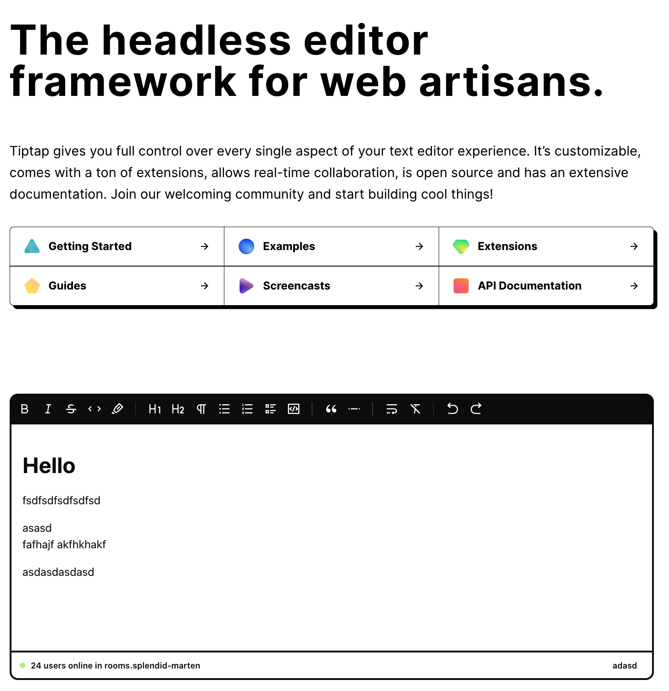
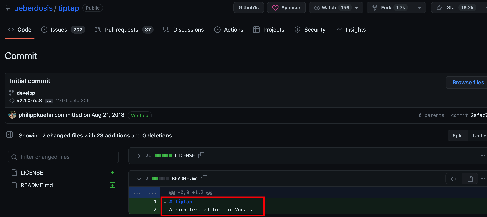
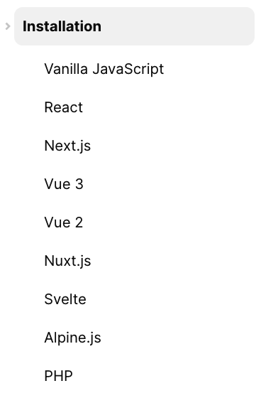
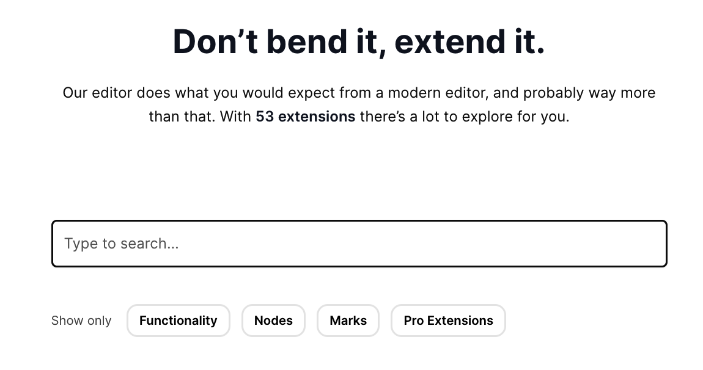

## Tiptap 概述

在说 Tiptap 之前，我们先了解一下[ProseMirror](https://prosemirror.net/) ，它是一款非常优秀和功能完备强大的「所见即所得」富文本编辑器框架，但并不是开箱即用的，需要一系列的模块进行配合搭建，上手成本比较高，且学习成本极大，有很多晦涩难懂的概念和 API，所以不会推荐直接去使用它，除非有遇到问题再查它的文档就行。

Tiptap 便是一款基于 ProseMirror 构建的`headless`富文本编辑器。

> headless: 无头，指不提供任何 UI 展示界面，完全自由的打造自己想要的风格，好处是可以根据需求自由地构建想要的 UI，而不用考虑样式权重及覆盖编辑器本身的样式，即不需要重写任何 class，不需要!important 覆盖样式等。

相比于 ProseMirror 的难上手，Tiptap 可以很轻松的接入各种框架，几分钟就可以创建好富文本编辑器。与各种比较成熟的富文本框架对比，Tiptap 的可定制化程度极高，可以做到让我们自己去控制富文本的每个方面，并且拥有丰富的扩展和比较友好的 API，并且基于[yjs](https://github.com/yjs/yjs)实现了时协作功能。

## Tiptap 兴起

Tiptap 是作者[Philipp Kühn](https://github.com/philippkuehn)在寻找 vue 版本的富文本组件时，一时找不到适合他需求的方案，这时发现有些大厂都在使用 ProseMirror，于是决定打造适用于 Vue 的 ProseMirror 的封装。

可以看到最早的提交是在 2018 年 8 月 21 日，作者最初的想法就很简单：`A rich-text editor for Vue.js`，专门为 Vue 的富文本编辑器，因为当时针对 React 的富文本已经有了很不错的 [Slate.js](https://github.com/ianstormtaylor/slate)。

## Tiptap 版本

Tiptap 前后共经历两个版本，Tiptap1 是在 Vue2 的基础上封装的，不支持 Vue3，并且对 Typescript 也不太友好，还存在一些 bug 问题。

于是 Tiptap 团队历经一年时间打造出 Tiptap2，相比于 Tiptap1 的主要有以下方面提升：

- 支持目前流行的大多数

  

- 基于 Typescript 重写，更好的 IDE 提示
- 更多开箱即用的扩展，目前有 53 款扩展

  

- 完全显示的注册文档、扩展等
- 新的自定义扩展 API
- 基于 yjs 的协同编辑

并且官方给出以下几点足够让你升级到 Tiptap2 的理由：

- IDE 中的自动补全
- 包含 100 多页和 100 多个交互式示例的惊人文档
- 积极开发，正在制作新功能，每周发布新版本
- 大量的新扩展
- 经过良好测试的代码库

更多请查看 [Upgrade Guide](https://tiptap.dev/overview/upgrade-guide)

## 基于 Tiptap 的优秀框架

### React

[BlockNote](https://github.com/TypeCellOS/BlockNote)，最新版本 v0.8.0，提交比较频繁，目前 2.5k🌟。
[think](https://github.com/fantasticit/think)，云策文档，国内开发者，目前 1.5k🌟。

### Vue

[element-tiptap](https://github.com/Leecason/element-tiptap)，国内开发者，目前新版本正在开发中，支持 Vue3，基于 tiptap2 和 Element Plus，目前 1k🌟。
[Nextcloud Text](https://github.com/nextcloud/text)，目前 426🌟。

### Angular

[ngx-tiptap](https://github.com/sibiraj-s/ngx-tiptap)，官方推荐的 Angular 的 Tiptap 封装。

### SolidJS

[solid-tiptap](https://github.com/LXSMNSYC/solid-tiptap)，官方推荐的 SolidJS 的 Tiptap 封装。

这些都是比较优秀的 Tiptap 的框架，当然还有一些比较好用的 Tiptap 扩展，像[tiptap-comment-extension](https://github.com/sereneinserenade/tiptap-comment-extension)等。

## 结束

本文先介绍 Tiptap 的基本概念，后续会接着分享下 Tiptap 的核心概念、基本使用、插件的使用、自定义插件等。
