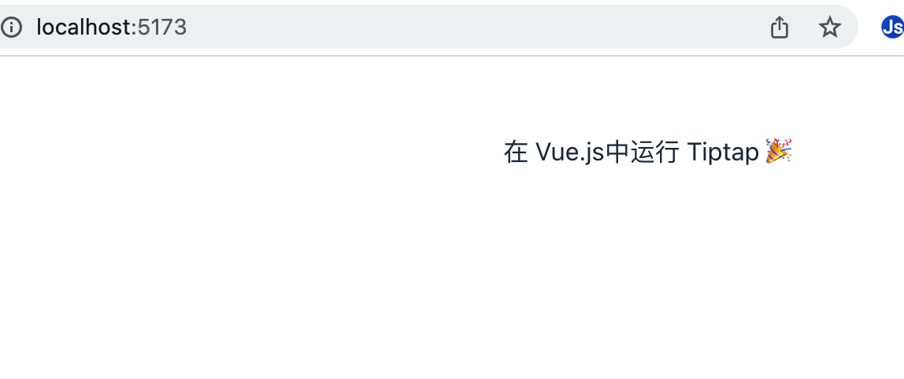
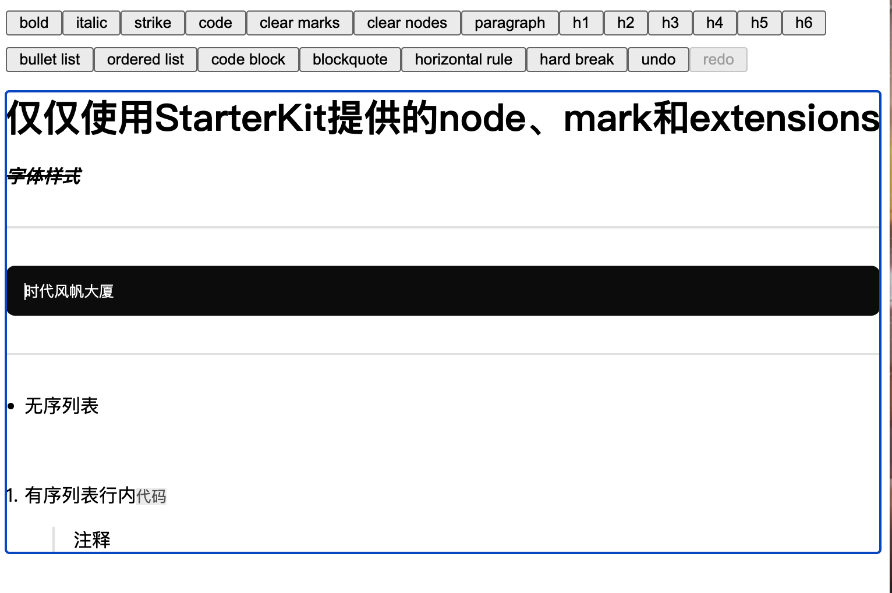
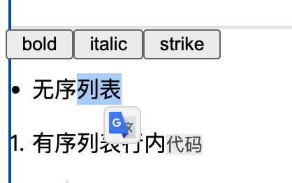
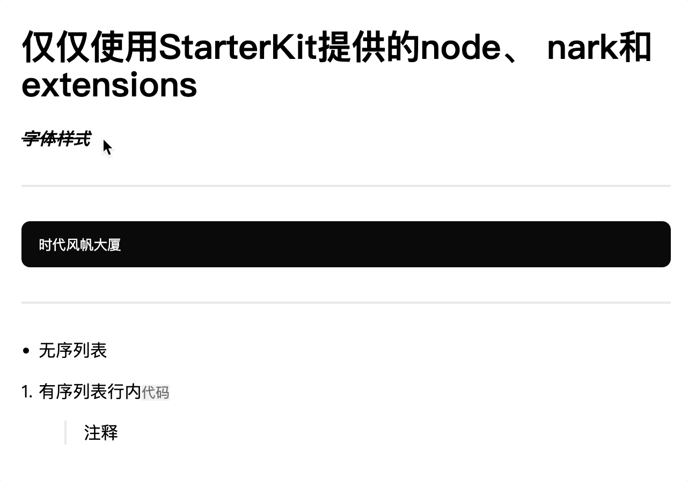
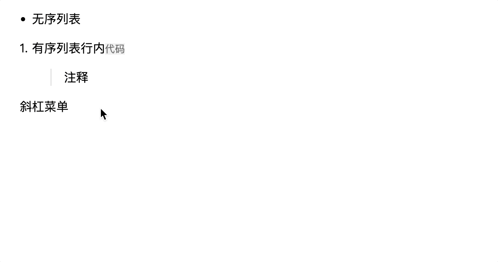
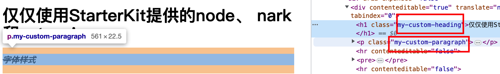
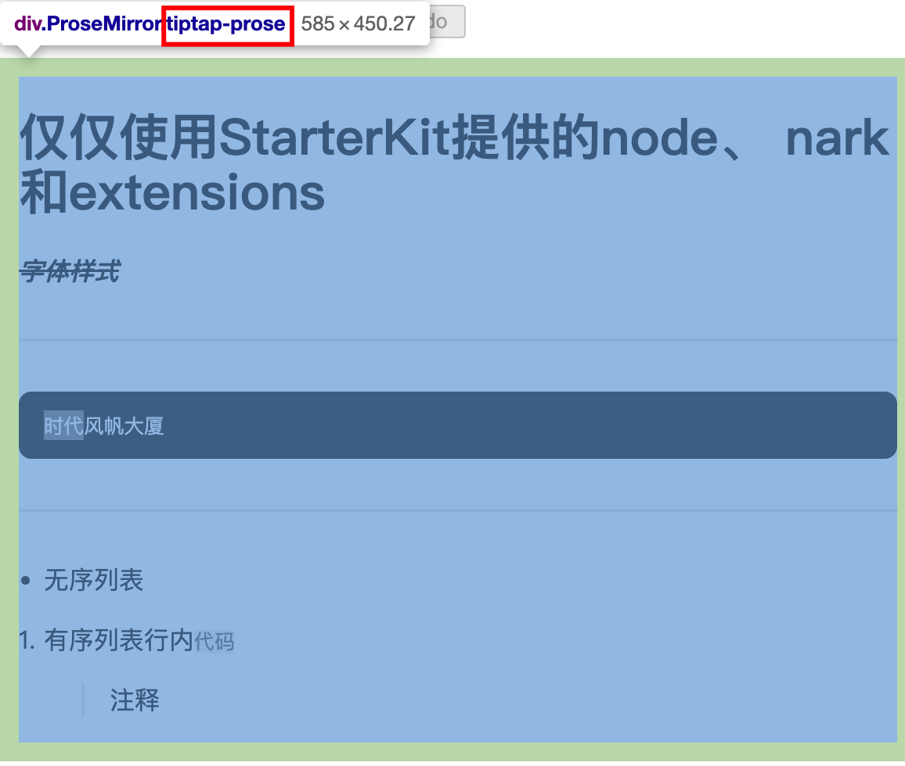
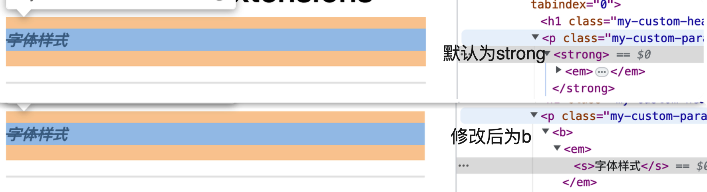

接上篇 [富文本编辑器 Tiptap 系列教程——5 分钟认识 Tiptap](https://juejin.cn/post/7240833787159838775)，本节我们主要讲一下如何构建一个 Tiptap 富文本编辑器。

> 通过上篇文章，我们已经对 Tiptap 有了简单的认识，那么接下来我们动手实操一下。

## 快速搭建一个简单的 Tiptap 应用

1. 使用 vite 创建 vue3 项目
2. 安装依赖

   ```bash
   pnpm install @tiptap/vue-3 @tiptap/pm @tiptap/starter-kit
   ```

3. 创建组件

   ```vue
   <template>
     <editor-content class="editor-container" :editor="editor" />
   </template>
   
   <script setup>
   import { useEditor, EditorContent } from '@tiptap/vue-3'
   import StarterKit from '@tiptap/starter-kit'
   
   const editor = useEditor({
     content: '<p>在 Vue.js中运行 Tiptap  🎉</p>',
     extensions: [StarterKit],
   })
   </script>
   <style scoped>
   .editor-container {
     width: 400px;
     height: 400px;
   }
   </style>
   ```

   此时启动项目就看到如下界面：

   

是不是很简单，我们只需要`@tiptap/vue-3`提供的`EditorContent`组件，然后定义要启用哪些扩展`extensions`，以及提供初始文档`content`，一个高度可定制的富文本编辑器就实现了 🎉。

初始化后，此时的编辑器只是光秃秃的一个输入框，与传统的富文本编辑器相比，还差一些功能，像：**顶部菜单**、**自定义样式**、**输入输出**等，这只需要我们一步步实现即可。

## 创建菜单

Tiptap 最大的特点：**Headless，无头，高度可定制。**

我们可以完全控制 Tiptap 的菜单、外观样式等，而且 Tiptap 提供了丰富的 API 来帮助我们打造自己的菜单。

Tiptap 中包含多种菜单样式：

1. 固定菜单
2. 气泡菜单
3. 浮动菜单
4. 斜杠`/`菜单

### 固定菜单

固定菜单就是我们常见的各种富文本编辑器的顶部或底部菜单。

例如，我们只引入 StarterKit ，然后用它提供的节点和扩展来做一个简单的 demo：


富文本编辑的菜单一般有这几种状态：点击事件、不可点击状态、激活状态，我们看一下`bold`的代码：

```html
<button
  @click="editor.chain().focus().toggleBold().run()"
  :disabled="!editor.can().chain().focus().toggleBold().run()"
  :class="{ 'is-active': editor.isActive('bold') }"
>
  bold
</button>
```

Tiptap 中调用 API 可以像 Promise 一样链式调用，通过`chain()`就可以创建一条链，比如上面的示例，同时执行了`focus()`和`toggleBold()`方法，focus 可以让编辑器重新获取焦点，因为当单击内容之外的按钮时，编辑器会失焦，所以需要 focus 重新获取焦点，后面大多数命令都会添加 focus，toggleBold 将所选文本切换粗体/清除粗体标记，Tiptap 中大多数扩展都带有 set…()、unset…() 和 toggle…() 命令，很好理解。

**注意：通过 chain 链式调用时需要添加 .run() 来实际执行所有命令。**

那我们怎么管理当前菜单的激活状态呢 🤔️？

Tiptap 也提供了相应的 API `isActive()`检查是否已将某些标记应用于所选文本，返回 true 或 false，我们可以借助该功能来切换 CSS 类名。比如通过`editor.isActive('bold')`判断选择的内容是否含有 Bold 标记，如果所选文本跨越多个标记，或者只有部分选择有标记，isActive()将返回 false。

```js
// 比较给定属性的示例
editor.isActive('highlight', { color: '#ffa8a8' })
// 支持正则表达式
editor.isActive('textStyle', { color: /.*/ })
// 比较标记的值
editor.isActive({ textAlign: 'right' })
```

### 气泡菜单

气泡菜单就是出现在所选文本附近的菜单，可以快速对所选文本进行设置。Tiptap 提供了[Bubble Menu](https://github.com/ueberdosis/tiptap/tree/main/packages/extension-bubble-menu)扩展来实现此功能。

1. 安装

   ```bash
   npm install @tiptap/extension-bubble-menu
   ```

2. 选项

   - element：菜单挂载点，HTML 节点
   - updateDelay：更新延迟，默认 250ms
   - tippyOptions：BubbleMenu 扩展基于 [tippy.js](https://atomiks.github.io/tippyjs/v6/all-props/)，此参数将完全传递给它
   - pluginKey：扩展唯一标识，项目暂时未用到
   - shouldShow：自定义菜单是否显示

3. 使用

   ```vue
   <template>
     <bubble-menu
       v-if="editor"
       :editor="editor"
       :tippy-options="{ duration: 100 }"
     >
       <button
         @click="editor.chain().focus().toggleBold().run()"
         :class="{ 'is-active': editor.isActive('bold') }"
       >
         bold
       </button>
       <button
         @click="editor.chain().focus().toggleItalic().run()"
         :class="{ 'is-active': editor.isActive('italic') }"
       >
         italic
       </button>
       <button
         @click="editor.chain().focus().toggleStrike().run()"
         :class="{ 'is-active': editor.isActive('strike') }"
       >
         strike
       </button>
     </bubble-menu>
   </template>

   <script setup>
   import { BubbleMenu, Editor } from '@tiptap/vue-3'
   defineProps({
     editor: {
       type: Editor,
       require: true,
     },
   })
   </script>

   <style lang="scss" scoped></style>
   ```

   完了，当我们选择文本时就会出现气泡菜单

   

4. 自定义显示逻辑

   上面说到可以通过 shouldShow 控制自定义菜单是否显示，那么我们可以修改代码如下：

   ```vue
   <template>
     <bubble-menu
       v-if="editor"
       :editor="editor"
       :tippy-options="{ duration: 100 }"
       :should-show="shouldShow"
     >
       。。。
     </bubble-menu>
   </template>
   
   <script setup>
   ...
   const shouldShow = ({ editor, view, state, oldState, from, to }) => {
     // 仅在无序列表选中的时候才显示气泡菜单
     return editor.isActive("bulletList");
   };
   </script>
   ```

   这样只有当我们选中无序列表时才会显示气泡菜单。

### 浮动菜单

浮动菜单就是出现在空行的菜单，可以快速设置当前行。Tiptap 提供了[Floating Menu](https://github.com/ueberdosis/tiptap/tree/main/packages/extension-floating-menu)扩展来实现此功能。

安装

```bash
npm install @tiptap/extension-floating-menu
```

选项、展示逻辑都与气泡菜单相同，这里不再赘述。看下效果：



### 斜杠菜单

斜杠菜单还是一个实验性的扩展，使用 `/` 开始一个新行，并会弹出一个窗口以选择应添加哪个节点。基于[suggestion](https://github.com/ueberdosis/tiptap/tree/main/packages/suggestion)



## 修改外观样式

Tiptap 是无头的，这意味着没有提供样式。同时也意味着，我们可以完全控制编辑器的外观。如设置编辑器的自定义样式。

- 通过容器设置 css 样式

  编辑器最外层的容器中 class 为`.ProseMirror`，可以通过这个类来自定义编辑器内部样式，完全由自己控制。

  ```css
  /* 只作用在编辑器中 */
  .ProseMirror p {
    margin: 1em 0;
  }
  ```

- 向扩展添加自定义类

  大多数扩展都可以通过 `HTMLAttributes` 选项将 class 类名添加到呈现的 HTML 元素上。所以可以使用它来添加自定义类（或任何其他属性）

  ```js
  new Editor({
    extensions: [
      Document,
      Paragraph.configure({
        HTMLAttributes: {
          class: 'my-custom-paragraph',
        },
      }),
      Heading.configure({
        HTMLAttributes: {
          class: 'my-custom-heading',
        },
      }),
      Text,
    ],
  })
  ```

  渲染到页面上如图所示：

  

- 向编辑器添加自定义类

  通过前面我们知道，编辑器实例的最外部容器类名为 `.ProseMirror`，我们也可以自定义它。在初始化 Editor 编辑器时，可以通过`editorProps.attributes.class`属性向编辑器添加 class，

  ```js
  new Editor({
    editorProps: {
      attributes: {
        class: 'tiptap-prose',
      },
    },
  })
  ```

  渲染到页面上如图所示：

  

- 自定义标记将节点

  如可以自定义的粗体扩展，将默认呈现的 `<strong> `标签，改为呈现 `<b>` 标签：

  ```js
  import Bold from '@tiptap/extension-bold'
  
  const CustomBold = Bold.extend({
    renderHTML({ HTMLAttributes }) {
      // Original:
      // return ['strong', HTMLAttributes, 0]
      return ['b', HTMLAttributes, 0]
    },
  })
  
  new Editor({
    extensions: [
      // …
      CustomBold,
    ],
  })
  ```

  

## Tiptap 输出和回显

也许已经有小伙伴想问很久了：**Tiptap 的数据保存和回填是怎么做的呢？** 这不就来了嘛 😂

Tiptap 编辑器的内容可以存储为 JSON 或 HTML 字符串，并且两者都可以用来传入编辑器进行内容回显。TIptap 提供了获取 JSON 和 HTML 字符串的 API：`getJSON()`和`getHTML()`，调用这两个方法，即可获得 JSON 格式或者 HTML 字符串的编辑器里的富文本内容。

### 保存输出结果

一般会有两种保存：实时保存和手动保存。

- 文档发生改变时保存

  Tiptap 提供了`onUpdate`来监听编辑器内容变化，通过`getJSON()`和`getHTML()`即可拿到最新数据。

  ```js
  const editor = new Editor({
    onUpdate({ editor }) {
      const json = editor.getJSON()
      const html = editor.getHTML()
      console.log(json)
      console.log(html)
    },
  })
  ```

- 手动保存

  通常是点击按钮时进行保存，此时通过初始化的`editor`实例，调用上述方法即可拿到数据。

### 回显

回显时可以在编辑器初始化时设置`content`字段，或者调用`setContent`异步更新，JSON 格式或 HTML 格式都可以进行回填，并且官方提供了[JSON 转 HTML 的 API](https://tiptap.dev/guide/output#option-2-generate-html-from-prosemirror-json)。

而如果想将其他富文本编辑器内容转为 Tiptap 的内容，官方同样提供了一个 PHP 包来将 HTML 转换为兼容的 JSON 结构：[ueberdosis/prosemirror-to-html](https://github.com/ueberdosis/html-to-prosemirror)。

```js
// 编辑器初始化时设置
new Editor({
  content: `<p>示例文字</p>`,
})

// or 后期异步更新设置
editor.commands.setContent(json)
```

### 协同操作

Tiptap 对 [Y.js](https://docs.yjs.dev/) 提供一流的支持，添加实时协作、离线编辑或设备间同步等功能非常棒，当然此时就不能只是简单的 HTML 或 JSON 格式的存储了，以后再说，可以先看官方[协同编辑](https://tiptap.dev/guide/collaborative-editing)文档。

### Markdown

Tiptap 基于一些原因， 目前不支持 Markdown 作为输入或输出格式，如：HTML 或 JSON 格式是嵌套结构，而 Markdown 是扁平的。如果想实现要 Markdown，可以参考前面提到的[Nextcloud Text](https://github.com/nextcloud/text)。

我们也可以在[官方 demo](https://tiptap.dev/examples/default)中看到更多案例，有很多都是可以直接拿过来用的。

## 最后

这篇文章通过搭建 Tiptap 应用，我们了解了 Tiptap 的一些 API、菜单样式以及 Tiptap 的输出格式。通过这篇文章，相信你已经可以搭建一个自己开发的富文本编辑器了，那还等什么？动手试试吧 😄。
