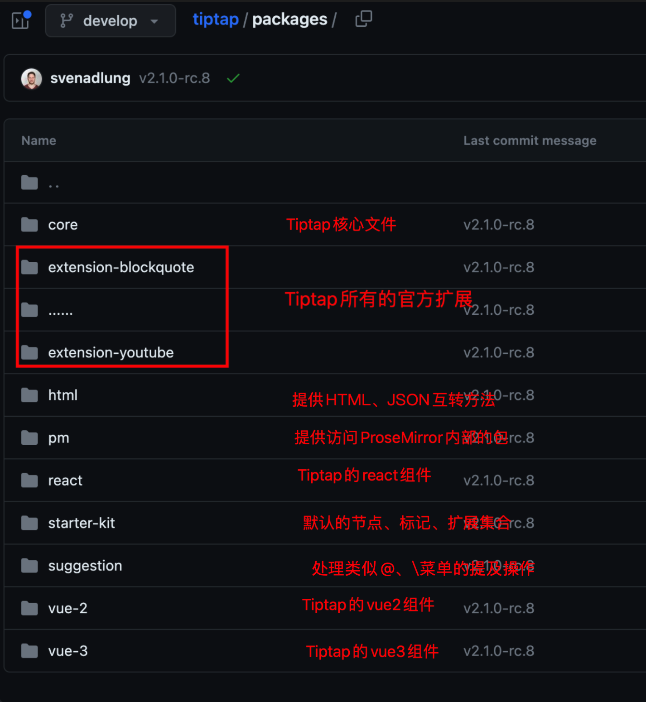
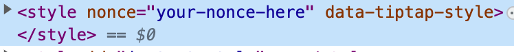
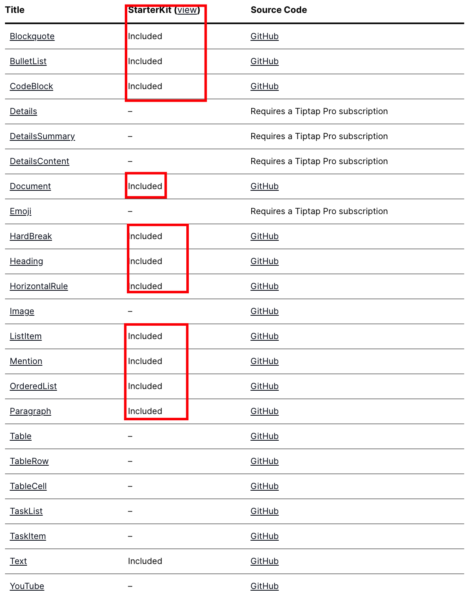
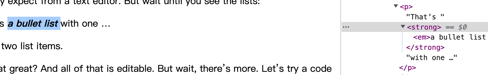

接上篇[富文本编辑器 Tiptap 系列教程——5 分钟搭建基于 Tiptap 的富文本编辑器 ](https://juejin.cn/post/7243413934765621307)，本节我们主要讲一下 Tiptap 的基本概念。

## Tiptap 模块

[Tiptap](https://github.com/ueberdosis/tiptap/tree/develop)采用 monorepo 的方式构建代码，相关的包都在 packages 下：



我们上篇文章初始化安装时有以下几个模块：

- @tiptap/vue-3：适用于 vue3 的 tiptap 组件，类似的还有[@tiptap/react](https://github.com/ueberdosis/tiptap/tree/develop/packages/react)、[@tiptap/vue-2](https://github.com/ueberdosis/tiptap/tree/develop/packages/vue-2)

  Tiptap 简化了创建 ProseMirror 编辑器的大部分繁重工作，例如创建 EditorView、设置初始 EditorState 等，在 vue3 中可以很方便的使用`useEditor`钩子进行初始化，vue2 可以使用`new Editor`初始化。
  我们项目中通过继承 Tiptap 的`Editor`，并在其基础上封装了一些基础设置和常用方法。

- @tiptap/pm：提供了所有重要的 ProseMirror 包，如 prosemirror-state、prosemirror-view 或 prosemirror-model，这样我们就可以访问所有 ProseMirror 内部各种强大的 API，比如我们需要注册插件的时候：

  ```js
  import { Plugin, PluginKey } from '@tiptap/pm/state'

  ...
  addProseMirrorPlugins() {
    return [
      new Plugin({
        key: new PluginKey('xxx'),
        ...
      })
    ]
  }
  ...
  ```

- @tiptap/starter-kit：StarterKit 是最流行的 Tiptap 扩展的[集合](https://tiptap.dev/api/extensions/starter-kit#included-extensions)，包含最基本的 Tiptap 节点、标记和扩展，并且可以对其中的一个或多个进行配置或禁用，在项目中我们可以先引入 StarterKit 再根据自己的需求引入其他扩展即可

  ```js
  import StarterKit from '@tiptap/starter-kit'

  const editor = new Editor({
    ...
    extensions: [
      StarterKit.configure({
        // 禁用历史记录
        history: false,

        // 目录只有一级目录和二级目录
        heading: {
          levels: [1, 2],
        }
      }),
    ],
    ...
  })
  ```

## Tiptap 初始化配置

我们在初始化编辑器的时候可以为编辑器开启一些默认配置，如：初始内容 content、扩展 extensions、自动获取焦点 autofocus、是否可编辑 editable 等。

```js
import Document from '@tiptap/extension-document'
import Paragraph from '@tiptap/extension-paragraph'
import Text from '@tiptap/extension-text'

new Editor({
  extensions: [Document, Paragraph, Text],
  content: `
    <h2>
      Hi there,
    </h2>
  `,
  autofocus: false,
  editable: true,
})
```

我们来看下所有可用的配置项列表：

### element

将编辑器内容绑定到指定的元素，针对于 JS 引用，vue 中不用配置，使用`EditorComponent`即可。

### extensions

Tiptap 扩展列表，可以使用 StarterKit 默认扩展，或其他扩展。

```js
import { Editor } from '@tiptap/core'
import StarterKit from '@tiptap/starter-kit'
import Document from '@tiptap/extension-document'
import Paragraph from '@tiptap/extension-paragraph'
import Text from '@tiptap/extension-text'
import Highlight from '@tiptap/extension-highlight'

new Editor({
  // 使用默认扩展
  extensions: [StarterKit],

  // 使用其他扩展
  extensions: [Document, Paragraph, Text],

  // 也可以混着用
  extensions: [StarterKit, Highlight],
})
```

### content

初始化时传递给编辑器的内容，可以是 HTML 或 JSON 格式。

### editable

设置编辑器读写权限，`true` 可编辑 `false` 只读。

### autofocus

设置编辑器是否自动聚焦和设置光标位置：

- 'start': 设置光标在编辑器文档的最前面
- 'end': 设置光标在编辑器文档的最后面
- 'all' 选中全部文档
- Number: 光标设置到文档中的特定位置
- true: 自动获取焦点
- false: 禁用自动获取焦点
- null: 禁用自动获取焦点

### enableInputRules

默认情况下开启所有[输入规则](https://tiptap.dev/guide/custom-extensions/#input-rules)，通过`enableInputRules`可以自定义输入规则。一般不会直接在这里设置，而是在节点或扩展中通过`addInputRules`来设置。

比如：我们使用 markdown 语法的规则来定义有序无序列表的输入，在输入`-`、`+`、`*`后空格启用无序列表，输入`1`、`a`、`一`后输入`.`或`、`启用有序列表。

```js
export const List = Node.create({
  name: 'list',
  // ...
  // 有序无序列表输入规则
  addInputRules() {
    return [
      new InputRule({
        find: /^\s*([-+*])\s$/,
        handler({ range, chain, state }) {
          if (isInListNde(state)) return
          chain().deleteRange(range).wrapInBulletList().run()
        },
      }),
      new InputRule({
        find: /^\s*([1a一][.、])\s$/,
        handler({ range, chain, match, state }) {
          if (isInListNde(state)) return
          if (match[0]?.startsWith('a')) {
            chain()
              .deleteRange(range)
              .wrapInOrderedList()
              .toggleListStyle({ listStyle: '4' })
              .run()
          } else if (match[0]?.startsWith('一')) {
            chain()
              .deleteRange(range)
              .wrapInOrderedList()
              .toggleListStyle({ listStyle: '7' })
              .run()
          } else {
            chain().deleteRange(range).wrapInOrderedList().run()
          }
        },
      }),
    ]
  },
})
```

### enablePasteRules

默认情况下开启所有[粘贴规则](https://tiptap.dev/guide/custom-extensions/#paste-rules)，通过`enablePasteRules`可以自定义粘贴规则。

### injectCSS

Tiptap 默认注入的[css 样式](https://github.com/ueberdosis/tiptap/blob/main/packages/core/src/style.ts)，通过设置`injectCSS`可以禁用掉。

### injectNonce

HTML [nonce](https://developer.mozilla.org/zh-CN/docs/Web/API/HTMLElement/nonce)是一种告诉浏览器特定脚本或样式元素的内联内容不是由某些(恶意)第三方注入到文档中，而是由控制文档的服务器的人故意放入文档中的方法。

使用`injectNonce`可以指定要添加到动态创建的元素的 `nonce`，如设置`injectNonce: "your-nonce-here"`，这样在控制台中看到的样式文件会带有`nonce`标志。



### editorProps

传递`editorProps`由`ProseMirror`处理，用来覆盖编辑器事件或更改编辑器 DOM 元素属性。

### parseOptions

传递`parseOptions`由`ProseMirror`处理。

[所有配置选项](https://tiptap.dev/api/editor#settings)

## NNde、Mark、Extension

Tiptap 的大多功能依赖于 [节点 node](https://tiptap.dev/api/nodes)、[标记 mark](https://tiptap.dev/api/marks) 和 [扩展 extension](https://tiptap.dev/api/extensions) 这三个模块，所以想要敲开 Tiptap 的大门，我们需要熟悉这三个模块。

### 节点 node

如果您将文档视为一棵树，那么节点就是该树中的一种内容。类似 DOM 树和 DOM 节点，而 Tiptap 节点指的是段落 Paragraph、标题 Heading、代码块 CodeBlock、表情 Emoji 等等。

前面讲到我们可以使用 StarterKit 来初始化节点、标记和扩展，我们看下 StarterKit 已经包含的 node 列表



像其他的一些比如图片 Image、表格 Table 等，需要导入如`@tiptap/extension-image`相关插件来配置。

```bash
npm install @tiptap/extension-image
```

```js
new Editor({
  extensions: [Image],
})
```

Tiptap 已经为我们完成了大多数的 node，当然如果你觉得不够用或不好用的话，也可以自定义节点。

```js
import { Node } from '@tiptap/core'

const CustomNode = Node.create({
  // Your code here
})

const editor = new Editor({
  extensions: [CustomNode, Document, Paragraph, Text],
})
```

### 标记 mark


可以将一个或多个标记应用于节点，例如添加内联格式（如粗体和斜体）或其他附加信息。如上图，当我们给节点设置`加粗`和`斜体`后，在 html 内容中可以看到会讲`<strong>`和`<em>`标签添加到对应节点上，这些对应的 html 标签就是 mark。

StarterKit 中已经包含了一些常用的 mark，其余的只需要引入即可，当然像 node 一样 mark 也是可以自定义的。

### 扩展 extension

Tiptap 提供具有更多功能的扩展，横向增加 Tiptap 的功能，像之前的 node 和 mark 都可以作为扩展添加到 Tiptap 中。
可以在社区中找到更多的 Tiptap [扩展](https://github.com/ueberdosis/awesome-tiptap#community-extensions)

#### extension 的工作原理

尽管 Tiptap 试图隐藏 ProseMirror 的大部分复杂性，但它构建在 ProseMirror 之上，所以扩展的底层依然是基于 roseMirror，要想使用自定义扩展这样的高级功能必须对 ProseMirror 的原理有一定的了解。

现有的节点、标记和扩展都有 Github 地址，这样我们就能很方便的看到它们的源码。看下官方扩展的源码可以让我们可能会遇到 ProseMirror 的各种 API，然后可以在[ProseMirror API](https://prosemirror.net/docs/ref/)中找到它，去了解并学习最终运用在自己的自定义扩展中。

#### 自定义 extension

自定义扩展只需要继承通过 Extension 去创建一个扩展，最后引入到初始化 Editor 的 extensions 中即可。

```js
import { Extension } from '@tiptap/core'

const CustomExtension = Extension.create({
  // Your code here
})

const editor = new Editor({
  extensions: [
    // Register your custom extension with the editor.
    CustomExtension,
    // … and don't forget all other extensions.
    Document,
    Paragraph,
    Text,
    // …
  ],
})
```

## 最后

通过本文的介绍，想必大家已经对 Tiptap 重要的概念有了一定的了解，也知道了如何自定义节点或扩展。推荐大家阅读一些比较简单的扩展源码，类似[Bold](https://github.com/ueberdosis/tiptap/tree/develop/packages/extension-bold)、[CharacterCount](https://github.com/ueberdosis/tiptap/tree/main/packages/extension-character-count)这种，学习别人是怎么完成一个扩展，怎样使用 Tiptap 或 ProseMirror API 的，**学了就会有收获**💪。

以上就是本文的全部内容，希望这篇文章对你有所帮助，欢迎点赞和收藏 🙏，如果发现有什么错误或者更好的解决方案及建议，欢迎随时联系。
