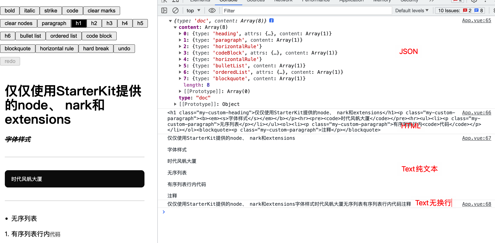

接上篇[富文本编辑器 Tiptap 系列教程——Tiptap 模块&概念详解](https://juejin.cn/post/7243413934765621307)，本文我们主要说一下 Tiptap 的常用方法 & 命令。

## Tiptap 实例

首先回忆一下我们之前初始化编辑器部分：

```js
const editor = new Editor({ ... })
```

通过`new Editor`或`useEditor`初始化得到的`editor`就是一个编辑器实例，实例上存在很多实用方法和属性，下面我们来一一列举下。

### 方法

编辑器实例提供了很多方法，可以返回任何内容，增加 Tiptap 的可操作性。

### can()

检查命令或命令链是否可以执行，不会实际执行。返回值为`false/true`。

比如：之前利用`!editor.can().chain().focus().toggleBold().run()`来对`加粗bold`按钮进行启用或禁用。

```js
<button
  @click="editor.chain().focus().toggleBold().run()"
  :disabled="!editor.can().chain().focus().toggleBold().run()"
  :class="{ 'is-active': editor.isActive('bold') }"
>
  bold
</button>
```

### chain()

之前说过，通过`chain()`可以创建一条链来执行多个方法，最后需要添加`.run()`来实际执行所有命令。

```js
editor.chain().focus().toggleBold().run()
```

### destroy()

销毁编辑器实例并注销所有事件，在组件销毁时调用。

```js
onUnmounted(() => editor.value.destroy())
```

### getHTML()/getJSON()/getText()

获取编辑器 HTML/JSON/纯文本 Text 内容。

```js
onUpdate({ editor }) {
  const json = editor.getJSON()
  const html = editor.getHTML()
  // 默认两个节点 nodes 之间两个换行符
  const text = editor.getText()
  // 可传入参数 blockSeparator 控制节点之间的连接
  const lineText = editor.getText({ blockSeparator: '' })
  console.log(json)
  console.log(html)
  console.log(text)
  console.log(lineText)
}
```



### getAttributes()

获取当前选中的节点或标记的属性，如获取当前链接的href属性：

```js
editor.getAttributes('link').href
```

### isActive()

返回当前选定的节点或标记是否处于激活状态，如我们之前用于判断`bold`是否处于激活状态时，为其添加`is-active`类：

```js
:class="{ 'is-active': editor.isActive('bold') }"
```

### registerPlugin()/unregisterPlugin()

注册/注销一个 ProseMirror 插件。

项目中暂时还没有用到，我们可以看下 vue3 中对[BubbleMenu](https://github.com/ueberdosis/tiptap/blob/HEAD/packages/vue-3/src/BubbleMenu.ts#L53)注册插件的代码。

```js
import { BubbleMenuPlugin, BubbleMenuPluginProps } from '@tiptap/extension-bubble-menu'
// ...
onMounted(() => {
  const {
    updateDelay,
    editor,
    pluginKey,
    shouldShow,
    tippyOptions,
  } = props

  editor.registerPlugin(BubbleMenuPlugin({
    updateDelay,
    editor,
    element: root.value as HTMLElement,
    pluginKey,
    shouldShow,
    tippyOptions,
  }))
})

onBeforeUnmount(() => {
  const { pluginKey, editor } = props

  editor.unregisterPlugin(pluginKey)
})
// ...
```

在`onMounted`中注册插件`BubbleMenuPlugin`，并在`onBeforeUnmount`通过`pluginKey`注销这个插件。

### setOptions()

手动更新编辑器的配置。

我们通过`new Editor()`初始化时对编辑器添加配置之外，还可以通过`setOptions()`去动态的修改配置，参数同初始化相同。

```js
// 添加 class 样式到编辑器实例
editor.setOptions({
  editorProps: {
    attributes: {
      class: 'my-custom-class',
    },
  },
})
```

### setEditable()

更新编辑器的可编辑状态，接受两个参数`editable`和`emitUpdate`。

```js
// 设置编辑器只读
editor.setEditable(false)
```

### 属性

目前有 isEditable（是否是编辑状态） 和 isEmpty（内容是否为空） 两个属性。

### isEditable

返回编辑器是可编辑的还是只读的。

```js
editor.isEditable
```

### isEmpty

检查是否有内容。

```js
editor.isEmpty
```

## Commands 命令

Commands 命令用于更改编辑器的状态（内容、选区等），仅返回 `true/false`。Tiptap 编辑器提供了大量 Commands 命令，可以添加或更改内容、更改选择等。只有掌握这些命令，才能更好的使用 Tiptap 编辑器。

**切记：不要混淆实例方法和 commands 命令**，实例方法可返回任何内容，命令仅返回 `true/false`。

### 执行命令

Tiptap 中所有命令都可以通过编辑器实例`editor`调用，比如在用户单击按钮时将文本设置为粗体：

```js
editor.commands.setBold()
```

上面命令可以使所选内容变为粗体，但在使用此类命令时是点击外部按钮，会导致编辑器失焦，所以通常会通过链式调用使编辑器重新获取焦点。

#### chain 链式调用

大多数的命令可以组合为一个调用，这比单独的函数调用要简短优雅一些，链命令以`.chain()`开头`.run()`结尾，将多个命令合并成一个事务，内容只更新一次，并且事务也只触发一次，比如修改上面使文本加粗的例子：

```js
editor.chain().focus().toggleBold().run()
```

上面我们说过当点击编辑器外部区域调用方法时，会导致编辑器失焦，所以需要链式调用`focus()`使编辑器重新获取焦点，再继续执行其他方法。

#### 检测命令是否可执行

通过`editor.can().xxx()`可以判断命令是否可以执行，返回`true/false`。比如我们在表格中需要判断当前选中单元格是否可以合并/拆分，因为并不是所选的单元格就可以进行合并/拆分操作：

```js
// 是否可合并
editor.can().mergeCells()
// 是否可拆分
editor.can().splitCell()
```

### Try commands

`.first()`用于执行命令列表，首先执行第一个命令，如果第一个命令返回`true`，即执行成功时就会停止；如果第一个命令执行失败，就会接着执行第二个命令，即一个接一个执行，遇到成功执行的命令则停止执行。

如：退格键首先尝试撤消输入规则。如果成功，就到此为止。如果没有应用输入规则，因此无法恢复，它将运行下一个命令并删除选择。

```js
editor.first(({ commands }) => [
  () => commands.undoInputRule(),
  () => commands.deleteSelection(),
  // …
])
```

也可以在命令中应用 `commands.first()` 方法

```js
export default () =>
  ({ commands }) => {
    return commands.first([
      () => commands.undoInputRule(),
      () => commands.deleteSelection(),
      // …
    ])
  }
```

### 命令合集

Tiptap 有很可使用多命令，包括对文档、节点/标记和选中区域的各种操作，所以要想玩转 Tiptap，必须熟悉这些命令，知道在什么时候用什么命令。

#### content 文档命令

- clearContent

  清空文档中的所有内容。

- insertContent/insertContentAt

  在当前/指定位置插入纯文本、HTML 或 JSON 节点。这两个命令使用较多，如一些自定义节点插入内容时我们会使用：

  ```js
  commands.insertContent({
    type: 'xxx',
    attrs: {},
  })
  ```

  或者如插入表情内容时：

  ```js
  props.editor.chain().focus().insertContent(emoji).run()
  ```

- setContent

  设置文档内容（用新文档替换该文档），一般用于初始化文档内容。

#### 节点、标记命令

- clearNodes

  将节点规范化为默认节点，一般用于清除样式，如：橡皮擦功能。

- createParagraphNear

  在选中节点后面添加空段落。

- deleteNode

  删除选中节点，如一些自定义节点删除时：

  ```js
  Backspace: () => {
    return this.editor
      .chain()
      .deleteNode(this.name)
      .insertContent('<p></p>')
      .run()
    return false
  }
  ```

- extendMarkRange

  扩展当前的选择以包含当前标记，如将当前选中区域设置为链接：

  ```js
  props.editor
    .chain()
    .focus()
    .extendMarkRange('link')
    .setLink({ href: link })
    .run()
  ```

- setMark

  在当前选择处添加一个新标记，主要用于对选中文本添加各种标记，如对设置加粗或字体等：

  ```js
  setFontSize:
    (fontSize) =>
    ({ tr, chain, editor, dispatch }) => {
      return chain().setMark('textStyle', { fontSize }).run()
    },
  unsetFontSize:
    () =>
    ({ chain }) => {
      return chain().setMark('textStyle', { fontSize: null }).run()
    }
  ```

- setNode

  将当前节点替换成指定节点，如对当前节点进行标题和正文的切换：

  ```js
  editor.commands.setNode('paragraph')
  editor.commands.setNode('heading', { level: 1 })
  ```

- toggleMark

  在当前选择处打开和关闭特定标记，也就是添加或取消添加标记，如：

  ```js
  editor.commands.toggleMark('bold')
  ```

  点击一次时选中内容加粗，再次点击选中内容将取消粗体。

- toggleNode

  类似于 toggleMark，所选节点将在一个节点与另一个节点之间切换，如：

  ```js
  props.editor.chain().focus().toggleNode('paragraph', 'heading').run()
  ```

  点击一次时当前节点转为标题，再次点击标题又转为段落。

- unsetAllMarks

  将选中内容的所有 marks 标记移除。

- unsetMark

  与 setMark 作用相反，移除当前选中内容的指定标记。

- updateAttributes

  更新节点、标记的属性，只需传递需要更改的属性，如针对图片的宽度设置：

  ```js
  editor.commands.updateAttributes('image', { width: 100 })
  ```

#### selection 选区命令

- blur

  使编辑器失去焦点。

- focus

  将焦点设置回编辑器，可以看到上面讲到的大部分链式命令中都用了 focus 命令，并且可以针对光标位置进行设置：

  ```js
  // 设置编辑器获得焦点
  editor.commands.focus()

  // 设置光标位于编辑器开始位置
  editor.commands.focus('start')

  // 设置光标位于编辑器结尾位置
  editor.commands.focus('end')

  // 选中全部文档
  editor.commands.focus('all')

  // 设置光标到pos=10的位置
  editor.commands.focus(10)

  // 设置光标位于结尾位置，但是滚动条不滚动到结尾（当内容高度大于编辑器高度有滚动条时）
  editor.commands.focus('end', { scrollIntoView: true })
  ```

- deleteRange

  删除指定范围内所有内容，如：

  ```js
  editor.commands.deleteRange({ from: 0, to: 10 })
  ```

- deleteSelection

  删除当前选中节点。

- enter

  触发键盘"Enter"。

- scrollIntoView

  将视图滚动到当前选择或光标位置。

- selectAll

  选中整个文档。

- setNodeSelection

  给定位置创建一个新的节点选区，如选中图片、列表等块元素，传入节点的所在位置。

- setTextSelection

  创建一个文本选区，接受 number 或 range，如果传入 range 时会选中文本，传入 number 时只是移动光标位置。

  ```js
  // 仅移动光标
  editor.commands.setTextSelection(6)
  // 选中文本区域
  editor.commands.setTextSelection({ from: 6, to: 8 })
  ```

## 总结

本文主要讲了 Tiptap 实例方法和常用命令，记住不要**混淆实例方法和命令**。我们只需要记住这些 API 的大概作用，脑袋里有个“影子”。一旦某个地方需要这么做的时候，要能回忆起好像已经有方法实现了，然后再去详细查看对应的方法，最终使用它并解决问题，这套思想适用于所有 API 较多的组件、框架等。

这篇文章完后，关于自定义节点、标记扩展等的文章暂时不再更新。leader 安排我做 webrtc 音视频通话的调研工作，等完成这部分工作后继续更新。

以上就是本文的全部内容，希望这篇文章对你有所帮助，欢迎点赞和收藏 🙏，如果发现有什么错误或者更好的解决方案及建议，欢迎随时联系。
