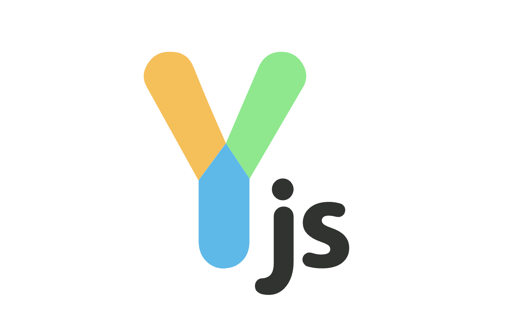

思考一下，如果想要实现一个富文本编辑器的的协同编辑，你能想到哪几种方案呢 🐶？

## 呼之欲出的方案

### 直接覆盖

这个是最最简单粗暴的办法：即保存最后一次修改，更早一些的其他人的修改直接被丢弃，也就是**管其他人死活，我自己爽就好**。

### 锁机制

还可以利用`锁机制`去实现，比如：A 用户正在编辑某个文档时，对此文档进行加锁处理，避免多人同时编辑，从而避免文档的内容冲突。
优点：简单粗暴，但会影响用户体验。

### diff-patch

第三种就是`diff-patch`了，我们可以类比`基于 git 的版本管理`，多人编辑时利用 socket 与服务端通信，当多人编辑时服务端进行差异对比、合并，自动进行冲突处理，在通过 socket 更新其他人本地的文档。
弊端是会出现类似 git 修改同一行，纯靠服务端无法处理，需要手动处理的问题。

### 结论

基于以上三种方法实现富文本编辑器的协同编辑时，无法实现真正意义的协同编辑。

1. 如果使用`直接覆盖`，显然是不行的，可能你辛辛苦苦`挤出来`的内容直接被覆盖掉，欲哭无泪 😭；
2. 那么使用`锁机制`可行吗？显然不可行，限制同时只能一人编辑，别人编辑时也只能干等着；
3. `diff-patch`虽然可行，但需要额外的操作步骤和成本，实时性很差，不适合高频同时修改的场景。

于是就引出了`OT 和 CRDT`这类专门用于**处理协同文档**的方案。

## What is OT

OT 算法全称为 **Operational Transformation**，直接翻译就是**操作转换**，即包含两个过程**操作** & **转换**。

OT 算法是一种用于实时协同编辑的算法，它通过操作转换来实现数据的一致性。在 OT 算法中，每个用户对数据的操作（如修改、删除等）都被记录下来，并在其他用户的客户端进行相应的转换，从而实现多个用户对同一份数据的协同编辑。

OT 算法的优点在于它可以实时地反映用户的操作，并且可以很好地处理并发冲突。然而，OT 算法需要在中心化的服务器上进行协同调度，因此对于大规模的分布式系统来说可能不太适用。

### 发展史

- 1989 年，OT 算法被正式提出，标志协同编辑技术的进步
- 2006 年，Google 首次将 OT 算法应用于商业产品 Google Docs
- 2011 年，微软在 Office 365 中基于 OT 实现了协同编辑
- 2012 年，Quill 编辑器开源，其数据模型 [Delta](https://quilljs.com/docs/delta/) 基于 OT 算法设计，降低了协同编辑门槛，基于 Quill 可以很方便的实现协同富文本编辑，随后被更多中小公司产品采用
- 2013 年，一款基于 OT 的流行的开源解决方案 [ShareDB](https://github.com/share/sharedb) 开源

### 操作 Operational

基于 OT 的协同编辑核心是：将文档的每一次修改看作是一个操作，即**操作原子化处理**，如在第 N 个位置插入一个字符时，客户端会将操作发送到服务端去处理。

在富文本领域，最经典的 Operational 有 quill 的 [Delta](https://quilljs.com/docs/delta/) 模型，通过 retain、insert、delete 三个操作完成整篇文档的描述与操作，如下图所示。

还有 slate 的 [JSON](https://docs.slatejs.org/api/operations) 模型，通过 insert_text、remove_text 等等操作来完成整篇文档的描述。

### Transformation 转换

客户端将原子化的操作发送到服务端时（`必须有中央服务器进行调度`），服务端对多个客户端的操作进行转换，对客户端操作中的并发冲突进行修正，确保当前操作同步到其他设备时得到一致的结果，因为对冲突的处理都是在服务端完成，所以客户端得到的结果一定是一致的，也就是说 OT 算法的结果**保证强一致性**。

转换完成后，通过网络发送到对应客户端，客户端合并操作，从而得到一致结果。

这也就意味着 **OT 算法对网络要求更高**，如果某个用户出现网络异常，导致一些操作缺失或延迟，那么服务端的转换就会出现问题。

下面是一个 OT 算法的协同过程：

`OT 算法会通过一系列的变化来调整其中一个操作`，而这个调整转化的核心就是[transform](https://github.com/Operational-Transformation/ot.js/blob/master/lib/simple-text-operation.js#L88)方法，它可以对不同的操作进行修正。

我们可以通过[OT 算法可视化](https://operational-transformation.github.io/index.html)来看下 OT 算法的实现过程。

上面这个演示体现了**OT 算法对网络要求更高**的说法，Alice 先修改的文档，由于网络的原因 Bob 的请求先到的服务器，所以此时得到的结果并不是想要的结果，但 OT 算法的期望是得到**一致的结果**，所以这一点看来也是没错的 😂。

## What is CRDT

CRDT 算法全称为 Conflict-free Replicated Data Type，即**无冲突复制数据类型**，是一种基于数据结构的无冲突复制数据类型算法，它`通过数据结构的合并来实现数据的一致性`。

在 CRDT 算法中，每个用户对数据的修改都会被记录下来，并在其他用户的客户端进行合并，以实现数据的一致性。CRDT 算法的优点在于它可以适用于大规模的分布式系统，并且不需要中心化的服务器进行协同调度。但是，CRDT 算法在处理复杂操作时可能会存在合并冲突的问题，需要设计复杂的合并函数来解决。

### 发展史

- 2011 年，CRDT 算法提出，代表了一种新的协同编辑方案的出现
- 2015 年，基于 CRDT 的协同编辑框架 [Yjs](https://docs.yjs.dev/) 开源，Yjs 是专门为在 web 上构建协同应用程序而设计的。

### 类型

通过[维基百科](https://zh.wikipedia.org/wiki/%E6%97%A0%E5%86%B2%E7%AA%81%E5%A4%8D%E5%88%B6%E6%95%B0%E6%8D%AE%E7%B1%BB%E5%9E%8B)对 CRDT 的介绍，CRDT 包含以下两种：

- CmRDT：基于操作的 CRDT，`OP-based-CRDT`
- CvRDT：基于状态的 CRDT，`State-based CRDT`

基于状态的 CRDT 更容易设计和实现，每个 CRDT 的整个状态最终都必须传输给其他每个副本，每个副本之间通过同步全量状态达到最终一致状态，这可能开销很大；

而基于操作的 CRDT 只传输更新操作，各副本之间通过同步操作来达到最终一致状态，通常很小。

下面是一个 CRDT 算法的协同过程：

### 向量时钟

案例第 4 步有提到**向量时钟（Vector Clock）**，它是一种在分布式系统中用于记录事件顺序的时间戳机制。它的主要目的是在分布式环境中实现事件的并发控制和一致性。

向量时钟的基本思想是为系统中的每个节点维护一个向量，其中每个分量对应一个节点，用于记录该节点的事件发生次数。当一个节点发生事件时，它会增加自己分量的值。向量时钟的关键是在不同节点之间传递这些向量，并在合并时确保一致性。

1. **事件发生：**

   在分布式系统中，不同的节点（例如，多个客户端或服务器）都可以独立地发生事件。这些事件可以是用户的操作、消息的发送等。

2. **向量时钟的基本思想：**

   向量时钟是一种记录事件顺序的数据结构。每个节点都维护一个向量，向量的每个分量对应一个节点。分量的值表示对应节点的事件次数。当节点发生事件时，它会增加自己分量的值。

3. **事件发生时的向量更新：**

   当节点 A 发生事件时，它将自己的向量中对应分量的值增加 1。这样，每个节点的向量都会随着事件的发生而更新。

4. **向量时钟的传递：**

   当一个节点向另一个节点发送消息时，它会将自己的向量时钟传递给接收方。这样，接收方就能知道发送方的事件顺序。

5. **合并向量时钟：**

   当接收方收到消息并希望合并两个向量时钟时，它会比较两个向量的每个分量，选择较大的值作为合并后的值。这确保了在合并后的向量中，每个节点的事件次数都不会减少。

6. **一致性和并发控制：**

   向量时钟的设计旨在解决分布式系统中的并发控制问题。通过比较向量时钟，系统能够理解事件发生的顺序，从而确保在合并时保持一致性。

[分布式系统：向量时钟](https://zhuanlan.zhihu.com/p/56886156)

### CRDT 优势

[Why AFFiNE Chose CRDT over OT to Build a Collaborative Editor](https://medium.com/@affineworkos/why-affine-chose-crdt-over-ot-to-build-a-collaborative-editor-14b05689584c#e71f)这篇文章从三个方面说明 CRDT 的优势，分别是：

1. **去中心化**

   减少对服务器的依赖，任意客户端可自行独立地解决冲突。

2. **性能**

   通过近些年的优化，CRDT 的性能已经超越传统 OT 的性能，并且由于 CRDT 的去中心化性质，可以容忍较高的延迟，并且可在离线模式下解决冲突。

3. **灵活性和可用性**

   CRDT 支持更广泛的数据类型，像 Yjs 支持 Text、Array、Map 和 Xml 等数据结构，使其适用于更多业务场景。

## OT vs CRDT

两种方法的相似之处在于它们提供了**最终的数据一致性**。不同之处在于他们如何做到这一点：

- OT 通过**算法控制**保证数据一致性：操作通过发送到服务端，一旦收到就会进行转换（ OT 控制算法）。
- CRDT 通过**数据结构**保证数据一致性：操作是在本地 CRDT 上进行的，它的状态通过网络发送并与副本的状态合并。

### 不同点

1. OT 是基于中央服务器进行转换操作；而 CRDT 只需要与同伴交换新数据，不需要中央服务器，每个客户端都可以是独立完整的版本，因此**稳定性很高**。
2. OT 相较于 CRDT 发展更早，技术体系更为成熟，服务端压力大，客户端无需像 CRDT 那样存储大量额外元数据，因此压力较小。
3. OT 用复杂性换来了对用户预期的实现；而 CRDT 则更加关注数据结构，**复杂性低**，不过随着数据结构的复杂度上升，算法的时间和空间复杂度也会呈指数上升的，会带来性能上的挑战。
4. OT 处理不同数据模型需要实现不同的转换算法；CRDT 只需要转化数据结构。
5. CRDT 去中心化的特征，很容易**实现离线编辑**；

综上所述，OT 算法和 CRDT 算法各有优缺点，适用于不同的场景。如果需要实现文本的实时协同编辑，OT 算法更为合适；如果需要在大规模分布式系统中实现数据一致性，CRDT 算法更为合适。

CRDT 不依赖于编辑器实现，使用它可以实现任意一款编辑器的协同编辑，只需要将对应的数据结构转换成 CRDT 的数据结构，内部会自动处理冲突和同步，并且可以不依赖中心化的服务器，在复杂的网络中表现更加稳健。

并且随着 CRDT 的逐步崛起以及去中心化（web3.0）的流行，新的产品也更多地开始基于 CRDT 开发协同编辑功能，例如 [Figma](https://www.figma.com/file/o7ekFKPe01QCYrozrD1WWj/Untitled?type=whiteboard&node-id=0-1&t=qUzVTtGC4OU34fjz-0)、[Miro](https://miro.com/app/board/uXjVN25OUr0=/)等。

### CRDT 开源实现：Yjs

Yjs 本身是一个**数据结构**，原理是：当两人协作时，对于文档内容修改，通过中间层将文档数据转换成 CRDT 数据；通过 CRDT 进行数据数据更新这种增量的同步，通过中间层将 CRDT 的数据转换成文档数据，另一个协作方就能看到对方内容的更新。

中间内容的更新是基于 Yjs 数据结构进行的，冲突处理等核心都是 Yjs 承担的，通信基于 websocket 或 webrtc，所以我们只需要简单的使用，底层的冲突处理、光标等都不需要深入学习。

#### Yjs 架构图

- `接入层`：Yjs 支持大部分主流编辑器的接入，只需要实现中间绑定层将 Yjs 的数据模型与编辑器的数据模型进行绑定，用于编辑器数据模型与 Yjs 数据模型之间进行转换

- `Yjs`: 包含最核心的数据结构及逻辑。如数据类型的定义，数据读写编码 encoding 模块，事件监听，状态管理 StructStore，Undo/Redo 管理器等

- `Providers`：支持将 Yjs 数据在网络之间转发，或同步到数据库
  - y-websocket: 提供协同编辑时的消息通讯，如：更新文档和 awareness 信息
  - y-protocols: 定义消息通讯协议，包括文档更新、管理用户信息、用户状态，同步光标等
  - y-redis - 持久化数据到 Redis
  - y-indexeddb - 持久化数据到 IndexedDB

#### 支持众多编辑器

在上层 Yjs 支持任何大部分主流编辑器的接入，因为 Yjs 也可以理解为一套独立的数据模型，它与每种编辑器本身的数据模型是不同的，所以每种编辑器想要接入 Yjs 都必须实现一个中间绑定层，用于编辑器数据模型与 Yjs 数据模型转换，这个转换是双向的。

Yjs 支持多种流行的文本和富文本编辑器，如

- ProseMirror：[https://docs.yjs.dev/ecosystem/editor-bindings/prosemirror](https://docs.yjs.dev/ecosystem/editor-bindings/prosemirror)
- Tiptap：[https://tiptap.dev/docs/editor/guide/collaborative-editing](https://tiptap.dev/docs/editor/guide/collaborative-editing)
- Remirror：[https://docs.yjs.dev/ecosystem/editor-bindings/remirror](https://docs.yjs.dev/ecosystem/editor-bindings/remirror)
- milkdown：[https://milkdown.dev/docs/guide/collaborative-editing](https://milkdown.dev/docs/guide/collaborative-editing)
- Quill：[https://docs.yjs.dev/ecosystem/editor-bindings/quill](https://docs.yjs.dev/ecosystem/editor-bindings/quill)
- Slate：[https://github.com/BitPhinix/slate-yjs/](https://github.com/BitPhinix/slate-yjs/)
- Monaco：[https://docs.yjs.dev/ecosystem/editor-bindings/monaco](https://docs.yjs.dev/ecosystem/editor-bindings/monaco)
- CodeMirror：[https://docs.yjs.dev/ecosystem/editor-bindings/codemirror](https://docs.yjs.dev/ecosystem/editor-bindings/codemirror)

#### 冲突处理

Yjs 基于数据结构层面处理冲突，比 OT 更加稳健 ，对复杂网络的适应性更强。网络延时或离线编辑对数据结构来说，处理没有任何差异。

#### 协同列表及光标位置

Yjs 提供的 Awareness（意识）模块，名如其意，让协作者能够意识到其他人的位置在哪，有效避免冲突可能性。

#### 离线编辑

基于 CRDT 的内容合并，天然支持离线编辑，浏览器端做本地化存储。

#### 版本历史支持

Yjs 自身提供了快照机制，保存历史版本不用保存全量数据，只是基于 Yjs 打一个快照，后续基于快照恢复历史版本。

#### 系统编辑人数上限

上限人数很高，可支持很多人同时编辑。

## 总结

本篇文章主要学习 OT 和 CRDT 协同算法的原理，以及它们之间的对比，CRDT 未来会有更好的发展。并且初步了解了一下 Yjs，接下来我们会着重学习 Yjs，并讲解如何使用 Yjs 来实现富文本编辑器、脑图、文档等的协同编辑。

然后说下开题的结论，OT 和 CTDT 之间也不能说谁赢，只能就目前趋势来说，CRDT 已经在性能、可用性等方面已经赶上 OT，并且有着去中心化的优势，近些年新产品的协作编辑方面都会优先考虑使用 CRDT 方案来实现。

以上就是本文的全部内容，希望这篇文章对你有所帮助，欢迎点赞和收藏 🙏，如果发现有什么错误或者更好的解决方案及建议，欢迎随时联系。
