> WebRTC 系列教程分为三篇进行介绍，本篇为第二篇，上一篇 WebRTC 这么火 🔥，前端靓仔，请收下这篇入门教程。

通过上一篇文章，各位小伙伴们应该都了解了 WebRTC 相关概念以及通信过程后，趁热打铁，我们来动手搭建一个 WebRTC 一对一音视频通话项目。

[👉🏻 在线体验地址](https://wangxiang.website/)

[👉🏻 完整代码地址](https://github.com/wang1xiang/tiptap-editor/tree/master/02-quill-collab)

## Yjs 介绍

官方介绍：**用于构建 Google Docs 和 Figma 等协作应用程序的模块化构建块**。

通过上文想必大家已经对 OT 和 CRDT 这两种协同编辑算法有所了解。[Yjs](https://docs.yjs.dev/) 是基于 CRDT ，帮助实现高性能的协作应用程序。

如果目前使用的编辑器是上述其中之一时，根据上述 demo 便可以很简单的完成协同编辑。当我们学习完成后，就可以使用它来实现各类应用的协同编辑。

[在线 demo](https://demos.yjs.dev/)

### 对比

[automerge](https://automerge.org/)是一个用于构建协作应用程序的数据结构库，也是基于 CRDT 算法实现的，通过它与 Yjs 的[对比](https://github.com/dmonad/crdt-benchmarks?tab=readme-ov-file#results)可知 Yjs 是迄今为止最快的 CRDT 实现。

## 基础代码

这是基础的 Yjs 代码，现在看不懂没关系，通过我们的学习，后面再回来看，就看得懂了。

```js
import * as Y from 'yjs'

// Yjs documents are collections of
// shared objects that sync automatically.
const ydoc = new Y.Doc()
// Define a shared Y.Map instance
const ymap = ydoc.getMap()
ymap.set('keyA', 'valueA')

// Create another Yjs document (simulating a remote user)
// and create some conflicting changes
const ydocRemote = new Y.Doc()
const ymapRemote = ydocRemote.getMap()
ymapRemote.set('keyB', 'valueB')

// Merge changes from remote
const update = Y.encodeStateAsUpdate(ydocRemote)
Y.applyUpdate(ydoc, update)

// Observe that the changes have merged
console.log(ymap.toJSON()) // => { keyA: 'valueA', keyB: 'valueB' }
```

## 5 分钟打造基于 Quill 的协同编辑器

之前提过 Quill 的 delta 结构是在在 2012 年开源的，
通过打造 Quill 富文本编辑器的协同编辑我们来一起学习下 Yjs 的使用吧。

1. 通过`npx create-vite quill-collab`创建一个 vue 项目
2. 安装 quill 即插件 quill-cursor

   ```bash
   yarn add quill quill-cursors
   ```

   覆盖 main.ts 代码

   使用以下代码覆盖 main.ts

   ```js
   import Quill from 'quill'
   import QuillCursors from 'quill-cursors'
   import 'quill/dist/quill.snow.css'

   Quill.register('modules/cursors', QuillCursors)

   const quill = new Quill(document.querySelector('#app'), {
     modules: {
       cursors: true,
       toolbar: [
         // adding some basic Quill content features
         [{ header: [1, 2, false] }],
         ['bold', 'italic', 'underline'],
         ['image', 'code-block'],
       ],
       history: {
         // Local undo shouldn't undo changes
         // from remote users
         userOnly: true,
       },
     },
     placeholder: 'Start collaborating...',
     theme: 'snow',
   })
   ```

   启动服务

3. 引入 Yjs 绑定 Quill 编辑器

   ```bash
   yarn add yjs y-quill
   ```

   y-quill 是 Yjs 官方提供的，通过它可以将 Quill 数据模型和 Yjs 数据模型进行绑定。

   main.ts 添加如下代码

   ```js
   import * as Y from 'yjs'
   import { QuillBinding } from 'y-quill'
   // Yjs文档，保存共享数据shared data
   const ydoc = new Y.Doc()
   // 在文档上定义共享文本类型
   const ytext = ydoc.getText('quill')

   // 创建一个编辑器绑定 将quill编辑器“绑定”到 Y.Text 类型。
   const binding = new QuillBinding(ytext, quill)
   ```

   首先通过`new Y.Doc()`创建 Yjs 文档，用于保存共享数据；
   接着创建名为 Quill 的 ytext 对象，用于表示文本的共享数据结构；
   最后通过 `QuillBinding` 将 ytext 与 Quill 编辑器保持同步。
   几乎所有编辑器与 Yjs 进行绑定时都是以上三步。

   Yjs 自动解决共享数据的并发更改，因此我们不必再担心冲突解决。

4. 使用 y-websocket 进行数据传输

   前三步客户端的操作已经完成，接下来就是要接上服务端，实现数据传输了。

   Yjs 提供了多种类型的[Provider](https://docs.yjs.dev/ecosystem/connection-provider)用于数据传输，如：WebSocket、WebRTC、Dat。

   ```bash
   yarn add y-websocket
   ```

   修改代码：

   ```js
   import { WebsocketProvider } from 'y-websocket'
   // 连接到 websocket 服务端 yjs提供的体验服务器
   const provider = new WebsocketProvider(
     'wss://demos.yjs.dev',
     'quill-demo-room',
     ydoc
   )
   // 绑定
   const binding = new QuillBinding(ytext, quill, provider.awareness)
   ```

   大多数 Provider 的共同点是他们使用房间名称的概念来连接 Yjs 文档。在上面的示例中，所有指定“quill-demo-room”作为房间名称的文档都将同步。

5. 协同效果

   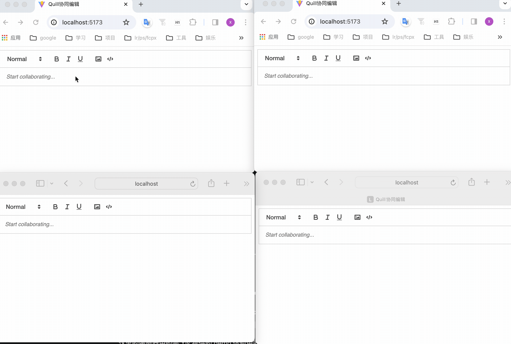

   因为 websocket 服务连接失败，不同浏览器之间的协同是没有生效的。

   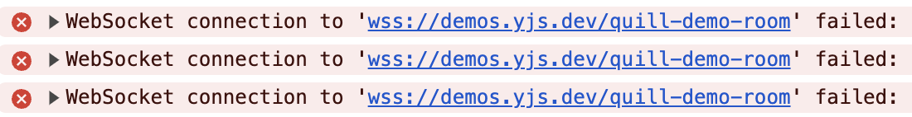

   那为什么同一浏览器的两个 tab，没连上服务也能做协同编辑呢？

   这是因为 Yjs 会**优先通过浏览器的同 host 共享状态的方式进行通信**，然后才是网络通信。

6. 创建本地服务

   Yjs 提供的体验服务器既然无法连接，那么我们可以自己本地通过 npx 启一个 y-websocket 服务：

   ```bash
   PORT=1234 npx y-websocket
   ```

   

   修改 ws 服务的地址

   ```js
   const provider = new WebsocketProvider(
     'ws://localhost:1234',
     'quill-demo-room',
     ydoc
   )
   ```

   此时效果就正常了
   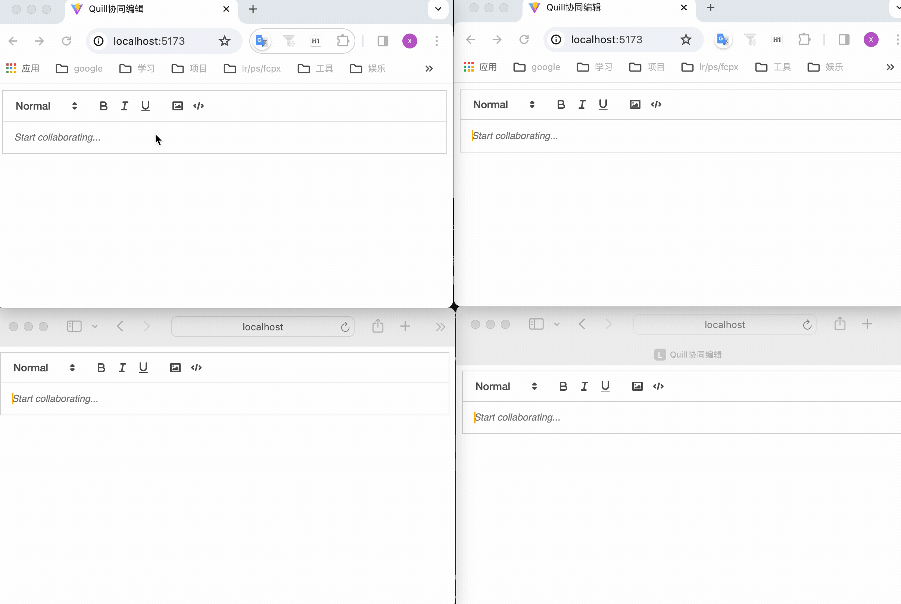

我们通过短短的几十行代码，就实现了 Quill 富文本编辑器的协同编辑，有了这个前提，那我们来整理下 Yjs 几个比较重要的概念。

### Yjs

包含最核心的数据结构及逻辑。如数据类型的定义，数据读写编码 encoding 模块，事件监听，状态管理 StructStore，Undo/Redo 管理器等。

### Documents

```js
import * as Y from 'yjs'

const doc = new Y.Doc()
```

通过 `new Y.Doc()` 会创建一个 Doc 实例（即一个 Yjs 文档），作用：

1. 是承载共享数据 Shared Types 的容器
2. 是网络传输 Provider 的载体，将 ydoc 传入 WebSocket 的 provider 后即可支持网络同步

```js
// 连接到 websocket
const provider = new WebsocketProvider(
  'ws://localhost:1234',
  'quill-demo-room',
  ydoc
)
```

Y.doc 上有很多有用的属性，如：

#### doc.clientID: number

**只读属性**，标识会话的客户端的唯一 ID, Yjs 旨在为每个会话创建一个新的 clientID，以避免同步冲突。同一用户打开多个 tab 页时 clientID 也是唯一的，不允许跨会话重复使用，可见[FAQ](https://docs.yjs.dev/api/faq#i-get-a-new-clientid-for-every-session-is-there-a-way-to-make-it-static-for-a-peer-accessing-the-doc)。

#### doc.gc: boolean

是否在此文档实例上启用垃圾回收，默认为`true`。更多可通过[Internals](https://docs.yjs.dev/api/internals)了解 Yjs 的内部工作原理。

#### doc.transact(function(Transaction): void [, origin:any])

Yjs 中 Documents/Shared Types 的所有更改都发生在事务中，每次事务后都会触发 `observer` 调用和 `update` 事件，触发监听和更新操作。

#### doc.get(string, Y.[TypeClass]): [Type]

获取共享类型的顶级实例

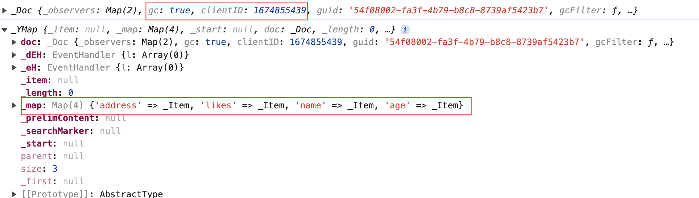

#### doc.getText/getArray/getMap

用于定义 Shared Types 类型

#### doc.on/once/off

事件监听

#### doc.on('beforeTransaction', function(tr: Transaction, doc: Y.Doc))

事件处理程序在每次事务之前都会被调用

#### doc.on('beforeObserverCalls', function(tr: Transaction, doc: Y.Doc))

事件处理程序在调用共享类型的观察程序之前立即调用

#### doc.on('afterTransaction', function(tr: Transaction, doc: Y.Doc))

事件处理程序在每次事务之后立即调用

#### doc.on('update', function(update: Uint8Array, origin: any, doc: Y.Doc, tr: Transaction))

监听 Shared Types 上的最新消息，所有更新消息都传播给所有用户，每个人最终都会统一相同的状态。

前面说了“Yjs 中 Documents/Shared Types 的所有更改都发生在事务中”，当发生变更时，事件按以下顺序调用：

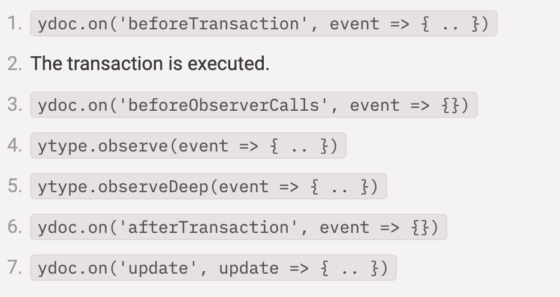

可修改代码测试

```js
const ydoc = new Y.Doc()
ydoc.on('beforeTransaction', () => console.log('beforeTransaction'))
ydoc.on('beforeObserverCalls', () => {console.log('beforeObserverCalls'))
ydoc.on('afterTransaction', () => console.log('afterTransaction'))
ydoc.on('update', (update) => console.log('update'))

// 创建一个顶层名为 kun 的 YMap
const ymap = ydoc.getMap('kun')
ymap.observe(() => console.log('observe'))
ymap.observeDeep(() => console.log('observeDeep'))
```

测试结果如下：

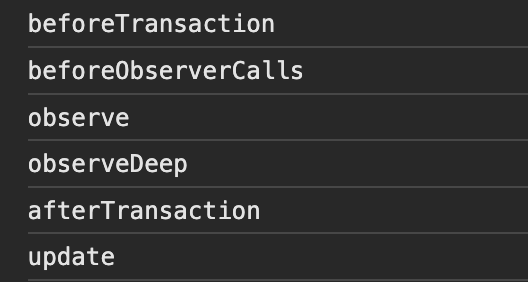

完整属性可见[这里](https://docs.yjs.dev/api/y.doc)

### Shared Types

**the most unique feature of Yjs yet: Shared Types.**

Shared Types 是 Yjs 最核心的内容，用于表示可协同编辑的数据结构。通过它可以实现任何应用的协作，比如：文档、表格、绘图等等。

Yjs 提供了多种类型的 Shared Types：包括常见的数据结构 [Y.Map](https://docs.yjs.dev/api/shared-types/y.map)、[Y.Array](https://docs.yjs.dev/api/shared-types/y.array)、[Y.Text](https://docs.yjs.dev/api/shared-types/y.text)，使用起来就和 js 的 map、array 对象基本是一样的，具体使用哪种需要根据实际的数据结构来决定。比如上一节中将 Y.Text 通过 `y-quill` “绑定”到 Quill 的编辑器实例以自动同步编辑器内容。

想要实现协同编辑的，我们就需要**构造好一个 Shared Types，监听它的变化，将变化通知其他端**即可。看下在 Yjs 中是怎么实现的？

#### 构造 Shared Types

比如我们有如下数据：

```js
{
  name: 'kunkun',
  age: '2.5',
  address: {
    country: 'China',
    city: 'shanghai'
  },
  likes: ['Sing', 'dance', 'rap', 'basketball']
}
```


尝试将他转为 Y.Map 格式如下：

```js
import * as Y from 'yjs'

const ydoc = new Y.Doc()

// 创建一个顶层名为 kun 的 YMap
const ymap = ydoc.getMap('kun')

// 构造嵌套的 ymap
const ymapAddress = new Y.Map()
ymapAddress.set('country', 'China')
ymapAddress.set('city', 'shanghai')
ymap.set('address', ymapAddress)

// 构造嵌套的 yarray
const yarrayLikes = Y.Array.from(['Sing', 'dance', 'rap', 'basketball'])
// const yarrayLikes = new Y.Array()
// yarrayLikes.push(['Sing'])
// yarrayLikes.push(['dance'])
// yarrayLikes.push(['rap'])
// yarrayLikes.insert(3, ['basketball'])
ymap.set('likes', yarrayLikes)
ymap.set('name', 'kunkun')
ymap.set('age', '2.5')

console.log(ymap.toJSON())
```

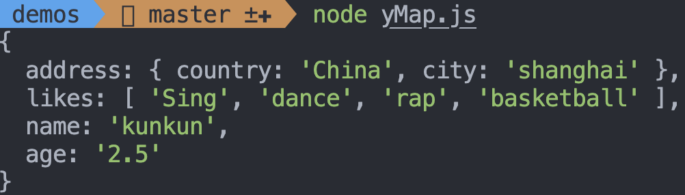

上面的 API 可参考[yMap](https://docs.yjs.dev/api/shared-types/y.map)

#### 监听变化

yMap 已经构造完成，那么接下来便是监听它的变化作相应的处理。

Shared Types 中通过 observe 和 observeDeep 来监听数据的变化，当数据变化时，会触发监听的回调函数，回调函数会通过更新事件 [YEvent](https://docs.yjs.dev/api/y.event) 传入当前的更新内容，从而执行相应的操作。

- ymap.observe：注册一个 observe，当修改数据时会调用该方法
- ymap.unobserve：取消注册在 ymap.observe 中方法
- ymap.observeDeep
- ymap.unobserveDeep(function)

observeDeep 与 observe 的不同在于 observeDeep 是深度监听，类似于 watch 的`deep:true`。

修改代码如下：

```js
// 创建一个顶层名为 kun 的 YMap
const ymap = ydoc.getMap('kun')

// 监听变化
ymap.observe(event => {
  event.changes.keys.forEach((change, key) => {
    if (change.action === 'add') {
      console.log(`Property "${key}" was added. Initial value: "${ymap.get(key)}".`)
    } else if (change.action === 'update') {
      console.log(`Property "${key}" was updated. New value: "${ymap.get(key)}". Previous value: "${change.oldValue}".`)
    } else if (change.action === 'delete') {
      console.log(`Property "${key}" was deleted. New value: undefined. Previous value: "${change.oldValue}".`)
    }
  })
})
...
```

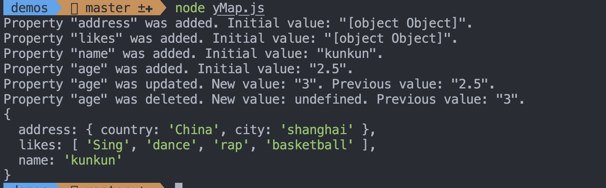

#### 更新同步

通过 observe 已经可以监听到 Shared Types 的变化，那么如何将变化应用到其他副本呢？

首先，协作编辑时传输数据很频繁，并且一般数据量都比较大，Yjs 为了减少每次传输数据的大小，对数据进行二进制编码（高度压缩）后，通过 [Update API](https://docs.yjs.dev/api/document-updates#update-api) 与其他文档进行同步，所有客户端收到所有文档更新后都会同步，主要使用下面两个 API 进行同步：

- Y.applyUpdate：将当前更新应用到一个新副本
- Y.encodeStateAsUpdate：编码整个文档为单个更新消息

之前我们提到了发生变更时的事件执行顺序，Shared Types 变更时通过 `ydoc.on('update', )` 接收 `ytype.observe` 所发出的增量更新，将计算出的增量更新发送到所有连接的客户端。

我们可以同时创建两个 YDoc 实例来模拟 2 个客户端，验证一下：

```js
const ydoc1 = new Y.Doc()
const ydoc2 = new Y.Doc()

// 在其中一份 YDoc 更新时，通过applyUpdate将二进制数据应用到其他 YDoc 上
ydoc1.on('update', (update) => Y.applyUpdate(ydoc2, update))
ydoc2.on('update', (update) => Y.applyUpdate(ydoc1, update))

// 创建一个顶层名为 kun 的 YMap
const ymap1 = ydoc1.getMap('kun')
const ymap2 = ydoc2.getMap('kun')
// 监听变化
ymap1.observe((event) => {
  event.changes.keys.forEach((change, key) => {
    if (change.action === 'add') {
      console.log(
        `ymap1: Property "${key}" was added. Initial value: "${ymap1.get(
          key
        )}".`
      )
    } else if (change.action === 'update') {
      console.log(
        `ymap1: Property "${key}" was updated. New value: "${ymap1.get(
          key
        )}". Previous value: "${change.oldValue}".`
      )
    } else if (change.action === 'delete') {
      console.log(
        `ymap1: Property "${key}" was deleted. New value: undefined. Previous value: "${change.oldValue}".`
      )
    }
  })
})
ymap2.observe((event) => {
  event.changes.keys.forEach((change, key) => {
    if (change.action === 'add') {
      console.log(
        `ymap2: Property "${key}" was added. Initial value: "${ymap2.get(
          key
        )}".`
      )
    } else if (change.action === 'update') {
      console.log(
        `ymap2: Property "${key}" was updated. New value: "${ymap2.get(
          key
        )}". Previous value: "${change.oldValue}".`
      )
    } else if (change.action === 'delete') {
      console.log(
        `ymap2: Property "${key}" was deleted. New value: undefined. Previous value: "${change.oldValue}".`
      )
    }
  })
})

// 构造嵌套的 ymap
const ymapAddress = new Y.Map()
ymapAddress.set('country', 'China')
ymapAddress.set('city', 'shanghai')
ymap1.set('address', ymapAddress)

// 构造嵌套的 yarray
const yarrayLikes = Y.Array.from(['Sing', 'dance', 'rap', 'basketball'])

ymap1.set('likes', yarrayLikes)
ymap1.set('name', 'kunkun')
ymap1.set('age', '2.5')
ymap1.set('age', '3')
ymap2.set('age', '4')
ymap1.delete('age')
ymap2.set('sex', 'male')

console.log(ymap1.toJSON())
console.log(ymap2.toJSON())
```

输出结果如下所示，可以看到最终打印出的两个 yMap 的结果一致：

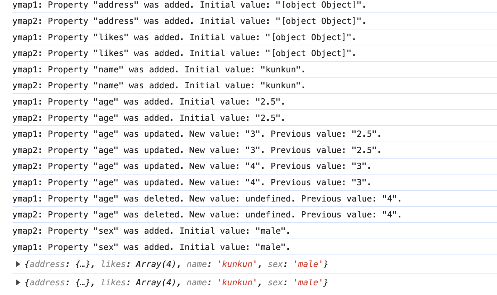

也可以通过交换完整文档结构来同步两个客户端

```js
...
// 通过交换完整文档结构来同步两个客户端
const state1 = Y.encodeStateAsUpdate(ydoc1);
const state2 = Y.encodeStateAsUpdate(ydoc2);
Y.applyUpdate(ydoc1, state2);
Y.applyUpdate(ydoc2, state1);
console.log(ymap1.toJSON())
console.log(ymap2.toJSON())
```

这一套组合 API 看似和我们常用的 map、array 等相似，但它真正的强大之处在于 `Conflict-free`，在它的内部就已经包含了冲突解决的机制。对使用者来说，我们只是简单的使用 Shared Types 所提供的 API，协同编辑时所存在的状态冲突被 Yjs 自动解决了。

而在项目项目中使用 JavaScript/JSON 对象来表示应用的状态。现在只需增加一个简单的 Binding 层，将其转化为 Yjs 的 Shared Types，类似于 Quill 的 y-quill，应用就能够自然地获得多人编辑的能力。

通过以上的内容，我们可以不需要 y-quill，自己实现 Quill 的协作编辑：

1. 创建 ydoc、ytext、quill 实例
2. 监听 Quill 的`text-change` 事件，拿到 Delta 数据`delta.ops`
3. 在 `transact` 事物中，使用 `ytext.applyDelta` 将 Delta 数据应用于 ytext 实例
4. 通过 `observe` 监听变化，此处需要过滤当前事务
5. 使用 `updateContents` 更新 Quill 数据

完整代码如下：

```js
// 模拟编辑器绑定
quill.on('text-change', (delta, content, source) => {
  // 过滤非用户输入的事件
  if (source === 'api') return
  ydoc.transact(() => ytext.applyDelta(delta.ops))
})
ytext.observe((event, origin) => {
  // 本地的变化不会引起quill更新
  if (origin.local) return
  quill.updateContents(event.delta)
})
```

同样也能达到 Quill 的协同编辑效果。

### Providers

#### Connection Providers

通过上一节，我们已经将普通的 JSON 数据转换成了 Shared Types 的 yMap，使它有了自动解决冲突的能力，并且在本地已模拟了不同客户端的数据同步，而为了能够在不同的网络之间同步共享数据，就需要通过网络通信来完成。

CRDT 本身和网络方案是解耦的，我们可以选择任意的通信方案，只要能保证更新数据成功的同步到远端即可。

Yjs 自身提供了 [Connection Provider](https://docs.yjs.dev/ecosystem/connection-provider) 来实现副本间的通信，如：y-websocket、y-webrtc、y-dat 等。

websocket 和 webrtc 大家应该都有所了解，[Dat](https://docs.dat.foundation/docs/intro) 是一个 P2P 协议，是一个去中心化、安全、快速的文件传输协议，适用于各种需要传输文件的情况。

这里我们使用 y-websocket 来实现服务端与各个客户端之间的文档同步。

y-websocket 支持 `cross-tab communication`：即当在同一浏览器的不同页签打开同一文档时，文档上的更改将通过跨选项卡通信进行交换（[Broadcast Channel](https://developer.mozilla.org/en-US/docs/Web/API/Broadcast_Channel_API)和 localStorage）。

我们以 ytext 为例来看下：

```js
const ydoc = new Y.Doc()

const wsProvider = new WebsocketProvider(
  'ws://localhost:1234',
  'my-room-name',
  ydoc
)

wsProvider.on('status', (event) => {
  console.log(event.status) // logs "connected" or "disconnected"
})
const yText = ydoc.getText()

// 在某份 YDoc 更新时，应用二进制的 update 数据到另一份 YDoc 上
ydoc.on('update', (update, origin) => {
  Y.applyUpdate(ydoc, update)
  console.log(yText.toJSON())
  div.innerText = yText.toJSON()
})

const button = document.createElement('button')
const div = document.createElement('div')
button.innerText = 'click'
document.querySelector('#app')?.appendChild(button)
document.querySelector('#app')?.appendChild(div)

button.onclick = () => yText.insert(0, Math.floor(Math.random() * 10) + '')
```

首先按照我们之前说的 `PORT=1234 npx y-websocket` 启动 websocket 服务

当点击 click 时，在最前面插入一个数字，效果如下：

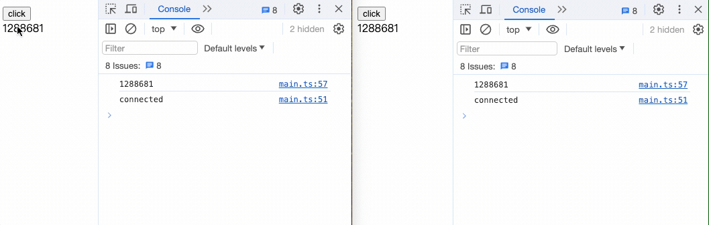

其实可以看下[y-websocket](https://github1s.com/yjs/y-websocket/blob/HEAD/bin/server.js)的源码，主要有以下几个过程：

1. 创建 Websocket 连接

   在 `/bin/server.js` 中，通过 `ws` 启动一个 socket 服务，服务端只需要提供基础的消息转发能力即可

2. 初始化 Yjs 实例

   在 `/bin/utils.js` 中，通过 `WSSharedDoc` 创建一个 Yjs 实例

   ```js

    class WSSharedDoc extends Y.Doc {
      ...
      this.conns = new Map()
      ...
      this.awareness.on('update', awarenessChangeHandler)
      this.on('update', updateHandler)
      ...
    }
   ```

   `this.conns` 缓存所有的连接客户端
   `this.on('update', updateHandler)` 用来监听 ydoc 文档的更新

   ```js
   const updateHandler = (update, origin, doc) => {
   ...
   doc.conns.forEach((_, conn) => send(doc, conn, message))
   }
   ```

   在 `updateHandler` 中将文档的更新发送到每一个客户端。

3. 客户端使用 `WebsocketProvider` 连接服务端

   首先需要了解下 [自定义 Provider](https://docs.yjs.dev/api/document-updates#example-building-a-custom-provider)

   在 `/src/y-websocket.js` 中，`WebsocketProvider` 继承 `lib0/observable` 的 `Observable`来自定义 Provider，与服务端建立连接

4. 处理文档更新

   一旦建立了 WebSocket 连接，Y-Websocket 开始同步文档状态。这涉及将客户端的本地文档状态发送到服务器，然后服务器再将其他客户端的编辑操作传递给当前客户端。

   ```js
   this._updateHandler = (update, origin) => {
     if (origin !== this) {
       const encoder = encoding.createEncoder()
       encoding.writeVarUint(encoder, messageSync)
       syncProtocol.writeUpdate(encoder, update)
       broadcastMessage(this, encoding.toUint8Array(encoder))
     }
   }
   this.doc.on('update', this._updateHandler)
   ```

   在 `WebsocketProvider` 的构造函数中使用`this.doc.on('update')`监听 ydoc 文档的更新，然后通过 `broadcastMessage` 广播事件，这里判断 `origin !== this` 意思只有其他客户端的更新才会触发 `syncProtocol.writeUpdate` 方法（避免无限循环更新）。

   这个方法来自于 [y-protocols](https://github1s.com/yjs/y-protocols/blob/HEAD/sync.js#L114)，最终会调用 `readSyncStep2` 通过 `applyUpdate` 来更新文档。

   ```js
   export const readSyncStep2 = (decoder, doc, transactionOrigin) => {
     try {
       Y.applyUpdate(
         doc,
         decoding.readVarUint8Array(decoder),
         transactionOrigin
       )
     } catch (error) {
       // This catches errors that are thrown by event handlers
       console.error('Caught error while handling a Yjs update', error)
     }
   }
   ```

   `broadcastMessage` 也很有特点，当 websocket 连接失败时，会通过 `broadcastchannel` 来实现同一浏览器不同页签之间的协同。

   ```js
   const broadcastMessage = (provider, buf) => {
     const ws = provider.ws
     if (provider.wsconnected && ws && ws.readyState === ws.OPEN) {
       ws.send(buf)
     }
     if (provider.bcconnected) {
       bc.publish(provider.bcChannel, buf, provider)
     }
   }
   ```

以上就是 y-websocket 的大致流程，其实也不是很复杂，我们可以修改它来做一些定制化的开发，要想更加详细的了解 Yjs 的同步过程，可以查看[Yjs Fundamentals — Part 2: Sync & Awareness](https://medium.com/dovetail-engineering/yjs-fundamentals-part-2-sync-awareness-73b8fabc2233)这篇文章。

#### Database Provider

YJs 不仅提供了 Connection Provider 来实现客户端的协作，并且提供了 Database Provider 将文档数据同步到数据库或离线存储：如 y-indexeddb、y-redis 等。

```bash
yarn add y-redis
```

```js
const { RedisPersistence } = require('y-redis')
const redisConfig = {
  host: process.env.REDIS_HOST,
  port: process.env.REDIS_PORT,
  password: process.env.REDIS_PASSWORD,
  db: process.env.REDIS_DB,
  keyPrefix: process.env.REDIS_KEY_PREFIIX,
}

const rp = new RedisPersistence({ redisOpts: redisConfig })
const persistence = {
  provider: rp,
  bindState: async (docName, ydoc) => {
    rp.closeDoc(docName)
    return rp.bindState(docName, ydoc)
  },
  writeState: async (docName, ydoc) => {},
}
```

### Awareness & Presence

上一节我们通过 Connect Provider 实现了不同副本之间的协作，但协同编辑不仅仅是数据的同步，还需要一些交互上的优化，诸如：当前在线用户列表、用户编辑位置以及光标位置，这些信息被称为 `Awareness`。

通常这些信息数据量较少，因此 Yjs 内部采用了 `state-based Awareness CRDT` 将信息转为 JSON 对象传播给所有用户。但它并不是 Yjs 模块，它是在 [y-protocols](https://github.com/yjs/y-protocols) 内部定义的，所有的 Providers 都默认实现了，并且提供了[Awareness CRDT API](https://docs.yjs.dev/api/about-awareness#awareness-crdt) 帮助我们获取 Awareness 的变化和更新等状态。

#### awareness = new awarenessProtocol.Awareness(ydoc: Y.Doc)

创建 awareness 实例，在 Provider 中我们可以通过以下代码获取到 awareness

```js
awareness = provider.awareness
```

它是在 Provider 内部创建和维护

#### awareness.setLocalStateField(string, any)

为本地 awareness 设置或更新键值对。

#### awareness.getStates(): Map<string, Object<string, any>>

获取所有 awareness（远程和本地）

#### awareness.on('update', ({ added: Array, updated: Array, removed: Array }, [transactionOrigin:any]) => ..)

监听远程和本地意识变化。即使感知状态未更改，但仅更新以通知其他用户该客户端仍处于在线状态，也会调用此事件。如果您想要将感知状态传播给其他用户，请使用此事件。

#### awareness.on('change', ({ added: Array, updated: Array, removed: Array }, [transactionOrigin:any]) => ..)

监听远程和本地状态变化 ​​。当添加、更新或删除状态时收到通知。

我们来看一个简单的例子，在之前的 Quill 协同编辑文档中展示当前编辑的人名：

```js
// 从wsProvider获取awareness
const awareness = wsProvider.awareness

// 监听awareness变化
awareness.on('change', (changes: Y.Transaction) => {
  // 获取所有协同信息 显示光标位置和用户列表
  console.log(Array.from(awareness.getStates().values()))
})

// 设置user字段传递用户信息 { name: '', color: '' }
// 如果未指定user字段，Provider会使用随机用户名以默认颜色呈现光标。
awareness.setLocalStateField('user', {
  name: 'Emmanuelle Charpentier',
  color: '#ffb61e',
})
```

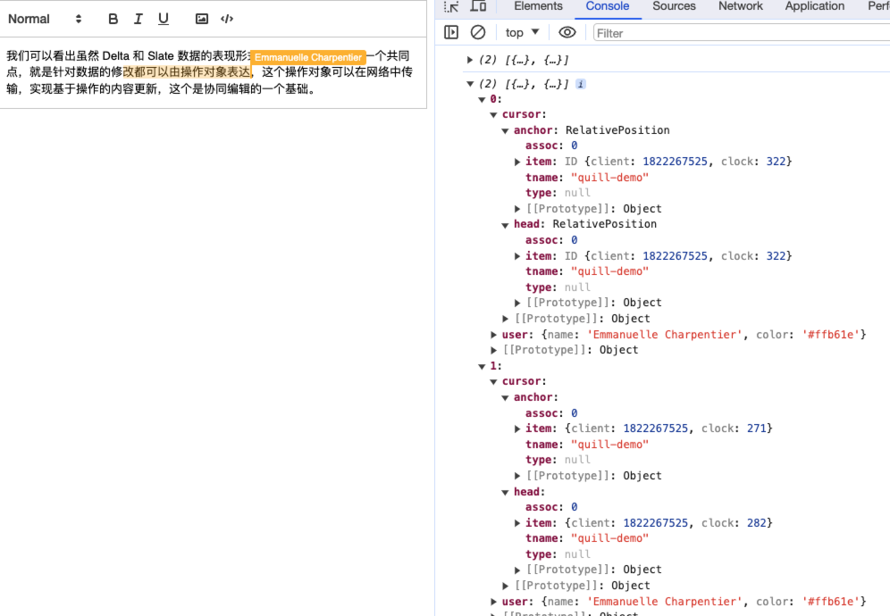

#### Awareness Protocol

如果自定义 Provider 时，则需要了解 [Awareness Protocol API](https://docs.yjs.dev/api/about-awareness#awareness-protocol-api) 为 Provider 添加 Awareness。

##### awarenessProtocol.encodeAwarenessUpdate(awareness: Awareness, clients: Array<number>): Uint8Array

将指定客户端的感知状态编码为 Uint8Array 编码的更新。

##### awarenessProtocol.applyAwarenessUpdate(awareness: Awareness, update: Uint8array, origin: any)

将使用 encodeAwarenessUpdate 创建的感知更新应用到感知 CRDT 的实例。

##### awarenessProtocol.removeAwarenessStates(awareness: Awareness, clients: Array<number>, origin: any)

删除指定客户端的感知状态。这将调用 Awareness CRDT 的更新和更改事件处理程序。

Awareness CRDT 更新的工作方式与 Yjs 更新类似，之前我们再讲 y-websocket 的流程时漏掉了 Awareness，现在我们可以再过一遍 y-websocket 源码：

1. 创建 Websocket 连接
2. 初始化 Yjs 实例

   这一步同时创建 `awareness` 实例

   ```js
   this.awareness = new awarenessProtocol.Awareness(this)
   this.awareness.setLocalState(null)
   ```

   通过 `awareness.on('update'` 监听本地状态变化，通过 `awarenessProtocol.encodeAwarenessUpdate` 编码为 Uint8Array 数据包，发送到每一个客户端

   ```js
   const awarenessChangeHandler = ({ added, updated, removed }, conn) => {
    ...
    encoding.writeVarUint8Array(encoder, awarenessProtocol.encodeAwarenessUpdate(this.awareness, changedClients))
    const buff = encoding.toUint8Array(encoder)
     this.conns.forEach((_, c) => {
       send(this, c, buff)
     })
   }
   this.awareness.on('update', awarenessChangeHandler)
   ```

3. 客户端使用 `WebsocketProvider` 连接服务端
4. 处理文档更新

   在处理文档更新的同时，处理感知数据的更新，发送消息方式与文档更新的一致，这里不再赘述

   ```js
   this._awarenessUpdateHandler = ({ added, updated, removed }, _origin) => {
    ...
    broadcastMessage(this, encoding.toUint8Array(encoder))
   }
   awareness.on('update', this._awarenessUpdateHandler)
   ```

5. 断开连接

   当某个客户端断开连接时，通过 `awarenessProtocol.removeAwarenessStates` 删除它的感知状态，

   ```js
   const closeConn = (doc, conn) => {
    ...
    awarenessProtocol.removeAwarenessStates(doc.awareness, Array.from(controlledIds), null)
    ...
   }
   ```

   在 y-websocket，每个客户端每 30 秒向服务器发送一次心跳，如果在过去 30 秒内未从客户端收到消息，其他客户端会将其标记为离线。

   ```js
   const pingTimeout = 30000
   const pingInterval = setInterval(() => {
     if (!pongReceived) {
       if (doc.conns.has(conn)) {
         closeConn(doc, conn)
       }
       clearInterval(pingInterval)
     } else if (doc.conns.has(conn)) {
       pongReceived = false
       try {
         conn.ping()
       } catch (e) {
         closeConn(doc, conn)
         clearInterval(pingInterval)
       }
     }
   }, pingTimeout)
   ```

### UndoManager

Yjs 提供了 UndoManager，用来追踪本地更改，自然提更了 uodo/redo 功能。

```js
import * as Y from 'yjs'

const ytext = doc.getText('text')
const undoManager = new Y.UndoManager(ytext)

ytext.insert(0, 'abc')
undoManager.stopCapturing()
undoManager.undo()
ytext.toString() // => ''
undoManager.redo()
ytext.toString() // => 'abc'
```

结合以上代码，我们来看下它的 API

#### const undoManager = new Y.UndoManager(scope: Y.AbstractType | Array<Y.AbstractType> [, {captureTimeout: number, trackedOrigins: Set<any>, deleteFilter: function(item):boolean}])

在 Shared Types 上创建 Y.UndoManager，如果任何指定类型或其任何子类型被修改，UndoManager 将在其堆栈上添加反向操作。

默认情况下追踪所有本地更改，Shared Types 每次更改都会有来源，所以可以通过指定 `trackedOrigins` 来过滤特定来源的更改，默认为 null，即不过滤。

```js
const undoManager = new Y.UndoManager(ytext, {
  trackedOrigins: new Set([42, CustomBinding]),
})
```

UndoManager 合并在特定 `captureTimeout`（默认为 500ms）内创建的编辑，将其设置为 0 以单独捕获每个更改。

```js
const undoManager = new Y.UndoManager(ytext, {
  captureTimeout: 0,
})
```

#### undoManager.undo()/undoManager.redo()/undoManager.clear()

在 undoManager 实例上有两个堆栈 undoStack 和 redoStack 用于记录 undo/redo 操作：

undo 方法会撤消 undoStack 堆栈上的最后一个操作，将栈顶添加到 redoStack 上。

redo 方法重做 redoStack 堆栈上的最后一个操作，将栈顶添加到 undoStack 上。

clear 方法会清空这两个堆栈。

#### undoManager.stopCapturing()

前面提到 UndoManager 会默认合并 `captureTimeout` 设置的时间间隔内的操作，如果每步都想单独成为历史记录的话，可以设置 `captureTimeout` 为 0 即可；

而如果只是想设置单步的记录时，可以通过调用 stopCapturing() 方法确保 UndoManager 的下一个操作不会与上一个操作合并。

```js
const undoManager = new Y.UndoManager(yText)

yText.insert(0, 'abc')
undoManager.stopCapturing()
yText.insert(3, 'def')
console.log(undoManager)
```

未调用 stopCapturing 方法：
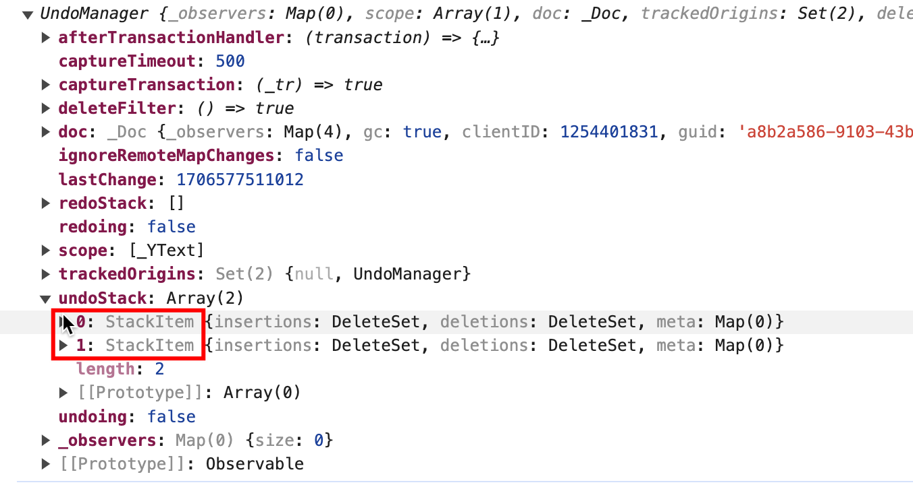

调用 stopCapturing 方法：
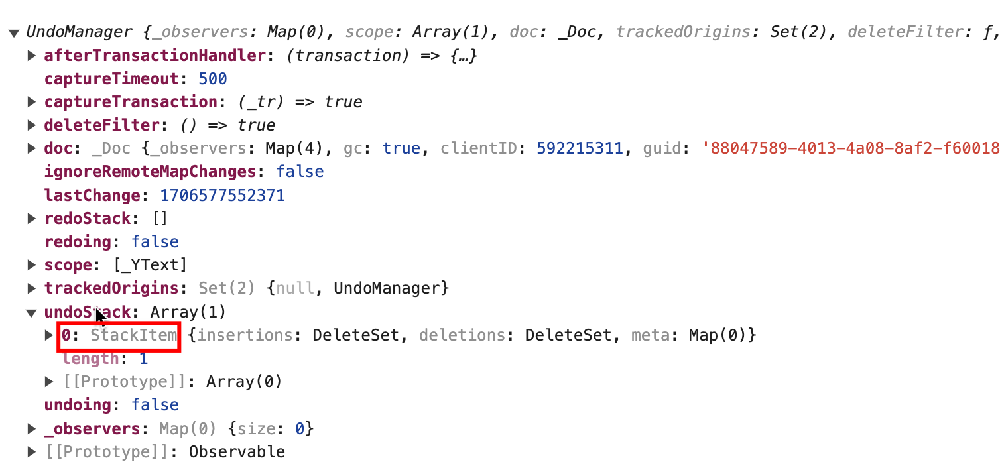

可以看到未调用 stopCapturing 方法后，在`undoStack` 堆栈只会形成一条数据，而调用之后，会生成两条堆栈信息。

#### on('stack-item-added',...) / on('stack-item-popped', ...)

监听 undo/redo 事件，如可在事件发生时向 StackItems 添加附加信息，用来恢复光标位置或文档视图等

```js
undoManager.on('stack-item-added', (event) => {
  // 将当前光标位置保存在堆栈项上
  // getRelativeCursorLocation()
  event.stackItem.meta.set('cursor-location', 12)
})

undoManager.on('stack-item-popped', (event) => {
  // 恢复堆栈项上的当前光标位置
  const cursorLocation = event.stackItem.meta.get('cursor-location')
  console.log(cursorLocation)
  // restoreCursorLocation()
})
```

### Offline Support

我们前面介绍了 Yjs 通过 Network Provider 可以在不同网络间传输，DataBase Provider 可以将文档更新同步到数据库。

y-indexeddb 是 DataBase Provider 的其中一种 ，可以将文档更新同步到 [IndexDB](https://developer.mozilla.org/zh-CN/docs/Web/API/IndexedDB_API) 数据库，实现离线编辑功能。

每个 Provider 都可以与其他 Provider 进行合作，比如我们可以通过 y-websocket 进行网络之间的同步，也可以通过 y-redis、y-indexeddb 等将文档持久化到 redis 或 IndexedDB 中。

这样在弱网或无网络状态时文档的修改也会记录在 indexedDB 中，网络正常后再同步到服务端，不会造成文档内容的丢失；
同时使用 y-indexeddb 和 y-websocket 会将会在每个副本的 IndexedDB 数据库中存储下来，如果某个副本或者服务器丢失一些数据时，其他副本也会将最新的文档同步回服务器。

```bash
yarn add y-indexeddb
```

```js
import { IndexeddbPersistence } from 'y-indexeddb'

const ydoc = new Y.Doc()
const roomName = 'quill-room-name'

const indexDBProvider = new IndexeddbPersistence(roomName, ydoc)
indexDBProvider.set('version', '1')
indexDBProvider.on('synced', () => {
  console.log('从IndexDB加载文档')
})
```

y-indexeddb 与之前 y-websocket 的工作方式类似，也是传入房间名称和 Yjs 文档，通过房间名称来连接 Yjs 文档，所有相同房间名称的文档都将同步。

此时，文档的更改都会保存到 IndexedDB 数据库中，重新访问站点时，将首先从 IndexedDB 数据库加载文档。

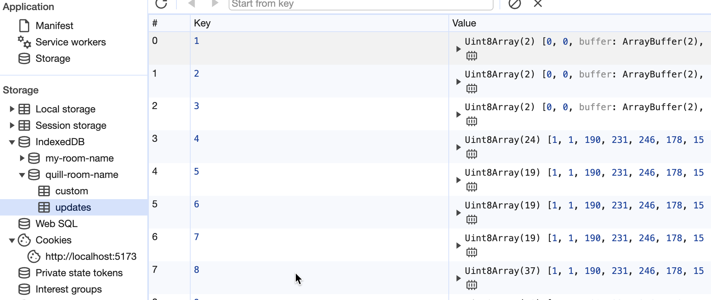

可以看到 `quill-room-name` 命名的 IndexedDB 中包含 `custom` 和 `updates` 两个对象存储区， `custom`主要用来存储自定义属性，`updates` 主要是记录文档的更新信息。

#### provider = new IndexeddbPersistence(docName: string, ydoc: Y.Doc)

创建 indexedDB 的 provider

#### provider.on('synced', function(idbPersistence: IndexeddbPersistence))

当与 IndexedDB 数据库的连接建立并且所有可用内容都已加载时，将触发 `synced` 事件。**当尚无内容可用时，也会触发该事件**。

#### provider.set(key: any, value: any)/get/del

通过 provider.set 可以在 provider 实例上设置自定义属性，存储文档的相关元信息，通过 get/del 获取或删除单个属性。

#### provider.destroy(): Promise

关闭与 IndexedDB 数据库的连接并停止同步文档。当 Yjs 文档被销毁时，会自动调用此方法。

#### provider.clearData(): Promise

销毁 IndexedDB 数据库并删除存储的文档和所有相关元信息。

### Yjs 与不同编辑器的绑定

在文章前面我们介绍 Quill 的协同编辑时，使用 `y-quill` 将 Yjs 与 Quill 进行绑定，实现了 Quill 的协同编辑。同时也在不使用 `y-quill` 的情况下，使用 Yjs 自带的 API 实现了 Quill 的协同编辑。

回忆下整个过程：

1. 首先监听 Quill 文本的变化；
2. 接着将 Quill 的 Delta 数据结构转换为 yText 结构；
3. yText 改变时通过 y-websocket 发送到其他副本；
4. 其他副本监听 yText 的变化，解析出 Quill 的 Delta 数据，回填到编辑器中。

Yjs 已经提供了常用的编辑器的数据绑定，像[Prosemirror](https://docs.yjs.dev/ecosystem/editor-bindings/prosemirror)、[Tiptap](https://docs.yjs.dev/ecosystem/editor-bindings/tiptap2)、[Monaco](https://docs.yjs.dev/ecosystem/editor-bindings/monaco)、[Quill](https://docs.yjs.dev/ecosystem/editor-bindings/quill) 等等，我们可以看下[y-quill](https://github.com/yjs/y-quill/blob/master/src/y-quill.js)和[y-monaco](https://github.com/yjs/y-monaco/blob/HEAD/src/y-monaco.js)的源码，Yjs 应用到不同的编辑器，基本都是这一套逻辑：

首先监听编辑器的数据变化，当发生变化时，将编辑器数据转为 Yjs 的 Shared Types 数据结构，当本地 Yjs 数据发生变化时会通过 Network Provider 将数据结构同步给所有协同者，其他协同者再通过监听 Yjs 数据的变动，将 Yjs 数据转为编辑器数据，利用自身的 API 将变化填充到编辑器中，从而实现协同编辑。

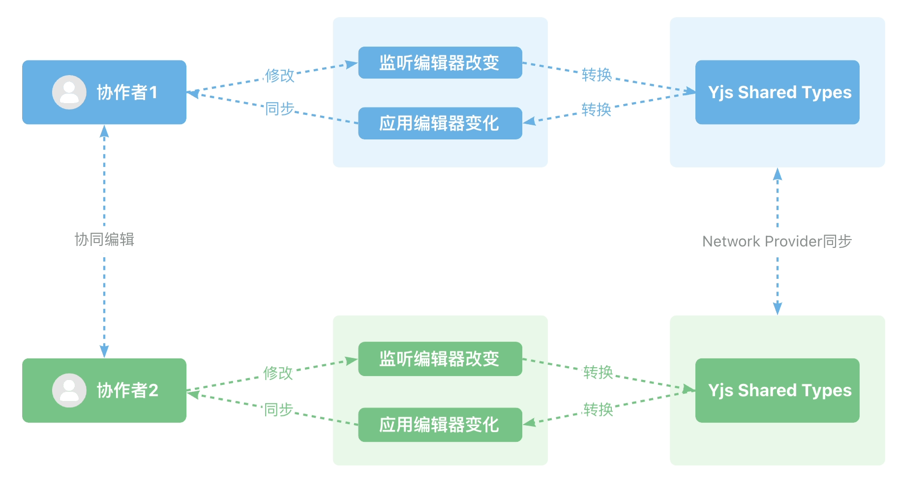

从流程图可以看出每一个客户端都维护了一个 Yjs 数据结构的副本，这个数据结构副本所表达的内容与 Slate 编辑器数据所表达的内容完全一样，只是它们承担职责不同，Slate 数据供编辑器及其插件渲染使用，然后 Yjs 数据结构用于处理冲突、保证数据一致性，数据的修改最终是通过 Yjs 的数据结构来进行同步的。

## 总结

本文通过实现 Quill 的协同编辑，我们学到了 短发 dafd 大方
