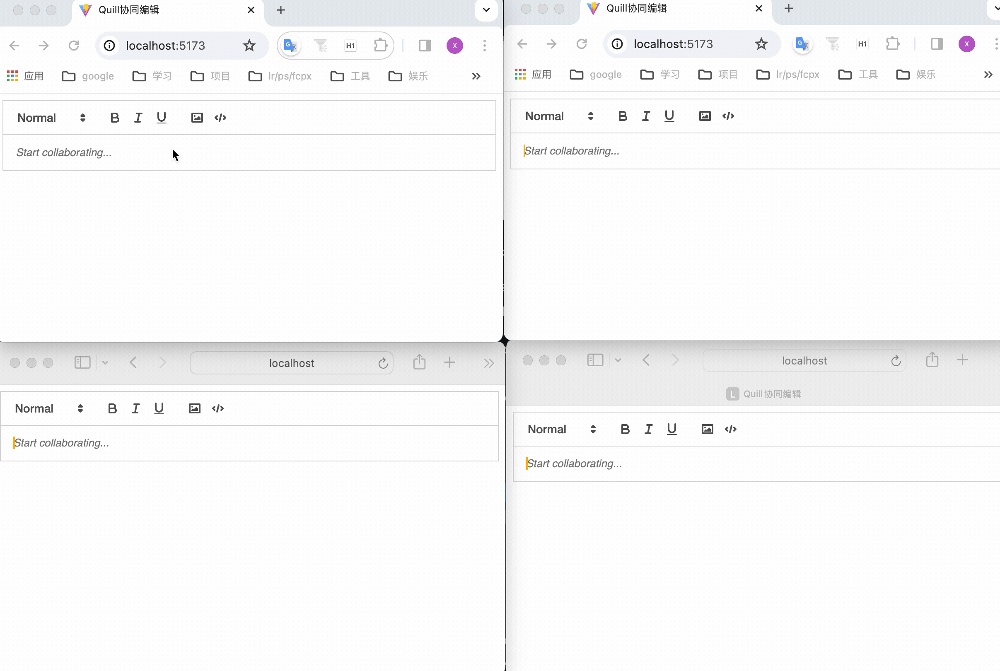
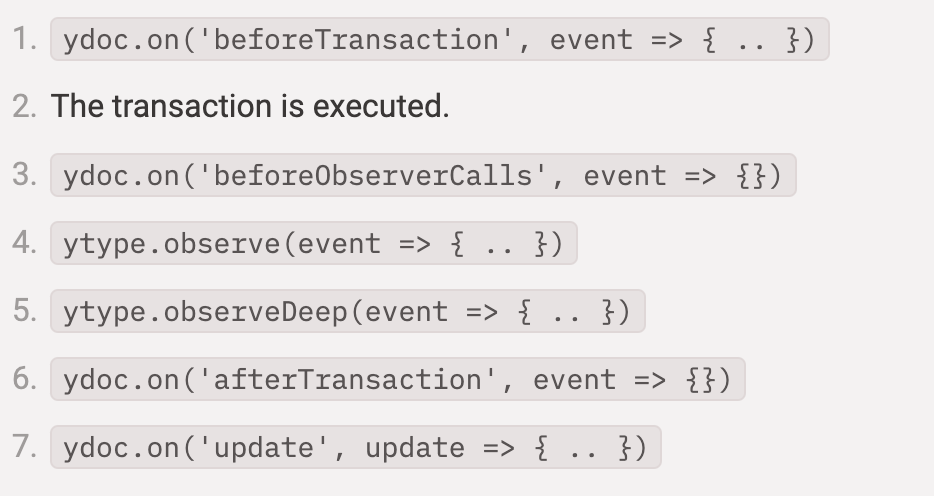
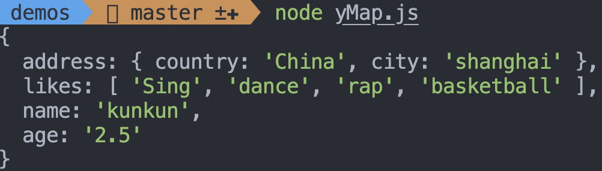
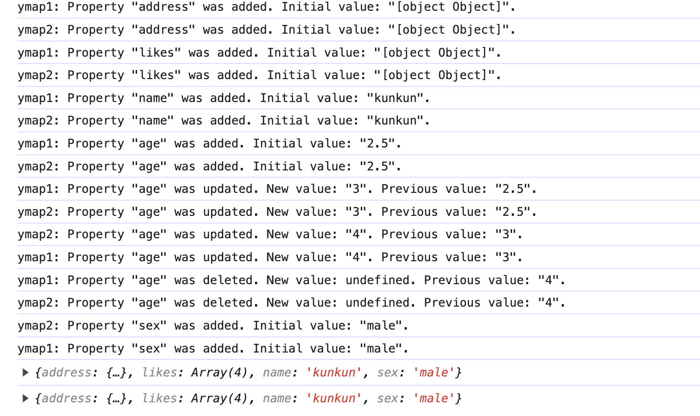

最近使用 yjs 给我们的思维导图加上了协同编辑的功能，效果如下面动图所示。是不是挺有意思的，其实实现起来很简单，yjs 已经帮我们做了很多事情，我们只需要简单的引用即可。


那么接下来同我一起揭秘 yjs 的奥秘吧！

## yjs 介绍

官方介绍：**用于构建 Google Docs 和 Figma 等协作应用程序的模块化构建块**。

通过上文想必大家已经对 OT 和 CRDT 这两种协同编辑算法有所了解。[yjs](https://docs.yjs.dev/) 是基于 CRDT ，帮助实现高性能的协作应用程序。

只要我们将自己的数据转换为 Y.js 提供的 Y.Array、Y.Map 类型，Y.js 就会自动帮我们做数据的一致性处理和同步。

### 支持多种富文本编辑器

Yjs 支持多种流行的文本和富文本编辑器，如

- ProseMirror：[https://docs.yjs.dev/ecosystem/editor-bindings/prosemirror](https://docs.yjs.dev/ecosystem/editor-bindings/prosemirror)
- Tiptap：[https://tiptap.dev/docs/editor/guide/collaborative-editing](https://tiptap.dev/docs/editor/guide/collaborative-editing)
- Remirror：[https://docs.yjs.dev/ecosystem/editor-bindings/remirror](https://docs.yjs.dev/ecosystem/editor-bindings/remirror)
- milkdown：[https://milkdown.dev/docs/guide/collaborative-editing](https://milkdown.dev/docs/guide/collaborative-editing)
- Quill：[https://docs.yjs.dev/ecosystem/editor-bindings/quill](https://docs.yjs.dev/ecosystem/editor-bindings/quill)
- Slate：[https://github.com/BitPhinix/slate-yjs/](https://github.com/BitPhinix/slate-yjs/)
- Monaco：[https://docs.yjs.dev/ecosystem/editor-bindings/monaco](https://docs.yjs.dev/ecosystem/editor-bindings/monaco)
- CodeMirror：[https://docs.yjs.dev/ecosystem/editor-bindings/codemirror](https://docs.yjs.dev/ecosystem/editor-bindings/codemirror)

如果目前使用的编辑器是上述其中之一时，根据上述 demo 便可以很简单的完成协同编辑。当我们学习完成后，就可以用它来实现各种想要的协同编辑操作。

### 在线 demo

[demos](https://demos.yjs.dev/)

### 对比

[automerge](https://automerge.org/)：一个用于构建协作应用程序的数据结构库

通过[对比](https://github.com/dmonad/crdt-benchmarks?tab=readme-ov-file#results)得到 yjs 是迄今为止最快的 CRDT 实现。

## yjs 核心

## 使用 yjs 实现

这是基础的 yjs 代码，现在看不懂没关系，通过我们的学习，后面再回来看，就看得懂了。

```js
import * as Y from 'yjs'

// Yjs documents are collections of
// shared objects that sync automatically.
const ydoc = new Y.Doc()
// Define a shared Y.Map instance
const ymap = ydoc.getMap()
ymap.set('keyA', 'valueA')

// Create another Yjs document (simulating a remote user)
// and create some conflicting changes
const ydocRemote = new Y.Doc()
const ymapRemote = ydocRemote.getMap()
ymapRemote.set('keyB', 'valueB')

// Merge changes from remote
const update = Y.encodeStateAsUpdate(ydocRemote)
Y.applyUpdate(ydoc, update)

// Observe that the changes have merged
console.log(ymap.toJSON()) // => { keyA: 'valueA', keyB: 'valueB' }
```

## 5 分钟打造基于 Quill 的协同编辑器

本节主要是让我们更好的了解 yjs 的基本概念。

1. 通过`npx create-vite quill-collab`创建一个 vue 项目
2. 安装 quill 即插件 quill-cursor

   ```bash
   yarn add quill quill-cursors
   ```

   覆盖 main.ts 代码

   使用以下代码覆盖 main.ts

   ```js
   import Quill from 'quill'
   import QuillCursors from 'quill-cursors'
   import 'quill/dist/quill.snow.css'

   Quill.register('modules/cursors', QuillCursors)

   const quill = new Quill(document.querySelector('#app'), {
     modules: {
       cursors: true,
       toolbar: [
         // adding some basic Quill content features
         [{ header: [1, 2, false] }],
         ['bold', 'italic', 'underline'],
         ['image', 'code-block'],
       ],
       history: {
         // Local undo shouldn't undo changes
         // from remote users
         userOnly: true,
       },
     },
     placeholder: 'Start collaborating...',
     theme: 'snow',
   })
   ```

   启动服务

3. 引入 yjs 绑定 quill 编辑器

   ```bash
   yarn add yjs y-quill
   ```

   y-quill 是 Yjs 官方提供的，通过它可以将 quill 数据模型和 Yjs 数据模型进行绑定。

   main.ts 添加如下代码

   ```js
   import * as Y from 'yjs'
   import { QuillBinding } from 'y-quill'
   // Yjs文档，保存共享数据shared data
   const ydoc = new Y.Doc()
   // 在文档上定义共享文本类型
   const ytext = ydoc.getText('quill')

   // 创建一个编辑器绑定 将quill编辑器“绑定”到 Y.Text 类型。
   const binding = new QuillBinding(ytext, quill)
   ```

   首先通过`new Y.Doc()`创建 yjs 文档，用于保存共享数据；
   接着创建名为 quill 的 ytext 对象，用于表示文本的共享数据结构；
   最后通过 `QuillBinding` 将 ytext 与 Quill 编辑器保持同步。
   几乎所有编辑器与 yjs 进行绑定时都是以上三步。

   Yjs 自动解决共享数据的并发更改，因此我们不必再担心冲突解决。

4. 使用 y-websocket 进行数据传输

   前三步客户端的操作已经完成，接下来就是要接上服务端，实现数据传输了。

   yjs 提供了多种类型的[Provider](https://docs.yjs.dev/ecosystem/connection-provider)用于数据传输，如：WebSocket、WebRTC、Dat。

   ```bash
   yarn add y-websocket
   ```

   修改代码：

   ```js
   import { WebsocketProvider } from 'y-websocket'
   // 连接到 websocket 服务端 yjs提供的体验服务器
   const provider = new WebsocketProvider(
     'wss://demos.yjs.dev',
     'quill-demo-room',
     ydoc
   )
   // 绑定
   const binding = new QuillBinding(ytext, quill, provider.awareness)
   ```

   大多数 Provider 的共同点是他们使用房间名称的概念来连接 Yjs 文档。在上面的示例中，所有指定“quill-demo-room”作为房间名称的文档都将同步。

5. 协同效果

   

   因为 websocket 服务连接失败，不同浏览器之间的协同是没有生效的。

   

   那为什么同一浏览器的两个 tab，没连上服务也能做协同编辑呢？

   这是因为 Yjs 会**优先通过浏览器的同 host 共享状态的方式进行通信**，然后才是网络通信。

6. 创建本地服务

   yjs 提供的体验服务器既然无法连接，那么我们可以自己本地通过 npx 启一个 y-websocket 服务：

   ```bash
   PORT=1234 npx y-websocket
   ```

   

   修改 ws 服务的地址

   ```js
   const provider = new WebsocketProvider(
     'ws://localhost:1234',
     'quill-demo-room',
     ydoc
   )
   ```

   此时效果就正常了
   

基于以上实现 quill 协同编辑的过程，我们来整理下 yjs 几个比较重要的概念。

y-websocket: Websocket Provider 实现了一个经典的 C/S 模型。客户端通过 Websocket 连接到单个端点。服务器在客户端之间分发 awareness 信息且进行文档更新。

Yjs: 包含最核心的数据结构及逻辑。如数据类型的定义，数据读写编码 encoding 模块，事件监听，状态管理 StructStore，Undo/Redo 管理器等。

接入层：各种第三方编辑器接入层。

### Documents

```js
import * as Y from 'yjs'

const doc = new Y.Doc()
```

通过 `new Y.Doc()` 会创建一个 Doc 实例（即一个 Yjs 文档），作用：

1. 承载共享数据 Shared Types 的容器
2. 网络传输 Provider 的载体，将 ydoc 传入 WebSocket 的 provider 后即可支持网络同步

```js
// 连接到 websocket
const provider = new WebsocketProvider(
  'ws://localhost:1234',
  'quill-demo-room',
  ydoc
)
```

Y.doc 上有很多有用的属性，如：

#### doc.clientID: number

**只读属性**，标识会话的客户端的唯一 ID, Yjs 旨在为每个会话创建一个新的 clientID，以避免同步冲突。同一用户打开多个 tab 页时 clientID 也是唯一的，不允许跨会话重复使用，可见[FAQ](https://docs.yjs.dev/api/faq#i-get-a-new-clientid-for-every-session-is-there-a-way-to-make-it-static-for-a-peer-accessing-the-doc)。

#### doc.gc: boolean

是否在此文档实例上启用垃圾回收，默认为`true`。更多可通过[Internals](https://docs.yjs.dev/api/internals)了解 Yjs 的内部工作原理。

#### doc.transact(function(Transaction): void [, origin:any])

Yjs 中 Documents/Shared Types 的所有更改都发生在事务中，每次事务后都会触发 `observer` 调用和 `update` 事件，触发监听和更新操作。

#### doc.get(string, Y.[TypeClass]): [Type]

获取共享类型的顶级实例


#### doc.getText/getArray/getMap

用于定义 Shared Types 类型

#### doc.on/once/off

事件监听

#### doc.on('beforeTransaction', function(tr: Transaction, doc: Y.Doc))

事件处理程序在每次事务之前都会被调用

#### doc.on('beforeObserverCalls', function(tr: Transaction, doc: Y.Doc))

事件处理程序在调用共享类型的观察程序之前立即调用

#### doc.on('afterTransaction', function(tr: Transaction, doc: Y.Doc))

事件处理程序在每次事务之后立即调用

#### doc.on('update', function(update: Uint8Array, origin: any, doc: Y.Doc, tr: Transaction))

监听 Shared Types 上的最新消息，所有更新消息都传播给所有用户，每个人最终都会统一相同的状态。

前面说了“Yjs 中 Documents/Shared Types 的所有更改都发生在事务中”，当发生变更时，事件按以下顺序调用：



可修改代码测试

```js
const ydoc = new Y.Doc()
ydoc.on('beforeTransaction', () => console.log('beforeTransaction'))
ydoc.on('beforeObserverCalls', () => {console.log('beforeObserverCalls'))
ydoc.on('afterTransaction', () => console.log('afterTransaction'))
ydoc.on('update', (update) => console.log('update'))

// 创建一个顶层名为 kun 的 YMap
const ymap = ydoc.getMap('kun')
ymap.observe(() => console.log('observe'))
ymap.observeDeep(() => console.log('observeDeep'))
```

测试结果如下：


完整属性可见[这里](https://docs.yjs.dev/api/y.doc)

### Shared Types

**the most unique feature of Yjs yet: Shared Types.**

Shared Types 是 Yjs 的核心内容，用于表示可协同编辑的数据结构。通过它可以实现任何应用的协作，比如：文档、表格、绘图等等。

Yjs 提供了多种类型的 Shared Types：包括常见的数据结构 [Y.Map](https://docs.yjs.dev/api/shared-types/y.map)、[Y.Array](https://docs.yjs.dev/api/shared-types/y.array)、[Y.Text](https://docs.yjs.dev/api/shared-types/y.text)，使用起来就和 js 的 map、array 对象基本是一样的，具体使用哪种需要根据实际的数据结构来决定。比如上一节中将 Y.Text 通过 `y-quill` “绑定”到 Quill 的编辑器实例以自动同步编辑器内容。

想要实现协同编辑的，我们就需要构造好一个 Shared Types，监听它的变化，将变化通知其他端即可。看下在 yjs 中是怎么实现的？

#### 构造 Shared Types

比如我们有如下数据

```js
{
  name: 'kunkun',
  age: '2.5',
  address: {
    country: 'China',
    city: 'shanghai'
  },
  likes: ['Sing', 'dance', 'rap', 'basketball']
}
```

尝试将它转为 Y.Map 格式如下：

```js
import * as Y from 'yjs'

const ydoc = new Y.Doc()

// 创建一个顶层名为 kun 的 YMap
const ymap = ydoc.getMap('kun')

// 构造嵌套的 ymap
const ymapAddress = new Y.Map()
ymapAddress.set('country', 'China')
ymapAddress.set('city', 'shanghai')
ymap.set('address', ymapAddress)

// 构造嵌套的 yarray
const yarrayLikes = Y.Array.from(['Sing', 'dance', 'rap', 'basketball'])
// const yarrayLikes = new Y.Array()
// yarrayLikes.push(['Sing'])
// yarrayLikes.push(['dance'])
// yarrayLikes.push(['rap'])
// yarrayLikes.insert(3, ['basketball'])
ymap.set('likes', yarrayLikes)
ymap.set('name', 'kunkun')
ymap.set('age', '2.5')

console.log(ymap.toJSON())
```



上面的 API 可参考[yMap](https://docs.yjs.dev/api/shared-types/y.map)

#### 监听变化

yMap 已经构造完成，对于它的变化如何监听呢？

yjs 通过 observe 和 observeDeep 来监听数据的变化，当数据变化时，会触发监听的回调函数，回调函数会通过更新事件 [YEvent](https://docs.yjs.dev/api/y.event) 传入当前的更新内容，从而执行相应的操作。。

- ymap.observe：注册一个 observe，当修改数据时会调用该方法
- ymap.unobserve：取消注册在 ymap.observe 中方法
- ymap.observeDeep
- ymap.unobserveDeep(function)

observeDeep 与 observe 的不同在于 observeDeep 是深度监听，类似于 watch 的`deep:true`。

修改代码如下：

```js
// 创建一个顶层名为 kun 的 YMap
const ymap = ydoc.getMap('kun')

// 监听变化
ymap.observe(event => {
  event.changes.keys.forEach((change, key) => {
    if (change.action === 'add') {
      console.log(`Property "${key}" was added. Initial value: "${ymap.get(key)}".`)
    } else if (change.action === 'update') {
      console.log(`Property "${key}" was updated. New value: "${ymap.get(key)}". Previous value: "${change.oldValue}".`)
    } else if (change.action === 'delete') {
      console.log(`Property "${key}" was deleted. New value: undefined. Previous value: "${change.oldValue}".`)
    }
  })
})
...
```


#### 更新同步

通过 observe 已经可以监听到 Shared Types 的变化，那么如何将变化应用到所有端呢？

首先，协作编辑时传输数据就很频繁，Yjs 为了减少每次传输数据的大小，对数据进行二进制编码（高度压缩）后，通过 [Update API](https://docs.yjs.dev/api/document-updates#update-api) 与其他文档进行同步，所有客户端收到所有文档更新后都会同步，主要使用下面两个 API：

- Y.applyUpdate：将当前更新应用到一个新副本
- Y.encodeStateAsUpdate：编码整个文档为单个更新消息

之前我们提到了发生变更时的事件执行顺序，Shared Types 变更时通过 `ydoc.on('update', )` 接收 `ytype.observe` 所发出的增量更新，将计算出的增量更新发送到所有连接的客户端。

我们可以创建 2 个 YDoc 实例来模拟 2 个客户端，验证一下：

```js
const ydoc1 = new Y.Doc()
const ydoc2 = new Y.Doc()

// 在其中一份 YDoc 更新时，通过applyUpdate将二进制数据应用到其他 YDoc 上
ydoc1.on('update', (update) => Y.applyUpdate(ydoc2, update))
ydoc2.on('update', (update) => Y.applyUpdate(ydoc1, update))

// 创建一个顶层名为 kun 的 YMap
const ymap1 = ydoc1.getMap('kun')
const ymap2 = ydoc2.getMap('kun')
// 监听变化
ymap1.observe((event) => {
  event.changes.keys.forEach((change, key) => {
    if (change.action === 'add') {
      console.log(
        `ymap1: Property "${key}" was added. Initial value: "${ymap1.get(
          key
        )}".`
      )
    } else if (change.action === 'update') {
      console.log(
        `ymap1: Property "${key}" was updated. New value: "${ymap1.get(
          key
        )}". Previous value: "${change.oldValue}".`
      )
    } else if (change.action === 'delete') {
      console.log(
        `ymap1: Property "${key}" was deleted. New value: undefined. Previous value: "${change.oldValue}".`
      )
    }
  })
})
ymap2.observe((event) => {
  event.changes.keys.forEach((change, key) => {
    if (change.action === 'add') {
      console.log(
        `ymap2: Property "${key}" was added. Initial value: "${ymap2.get(
          key
        )}".`
      )
    } else if (change.action === 'update') {
      console.log(
        `ymap2: Property "${key}" was updated. New value: "${ymap2.get(
          key
        )}". Previous value: "${change.oldValue}".`
      )
    } else if (change.action === 'delete') {
      console.log(
        `ymap2: Property "${key}" was deleted. New value: undefined. Previous value: "${change.oldValue}".`
      )
    }
  })
})

// 构造嵌套的 ymap
const ymapAddress = new Y.Map()
ymapAddress.set('country', 'China')
ymapAddress.set('city', 'shanghai')
ymap1.set('address', ymapAddress)

// 构造嵌套的 yarray
const yarrayLikes = Y.Array.from(['Sing', 'dance', 'rap', 'basketball'])

ymap1.set('likes', yarrayLikes)
ymap1.set('name', 'kunkun')
ymap1.set('age', '2.5')
ymap1.set('age', '3')
ymap2.set('age', '4')
ymap1.delete('age')
ymap2.set('sex', 'male')

console.log(ymap1.toJSON())
console.log(ymap2.toJSON())
```

输出结果如下所示：



也可以通过交换完整文档结构来同步两个客户端

```js
...
// 通过交换完整文档结构来同步两个客户端
const state1 = Y.encodeStateAsUpdate(ydoc1);
const state2 = Y.encodeStateAsUpdate(ydoc2);
Y.applyUpdate(ydoc1, state2);
Y.applyUpdate(ydoc2, state1);
console.log(ymap1.toJSON())
console.log(ymap2.toJSON())
```

这一套组合 API 看似和我们常用的 map、array 等相似，但它真正的强大之处在于 `Conflict-free`，在它的内部就已经包含了冲突解决的机制。对使用者来说，我们只是简单的使用 Shared Types 所提供的 API，协同编辑时所存在的状态冲突被 Yjs 自动解决了。

而在项目项目中使用 JavaScript/JSON 对象来表示应用的状态。现在只需增加一个简单的 Binding 层，将其转化为 Yjs 的 Shared Types，应用就能够自然地获得多人编辑的能力。

### Providers

#### Connection Providers

通过上一节，我们已经将简单的 JSON 数据转换为 Yjs 提供的 Shared Types，使它有了自动解决冲突的能力，并且在本地已实现了不同客户端的数据同步，此时就需要网络通信来达到多个副本之间的同步。

CRDT 本身和网络方案是解耦的，我们可以选择任意的通信方案，只要能保证更新数据成功的同步到远端即可。

Yjs 提供了 [Connection Provider](https://docs.yjs.dev/ecosystem/connection-provider) 来实现副本间的通信，如：y-websocket、y-webrtc、y-dat 等，websocket 和 webrtc 大家应该都有所了解，Dat 是一个 P2P 协议，是一个去中心化、安全、快速的文件传输协议，适用于各种需要传输文件的情况[dat](https://docs.dat.foundation/docs/intro)。

这里我们使用 y-websocket 来实现服务端与各个客户端之间的文档同步。

y-websocket 支持 `cross-tab communication`：即当在同一浏览器的不同页签打开同一文档时，文档上的更改将通过跨选项卡通信进行交换（[Broadcast Channel](https://developer.mozilla.org/en-US/docs/Web/API/Broadcast_Channel_API)和 localStorage）。

我们以 ytext 为例来看下：

```js
const ydoc = new Y.Doc()

const wsProvider = new WebsocketProvider(
  'ws://localhost:1234',
  'my-roomname',
  ydoc
)

wsProvider.on('status', (event) => {
  console.log(event.status) // logs "connected" or "disconnected"
})
const yText = ydoc.getText()

// 在某份 YDoc 更新时，应用二进制的 update 数据到另一份 YDoc 上
ydoc.on('update', (update, origin) => {
  Y.applyUpdate(ydoc, update)
  console.log(yText.toJSON())
  div.innerText = yText.toJSON()
})

const button = document.createElement('button')
const div = document.createElement('div')
button.innerText = 'click'
document.querySelector('#app')?.appendChild(button)
document.querySelector('#app')?.appendChild(div)

button.onclick = () => yText.insert(0, Math.floor(Math.random() * 10) + '')
```

首先按照我们之前说的 `PORT=1234 npx y-websocket` 启动 websocket 服务

当点击 click 时，在最前面插入一个数字，效果如下：


其实可以看下[y-websocket](https://github1s.com/yjs/y-websocket/blob/HEAD/bin/server.js)的源码，主要有以下几个过程：

1. 创建 Websocket 连接

   在 `/bin/server.js` 中，通过 `ws` 启动一个 socket 服务，服务端只需要提供基础的消息转发能力即可

2. 初始化 yjs 实例

   在 `/bin/utils.js` 中，通过 `WSSharedDoc` 创建一个 yjs 实例

   ```js

    class WSSharedDoc extends Y.Doc {
      ...
      this.conns = new Map()
      ...
      this.awareness.on('update', awarenessChangeHandler)
      this.on('update', updateHandler)
      ...
    }
   ```

   `this.conns` 缓存所有的连接客户端
   `this.on('update', updateHandler)` 用来监听 ydoc 文档的更新

   ```js
   const updateHandler = (update, origin, doc) => {
   ...
   doc.conns.forEach((_, conn) => send(doc, conn, message))
   }
   ```

   在 `updateHandler` 中将文档的更新发送到每一个客户端。

3. 客户端使用 `WebsocketProvider` 连接服务端

   首先需要了解下 [自定义 Provider](https://docs.yjs.dev/api/document-updates#example-building-a-custom-provider)

   在 `/src/y-websocket.js` 中，`WebsocketProvider` 继承 `lib0/observable` 的 `Observable`来自定义 Provider，与服务端建立连接

4. 处理文档更新

   一旦建立了 WebSocket 连接，Y-Websocket 开始同步文档状态。这涉及将客户端的本地文档状态发送到服务器，然后服务器再将其他客户端的编辑操作传递给当前客户端。

   ```js
   this._updateHandler = (update, origin) => {
     if (origin !== this) {
       const encoder = encoding.createEncoder()
       encoding.writeVarUint(encoder, messageSync)
       syncProtocol.writeUpdate(encoder, update)
       broadcastMessage(this, encoding.toUint8Array(encoder))
     }
   }
   this.doc.on('update', this._updateHandler)
   ```

   在 `WebsocketProvider` 的构造函数中使用`this.doc.on('update')`监听 ydoc 文档的更新，然后通过 `broadcastMessage` 广播事件，这里判断 `origin !== this` 意思只有其他客户端的更新才会触发 `syncProtocol.writeUpdate` 方法（避免无限循环更新）。

   这个方法来自于 [y-protocols](https://github1s.com/yjs/y-protocols/blob/HEAD/sync.js#L114)，最终会调用 `readSyncStep2` 通过 `applyUpdate` 来更新文档。

   ```js
   export const readSyncStep2 = (decoder, doc, transactionOrigin) => {
     try {
       Y.applyUpdate(
         doc,
         decoding.readVarUint8Array(decoder),
         transactionOrigin
       )
     } catch (error) {
       // This catches errors that are thrown by event handlers
       console.error('Caught error while handling a Yjs update', error)
     }
   }
   ```

   `broadcastMessage` 也很有特点，当 websocket 连接失败时，会通过 `broadcastchannel` 来实现同一浏览器不同页签之间的协同。

   ```js
   const broadcastMessage = (provider, buf) => {
     const ws = provider.ws
     if (provider.wsconnected && ws && ws.readyState === ws.OPEN) {
       ws.send(buf)
     }
     if (provider.bcconnected) {
       bc.publish(provider.bcChannel, buf, provider)
     }
   }
   ```

以上就是 y-websocket 的大致流程，其实也不是很复杂，我们可以修改它来做一些定制化的开发，要想更加详细的了解 Yjs 的同步过程，可以查看[Yjs Fundamentals — Part 2: Sync & Awareness](https://medium.com/dovetail-engineering/yjs-fundamentals-part-2-sync-awareness-73b8fabc2233)这篇文章。

#### Database Provider

YJs 不仅提供了 Connection Provider 来实现客户端的协作，并且提供了 Database Provider 将文档数据同步到数据库或离线存储：如 y-indexeddb、y-redis。

### Awareness & Presence

上一节我们通过 Connect Provider 来实现数据的同步，但协同编辑不仅仅是数据的同步，还需要一些交互上的优化，诸如：当前在线用户列表、用户编辑位置以及光标位置，这些信息被称为 Awareness。

通常这些信息数据量较少，因此 Yjs 内部采用了 `state-based Awareness CRDT` 将信息转为 JSON 对象传播给所有用户。但它并不是 yjs 模块，它是在 [y-protocols](https://github.com/yjs/y-protocols) 内部定义的，并且所有的 Providers 都默认实现了，并且提供了[Awareness CRDT API](https://docs.yjs.dev/api/about-awareness#awareness-crdt) 帮助我们获取 Awareness 的变化和更新等状态。

#### awareness = new awarenessProtocol.Awareness(ydoc: Y.Doc)

创建 awareness 实例，在 Provider 中我们可以通过以下代码获取到 awareness

```js
awareness = provider.awareness
```

它是在 Provider 内部创建和维护

#### awareness.setLocalStateField(string, any)

为本地 awareness 设置或更新键值对。

#### awareness.getStates(): Map<string, Object<string, any>>

获取所有 awareness（远程和本地）

#### awareness.on('update', ({ added: Array, updated: Array, removed: Array }, [transactionOrigin:any]) => ..)

监听远程和本地意识变化。即使感知状态未更改，但仅更新以通知其他用户该客户端仍处于在线状态，也会调用此事件。如果您想要将感知状态传播给其他用户，请使用此事件。

#### awareness.on('change', ({ added: Array, updated: Array, removed: Array }, [transactionOrigin:any]) => ..)

监听远程和本地状态变化 ​​。当添加、更新或删除状态时收到通知。

我们来看一个简单的例子，在之前的 quill 协同编辑文档中展示当前编辑的人名：

```js
// 从wsProvider获取awareness
const awareness = wsProvider.awareness

// 监听awareness变化
awareness.on('change', (changes: Y.Transaction) => {
  // 获取所有协同信息 显示光标位置和用户列表
  console.log(Array.from(awareness.getStates().values()))
})

// 设置user字段传递用户信息 { name: '', color: '' }
// 如果未指定user字段，Provider会使用随机用户名以默认颜色呈现光标。
awareness.setLocalStateField('user', {
  name: 'Emmanuelle Charpentier',
  color: '#ffb61e',
})
```


#### Awareness Protocol

如果自定义 Provider 时，则需要了解 [Awareness Protocol API](https://docs.yjs.dev/api/about-awareness#awareness-protocol-api) 为 Provider 添加 Awareness。

##### awarenessProtocol.encodeAwarenessUpdate(awareness: Awareness, clients: Array<number>): Uint8Array

将指定客户端的感知状态编码为 Uint8Array 编码的更新。

##### awarenessProtocol.applyAwarenessUpdate(awareness: Awareness, update: Uint8array, origin: any)

将使用 encodeAwarenessUpdate 创建的感知更新应用到感知 CRDT 的实例。

##### awarenessProtocol.removeAwarenessStates(awareness: Awareness, clients: Array<number>, origin: any)

删除指定客户端的感知状态。这将调用 Awareness CRDT 的更新和更改事件处理程序。

Awareness CRDT 更新的工作方式与 Yjs 更新类似，之前我们再讲 y-websocket 的流程时漏掉了 Awareness，现在我们可以再过一遍 y-websocket 源码：

1. 创建 Websocket 连接
2. 初始化 yjs 实例

   这一步同时创建 `awareness` 实例

   ```js
   this.awareness = new awarenessProtocol.Awareness(this)
   this.awareness.setLocalState(null)
   ```

   通过 `awareness.on('update'` 监听本地状态变化，通过 `awarenessProtocol.encodeAwarenessUpdate` 编码为 Uint8Array 数据包，发送到每一个客户端

   ```js
   const awarenessChangeHandler = ({ added, updated, removed }, conn) => {
    ...
    encoding.writeVarUint8Array(encoder, awarenessProtocol.encodeAwarenessUpdate(this.awareness, changedClients))
    const buff = encoding.toUint8Array(encoder)
     this.conns.forEach((_, c) => {
       send(this, c, buff)
     })
   }
   this.awareness.on('update', awarenessChangeHandler)
   ```

3. 客户端使用 `WebsocketProvider` 连接服务端
4. 处理文档更新

   在处理文档更新的同时，处理感知数据的更新，发送消息方式与文档更新的一致，这里不再赘述

   ```js
   this._awarenessUpdateHandler = ({ added, updated, removed }, _origin) => {
    ...
    broadcastMessage(this, encoding.toUint8Array(encoder))
   }
   awareness.on('update', this._awarenessUpdateHandler)
   ```

5. 断开连接

   当某个客户端断开连接时，通过 `awarenessProtocol.removeAwarenessStates` 删除它的感知状态，

   ```js
   const closeConn = (doc, conn) => {
    ...
    awarenessProtocol.removeAwarenessStates(doc.awareness, Array.from(controlledIds), null)
    ...
   }
   ```

   在 y-websocket，每个客户端每 30 秒向服务器发送一次心跳，如果在过去 30 秒内未从客户端收到消息，其他客户端会将其标记为离线。

   ```js
   const pingTimeout = 30000
   const pingInterval = setInterval(() => {
     if (!pongReceived) {
       if (doc.conns.has(conn)) {
         closeConn(doc, conn)
       }
       clearInterval(pingInterval)
     } else if (doc.conns.has(conn)) {
       pongReceived = false
       try {
         conn.ping()
       } catch (e) {
         closeConn(doc, conn)
         clearInterval(pingInterval)
       }
     }
   }, pingTimeout)
   ```

## 实现脑图协同编辑

之前我们说过，yjs 绑定 quill 的过程：

1. 创建 yjs 文档，用于保存共享数据；
2. 创建 ytext 对象，用于表示文本的共享数据结构；
3. 通过 `QuillBinding` 将 ytext 与 Quill 编辑器保持同步（在 `QuillBinding` 方法中实现脑图数据与协同数据的转换，以及 awareness 的实现。）。

想要实现脑图的协同编辑，我们可以仿照 quill 的协同过程来实现。不过与 quill 不同的是，脑图的感知信息思维显示其他协作者的实时鼠标位置其实没有必要，因为大多数操作都是要在选中节点的情况下进行的，所以只要在激活的节点上显示激活该节点的协作人员信息即可，同样有相关的事件可以监听：

主要是用来提示当前这里谁在编辑，你就不要过来了，虽说冲突可以被处理掉，但是实际上大多数时候的协同编辑都是大家一起编辑一个文档不同的部分，而不是一起互相制造冲突，那样可能会打起来，效率反而低了。

可以通过 awareness 属性获取 Connection Provider 提供的感知数据处理对象，然后在节点的激活事件回调函数中设置或更新协作人员激活的节点列表，同样，awareness 也提供了监听其他协作者感知数据改变的方法：
