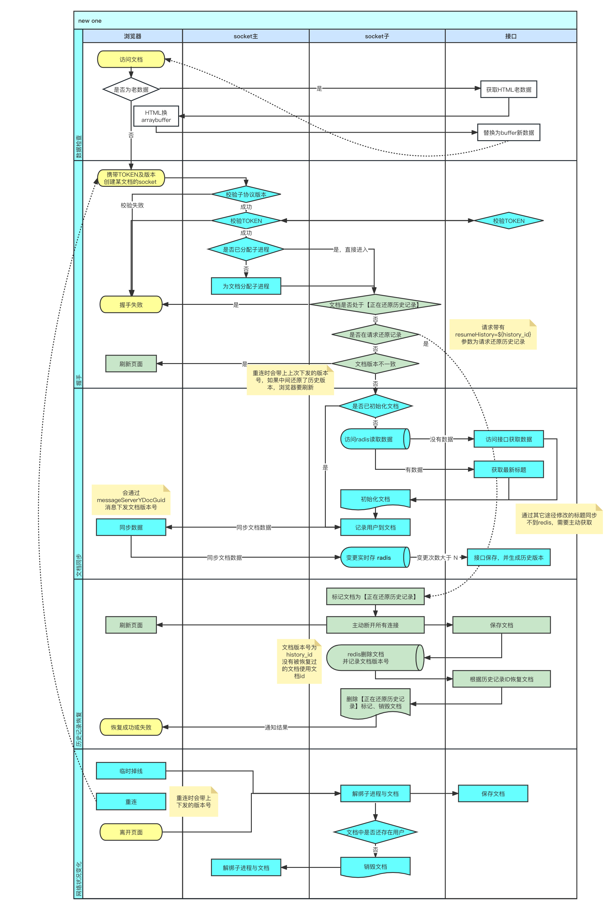

## 服务端：word 多人协作 socket 服务流程图

html 使用接口判断权限相关，以跳转页面
socket 数据读取、保存、缓存
接口：由 socket 调用以保存数据并生成历史记录

## 前端

word 使用 tipap 框架（一个基于 ProseMirror 的在线编辑器框架）
多人协作使用 yjs

1. 访问 api/doc/info 接口以校验权限
2. 权限校验完成后，创建 tiptap 实例
   1. 本地创建 YDoc
   2. 生成 title 和 prosemirror 子节点（title 不属于 tiptap，所以需要单独处理，prosemirror 用于存放 tiptap 内容）
   3. 绑定 prosemirror 与 tiptap 变更同步
   4. 创建 socket 连接（携带 token 及 uid）
   5. 监听 ydoc 变更及光标位置
3. socket 服务
   1. 校验 token
   2. 校验服务器文档状态： **正在恢复历史断开连接**
   3. 校验客户断文档版本号：**重连才会携带，不一致通知**、客户断刷新页面
   4. 下发服务器文档版本号
   5. 下发服务器文档内容
4. 记录版本号，掉线重连时携带（掉线后版本号有变化刷新页面，版本号 = 恢复的历史 ID || 文档 ID）
5. 使用服务器下发内容渲染文档内容
6. tiptap 实例 initSuccess**编辑按钮可点击、或自动进入编辑态**
7. 编辑内容或标题 **ydoc 发现变更并发送**
8. 服务端：收到 ydoc 变更下发给其它端
9. 客户端：收到服务器变更，yjs 合并内容
10. 掉线，打开断网遮罩
    1. 携带 服务器文档版本号 重连
    2. 恢复同步后

## 实现

基于 y-indexeddb 将文档内容存入本地 indexeddb

- 首次渲染
  - 从服务器下载内容，存入本地
  - 每次变更，向服务器同步、存本地同时触发
- 后续渲染
  - 先从本地获取数据渲染页面
  - 与服务器同步差异
- 离线
  - 变更存入本地
  - 重连后与服务器进行全量对比，同步差异
- 恢复历史记录
  - 恢复进行中，所有客户端会被踢下线，恢复完成后才能连的上
  - 每次连接会判断客户端 doc version 与服务器是否一致，不一致以 4301 连接失败，客户端收到 4301 删除本地 indexeddb，重新连接
