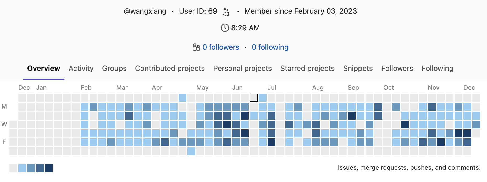
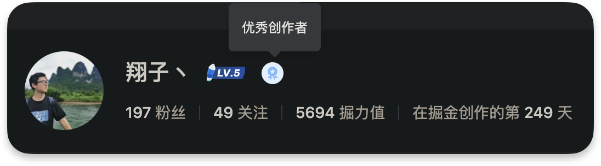
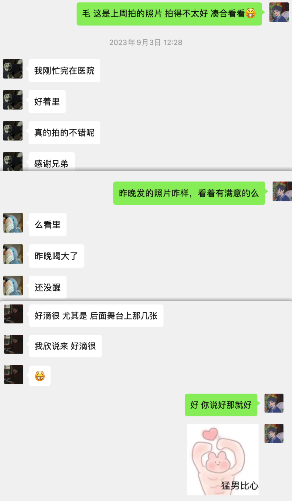
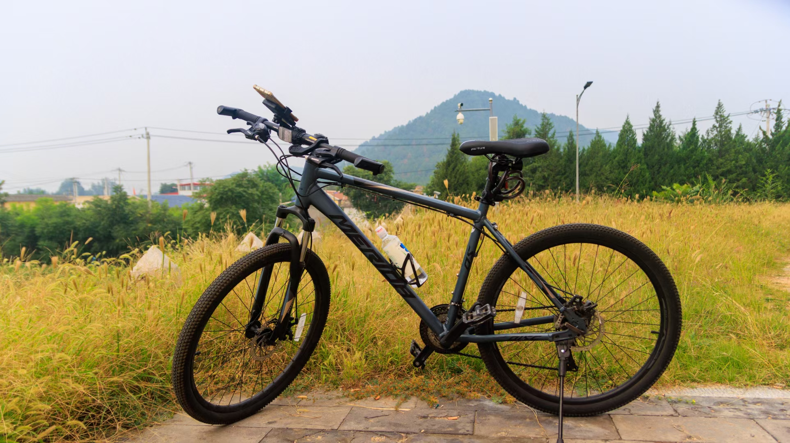
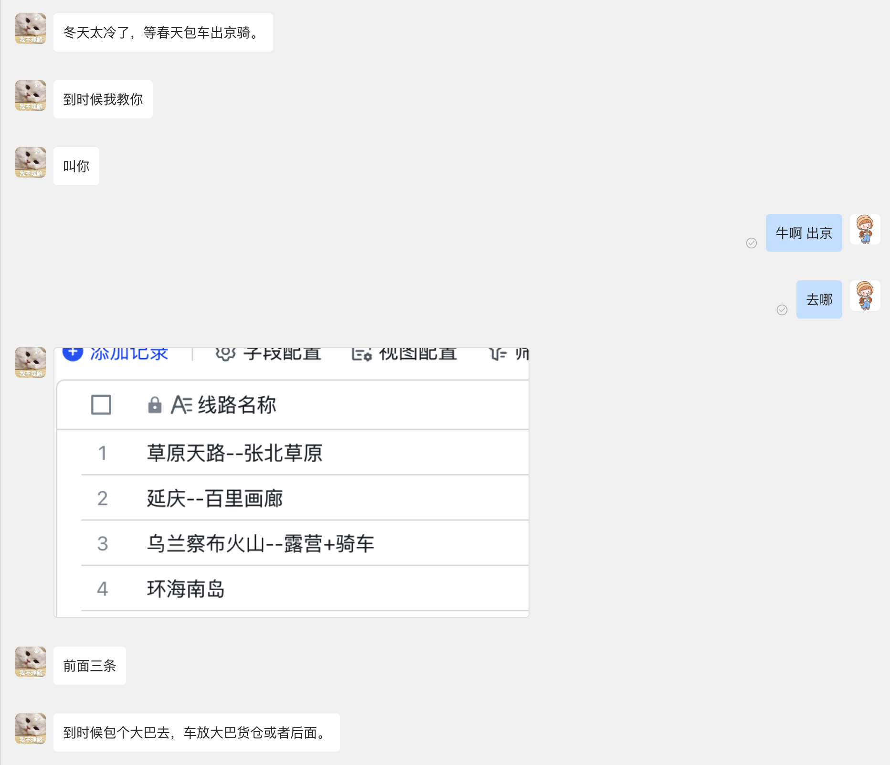
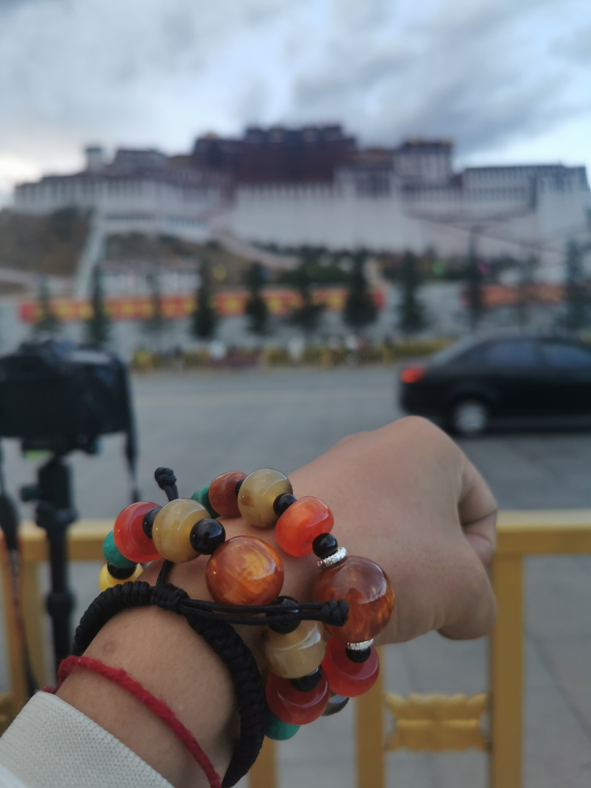
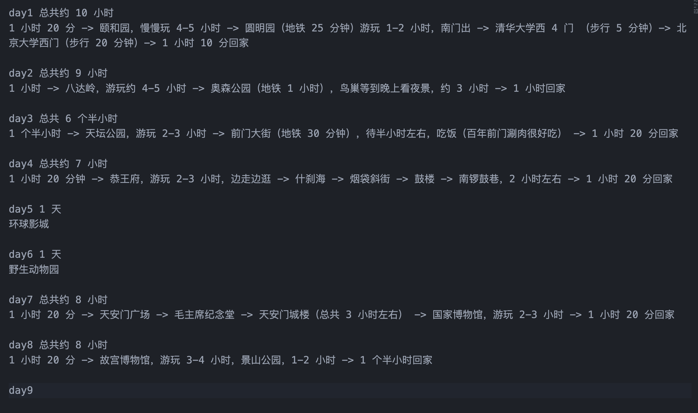

大家好，我是翔子，一个再普通不过的前端开发。既没有远大的志向，也没有值得炫耀的成绩，干的不多赚的也不多，知足常乐，随遇而安。

两个月没写文章了，随大流写个年终总结，也算给自己平凡的 2023 一个交代。

## 离职

> 一上来就写离职，真惨 😭

先说我之前的公司，21 年来北京的时候入职的是一家上市公司，工资高待遇好加班少，此时一切都好，干了两个多月。

要搞事了。
CEO 拉着 10 来个人出去创业，其中也包括我，在被他们选中的那一刻，命运的齿轮开始转动了，一开始我以为是实习期对我的考验，看我是否忠心，我就说考虑考虑。当公司小道消息传的沸沸扬扬的时候，我觉得应该是铁板钉钉的事了，于是领导第二次找了我......（此处省略数不清张饼）


最终没能拒绝领导画的大饼，其实也全不是因为钱，他能找我说明他也认可我吧，至少我是这么想的。当时在公司关系很好的同事，还羡慕我“再过几年要财富自由了”，不过他也没闲着，转头就去了 58。

开始戴上痛苦面具。
想想有可能是在给自己打工，干活很卖力，每晚到 9 点多，周日休息一天，连续一年的 996，有时发版会到半夜十一二点。有次到凌晨 2 点了吧，回去楼下门禁打不开了（我们那是个公寓楼，就住了不到 10 家），女朋友睡着了，不想打扰她休息，为了省几百块钱，到公司躺椅上睡了一觉，早上还回去送我女朋友去上班。

虽然很累，但技术上的成长是很大的，因为要做的事情很多很杂。

人生总有不如意，接受领导的大饼，就得当心撑着。去年年末开始裁人，今年年初全员降薪，美其名曰“等缓过去给大家补回来”，但前段时间问了之前留的几个同事，工资还没调，并且也没补，而且北京团队已经有点不想要的意思了。

虽然当时 CTO 人挺好，技术强，对我们也很真诚，想着跟着他能学点东西。但终究还是资本的力量过于强大，没钱真成不了事儿。

年前就开始面试，年后第一周就离职到新公司。新公司是做协作文档的，难度大，所以我特别感兴趣，虽然降薪了，但想想能挑战一点有难度的工作，比混日子强太多了。

## 新公司工作报告

> 这是公司年度述职报告的一环，粘到这里让大家评评及不及格。

今年是我入职新公司的第一年，首先列一下量化的数据：


1. 代码量：今年总共有 737 个提交，对应提交代码在 15w 行左右，平均每天 3 个提交，每天 500 行代码；
2. 项目：参与了 8 个前端项目的开发，web、桌面端、移动端开发都有所参与，专职维护文档、脑图、白板、流程图；
3. 文章：公司内部发布了 25 篇 wiki，均为原创内容。

如果想了解代码量是如何统计的？请查看[如何统计提交数和代码量](#如何统计提交数和代码量)

## 2023 个人最大的改变

> 我可以改变世界，改变自己...

最初的工作状态：需求做完就完了，该玩玩该吃吃...

今年最大的转变：需求做完就完了吗？

我在需求中遇到问题并解决的过程能总结成一篇文章吗？这些代码从业务抽离封装程其他人可用的代码呢？至少把自己的学习中遇到的坑分享给其他人吧！

于是开始写文章发布，把自己觉得有帮助的东西写下来，发布在公司知识库（好像大家都发，但根本没人看）和掘金上，终于在掘金的第 249 天获得“优秀创作者”称号 🎉。



期间还参加了一期若川大佬组织的“源码共读活动”，本来想多学习多写，开了头的文章最后又删了，发现精力不足，只足够把自己工作上的总结写完。

在做公司内部协作文档时，给 tiptap 和 prosemirror-tables 提了几个 pr，并且成了 prosemirror-tables 的 contributor。

今年 github 上有 112 个提交，得到了将近 100 的 star 🌟。

## 身边人都结婚了

> 啥时候轮到我呀

今年参加了 3 个兄弟的婚礼，都是周五回家，周日参加完婚礼再回北京，虽然搞得很疲惫，但能亲眼见证兄弟们最幸福的时刻，和他们待在一起的感觉很舒服。

当然因为我喜欢拍照，自然承担了婚礼跟拍的角色，方便偷师专业的摄影师，而且带着相机的好处就是能挤到最前面去，永远不用有人挡着我。

拍摄、选片、精修，虽然每一步都不专业，但每一步都不能少，咱可是免费的，专业的是要收钱的。



不过反馈还不错，有点小骄傲。

## 分手

> 情人总分分合合...

和女朋友分手了，难过了一周多 😭，整天干活都没心情，本来想着努力干活，从而能忘记痛苦，可是会止不住的想她，就挺难过的，代码也不怎么会写了。所以那一周的产出极低，索性有产品同事帮我兜着。

一个月后又和好了，还是离不开彼此，劝各位朋友珍惜眼前人，不要等失去了再后悔。

## 开始骑行

> 冬练有氧

听人说摄影、徒步、骑行能让人逐渐对异性失去兴趣，为了摆脱分手的阴霾，买了辆山地车开始骑行。第一次骑了 30 多公里。以后的每天都是 20 公里左右，周末会去更远的地方，边走边拍。



骑行的感觉很爽，轻轻松松超过电动车，每次超过时也会回头挑衅的看一眼 👀，意思就是“来追我呀小菜腿”。当然也会被其他骑车的超过，如果是山地车就追过去超了他，如果公路车就当个缩头乌龟，是真的追不上啊。

骑行的过程会分泌更多的多巴胺，心情也会跟着变好，最近买了 gopro，也在学习剪辑，多记录一些骑行路上的趣事。

认识了好几个骑友，虽然还没有真正一起骑过，约了春天出行



## 去西藏了

> 当我站在珠峰脚下时，珠峰已不再是课本里的珠峰了


以前，30 岁前去西藏并不是我的愿望，现在，30 岁前去西藏成了让我骄傲的事儿。

一是分手的缘故，让我有了散心的打算，二是抖音天天推许巍的“dilililidilililidada”，感觉人在地铁，心已经到了西藏。

嘴里喊着那句“青春没有售价，硬座直达拉萨”，毅然决然的踏上了去西藏的路。

从西宁到拉萨 20 多小时的旅程，遇见形形色色的人，看着未曾见过的风景，大家一起嗨皮，聊着来西藏的原因。

因为 720 镜头贼大（“大”：普通人眼里专业的标准），一路被人亲切的称为“摄影师”，当然拍风景的人也就成了别人眼中的风景。


在布达拉宫帮别人拍照，送给我的手串


去过一次西藏，也就明白了为什么会说“拉萨是一座缺氧但不缺信仰的城市”。

## 家人来北京了

> 家人最重要

本来是十一准备来北京的，怕人太多，所以选择了 10 月中旬，我姐我姐夫（他们有 10 天的育儿假，羡慕死了 😍），带着我妈和我小侄子。

有了家人的陪伴，成了我在北京最幸福的一段时间。早晨会被我妈做饭的香味“吵醒”，晚上会被我的小侄子闹的不能睡觉，天天揍也不管用。早晨吃完饭 9 点骑车上班，晚上到点就溜，我得让我妈认为“我过得很好，我的工作没有一点压力”。


这是给他们做的攻略，基本北京必去的景点都去了，中间还留了一天休息。

走之前，给我包了够吃一周的饺子。

## 2023 成就

1. 分了一次手（又和好了 🐶）
2. 读了两本书（《被讨厌的勇气》，我的讨好型人格被治愈了）
3. 去了趟西藏（走未曾走过的路，见未曾见过的风景）
4. 和家人一起旅行（和我妈的第一张游客照）
5. 50 公里骑行（20 多一点的配速，北京今年太冷了，本来还想挑战 100 公里）
6. 成功达成掘金“优秀创作者”身份（生活重要，学习次之）

## 2024 计划

1. 坚持学习（想学后端的东西，买了光神的《Nest 通关秘籍》，不想再被后端“忽悠”）
2. 坚持写作（今年 25 篇，24 年起码不能少于今年的产出）
3. 坚持骑行（让女朋友喜欢上骑行）
4. 去漠河（雪地里打滚）

## 如何统计提交数和代码量

1. 统计项目成员

   ```bash
   git log --pretty='%aN' | sort -u | wc -l
   ```

2. 项目总提交

   ```bash
   git log --pretty='%aN' | wc -l
   ```

3. 项目个人提交

   ```bash
   git log --author="xxx" --pretty='%aN' | wc -l
   ```

4. 项目个人提交前五

   ```bash
   git log --pretty='%aN' | sort | uniq -c | sort -k1 -n -r | head -n 5
   ```

5. 提交提交总行数

   ```bash
   git log --pretty=tformat: --numstat | \
   awk '{ add += $1; subs += $2; loc += $1 - $2 } END { printf "%15s %15s %15s \n", loc, add, subs }'
   ```

6. 项目个人提交行数

   ```bash
   git log --format='%aN' | sort -u -r | while read name; do printf "%25s" "$name"; \
   git log --author="$name" --pretty=tformat: --numstat | \
   awk '{ add += $1; subs += $2; loc += $1 - $2 } END { printf "%15s %15s %15s \n", loc, add, subs }' \
   -; done
   ```

## 总结

最后，用我今年最喜欢的两句话来结尾：

一半烟火以谋生，一半诗意以谋爱。

有志始知蓬莱近，无为总觉咫尺远。

END
