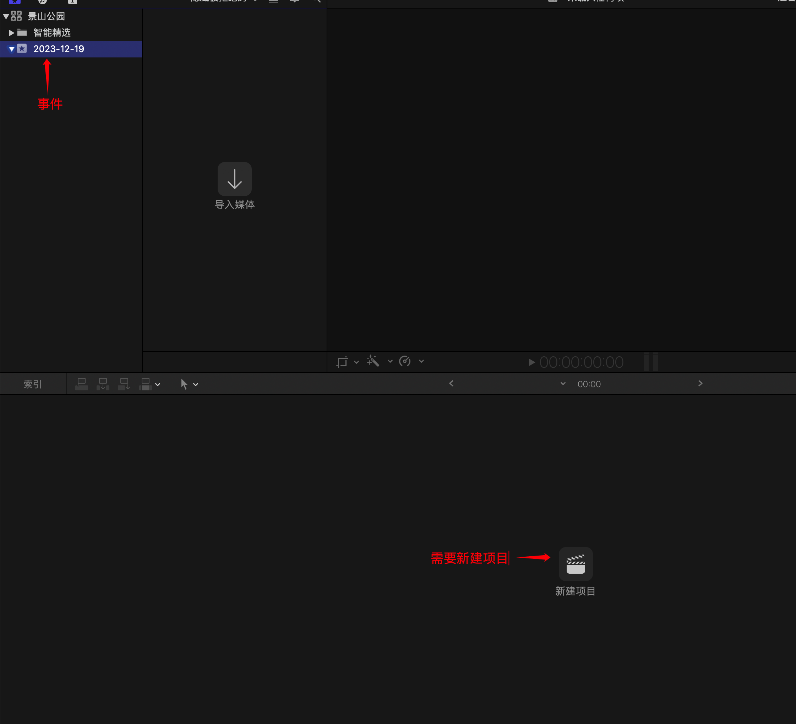
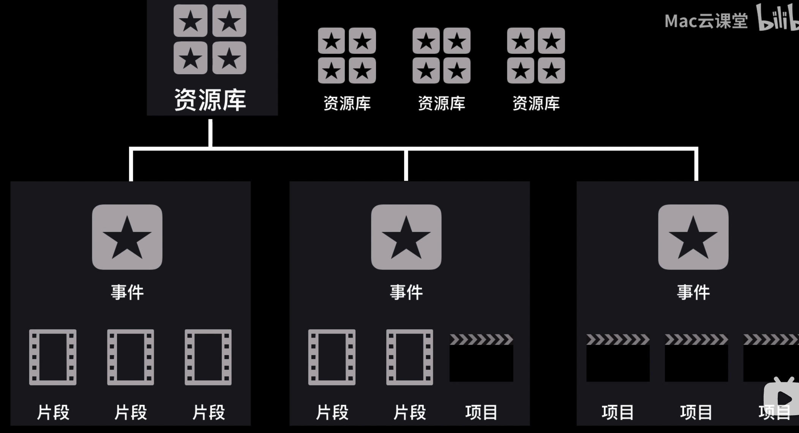
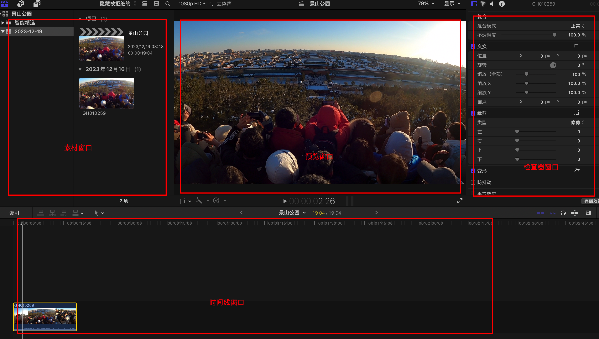
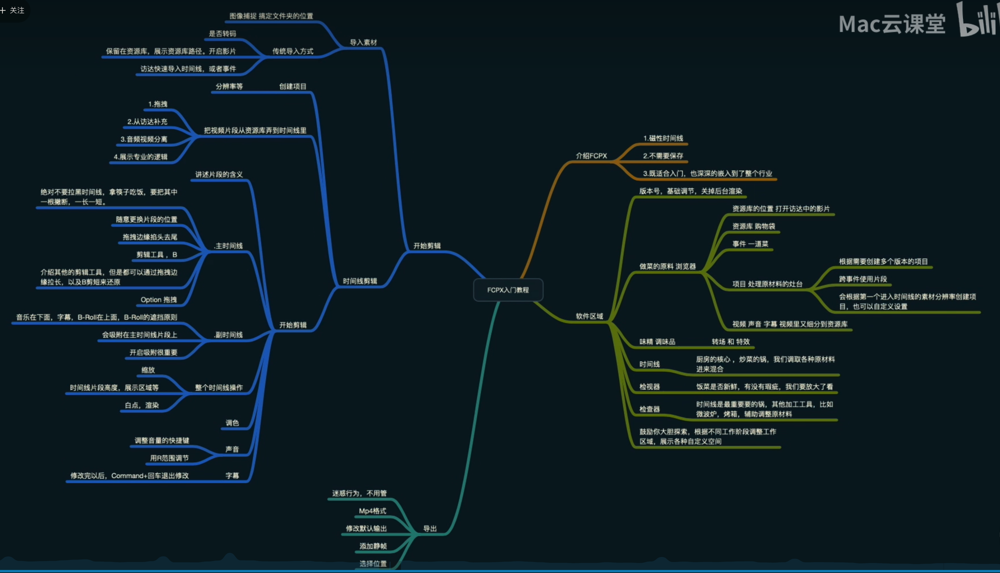
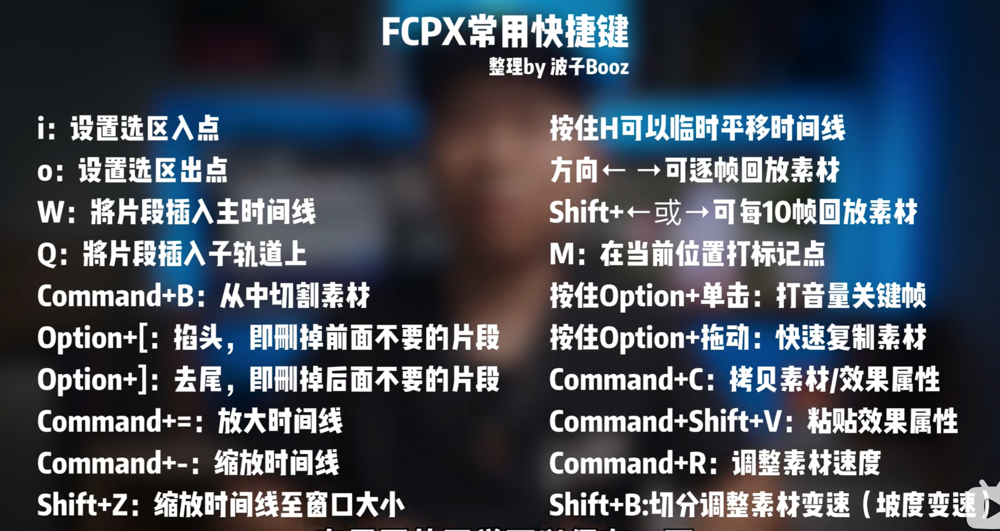

因为是使用 vitepress 搭建博客，所以先需要了解一下[vitepress](https://vitejs.cn/vitepress/)

## vitepress 文档

### 配置

- 文档目录下创建一个 `.vuepress` 目录，存放所有 `VuePress` 相关的文件
- 配置文件 `.vuepress/config.js`，导出一个 JavaScript 对象

  ```js
  module.exports = {
    title: 'Hello VitePress',
    description: 'Just playing around.',
  }
  ```

### markdown 拓展

[原文链接](https://vitejs.cn/vitepress/guide/markdown.html)

- 文件夹下的 `index.md` 文件都会被自动编译为 `index.html`，对应的链接将被视为 `/`

  ```bash
  .
  ├─ index.md
  ├─ foo
  │  ├─ index.md
  │  ├─ one.md
  │  └─ two.md
  └─ bar
    ├─ index.md
    ├─ three.md
    └─ four.md
  ```

  会被编译为

  ```bash
  [Home](/) <!-- 跳转到根目录的index.md -->
  [foo](/foo/) <!-- 跳转到 foo 文件夹的 index.html-->
  [foo heading](./#heading) <!-- 跳转到 foo/index.html 的特定标题位置 -->
  [bar - three](../bar/three) <!-- 你可以忽略扩展名 -->
  [bar - three](../bar/three.md) <!-- 具体文件可以使用 .md 结尾（推荐）-->
  [bar - four](../bar/four.html) <!-- 也可以用 .html-->
  ```

- Frontmatter

  任何包含 YAML frontmatter 块的 Markdown 文件都将由 gray-matter 处理。Frontmatter 块必须位于在 Markdown 文件的顶部，必须是有效的 YAML 格式，放置在三点划线之间。例如：

  ```md
  ---
  title: Docs with VitePress
  editLink: true
  ---
  ```

### 创建博客项目

> 可以使用[vitepress 官方文档](https://vitejs.cn/vitepress/)按照步骤创建，我是直接在 github 上克隆别人已有的博客进行修改<br />
> 博客地址：jexlau.github.io/blog/

- 克隆项目

  ```bash
  git clone https://github.com/JexLau/blog.git
  cd blog

  # 安装依赖
  yarn

  # 在本地启动服务器
  yarn dev

  # 构建静态文件 > .vitepress/dist
  yarn build
  ```

- 修改配置

  - .vitepress 是项目页面的配置，可以根据自己的想法更改
  - docs 中用于存放自己的 md 文档，存放你自己的文档，注意格式如下

    ```md
    ---
    date: 2022-06-10
    title: 搭建博客记录
    tags:
      - 博客
    describe: 使用vitepress搭建博客，通过github pages生成在线访问地址
    ---
    ```

  - more 中用于存放导航栏的标签

### 发布到 github pages

- github 创建 blog 仓库`Create a new repository`
- 先将本地代码推到远程仓库，便于存储及之后修改
- 修改 deploy.sh 脚本文件

  - 先将本地文件提交到 github master 分支
  - 修改 deploy.sh，将 github 地址改为你自己的地址

    ```bash
    # 如果发布到 https://<USERNAME>.github.io/<REPO>
    git push -f https://github.com/wang1xiang/blog.git master:gh-pages
    ```

  - yarn deploy 发布，如果没有成功，可以按照 deploy.sh 的文件一步步执行，看是哪里的问题

- 查看发布成功后的地址<https://wang1xiang.github.io/blog/>，如果没有刷新，强制刷新一下试试

### 发布到 gitlab pages

## Final cut pro 教程

1. 资源库

   fcpx 的工程文件，包含多个事件

   资源库创建成功后，会自动创建一个事件，日期命名（2023-12-19），相当于一个文件夹，在访达目录中可找到

2. 事件

   事件就是文件夹，如：按日期分类，可以包含多个项目

3. 项目

   项目就是时间线上的所有内容，当前剪辑的内容
   

   使用自定义设置，完成后
   自动设置也可

   

   左上角音效、字幕，右下角转场和效果可以运用在所有事件中

4. 添加视频素材

   拖到时间线当中



- 素材窗口
- 预览窗口
- 检查器窗口：调整片段参数
- 时间线窗口：剪辑、加工工作

## 视频剪辑

### 素材窗口

可用于粗剪，如选择视频片段

- 查看片段：j 后退、k 暂停、l 前进、ll 快进
- 选择片段：i 选择开头、o 选择结尾
- 插入片段/添加字幕

  e 直接添加到片段末尾、w 插入到红线位置

  q 直接添加到红线前、shift + q 添加到红线之后

### 时间线

- 时间线大小调整
  cmd+/- 调整大小
  shift + z 适应大小

- 片段删除
  delete 删除
  option + cmd + delete 仅删除主时间线

- 速度控制

  30 帧的片段，需要 60 帧的片段，才能无损的以 50%的速度慢放
  cmd + r 调出速度控制器
  shift + b 将片段速度切割成不同的部分进行调整

A-roll：主时间线，Vlog 的主线内容，能够保证整个 vlog 的连续性，让观看的人明白你要干什么、你在做什么
B-roll：主时间线上方的视频：当播放到此位置时，画面会从主时间线跳转到上面的视频，能够强化 Vlog 内容

## 关键帧

完成两个关键状态帧之间的过渡画面，动画如何产生：两个帧的参数不一样，就会有动画效果。

- 模拟运动镜头，可以在关键帧处放大或缩小视频
- 视频慢慢放大
- 文本慢慢消失：不透明的关键帧，下一个关键帧设为透明

## 视频导出

cmd + e



图像纠正和畸变修复是视频编辑中常见的任务之一。在使用 Final Cut Pro 进行视频编辑时，掌握一些图像纠正和畸变修复的技巧，可以让你的视频更加专业和令人印象深刻。下面将介绍一些 Final Cut Pro 中常用的图像纠正和畸变修复技巧。

1. 手动校正
   Final Cut Pro 提供了一些手动校正工具，可以帮助你调整图像的水平和垂直位置以及旋转角度。首先，在选定需要调整的视频素材后，点击“效果”选项卡，并选择“视频效果”中的“校正”。在校正的选项中，你可以通过调整滑块来实现图像的自由旋转和缩放，以及对齐图像的水平和垂直位置。
2. 视频稳定
   图像抖动是拍摄视频过程中常见的问题之一。Final Cut Pro 提供了视频稳定工具，可以帮助你稳定抖动的视频素材。选中需要修复的视频素材后，点击“效果”选项卡，并在“视频效果”中选择“稳定”。在稳定的选项中，你可以通过调整滑块来对视频进行稳定处理。
3. 镜头畸变修复
   镜头畸变是一种常见的问题，尤其是广角镜头拍摄的素材中容易出现畸变效果。Final Cut Pro 提供了镜头畸变修复工具，可以帮助你修复广角镜头拍摄的素材中的畸变效果。选择需要修复的视频素材后，点击“效果”选项卡，并在“视频效果”中选择“畸变修复”。在畸变修复的选项中，你可以通过调整滑块来修复不同类型的畸变效果。
4. 色彩校正
   在一些情况下，视频素材的色彩可能不准确，需要进行校正。Final Cut Pro 提供了多种色彩校正工具，可以帮助你调整视频素材的亮度、对比度、色相和饱和度等参数。选择需要调整的视频素材后，点击“效果”选项卡，并在“视频效果”中选择“色彩校正”。在色彩校正的选项中，你可以通过调整各个参数的滑块来实现色彩的修正。
5. 去噪和修复
   视频素材中可能存在噪点或其他干扰，Final Cut Pro 提供了去噪和修复工具，可以帮助你清除噪点和修复干扰。选中需要处理的视频素材后，点击“效果”选项卡，并在“音频效果”中选择“去噪”或“修复”。在去噪和修复的选项中，你可以通过调整滑块来降低噪点和修复干扰。

## 视频效果

- 风格化
  超级 8 毫米：复古效果
  摄录机：vlog 专用的视频框

- 聚焦
  模糊 -> 聚焦（整体模糊，局部清晰效果，制造“伪景深效果”；极大提升画面的通透感，凸显画面主体）
- 抠像
  抠像 -> 抠像（从画面抠选出一部分，将其他部分从画面抹去，类似色彩被抹去）
  显示选择遮罩：白色表示要留的部分，黑色表示要抹去的部分
  抠像 -> 亮度抠像器
  将亮部或暗部从画面中抹去
- 遮罩
  遮罩 -> 绘制遮罩
  被抹去的部分变成透明

## 音频效果

## 色彩校正

也就是后期调色

- 颜色

  全局、阴影、中间调、曝光

- 饱和度

  阴影、中间调、曝光

- 曝光

  阴影、中间调、曝光

## 常用快捷键



## 注意

**导入：保留在原位，其他默认**

**平衡颜色：软件会自动调整颜色**

**倒放**

关键帧：透明图 0 - 100 2s 黑起效果

导出片段：R

导出：电脑 mp4 格式 H.264

## 骑行视频

剪辑一个关于出去骑行游玩的视频，我会根据视频的整体风格、节奏感、画面过渡以及音效配合等要素，确保视频内容能够流畅、生动地展示骑行游玩的乐趣和精彩瞬间。以下是我的详细剪辑思路：

一、整体风格

整体风格将倾向于轻松、自由、活力四溢，以展现骑行带来的乐趣和激情。我会注重色彩饱和度和对比度的调整，让画面看起来更加鲜艳生动，同时保持自然色调，避免过度修饰。

二、节奏感

开头部分：以一段快节奏的音乐作为开场，迅速抓住观众的注意力。画面从骑行者整装待发的场景开始，快速切换到骑行途中的精彩瞬间，如爬坡、下坡、转弯等，展现骑行的速度与激情。
中间部分：节奏逐渐放缓，展现骑行途中的风景和骑行者的感受。可以穿插一些骑行者休息、交流、欣赏风景的画面，以及沿途的自然风光、人文景观等，让观众感受到骑行的轻松与惬意。
结尾部分：节奏再次提升，以一段高潮部分的音乐作为结尾，展示骑行者到达终点或完成挑战的喜悦与成就感。画面可以聚焦于骑行者的笑脸、胜利的庆祝动作等，让观众感受到骑行的乐趣和满足感。
三、画面过渡

自然过渡：利用画面间的相似性进行自然过渡，如从骑行者的背影逐渐切换到前方的风景，或从骑行者的面部表情切换到他们手中的自行车等。
溶解过渡：在需要强调场景转换或时间流逝的地方，可以使用溶解过渡来营造一种流畅、连贯的视觉效果。
跳切：对于一些需要突出表现的动作或瞬间，可以使用跳切来强化节奏感，让观众更加关注这些重点画面。
四、音效配合

背景音乐：选择一首节奏明快、充满活力的音乐作为背景音乐，与骑行游玩的主题相契合。同时，根据视频的节奏感，适时调整音乐的音量和节奏，使之与画面内容相互呼应。
环境音：保留部分环境音，如风声、车轮滚动声、鸟鸣声等，以增强视频的现场感和沉浸感。这些环境音可以适当调整音量，避免与背景音乐产生冲突。
特效音：在需要强调某些画面或动作时，可以加入一些特效音，如刹车声、欢呼声等，以增强观众的观看体验。
通过以上剪辑思路，我相信可以剪辑出一个流畅、生动、充满乐趣的骑行游玩视频，让观众感受到骑行的魅力和精彩。

### 更多音效

当然可以，以下是一些具体的音效配合方案，旨在让骑行游玩的视频更具感染力：

一、启动与出发

启动声：在视频开始时，可以加入轻微的链条转动声、脚踏板被踩下的声音，以及自行车轮胎与地面接触的滚动声，这些声音共同构成了出发的预备阶段。

风的声音：随着骑行者的启动，逐渐加入轻微的风声，增强动感，并预示着即将开始的旅程。

二、骑行途中

轮胎滚动声：在骑行途中，持续且适度地加入轮胎与地面接触的滚动声，让观众感受到骑行的连续性和稳定性。

环境音效：根据不同的骑行环境，加入相应的环境音效。比如，经过森林时加入鸟鸣声、树叶沙沙声；经过河流时加入流水声；经过城市时加入轻微的交通声等。这些音效能够增强观众对骑行环境的感知。

呼吸声与喘息声：在爬坡或加速等较为吃力的骑行阶段，可以适当加入骑行者的呼吸声或喘息声，让观众感受到骑行的挑战和紧张感。

三、精彩瞬间

刹车声：在紧急刹车或突然减速的瞬间，加入明显的刹车声，增强紧张感和刺激感。

欢呼与笑声：当骑行者完成某个挑战或遇到有趣的场景时，可以加入他们的欢呼声、笑声或交流声，展现他们的喜悦和兴奋。

四、休息与交流

自然风声：在休息或交流时，可以突出自然环境的声音，如风声、远处的鸟鸣等，营造宁静舒适的氛围。

轻松的音乐与谈话声：加入轻松的音乐作为背景音乐，同时穿插骑行者之间的谈话声或笑声，展现他们之间的友谊和放松的状态。

五、结束与庆祝

欢快的音乐：在视频结尾部分，选择一首欢快的音乐作为背景音乐，营造庆祝和胜利的氛围。

掌声与欢呼声：在骑行者到达终点或完成挑战的瞬间，加入观众的掌声和欢呼声，强调他们的成就和荣耀。

通过以上具体的音效配合方案，可以让骑行游玩的视频更加生动、真实，同时增强观众的参与感和情感共鸣。记得在剪辑过程中根据实际情况进行调整和优化，确保音效与画面内容相互呼应，达到最佳效果。

### vlog 思路

1. 介绍 vlog 剪辑的前期准备工作，如素材收集、整理等；
2. 阐述剪辑顺序的选择原则，确保故事连贯、节奏紧凑；
3. 说明音效配乐的选取标准，提升视频氛围和情感表达；
4. 讲解字幕和特效的添加技巧，增加视频的趣味性和观赏性；
5. 确保最终剪辑出的 vlog 内容连贯、有趣、吸引观众。

一、前期准备工作

在剪辑工作开始之前，充分的准备工作至关重要。这主要包括素材的收集与整理。

素材收集：我会从原始拍摄素材中筛选出所有可用的镜头，这些镜头包括风景、人物互动、特殊活动等。同时，我也会收集一些背景音乐、音效等音频素材，以备后期制作时使用。

素材整理：按照时间顺序或内容主题对素材进行分类整理，方便后续剪辑时快速找到所需素材。我会将相似的镜头放在一起，形成一个清晰的剪辑框架。

二、剪辑顺序的选择原则

剪辑顺序的选择直接影响到 vlog 的连贯性和节奏感。

故事连贯性：我会根据 vlog 的主题和内容，确定一个清晰的故事线。然后，按照故事发展的逻辑顺序来安排剪辑顺序，确保观众能够跟随故事线索流畅地观看。

节奏紧凑性：在保持故事连贯性的基础上，我会注意控制剪辑的节奏。通过合理安排镜头的长短、切换速度以及背景音乐的变化，营造出一种紧凑而富有张力的节奏感。

三、音效配乐的选取标准

音效和配乐在 vlog 中起着提升氛围和情感表达的重要作用。

音效选取：我会根据镜头的内容和氛围，选择合适的音效。例如，在户外拍摄的自然风光中，可以加入鸟鸣声、风声等自然音效；在人物互动的场景中，可以加入笑声、谈话声等人物音效。

配乐选取：配乐的选择需要与 vlog 的整体风格和情感表达相匹配。我会根据 vlog 的主题和情感倾向，选择相应的音乐风格和节奏。同时，注意控制音乐的音量和节奏变化，避免与画面内容产生冲突。

四、字幕和特效的添加技巧

字幕和特效的添加可以增加 vlog 的趣味性和观赏性。

字幕添加：我会在关键节点或需要解释说明的地方添加字幕。字幕的内容应简洁明了，字体和颜色应与画面相协调。通过字幕的引导，观众可以更好地理解 vlog 的内容和意图。

特效添加：特效的使用应适度而恰当。我会根据镜头的特点和需要，选择合适的特效进行添加。例如，可以使用转场特效来平滑地切换不同场景；可以使用动画特效来突出关键信息或增强视觉效果。

五、确保内容连贯、有趣、吸引观众

在剪辑过程中，我会不断审查和调整，确保最终剪辑出的 vlog 内容连贯、有趣、吸引观众。

内容连贯性：在剪辑完成后，我会对整个 vlog 进行多次审查，确保内容之间的衔接自然流畅，没有突兀或断裂的感觉。

趣味性提升：我会通过剪辑手法和特效运用，增加 vlog 的趣味性。例如，可以运用一些幽默或夸张的表现手法来展现一些有趣的瞬间；可以利用特效来突出一些独特的视觉效果。

吸引观众：通过精心选择剪辑顺序、音效配乐以及字幕特效等元素，我致力于打造一个引人入胜的 vlog 作品。我会关注观众的反馈和需求，不断优化剪辑策略，以吸引更多观众的关注和喜爱。

综上所述，vlog 剪辑是一个系统性的工作，需要综合考虑素材收集、剪辑顺序、音效配乐以及字幕特效等多个方面。通过遵循这些一般思路并不断实践探索，我相信能够剪辑出高质量、有趣味性的 vlog 作品。
