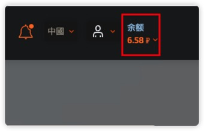
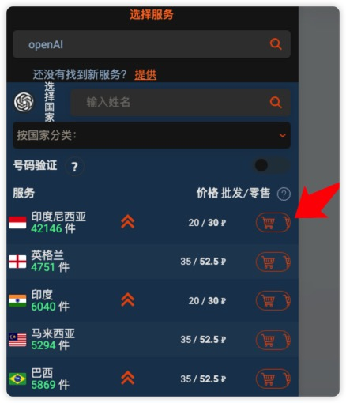
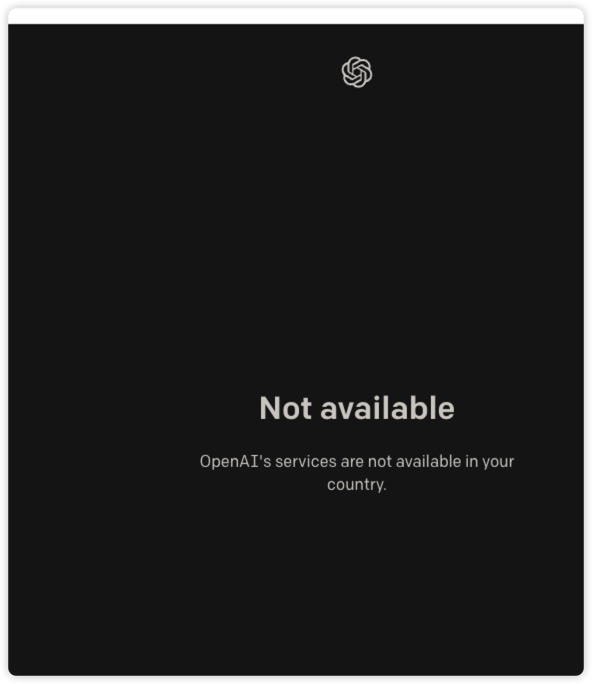
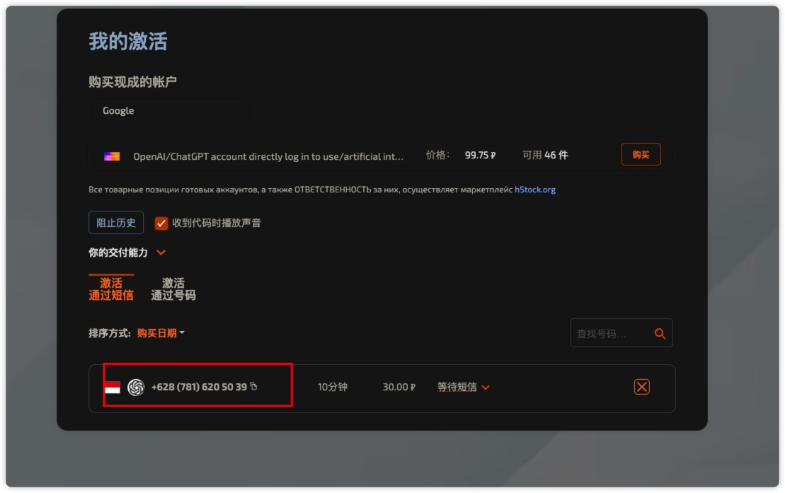
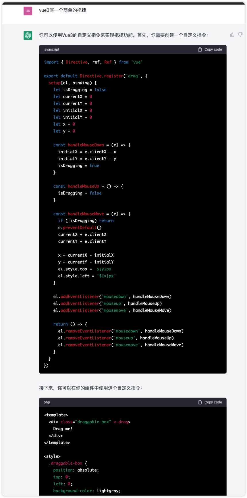

## 准备工作

- 科学上网，这是必须的
- 国外手机号，用于接受注册验证码，可以通过第三方平台注册

### 手机号注册

1. 打开网址：[https://sms-activate.org/](https://sms-activate.org/)
2. 使用邮箱注册
3. 注册完成后点击右上角充值，目前至少充值 0.5 美元，折合人民币 3.5 元
   
4. 在左侧输入 openAI，并选择印度尼西亚后的购物车按钮购买，买完有 20 分钟的使用时间，要尽快使用，如果未接收到验证码是不收费的，重新购买即可
   

## 注册 OpenAI

1. 打开网址：[https://openai.com/api/](https://openai.com/api/)，如果出现下面截图的问题，是因为你的代理地址没选对，选择美国、新加坡等等，香港代理不行
   

   如果代理对了但还是出现这个问题，那么可以使用浏览器无痕模式打开网址，打开控制台输入以下代码

   ```js
   window.localStorage.removeItem(
     Object.keys(window.localStorage).find((i) => i.startsWith('@@auth0spajs'))
   )
   ```

2. 输入邮箱，校验完成后填写姓名等等
3. 需要验证国外手机号，返回刚刚的[https://sms-activate.org/getNumber](https://sms-activate.org/getNumber)网站，复制此处的号码，注意不要把区号粘贴进去
   
4. 等待验证码，大概需要等 1 分钟左右即可收到

## 打开 ChatGpt

[beta.openai.com/overview](https://platform.openai.com/overview)，选择 `new Chat` 就可以和`ChatGpt`聊天了

比如，让它下一个拖拽的组件
