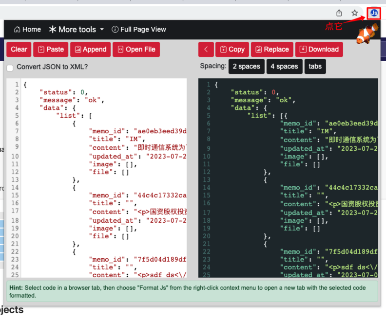
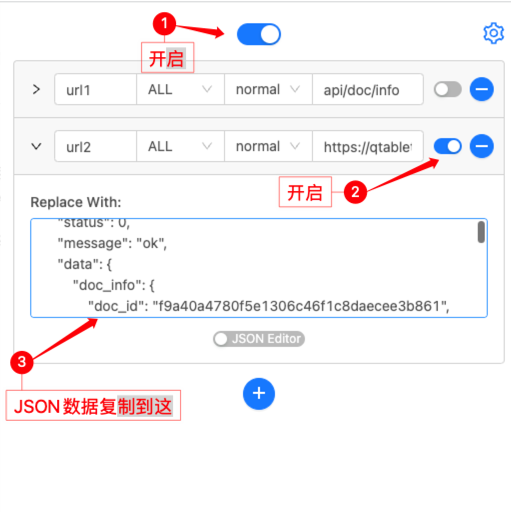
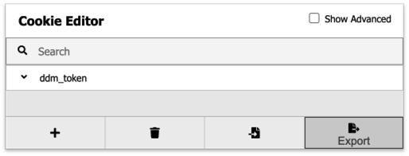
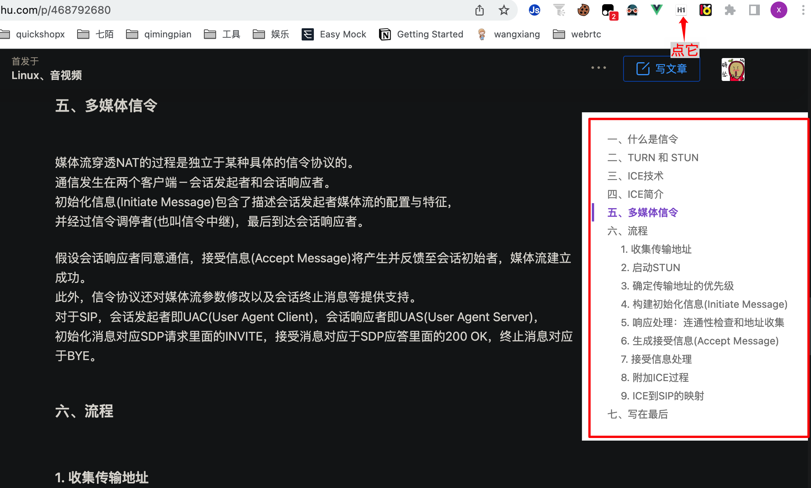
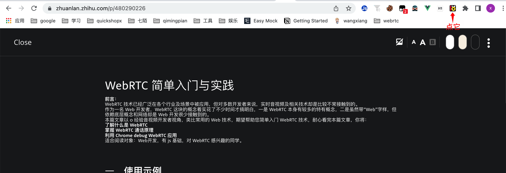
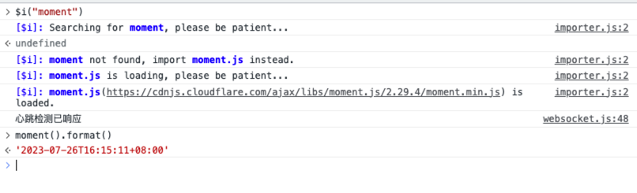
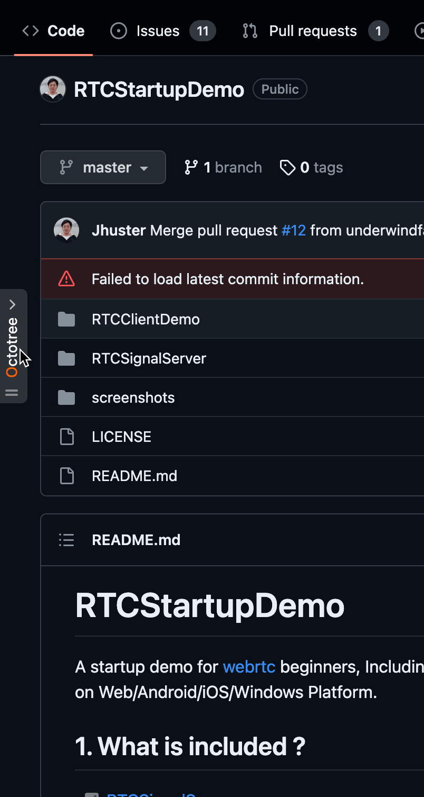
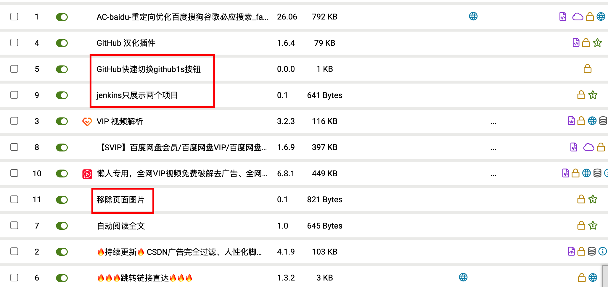

最近降本增效的话题日益盛行，那么作为前端开发我们能做哪些改变，来提升开发效率呢？

## 插件总览

- [Pretty Js](https://chrome.google.com/webstore/detail/pretty-js/kililblhcfpodipkcbobnbgnbbhgbkji)
- [Ajax interceptor](https://chrome.google.com/webstore/detail/ajax-modifier/nhpjggchkhnlbgdfcbgpdpkifemomkpg)
- [Cookie-Editor](https://chrome.google.com/webstore/detail/hlkenndednhfkekhgcdicdfddnkalmdm)
- [Smart TOC](https://chrome.google.com/webstore/detail/smart-toc/lifgeihcfpkmmlfjbailfpfhbahhibba)
- [Readbee](https://chrome.google.com/webstore/detail/text-mode-for-websites-re/phjbepamfhjgjdgmbhmfflhnlohldchb)
- [Console Importer](https://chrome.google.com/webstore/detail/console-importer/hgajpakhafplebkdljleajgbpdmplhie)
- [Google 翻译](https://chrome.google.com/webstore/detail/google-translate/aapbdbdomjkkjkaonfhkkikfgjllcleb)
- [Octotree](https://chrome.google.com/webstore/detail/octotree-github-code-tree/bkhaagjahfmjljalopjnoealnfndnagc?utm_source=chrome-ntp-icon)
- [油猴](https://chrome.google.com/webstore/detail/tampermonkey/dhdgffkkebhmkfjojejmpbldmpobfkfo)

### Pretty Js

这是我目前为止用过最好的 JSON 格式化工具了，直接点击插件图标就可以在当前页打开插件，不像其他的 JSON 格式化工具还需要另开一个页面。

并且支持文件导入/导出、展开/收缩转换结果面板以及对缩进格式调整功能。

### Ajax interceptor

使用该插件可以修改页面上 Ajax 请求的返回结果。插件现已改名叫 Ajax Modifier 了，名字对应功能，更好理解了。

说个开发中真实的案例：

与后端联调时，想要测试多个功能场景，需要接口数据变动时：
找后端："大哥，你返回的测试数据改一下，我测测其他的东西？"
后端大哥："你在教我做事？下次需要什么提前说好，别让我改改改的，xxx"
我："好的，大哥，下次一定。反手就是一个 👋"

如果你平时遇到的也是这样的后端大哥，那么你就一定需要这款插件，用法很简单。

这个插件我会和 Pretty Js 放在一起，当需要修改后端某个接口时，从接口`Response`中复制 JSON 数据，在 Pretty Js 中格式化并且修改成自己想要的结果，然后再将 JSON 粘贴到此插件中。此时刷新页面，请求结果就修改成了你想要的样子 👍。

### Cookie-Editor

Cookie Editor 是一个免费、功能强大、易于使用的可视化 Cookie 编辑器，用于修改网站 Cookie。

举个栗子：某个学习网站会员只支持单人登录，另外一个人登陆就会将当前登录人挤下线，此时就可以使用此插件将 Cookie 拷贝给另一个人，另一个人在粘贴到网站中，那么就可以多人同时使用会员服务了。

在前端开发中也挺有用，比如需要多个浏览器中测试，直接复制 Cookie，不需要重新登录。

### Smart TOC

自动提取网页标题，生成目录。非常适合一些没有标题的网站，快速到达自己想要浏览的地方。

### Readbee

Readbee 可以将网页内容简化为文本模式/阅读模式。

功能：去除图片、文字大小/行高/字体调整、背景色调整。

### Console Importer

在开发过程中，在浏览器调试代码时，如果有第三方库提供的参数或方法时，没法得到准确结果。这时候只需引入 console importer 插件，即可在浏览器控制台中安装第三方库，然后调试使用。

### Google 翻译

如果有翻墙，建议使用 Google 翻译。如果没有，使用沙拉查词。查看英文资料必备插件。

### Octotree

超实用的 GitHub 可视化代码树插件，会将 Github 项目代码以树形格式展示，以便于能非常清晰直观的看到项目结构，而且在展示的列表中，可以直接跳转到对应的文件。

### Tampermonkey 油猴脚本

最后必须得说下神器——油猴脚本

可以在网站上运行用户脚本，从而提升您的浏览体验。

比如：Jenkins 里面包含了大量的项目，而且都名字都挺像的，想要找到自己需要发布的项目挺废眼睛的，这时候就写了一个油猴脚本，将我需要的几个项目过滤出来，直接把其他的项目隐藏掉不展示，这样我一眼就能看到我需要发布的几个项目在哪里。

再比如之前没有发现 Readbee 这个插件时，我在访问网页时，因为不想看网页中的图片，所以写了一个脚本，将网页上的图片都删除掉。

如果你是一个前端，只要你会 JS，那么写油猴脚本就很简单，简单的就像操作 DOM、网页跳转之类。
