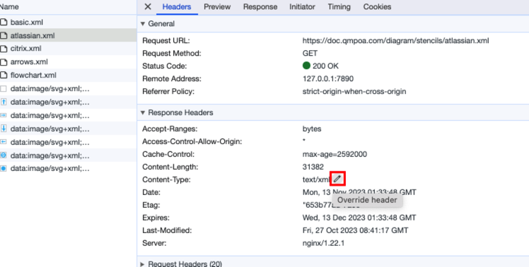
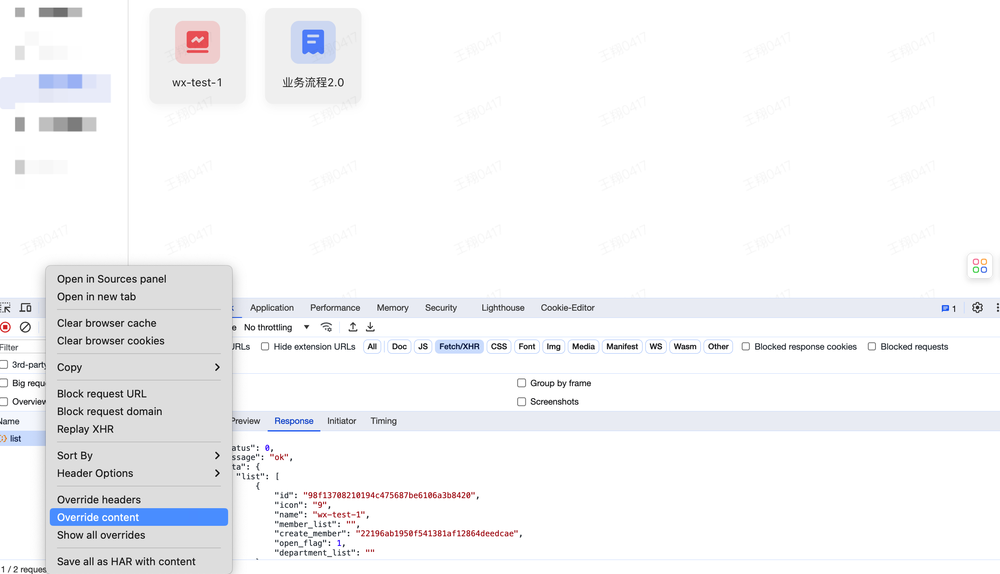
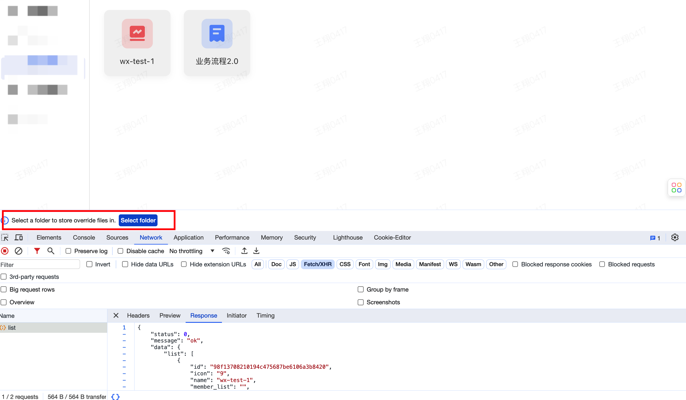
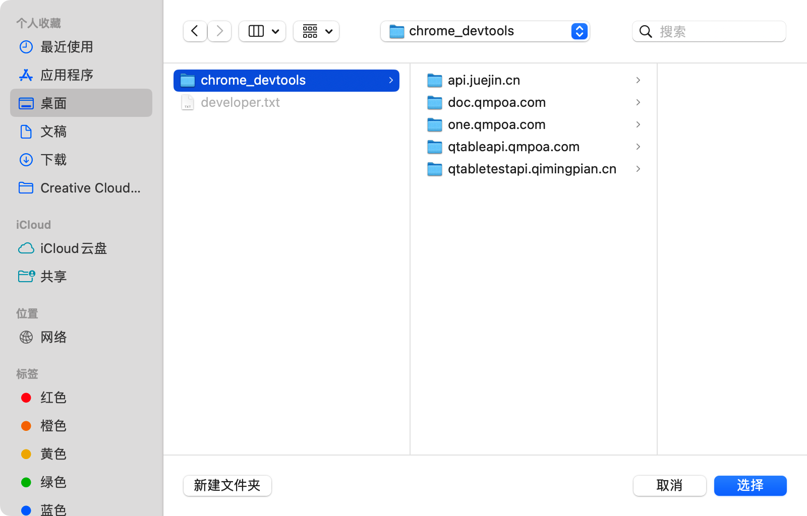
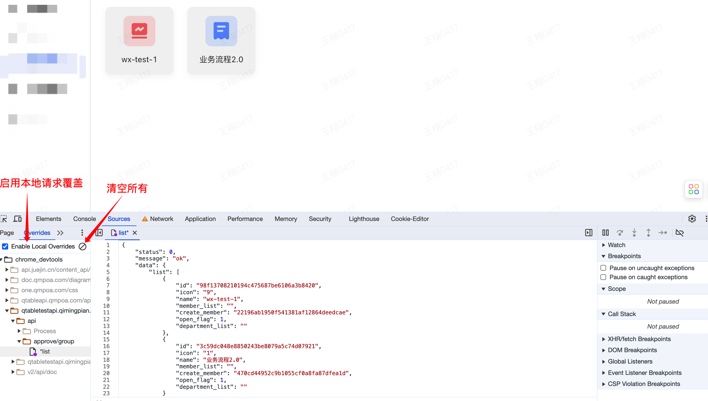
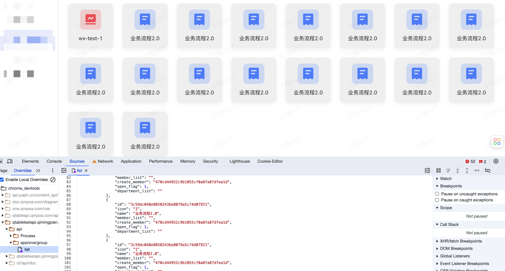
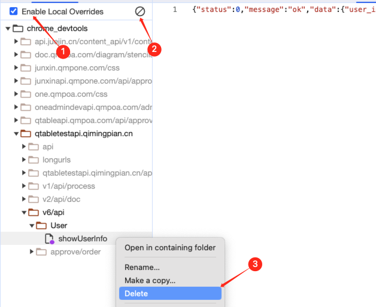

## 前言

Chrome 浏览器的 Overrides 功能，已经发布有一段时间了，因为一直在用 Ajax Modifier 的缘故，所以并没有使用过，但是最近在使用的时候，发现 Overrides 在对请求头 Headers 的修改上，比 Ajax Modifier 更加友好且方便，并且使用后就不需要再安装多余的浏览器插件。

## 传统 Mock 工具

Mock 工具可能是大多前端开发最常用的工具之一，Mock 数据的方式多种多样，可以直接使用 JSON 文件，也可以使用前端的 Mock 工具，如：mockjs，或者写一个简单的 Node 服务。

### 弊端

- 直接使用 JSON 很方便，就是 Mock 数据只能是固定的，每次测试都要去修改 JSON 文件，有点麻烦；
- mockjs 也很好用，但是需要在项目中引入 mockjs 的依赖，而且需要学习 mockjs 的语法；
- 使用 Node 服务，请求本地接口，则需要启动 Node 服务，每次测试都要启动 Node 服务，有点麻烦。

### Ajax Modifier

如果不想这么麻烦，可以尝试一下像 [Ajax Modifier](https://chromewebstore.google.com/detail/nhpjggchkhnlbgdfcbgpdpkifemomkpg) 这样的浏览器插件。

可以通过图中的 Switch 按钮切换 Mock 请求的开启状态。

接下来，我们来介绍一下 Chrome 浏览器的 Overrides 功能，功能类似 Ajax Modifier，就像一个浏览器原生的 Mock 工具，让我们可以更方便的实现对请求数据的覆盖。

## Overrides 的使用场景

### 修改请求头

Overrides 功能允许我们在对接口的 header 信息，如下图，我们可以直接点击字段旁边的编辑符号，或者在请求接口上右键->override headers 就可以实现对请求头的修改。

之前有次我们后端的 nginx 配置不对，导致返回的 xml 文件的 `Content-Type` 为 `text/xml`，而我们期望的是 `text/html`，直接通过 Overrides 就可以修改返回的 `Content-Type` 为 `text/html`。

### 修改请求返回结果

可以实现对接口返回数据的修改，不依赖其他工具。

#### 使用步骤

1. 右键选择需要修改的请求

   

   右键后选择`Override content`

2. 选择文件夹

   此时会出现如下图提示，需要选择一个文件夹来存储覆盖文件：
   

   

   在桌面创建一个文件夹，选择完成后会出现提示：“**DevTools 请求获得对 /Users/xxx/Desktop/chrome_devtools/ 的完整访问权限。请确保您不会泄露任何敏感信息**”，点击`允许`即可。

   > 如果是第一次覆盖请求时需要存储位置，一旦选择完成后，以后就不会出现这一步骤

3. 修改请求结果

   接着控制台会自动跳转到`Sources -> Overrides`中，并且会自动选中需要覆盖的请求文件，修改它就可以实现 mock 请求结果。

   

   比如我们可以修改上面的数量，看看超出屏幕范围后的弹窗位置是否正常显示：

   

### 停用 Overrides 的方式

使用完 mock 之后，需要及时停用，否则会对真实数据产生影响，Overrides 停用的方式有以下几种：

1. 通过`Enable Local Overrides`可以启用或停用 mock
2. 直接点击`Clear configuration`清空所有本地 mock 数据
3. 单独删除某一个请求的本地 mock 数据

## 结语

Overrides 功能的推出为我们提供了一个更为灵活、便捷的 Mock 工具，让我们在开发的过程中可以不再对后端有比较重的依赖，灵活处理各种数据交互情景。
