## 为什么学习这门课程

我在平时工作中经常会遇到这几种问题：

1. 后端返回的接口格式不太准确，于是通过`console.log`打印接口返回的数据
2. 写了一段代码，不知道运行结果对不对，通过代码中添加`debugger`或打断点进行调试
3. 写一段node脚本，不知道运行结果，通过`console.log`打印输出
4. 想学习源码，通过打断点的方式进行调试
5. ...

相信很多开发都会有这样的问题，那么想要做好这些就需要系统的学习下前端调试，所以我很推荐大家学习[这门课程](https://juejin.cn/book/7070324244772716556/section/7136841909959393293)，恶补很多不知道的知识。

## 调试概念

代码在不同平台运行时，将运行时状态通过某种方式暴露出来，传递给开发工具做UI展示和交互，辅助开发者排查问题、梳理流程、了解代码运行状态等，这个就是调试。

不同平台：浏览器、NodeJs、Electron、小程序、移动端等任何能执行JS代码的平台
暴露的运行时状态：调用栈、执行上下文、DOM结构等

### Chrome DevTools原理

Chrome DevTools分为两部分:

1. backend: backend与Chrome集成，负责把Chrome的网页运行时状态通过调试协议暴露出来
2. frontend: 负责对接调试协议，做UI的展示和交互

两者之间的调试协议叫做Chrome DevTools Protocol，简称CDP

## 调试js代码

- Chrome DevTools调试
  
  创建调试项目，打开Chrome DevTools，在Sources面板中通过`ctrl+p`搜索js文件，打断点
  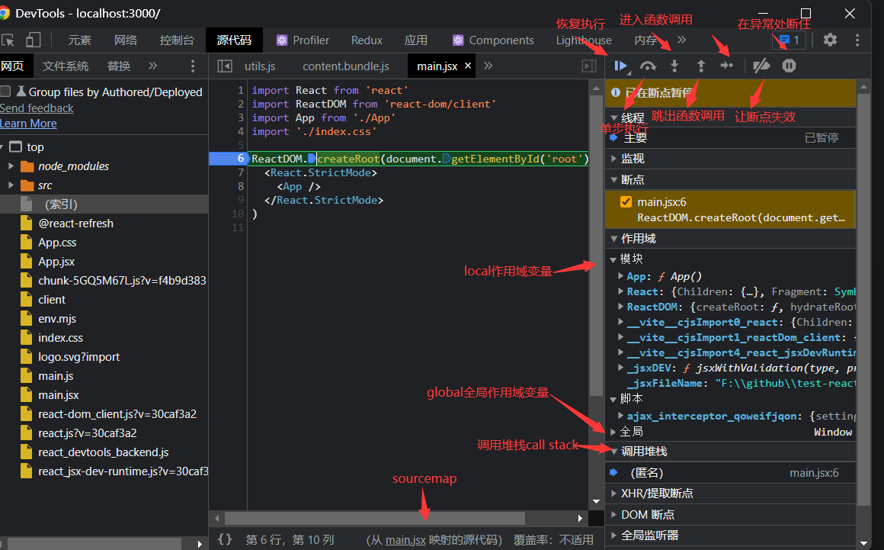

- VSCode Debugger调试
  
  比通过Chrome DevTools调试更好用

  1. 打开项目目录，创建.vscode/launch.json文件
  2. 点击右下角Add Configuration...，选择Chrome: Launch
  3. 将访问的url改为开发服务器启动的地址，如react的项目为`http://localhost:3000`
  4. 进入Debug窗口，点击启动
     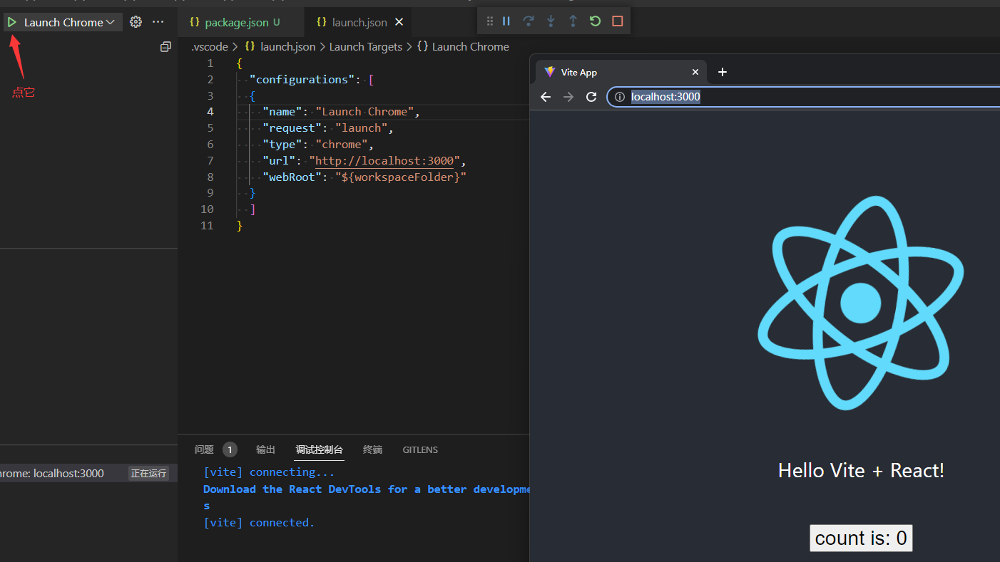
  5. 在代码处打断点，然后点击刷新按钮，调用上下文、堆栈信息都会展示在左
     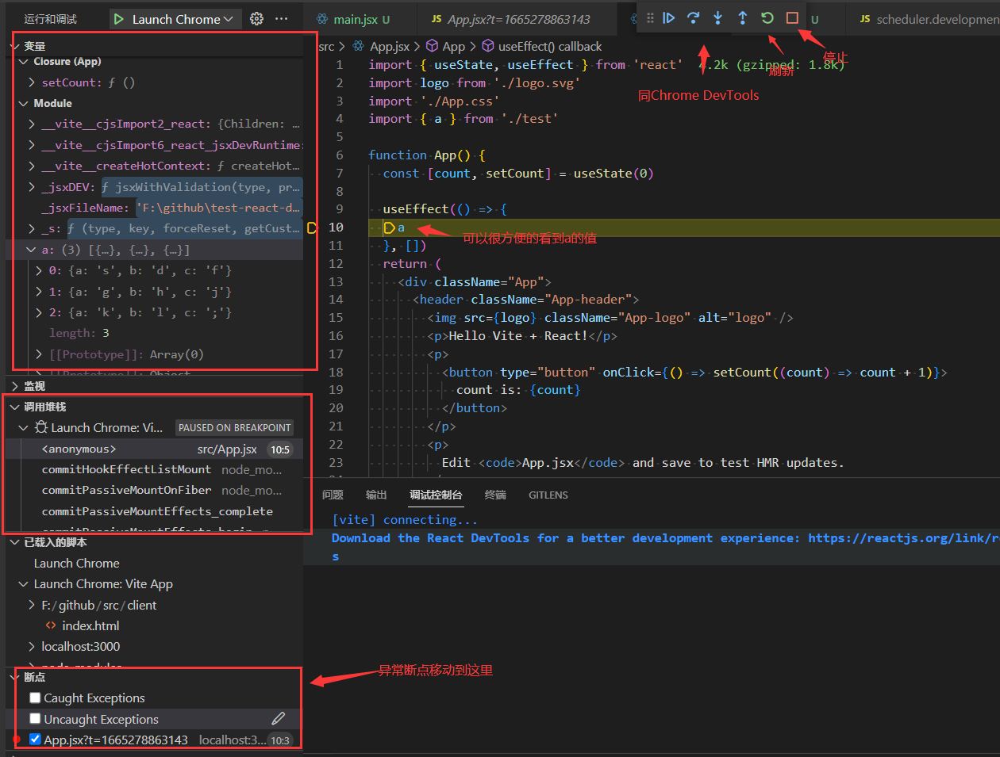

- 使用VSCode Debugger调试的好处
  
  1. 不用切换工具，边调试边写代码
  2. 边调试边写代码，直接知道属性值是什么，有哪些函数可以调用，所以ts会有属性名提示，但并不知道属性值是什么

- 为什么Chrome DevTools和VSCode debugger都可以调试网页

  调试协议相同，都是CDP，通过对接CDP调试网页，只不过VSCode debugger多一层Debug Adapter Protocol转换

### VSCode Debugger配置详解

launch.json文件可以不用自己创建，可以直接点击Debug窗口的`create a launch.json file`快速创建<br />

- launch/attach
  
  我们知道调试就是把浏览器跑起来，并访问目标网页，这时候会有一个ws的调试服务，通过frontend的ws客户端连接上这个服务，就可以进行调试了。<br />

  launch就是把url对应的网页跑起来，指定调试端口，然后frontend会自动attach到这个端口上，而如果已经有了调试模式跑的浏览器了，只需要通过attach直接连接<br />

- 为chrome配置调试模式
  
  1. 添加remote-debugging-port=9222

     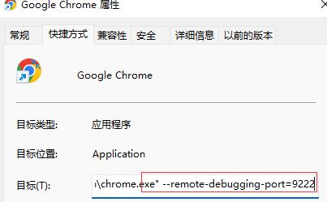

  2. 关闭浏览器后重新打开，在地址栏输入chrome://version，命令行出现remote..就说明配置成功

     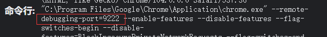

  3. 浏览器访问localhost:9222/json

     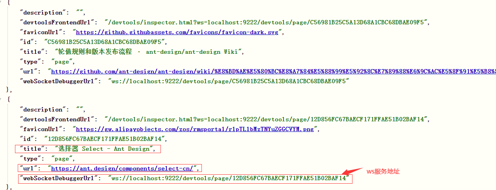

     每个页面是单独的ws服务，因为每个页面调试都是独立的
  
  4. VSCode debugger添加一个attach的Chrome Debug配置，启动之后就可以看到所有的ws调试服务

     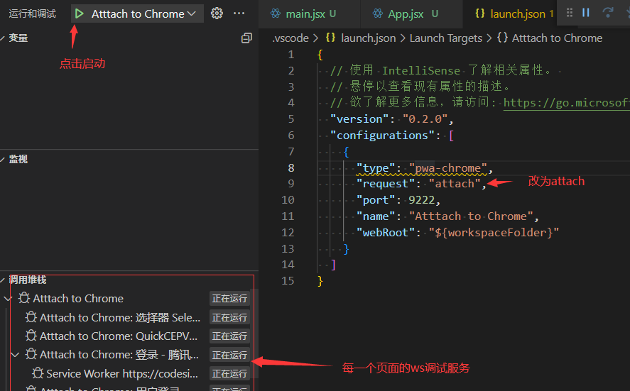

## sourcemap的原理和作用

sourcemap是关联编译后的代码和源码的，通过一个个行列号的映射，比如编译后的代码的第3行第4列对应源码里的第8行第5列这种，叫做一个mapping <br />

sourcemap格式如下：

```js
{
  version : 3,
  file: "out.js",
  sourceRoot : "",
  sources: ["foo.js", "bar.js"],
  names: ["a", "b"],
  mappings: "AAgBC,SAAQ,CAAEA;AAAEA",
  sourcesContent: ['const a = 1; console.log(a)', 'const b = 2; console.log(b)']
}
```

- file：文件名
- sourceRoot：源码根目录
- names：转换前的变量名
- sources：源码文件，可能有多个，因为编译产物是通过多个源文件合成的，比如webpack打包会将多个js文件打包成一个文件
- sourcesContent：是每个sources对应的源码内容
- mappings：一个个位置映射，通过分号`;`和逗号`,`分割，`;`代表一行，这样就免去行的映射，`,`代表行里面的位置映射

各种调试工具一般都支持sourcemap的解析，只需要在文件末尾加上一行`//@ sourceMappingURL=/path/to/source.js.map`，调试时就会自动关联到sourcemap
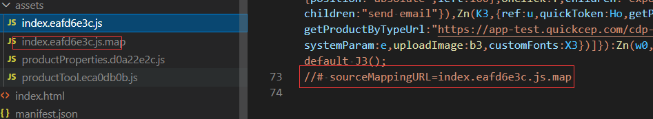

开发时使用sourcemap来调试，生产时不会，但需要报错时定位到源码位置，一般通过[错误管理平台进行收集](http://wangxiang.website/docs/work/sentry.html)

sourcemap只是位置的映射，可以用在任何代码上，比如TS、JS、CSS等，而且TS类型也支持sourcemap，只需要配置tsconfig.json
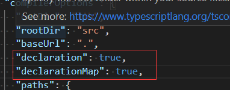
指定declaration 会生成 d.ts 的声明文件，还可以指定 declarationMap 来生成 sourcemap，这样在VScode中可以直接点击某个类型来跳转到源码对应的地方
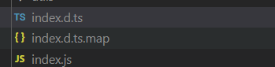

### sourcemap的生成

略过

## webpack的sourcemap配置

配置规律：其实是集中基础配置的组合，将eval、nosources、cheap、module等按照规律组合起来，就是一个配置

正则`^(inline-|hidden-|eval-)?(nosources-)?(cheap-(module-)?)?source-map$`

### eval

在js中，eval主要用来动态执行js代码，如下

```js
eval(`
  function add(a, b) {
    return a + b;
  }
  add(1,2)
  //# sourceURL=wangxiang.js
  //# sourceMappingURL=wangxiang.js.map
`)
```

通过在尾部添加`//# sourceURL=xxx.js`，可以将代码添加到sources中，并且可以通过`/# sourceMappingURL=xxx`指定 sourcemap 来映射到源码

webpack就是利用eval这个特性来优化sourcemap生成的性能，主要是快，不用生成mapping

### source-map

此配置用来生成独立的sourcemap文件，可以关联也可以不关联，比如加上hidden就是不关联，如生产环境不需要关联sourcemap，但上传错误管理平台需要生成sourcemap文件，用hidden就可以

```json
...
devtool: 'hidden-source-map'
...
```

### cheap

sourcemap慢主要是生成mapping比较慢，因为会映射到行和列，但一般只需要映射到行就行，这时候就可以用cheap

### module

webpack会对一个模块进行多次处理，比如经过loader A做一次转换，经过loader B再做一次转换，之后打包在一起，每次转换都生成sourcemap，就是会生成多个sourcemap

### nosources

sourcemap里有sourceContent部分，直接把源码贴在这里，这样的好处是根据文件路径找不到文件也可以映射，但这样会增加sourcemap的体积，如果确定根据文件路径能找到源文件的话，就不用生成sourceContent，文件也会小很多

## 调试React代码

需要sourcemap，但通过npm下载的react、react-dom都不带sourcemap，所以需要下载React源码自己build生成sourcemap

1. 下载react源码

    ```bash
    git clone https://github.com/facebook/react
    ```

2. 改造build过程，添加sourcemap配置

   在scripts/rollup/build.js中添加sourcemap配置

   ```js
   ...
    return {
      file: outputPath,
      format,
      globals,
      freeze: !isProduction,
      interop: false,
      name: globalName,
      sourcemap: false,
      esModule: false,
      sourcemap: true
    };
   ...   
   ```

3. 执行npm run build

   此时执行还是会报错：某个转换的插件没有生成sourcemap
   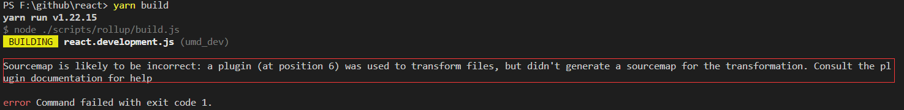

   因为构建过程会进行多次转换，会生成多次sourcemap，然后把sourcemap串联起来就是最终的sourcemap，如果中间有一步转换没有生成sourcemap，断掉了就没法把sourcemap串联起来。

   解决方法：将没有生成sourcemap的几个插件注释掉

4. 注释插件
  
   build中找到getPlugins方法，将5个插件注释

5. 再次执行npm run build ，即可打包出带有sourcemap的react包
