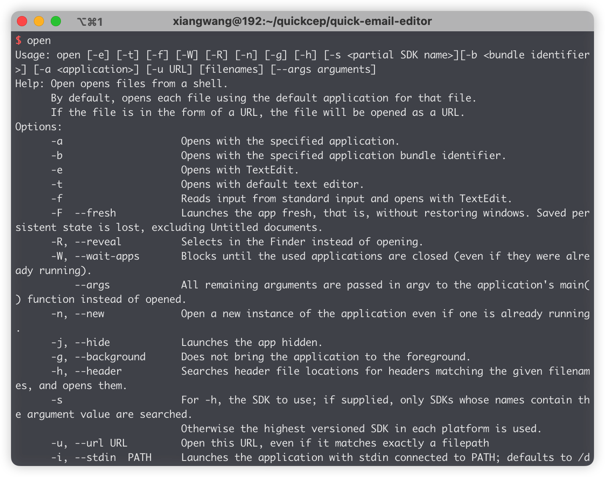
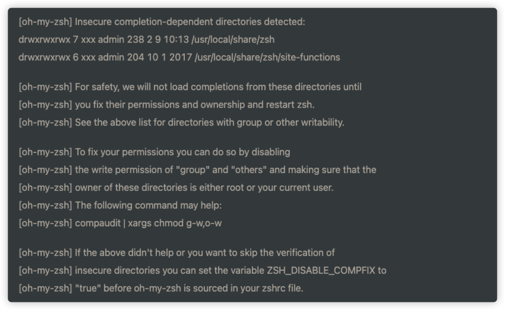
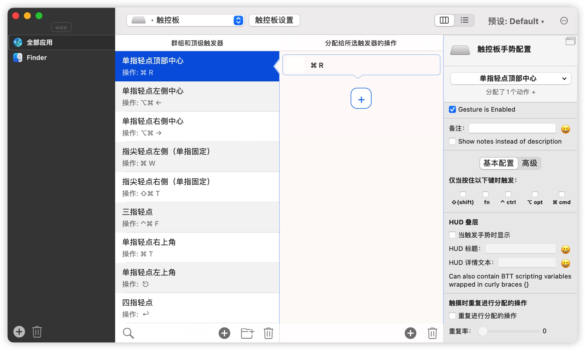

月初，由于陪伴我五年的神舟翻船了，很多朋友都让我换 mac，但我一直用着 windows，怕换了 mac 之后不习惯，考虑了很久还是换了。两个字总结：真香。

以下是我换 mac 之后的使用记录，做了笔记希望可以帮助其他人。

## 到手检测

1. 边角有无磨损、磕碰
2. 序列号 关于本机 外包装 序列号统一
3. 电池循环次数 关于本机 系统报告
4. 苹果官网 技术支持 apple 维修 查看保修[查看您的保障服务和支持期限 - Apple 支持](https://checkcoverage.apple.com/cn/zh/)
5. 屏幕 [在线屏幕检测 - 显示器检测 - 显示器坏点检测工具 (screenbmcx.com)](https://screen.bmcx.com/#welcome)

## 偏好设置

1. 系统偏好设置-菜单栏-电池 显示
2. 触控板设置 系统偏好-触控板-光标 跟踪速度最大 勾选上方选项
3. 三指拖移 系统偏好-辅助功能-指针控制-触摸板选项-三指拖移
4. 触发角 系统偏好-调度中心-触发角 桌面 调度中心 启动台 通知中心 鼠标滑倒左上角快速回到桌面
5. 鼠标设置 系统偏好-鼠标-速度最高
6. finder 访达 我的电脑
7. 启动台和程序坞 拖动常用软件到程序坞 启动隐藏
8. 日期显示 系统偏好-程序坞菜单栏-时钟
9. 隔空投送 仿达 隔空投送-所有人
10. 下载设置 系统偏好-安全性-点按锁按钮 任何来源

## 安装软件

- [homebrew](https://github.com/Homebrew)

  mac 软件包

- [clashX](https://github.com/yichengchen/clashX)

- vsCode、chrome

  在 mac 中，可以通过`open`命令打开文件、目录或程序，可以在终端中输入`open`

  

  - open，直接使用关联的程序打开文件，如`open xxx.html`会直接使用谷歌浏览器打开
  - open -e，强制使用文本编辑程序打开文件
  - open -a，自行选择程序打开文件，例：`open -a 'Visual Studio Code ' .`，在 vscode 打开目录

  安装 vscode 后，在终端中可以直接通过`code .`在 vscode 中打开文件，其实就是调用 mac 的`open -a`命令打开文件

  ```bash
  open -a 'Visual Studio Code'
  ```

- iShot pro 截图、录视频工具

- Beyond Compare

  最好用的对比工具

- Paste

  类似于 windows 的 window + v，可保存多条复制记录

- BetterTouchTool

- [keka](https://www.keka.io/en/)

- [柠檬清理](https://lemon.qq.com/)

- [utools](https://www.u.tools/)

- lightroom

- photoshop

- iTerm2 + onmyzsh

  使用 iTerm2 替代自带的终端工具

  - 查看 shell 路径

    ```bash
    echo $SHELL
    ```

  - 查看系统自动哪些 shell

    ```bash
    cat /etc/shells
    ```

  - 切换到 zsh

    ```bash
    chsh -s /bin/zsh
    # Mac如下
    # 在 /etc/shells 文件中加入如下一行
    /usr/local/bin/zsh
    # 接着运行
    chsh -s /usr/local/bin/zsh
    ```

    - 安装 iterms2 和 on-my-zsh

    <https://www.iterm2.com/downloads.html>

    - 安装 on-my-zsh

    ```bash
    # 下载 oh-my-zsh 源码
    git clone git://github.com/robbyrussell/oh-my-zsh.git ~/.oh-my-zsh
    # 并且把 .zshrc 配置文件拷贝到根目录下
    cp ~/.oh-my-zsh/templates/zshrc.zsh-template ~/.zshrc
    # 让 .zshrc 配置文件生效
    source ~/.zshrc
    ```

    - 查看 on-my-zsh 配置文件

      ```bash
      vim ~/.zshrc
      ```

      如果修改了配置文件，需要 source 使其生效

      ```bash
      source ~/.zshrc
      ```

    - 查看配色列表

      ```bash
      ls ~/.oh-my-zsh/themes
      ```

    - 快捷键

      ```bash
      # 新建标签
      cmd t
      # 删除标签
      cmd w
      # 切换标签
      cmd 数字/左右

      # 分屏
      cmd shift d

      # 查看历史命令
      cmd ;
      # 到行首/行尾
      Control a/e
      # 删除当前光标
      Control d
      # 删除光标之前/之后
      Control h/w
      # 删除当前行
      Control u
      # 删除当前单词
      Control w
      ```

    - 无权限问题

    

    解决方法

    - 修改文件权限

      ```bash
      chmod 755 /usr/local/share/zsh
      chmod 755 /usr/local/share/zsh/site-functions
      ```

    - 修改配置文件，根据提示加入 ZSH_DISABLE_COMPFIX="true"，修改后 source 生效

- QLMarkdown

  在 mac 上可以直接通过选中文件按下空格预览文件，但只能预览一般的文件，如：image、text 等

  QLMarkdown 是一个用于预览 Markdown 文件的 macOS Quick Look 扩展。 [github](https://github.com/sbarex/QLMarkdown)

  - 安装

    ```bash
    # 通过homebrew安装
    brew install qlmarkdown --cask
    ```

  - 等待安装完成后，选中 MarkDown 文件空格即可预览

## 系统快捷键

- 复制文件：按住option 拖动文件即可复制
- 剪切：cmd + c 复制成功后 再使用cmd+option+v进行剪切
- 预览：选中文件 按空格键 或 全选后按组合option+空格
- 聚焦搜索：cmd + 空格   搜索文件后 按住cmd键可以直达文件路劲
- 切换中英文：大写锁定键
- 打开表情：ctrl+cmd+空格
- 切换声调：tab 输入拼音后切换声调
- 菜单栏改变位置：按住cmd
- 退出应用：cmd+q
- 重命名：选中后回车
- 回退/前进：cmd+z/shift+cmd+z
- 移动光标（单词）：shift+options+</>
- 移动光标（当前行前面/后面）：shift+cmd+</>
- 类似于三指左右切换窗口：ctrl+</>
- 最大化最小化窗口：cmd+ctrl+f
- 左右切换：option+cmd+</>
- 切换对应标签页：cmd+1/2/3
- 窗口最小化：cmd+m
- 切换应用：cmd+tab
- 强制关闭应用  ：option+cmd+esc
- 查看ip等：option+wifit图标
- 拖动dock栏位置 ：按住option

## Google浏览器

- 调试

  跳过 cmd + \

  下一步 cmd + '

  进入 cmd + ;

- 打开下载管理 shift + cmd + j

## VSCode

- 打开用户设置：cmd + ,
- 打开新的vscode：cmd + shift + n
- 切换项目：cmd + r
- 跳到某一行：ctrl + g
- 搜索文件并打开：ctrl + p
- 选中匹配项（一个一个选）：cmd + d
- 选中所有匹配项（全选）：cmd + shift + l
- 格式化代码：option + shift + f
- 搜索：cmd + f
- 全局搜索：shift + cmd + f
- 替换：cmd + h
- 全局替换：shift + cmd + h
- 在当前行新增：shift + cmd + enter
- 复制上下行：shift + option + 上/下
- 回退/前进：cmd + z / shift + cmd + z
- 代码折叠/打开：option + cmd + [/]

## 触摸板设置

- 光标变大：来回移动手指
- 双指点击：右键/ctrl+单击
- 双指从触摸板边缘向左滑动：通知中心
- 双指旋转：改变图片方向
- 三指左右切换全屏窗口
- 三指向上 应用中心
- 四指向内 启动台
- 四指向外 桌面

## 更多手势

安装 BetterTouchTool



添加触发器：

- 单指轻点顶部中心：cmd + r 刷新浏览器
- 单指轻点左侧/右侧中心：options + cmd + </> 在页签之间切换
- 单指轻点右上角：cmd + t 打开新页签
- 指尖轻点左侧：cmd + w 关闭页签
- 指尖轻点右侧：shift + cmd + t 打开刚刚关闭的页签
- 三指轻点：ctrl + cmd + f 全屏/取消全屏
- 四指轻点：enter 确定

## 其他

- 修改 hosts 文件

终端中输入

```bash
sudo vim /etc/hosts
```
