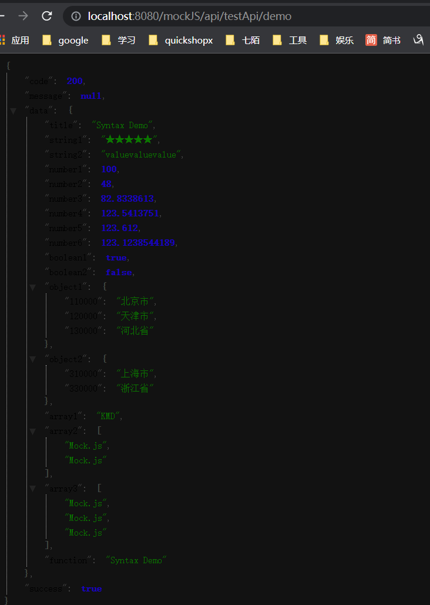
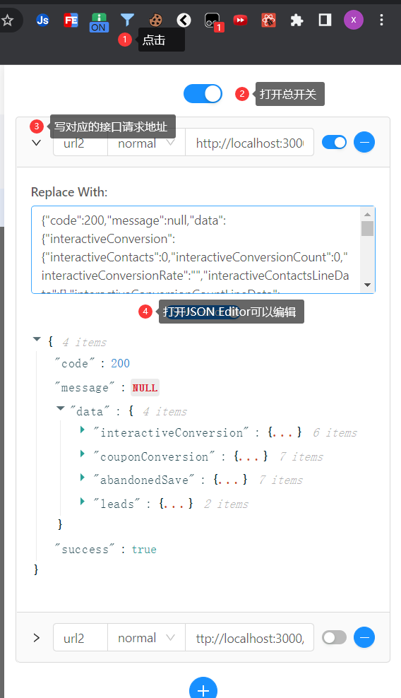

  
mock是前后端联调不可缺少的一部分，倘若前期开发时定好接口规范（当然避免不了后端改动），那么前端就可以通过mock数据的方式代替后端同事。接下来我会讲一下我经常使用的一些工具。

## MockJS

### 介绍

[官方网站](http://mockjs.com/0.1/#mock) <br>
Mock.js 是一款模拟数据生成器，旨在帮助前端攻城师独立于后端进行开发，帮助编写单元测试。

### 使用

- 安装

  ```bash
  npm install mockjs
  ```
  
- 使用

  ```js
  // 使用
  var Mock = require('mockjs');
  var data = Mock.mock({
      'list|1-10': [{
          'id|+1': 1
      }]
  });
  console.log(JSON.stringify(data, null, 4))
  ```

### 如何在项目中使用

1. 创建mockData，yarn init初始化
2. 添加app.js，并添加express启动服务

   ```js
    const express = require("express");
    const bodyParse = require("body-parser");

    const app = express();

    /*为app添加中间件处理跨域请求*/
    app.use(function(req, res, next) {
      res.header("Access-Control-Allow-Origin", "*");
      res.header('Access-Control-Allow-Methods', 'PUT, GET, POST, DELETE, OPTIONS');
      res.header("Access-Control-Allow-Headers", "X-Requested-With");
      res.header('Access-Control-Allow-Headers', 'Content-Type');
      next();
    });
    app.use(bodyParse.json());
    app.use(
      bodyParse.urlencoded({
        extended: false, // 扩展模式
        limit: 2 * 1024 * 1024, // 限制2m
      })
    );


    const testRouter = require('./router/test')
    app.use('/mockJS/api/testApi', testRouter)

    app.listen(8080, () => {
      console.info("服务启动http://localhost:8080");
    });

   ```

3. 创建test文件

   ```js
    const express = require("express");
    const router = express.Router();
    const mock = require("mockjs");

    router.get("/demo", (req, res) => {
      res.send({
        ...mock.mock({
          code: 200,
          message: null,
          data: {
            title: "Syntax Demo",

            "string1|1-10": "★",
            "string2|3": "value",

            "number1|+1": 100,
            "number2|1-100": 100,
            "number3|1-100.1-10": 1,
            "number4|123.1-10": 1,
            "number5|123.3": 1,
            "number6|123.10": 1.123,

            "boolean1|1": true,
            "boolean2|1-2": true,

            "object1|2-4": {
              110000: "北京市",
              120000: "天津市",
              130000: "河北省",
              140000: "山西省",
            },
            "object2|2": {
              310000: "上海市",
              320000: "江苏省",
              330000: "浙江省",
              340000: "安徽省",
            },

            "array1|1": ["AMD", "CMD", "KMD", "UMD"],
            "array2|1-10": ["Mock.js"],
            "array3|3": ["Mock.js"],

            function: function () {
              return this.title;
            },
          },
          success: true,
        }),
      });
    });

    module.exports = router;
   ```

4. 浏览器访问<http://localhost:8080/mockJS/api/testApi/demo>
   
5. 配置webpack或vite的proxy，添加mock配置

   ```js
   ...
   '/mockJS': {
      target: 'http://localhost:8080',
      ws: true,
      changeOrigin: true,
    },

   ```

## Ajax Interceptor

我认为Interceptor应该是每个前端都该安装的一个插件，主要有以下几个原因：

1. 开发阶段，后端只定义了接口并没有部署服务时，可以用来mock接口进行测试
2. 测试边界问题，比如返回data为null或返回data数据量较大的一个展示
3. 用来调试问题，修改接口不同的返回格式查看不同的页面表现

### 安装

1. 安装
   [chrome扩展]((ttps://chrome.google.com/webstore/detail/ajax-interceptor/nhpjggchkhnlbgdfcbgpdpkifemomkpg?hl=zh-CN)
2. 使用
   


## whistle

抓包、修改http请求、响应、代理服务器等等功能

可以看[这篇文章](https://wang1xiang.github.io/blog/docs/tool/whistle.html)