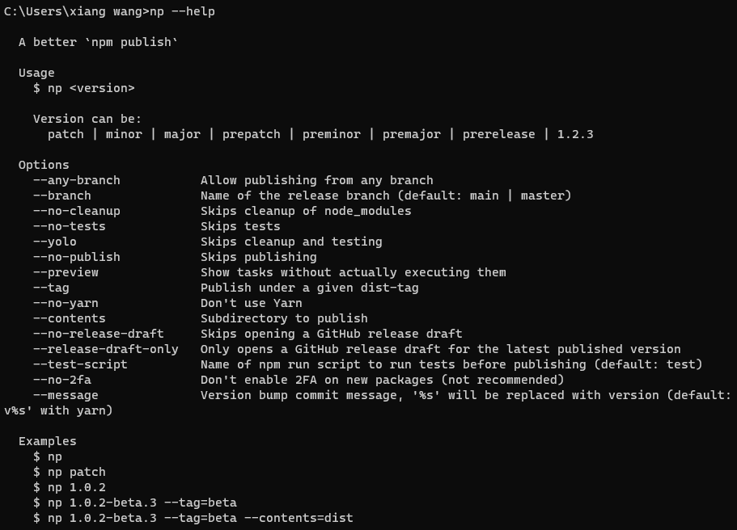
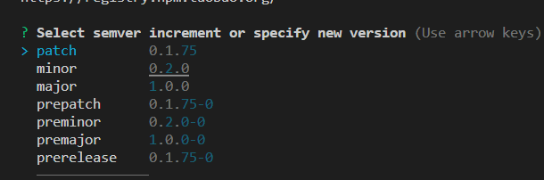
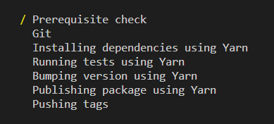

## 介绍

[np](https://www.npmjs.com/package/np)：更好的npm发布工具

## 安装

```bash
# 全局安装
npm install np -g
# 查看帮助
np --help
```



## 使用步骤

1. 首先项目必须是git仓库，已经push代码到远程，并且不能有未提交的文件，否则会报错
2. 项目根目录运行命令

   ```bash
   np
   ```

   此时会出现选择版本号的界面，根据改变选择合适的版本
   

3. 接下来会进行以下步骤

   

   1. prerequisite check：先决条件检查，会依次检查node环境是否正常、检查npm源仓库登陆情况、检查git远程仓库是否存在等
   2. Git：检查当前分支是否master或main（如果不是需要添加--any-branch)、检查本地仓库是否干净

      ```bash
      # 使用任意分支
      np --any-branch
      ```

   3. Installing dependencies using Yarn：使用yarn安装依赖，保证依赖最新版本（如果想使用npm则添加--no-yarn）

      ```bash
      # 不删除node_modules即不安装依赖，如果这样写后Installing dependencies using Yarn这一步会消失
      np --any-branch --no-cleanup --no-yarn
      ```

   4. Running tests using Yarn：运行`yarn tests`，如果这一步报错，需要修改scripts中的tests脚本，移除`exit 1`

      ```bash
      # --no-test不执行tests命令
      np --any-branch --no-cleanup --no-yarn --no-tests
      # 简写
      np --any-branch --yolo
      ```

   5. Bumping version using Yarn
   6. Publishing package using Yarn：发布包
   7. Pushing tags：发布tag

4. 发布成功后，git仓库会生成一个提交记录、并同时生成一个版本tag

## 配置文件

每次发布的时候都需要`np --any-branch --yolo`这样执行，所以np提供了配置文件的方式解决

- 在package.json中配置
  
  ```json
    ...
    "np": {
      "yarn": false,
      "anyBranch": true,
      "cleanup": false,
      "yolo": true
    }
    ...
  ```

- 添加单独的配置文件`.np-config.json`

  ```json
  {
      "yarn": false,
      "anyBranch": true,
      "cleanup": false,
      "yolo": true
  }
  ```
