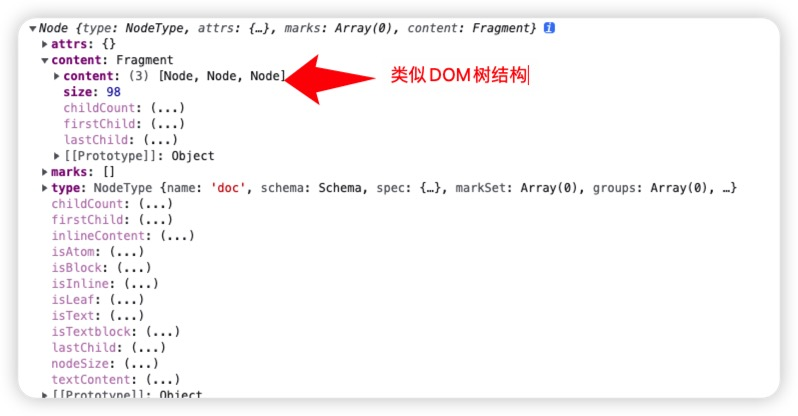
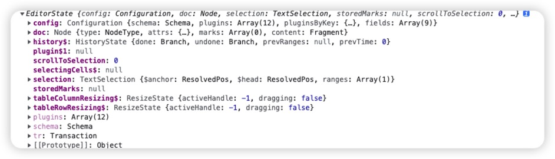
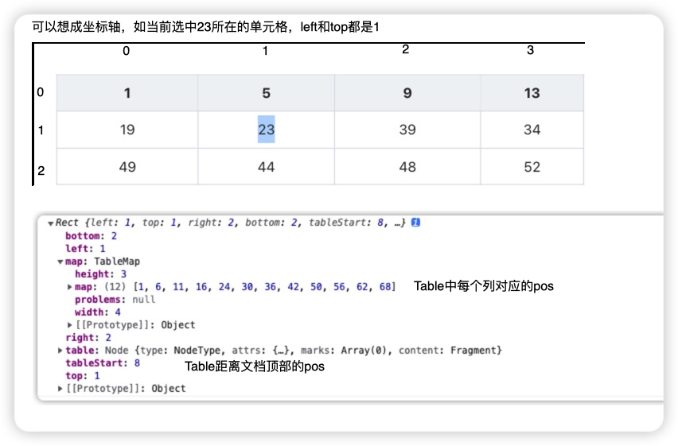

## 为什么写这篇文章

公司使用[tiptap](https://tiptap.dev/)富文本编辑器，在`tiptap`的官网有这么一段话`Tiptap is a headless wrapper around [ProseMirror](https://prosemirror.net/)`，这里的`headless wrapper`意思是“无头编辑器”，指的是不提供任何`UI`样式，完全自由的定制任何想要的`UI`，特别适合二次开发。

而`tiptap`是对[prosemirror](https://prosemirror.net/)的封装，在`prosemirror`的基础上提供了更友好的`API`、模块封装以及将`MVVM`的接入封装在框架内部，适用于各种[流行框架](https://tiptap.dev/installation)，使开发者更容易上手。

`tiptap`提供大量官方[扩展](https://tiptap.dev/extensions)，像本文介绍的[prosemirror-tabls](https://github.com/ProseMirror/prosemirror-tables)，但官方的毕竟是官方，一些样式或基本功能的改动，就必须要通过修改源码的方式实现。

## 名次解释

> PS：理解完概念再往下看，不然容易一脸懵

### [document](https://prosemirror.net/docs/guide/#doc)

用于表示`ProseMirror`的整个文档，使用`editor.view.state.doc`引用，`ProseMirror`定义自己的数据结构来存储`document`内容，通过输出可以看到`document`是一个`Node`类型，包含`content`元素，是一个[fragment](https://prosemirror.xheldon.com/docs/ref/#model.Fragment)对象，而每个`fragment`又包含 0 个或多个字节点，组成了`document`解构，类似于`DOM`树

.

### [Schema](https://prosemirror.net/docs/guide/#schema)

用于定义文档的结构和内容。它定义了一组节点类型和它们的属性，例如段落、标题、链接、图片等等。`Schema` 是编辑器的模型层，可以通过其 `API` 创建、操作和验证文档中的节点。每个`document`都有一个与之相关的`schema`，用于描述存在于此`document`中的`nodes`类型

### [Node](https://prosemirror.net/docs/ref/#model.Node)

文档中的节点，节点是 `Schema` 中定义的类型之一，整个文档就是一个`Node`实例，它的每个子节点，例如一个段落、一个列表项、一张图片也是`Node`的实例。`Node`的修改遵循`Immutable`原则，更新时创建一个新的节点，而不是改变旧的节点，统一使用[dispatch](https://prosemirror.net/docs/ref/#view.EditorView.dispatch)去触发更新。

```js
const node = $cell.node(-1)
// 当前节点类型
node.type
// 节点的attributes
node.attrs
// 从指定node中获取符合条件的子节点
findChildren(tr.doc, (node) => node.type.name === 'table')
```

### [Mark](https://prosemirror.net/docs/ref/#model.Mark)

用于给节点添加样式、属性或其他信息的一种方式。`Prosemirror` 将行内文本视作扁平结构而非 DOM 类似的树状结构，这样是为了方便计数和操作。例如，一个文本节点可以添加加粗、斜体、下划线等样式，也可以添加标签、链接等属性。`Mark` 本身没有节点结构，只是对一个节点的文本内容进行修饰。`Marks`通过`Schema`创建，用于控制哪些`marks`存在于哪些节点以及用于哪些`attributes`。

### [State](https://prosemirror.net/docs/guide/#state)

`Prosemirror` 的数据结构对象，相当于是 `react` 的 `state`，有 `view` 的 `state` 和 `plugin` 的局部 `state` 之分。 如上面的 `schema` 就定义在其上： `state.schema`。`ProseMirror` 使用一个单独的大对象来保持对编辑器所有 `state` 的引用（基本上来说，需要创建一个与当前编辑器相同的编辑器）



### [Transaction](https://prosemirror.net/docs/guide/)

继承自[Transform](https://prosemirror.net/docs/guide/#transform)，不仅能追踪对文档进行修改的一组操作，还能追踪`state`的其他变化，例如选区更新等。每次更新都会产生一个新的`state.transactions`（通过`state.tr`来创建一个`transaction`实例），描述当前`state`被应用的变化，这些变化用来应用当前`state`来创建一个更新之后的`state`，然后这个新的`state`被用来更新`view`。

> 此处的`state`指的是`EditorState`，描述编辑器的状态，包含了文档的内容、选区、当前的节点和标记集合等信息。每次编辑器发生改变时，都会生成一个新的 `EditorState`。

### [View](https://prosemirror.net/docs/guide/#view)

`ProseMirror`编辑器的视图层，负责渲染文档内容和处理用户的输入事件。`View` 接受来自 `EditorState` 的更新并将其渲染到屏幕上。同时，它也负责处理来自用户的输入事件，如键盘输入、鼠标点击等。其中`state`就是其上的一个属性：`view.state`

新建编辑器第一步就是`new`一个`EditorVIew`

### [Plugin](https://prosemirror.net/docs/ref/#state.Plugin_System)

`ProseMirror` 中的插件，用于扩展编辑器的功能，例如点击/粘贴/撤销等。每个插件都是一个包含了一组方法的对象，这些方法可以监听编辑器的事件、修改事务、渲染视图等等。每个插件都包含一个`key`属性，如`prosemirror-tables`设置`key`为`tableColumnResizing`，通过这个`key`就可以访问插件的配置和状态，而无需访问插件实例对象。

```js
const pluginState = columnResizingPluginKey.getState(state)
```

### [Commands](https://prosemirror.net/docs/guide/#commands)

表示`Command`函数集合，每个`command`函数定义一些触发事件来执行各种操作。

### [Decorations](https://www.xheldon.com/tech/prosemirror-guide-chinese.html?mode=light#decorations)

表示节点的外观和行为的对象。它可以用于添加样式、标记、工具提示等效果，以及处理点击、悬停、拖拽等事件。`Decoration` 通常是在渲染视图时应用到节点上的，但也可以在其他情况下使用，如在协同编辑时标记其他用户的光标位置。

用于绘制`document view`，通过`decorations`属性的返回值来创建，包含三种类型

- Node decorations：增加样式或其他 `DOM` 属性到单个`node` 的 `DOM` 上，如选中表格时增加的类名
- Widget decorations：在给定位置插入 `DOM node`，并不是实际文档的一部分，如表格拖拽时增加的基线
- Inline decoration：在给定的 `range` 中的行内杨素插入样式或属性，类似于 `Node decorations`，仅针对行内元素

`prosemirror` 为了快速绘制这些类型，通过 `decorationSet.create` 静态方法来创建

```js
import { Plugin, PluginKey } from 'prosemirror-state'
let purplePlugin = new Plugin({
  props: {
    decorations(state) {
      return DecorationSet.create(state.doc, [
        Decoration.inline(0, state.doc.content.size, {
          style: 'color: purple',
        }),
      ])
    },
  },
})
```

### [ResolvedPos](https://prosemirror.net/docs/ref/#model.Resolved_Positions)

`Prosemirror`中通过`Node.resolve`解析位置信息返回的对象，包含了一些位置相关的信息。它会告诉我们当前`position`的父级`node`是什么，它在父级`node`中的偏移量（`parentOffset`）是多少以及其他信息。

```js
const $cell = doc.resolve(cell)
// 从根节点开始，父级点的深度，如果直接指向根节点则为0，如果指定一个顶级节点，则为1
$cell.deth
// 该位置相对于父节点的偏移量
$cell.parentOffset
// 相当于$cell.parent() 获取父级节点，$cell.node(-2)获取父级的父级，以此类推
$cell.node(-1)
// 获取父节点的开始位置，相对于doc根节点的位置，一般用来定位
$cell.start(-1)
```

### [Selection](https://prosemirror.net/docs/ref/#state.Selection)

表示当前选中内容，`prosemirror`中默认定义两种类型的选区对象：

- TextSelection：文本选区，同时也可以表示正常的光标（即未选择任何文本时，此时`anchor = head`），包含`$anchor`选区固定的一侧，通常是左侧，`$head`选区移动的一侧，通常是右侧
- NodeSelection：节点选区，表示一个节点被选择

也可以通过继承`Selection`父类来实现自定义的选区类型，如`CellSelection`

```js
// 获取当前选区
const sel = state.selection
// 使用TextSelection创建文本选区
const selection = new TextSelection($textAnchor, $textHead)
// 使用NodeSelection创建节点选区
const selection = new NodeSelection($pos)
// 使用AllSelection创建覆盖整个文档的选区 可以作为cmd + a的操作
const selection = new AllSelection(doc)
// 用new之后的选区，更新当前 transaction 的选区
state.tr.setSelection(selection)
// 从指定选区获取符合条件的父节点
findParentNode(
  (node) =>
    node.type.spec.tableRole && node.type.spec.tableRole.includes('cell')
)(selection)
```

### [Slice](https://prosemirror.net/docs/guide/#intro)

- `slice of document`称为`文档片段`，主要处理复制粘贴和拖拽之类的操作
- 两个`position`之间的内容就是一个`文档片段`

## 源码目录

```bash
├── README.md
├── cellselection.ts
├── columnresizing.ts
├── commands.ts
├── copypaste.ts
├── fixtables.ts
├── index.html
├── index.ts
├── input.ts
├── schema.ts
├── tablemap.ts
├── tableview.ts
└── util.ts
```

### cellselection.ts

定义`CellSelection`选区对象，继承自`Selection`

- drawCellSelection：用于当跨单元格选择时，绘制选区，会添加到`tableEditing`的`decorations`为每个选中节点增加`class`类`selectedCell` ，`tableEditing`最后会注册为`Editor`的插件使用

### columnresizing.ts

定义`columnResizing`插件，用于实现列拖拽功能，大致思路如下：

- 插件初始化时，通过以下代为插件添加`nodeViews`，通过实例化`TableView`为表格节点自定义一套渲染逻辑，在初始化的时候为`DOM`节点添加了`colgroup`，然后调用`updateColumnWidth`生成每列对应的[col](https://developer.mozilla.org/zh-CN/docs/Web/HTML/Element/col)，有了`col`之后，我们在调整列宽的时候就可以通过改变`col`的`width`属性实时的去改变列宽了。

  ```ts
  plugin.spec!.props!.nodeViews![tableNodeTypes(state.schema).table.name] = (
    node,
    view
  ) => new View(node, cellMinWidth, view)
  ```

- 通过设置插件的`props`传入`attribute`（控制何时添加类`resize-cursor`）、`handleDOMEvents`（定义`mousemove`、`mouseleave`和`mousedown`事件）和`decorations`（调用`handleDecorations`方法，在鼠标移动到列上时，通过`Decoration.widget`来绘制所需要的`DOM`）

  - doc.resolve(cell)： `resolve`解析文档中给定的位置，返回此位置的上下文信息
  - $cell.node(-1)： 获取给定级别的祖先节点
  - $cell.start(-1)： 获取给定级别节点到起点的（绝对）位置
  - TableMap.get(table)： 获取当前表格数据，包含 `width` 列数、`height` 行数、`map` 行 `pos` 列 `pos` 形成的数组
  - 循环 `map.height`，为当前列的每一个`td`上创建一个`div`

- `handleMouseMove`当鼠标移动时，修改`pluginState`从而使得`decorations`重新绘制`DOM`
- `handleMouseDown`当鼠标按下时，获取当前位置信息和列宽，并记录在`pluginState`

  此方法中重新定义`mouseup`和`mousemove`事件

  - move：移动的同时从`draggedWidth`获取移动宽度，调用`updateColumnsOnResize`实时更新`colgroup`中的`col`的`width`属性，从而改变每列宽度
  - finish：当移动完成后调用`updateColumnWidth`方法重置当前列的`attrs`属性，并将`pluginState`置为初始状态

    ```js
    // 用来改变给定 position node 的类型或者属性
    tr.setNodeMarkup(start + pos, null, { ...attrs, colwidth: colwidth })
    ```

- `handleMouseLeave`当鼠标离开时，恢复`pluginState`为初始状态，完成列拖拽

### commands.ts

定义操作表格的一系列方法

- selectedRect：获取表格中的选区，并返回选区信息、表格起始偏移量、表格信息（`TableMap.get(table)`的值）和当前表格，这个方法很有用，能拿到当前表格中的所有信息

  

- 剩下的方法都是需要用到的功能函数，像`addColumn`、`addRow`等

### copypaste.ts

用于处理将单元格内容粘贴到表格中、或将任何内容粘贴到单元格选择中，如用选择内容替换单元格块。

当在单元格中`cmd + v`触发粘贴时，步骤为：

1. 调用`input.ts`中的`handlePaste`方法，根据传入的`文档片段`去做相应处理
2. 调用`pastedCells`，从`文档片段`中获取单元格的矩形区域，如果`文档片段`的外部节点不是表格单元格或行，则返回`null`，如果是的话会根据当前`slice`传入`ensureRectangular`去生成新的一组单元格

   ```js
   // 判断是否为单元格或行，主要通过schema中定义的tableRole来判断
   // 行
   first.type.spec.tableRole === 'row'
   // 单元格
   first.type.spec.tableRole === 'cell'
   first.type.spec.tableRole === 'header_cell'
   ```

3. 判断当前选区是否为`CellSelection`，即是否选中一个或多个单元格的情况，会调用`clipCells`方法根据生成的`cells`生成表格新的一组单元格，通过`insertCells`插入原表格指定位置

   - insertCells：将给定的一组单元格（由 `pastedCells` 返回）插入表格中 `rect` 指向的位置
   - growTable、`isolateHorizontal`和`isolateVertical`主要是为了确保被插入的表格足够大，足够容得下插入的单元格

4. 如果当前选区不是`CellSelection`，但是`pastedCells`生成了新的`cells`，即复制的是表格单元格，则同样使用`insertCells`插入
5. 不满足上面两个条件时，返回`false`，即不用处理，按浏览器默认行为处理

### fixtables.ts

定义了`tiptap`中的`fixTables`命令，用于检查文档中的所有表格并在必要时修复。通过代码可以看到`fixTables`就是遍历`state.doc`的所有子节点，如果是`table`的话就调用`fixTable`。而`fixTable`修复表格主要是根据表格是否存在`TableMap.get(table).problems`来做处理，`problems`包含四种类型

- collision：直译为“碰撞”，我理解就是单元格相互挤压，处理方式是通过`removeColSpan`处理掉对应的单元格
- missing：直译为”丢失“，处理方式是为丢失的单元格添加必要的单元格
- overlong_rowspan：直译为“过长的 rowspan”，处理方式是修改对应单元格的`rowspan`
- colwidth-mismatch：直译为“宽度不匹配”，处理方式是修改对应单元格的`colwidth`

因为目前我没遇到过这些错误，所以对这些名词的理解还不是很清晰。

### index.ts

定义插件`tableEditing`，用于处理单元格选择的绘制、以及创建和使用此类选择的基本用户交互。这个插件需要放在所有插件数组的末尾，因为它处理表格中的鼠标事件相当广泛。而其他插件，比如列宽拖动`columnResizing`插件，需要首先执行更具体的行为。
插件的`props`上定义了以下事件处理函数，这些事件处理函数如果返回`true`，说明它们处理了相应的事件，如果返回`false`则还是触发浏览器对应的事件

- handleDOMEvents：优先级最高，会先于其他处理任何发生在可编辑`DOM`元素上的事件之前调用，这里注册了`mousedown`函数，调用`input.js`中的`handleMouseDown`事件，处理鼠标按下事件
- handleTripleClick：三次单击编辑器时调用，这里会调用`handleTripleClick`函数，当三次单击的时候选中当前单元格
- handleKeyDown：当编辑器收到 `keydown` 事件时调用，这里会调用`handleKeyDown`函数，绑定一些操作表格的快捷键
- handlePaste：用于覆盖粘贴行为，`slice`是编辑器解析出来的粘贴内容，这里会调用`handlePaste`函数，[上面](上面)已经说过，就不再重复

### input.ts

定义了一些功能函数，用于链接用户输入与`table`相关功能

### schema.ts

- 定义`tables`的`node types`，分别为`table`、`table_header`、`table_cell`和`table_row`节点
- `tableNodeTypes(schema)`函数接受`schema`，返回上述定义的`node types`，可以用来判断传入的`schema`是否为`table`节点

### tablemap.ts

定义 TableMap 类，可以参考[prosemirror-tables](https://github.com/ProseMirror/prosemirror-tables#class-tablemap)关于`class TableMap`的说明，或[中文翻译](https://github.com/wang1xiang/prosemirror-tables/blob/readme-zh/README-zh.md#class-tablemap)。这里为了性能考虑，做了缓存处理。如果缓存中不存在对应表格的`tableMap`时，会通过`computeMap`重新获取`tableMap`，并放入缓存中。

### tableview.ts

[参考](https://prosemirror.net/docs/ref/#view.NodeView)

- 此处定义的`TableView`继承自[NodeView](https://prosemirror.net/docs/ref/#view.NodeView)，一般来说自定义`nodeView`都是为了更细粒度的控制节点在编辑器中的表现样式，如此处用于控制表格列拖拽时的样式和行为
- [上面]()已经提到了，会提供给插件`columnresizing`的`NodeViews`使用，所以要是不用实现列拖拽功能时，这个文件也就没什么用了

### util.ts

定义一些用于处理表格的各种辅助函数

cellAround：根据传入的位置返回当前单元格的位置信息

cellWrapping：根据传入的位置返回当前单元

isInTable：传入 state`判断当前选区是否在表格中

selectionCell：传入`state`返回当前选区的位置信息

pointsAtCell：根据传入的位置判断是否在单元格内，返回`true`或`false`

moveCellForward：获取当前单元格的前一个单元格位置信息

inSameTable：判断当前选区是否属于同一个表格

findCell：找到给定位置的单元格的尺寸

colCount：调用`TableMap`的`colCount`方法，返回当前单元格的列数

nextCell：根据传入的位置，在给定方向上查找下一个单元格

removeColSpan：为指定单元格删除`colspan`

addColSpan：为指定单元格添加`colspan`，根据传入的`n`来设定

columnIsHeader：判断当前单元格是否为`header`
