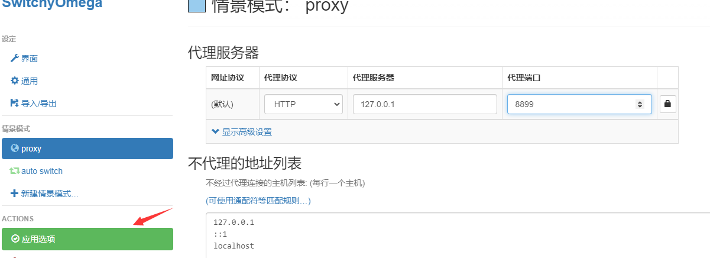
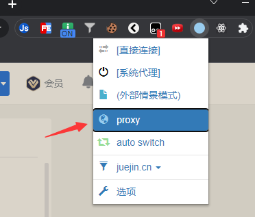
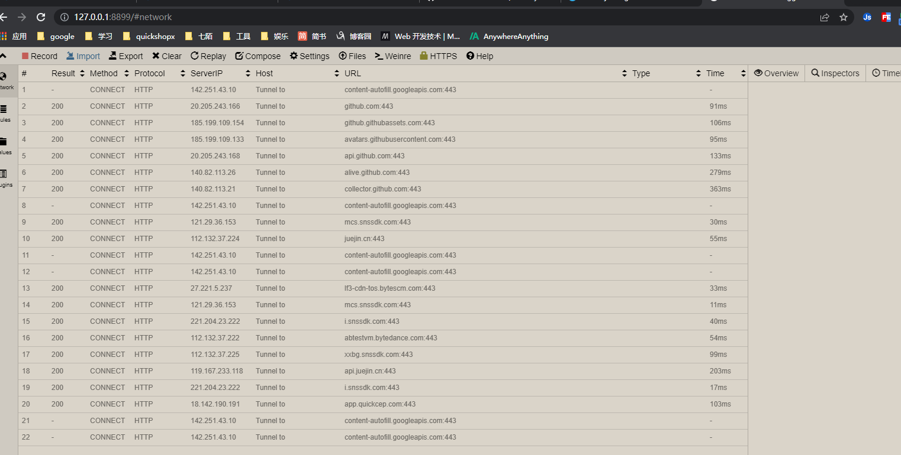
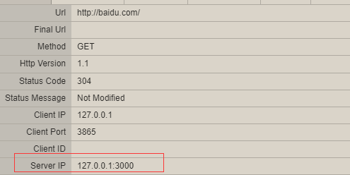
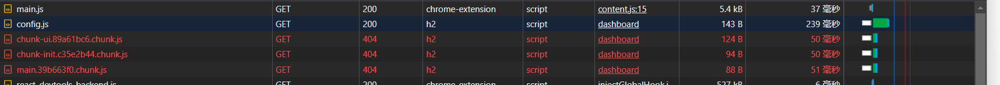
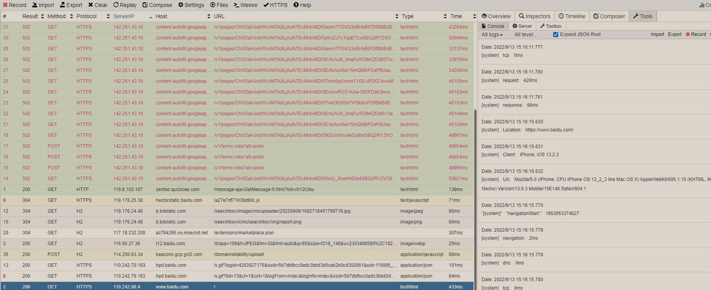
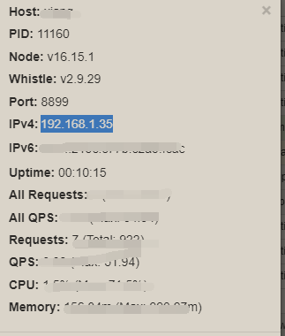

## whistle介绍

[官网](https://wproxy.org/whistle/)、[github](https://github.com/avwo/whistle)

基于Node实现的web调试代理工具，对前端很友好

## 安装启动

1. 如果没有node环境，先安装node
2. 安裝whistle

   ```bash
    # 全局安装whistle
    npm i -g whistle

    # 启动 默认端口8899，可以通过-p指定 --init会为计算机安装证书
    w2 start -p 8899 --init
    ```

    启动后，打开浏览器输入<http://127.0.0.1:8899/#network>访问

3. 浏览器设置代理

   google浏览器安装[SwitchyOmega](https://github.com/FelisCatus/SwitchyOmega/releases)插件，安装完成后需要配置proxy，将浏览器代理到8899端口（whistle的端口），如下图
   

   设置好后一定要点击`应用选项`，否则不会生效<br />
   点击whistle插件，选择刚刚设置的proxy<br />
   <br />
   打开<http://127.0.0.1:8899/#network>，看到以下页面，就说明成功了
   

3. [开启捕获HTTPS请求](https://wproxy.org/whistle/webui/https.html)，一定得开，不然https请求不会正常被捕获

## whistle页面介绍

由顶部工具栏、左侧菜单栏和中间内容区域组成

### Network

展示抓到的网络请求及详细信息

### Rules

设置代理规则

1. 配置host

   类似于修改全局host文件，为某个域名或具体的url指定ip，绕过dns解析过程，让请求直接到达指定的 ip <br />

   ```bash
   # 为github配置域名解析
   140.82.113.3  github.com
   ```

   本地启动一个vite服务，在rules中创建一个test文件 右键 -> create -> test，添加以下规则

   ```bash
   # 将百度代理本地vite项目上
   127.0.0.1:5173  baidu.com
   ```

   规则反着写也是一样的

   ```bash
   baidu.com  127.0.0.1:5173
   ```

   当访问baidu.com时就会跳到vite项目<br />

   可以在Network中查看这条请求的详情
   
   开发中就可以使用这种方式，将测试环境的域名代理到本地的 localhost，这样就能够在本地请求到测试环境的接口，类似于webpack和vite的proxy设置
  
2. 替换html文件

   将上述的test文件改为

   ```bash
   # 将线上环境的网页内容替换为本地
   https://app-test.quickcep.com file://${projectPath}/index.html
   ```

   此处的`projectPath`是在<http://127.0.0.1:8899/#values中配置的变量，再次打开baidu.com，就会看到变成了本地index.html>中的内容了

3. 替换静态资源

   ```bash
    # 将百度代理本地vite项目上
    127.0.0.1:3000 baidu.com

    # 将线上环境的网页内容替换为本地
    # https://app-test.quickcep.com file://${projectPath}/index.html

    # 将线上项目的js替换为本地资源进行调试
    https://app-test.quickcep.com/config.js file://${projectPath}/config.

   ```

   如果线上环境遇到bug时，可以将本地的静态资源通过代理取代线上环境的资源进行调试
   
4. 模拟接口报错

   ```bash
   # 通过修改statusCode 模拟接口报错
   https://app-test.quickcep.com/store/user/getUserInfo statusCode://500
   ```

5. 模拟接口超时

   ```bash
   https://app-test.quickcep.com/store/user/getUserInfo reqDelay://5000 enable://abort
   ```

6. 修改返回内容

   ```bash
   # 模拟接口返回
   https://app-test.quickcep.com/store/user/getUserInfo resBody://{getUserInfo.json}

   ```

7. 解决跨域

   ```bash
   www.baidu.com resCors://*
   ```

8. 插入js代码

   ```bash
   # 执行js代码  jsPrepend 允许我们对某个页面注入 JS 脚本
   https://app-test.quickcep.com jsPrepend://{reload.js}
   ```

以上的所有代码整理

```bash
# 将百度代理本地vite项目上
127.0.0.1:3000 baidu.com
# 将线上环境的网页内容替换为本地
# https://app-test.quickcep.com file://${projectPath}/index.html
# 将线上项目的js替换为本地资源
https://app-test.quickcep.com/config.js file://${projectPath}/config.js
# 解决跨域
www.baidu.com resCors://*
# 模拟接口报错
# https://app-test.quickcep.com/store/user/getUserInfo statusCode://500
# 模拟接口超时 reqDelay://5000 5s超时时间
https://app-test.quickcep.com/store/user/getUserInfo reqDelay://5000 enable://abort
# 模拟接口返回
https://app-test.quickcep.com/store/user/getUserInfo resBody://{getUserInfo.json}
# 执行js代码  jsPrepend 允许我们对某个页面注入 JS 脚本
https://app-test.quickcep.com jsPrepend://{reload.js}
```

#### 移动端调试

调试移动端的代码，可以查看[这篇文章](https://wang1xiang.github.io/blog/docs/mobile/mobileDebugging.html)

1. 注入vConsole
   whistle 可以通过jsPrepend 注入vConsole，下载[vConsole.min.js](https://cdn.jsdelivr.net/npm/vconsole@3.14.6/dist/vconsole.min.js)，copy到Values中取名为vConsole.js，并添加实例化vConsole的[代码](https://gitee.com/Tencent/vConsole?utm_source=alading&utm_campaign=repo)

   ```js
   // 此处省略vConsole.min.js的代码
   // VConsole 默认会挂载到 `window.VConsole` 上
   var vConsole = new window.VConsole();
   ```

   在Rules中添加vConsole分类，并添加以下代码

   ```bash
   # 为baidu添加vConsole
   https://www.baidu.com/ jsPrepend://{vConsole.js}
   ```

   重新打开百度，可以看到vConsole的标志

2. inspect插件
   whistle提供了更方便的插件:

   ```bash
   npm i -g whistle.inspect
   ```

   安装完成后，需要重启

   ```bash
   w2 restart
   ```

   配置rules

   ```bash
   # 为baidu添加vConsole
   https://www.baidu.com/ whistle.inspect://
   ```

3. 使用 log 功能打印日志
   除了使用vConsole，还可以开启日志打印

   ```bash
   https://www.baidu.com/  log://
   ```

   重新打开百度，在 Network 的 Tools 下面的 Console 选项下面看到控制台打印的所有 log 信息
   
4. 手机代理原理：
   1. 在 PC 启动一个服务，监听一个端口例如8899
   2. 手机连接统一局域网，配置网络代理，指向 PC 端的 IP 地址和 8899 端口
   3. 此时，手机上所有的网络通信都会被先转发到 PC 端的 8899 端口，就可以对数据包进行分析处理
5. 手机代理到 whistle

   - 手机电脑同一个wifi环境
   - 点击whistle的online，查看ip地址<br />
     
   - 手机进入wifi设置，代理设为手动，主机名为ip地址，端口填8899，保存（调试完记得改回去，避免手机上网异常）
   - 配置rules

     ```bash
      # 插件 m.baidu.com/为移动端
      https://m.baidu.com/ whistle.inspect://
      # 添加log日志
      # https://m.baidu.com/  log://
     ```

以上代码整理

```bash
# 为baidu添加vConsole
# https://www.baidu.com/ jsPrepend://{vConsole.js}
# 插件 m.baidu.com/为移动端
https://m.baidu.com/ whistle.inspect://
# 添加log日志
# https://www.baidu.com/  log://
```

### Values

设置变量，供其他模块使用

### Plugins

<https://wproxy.org/whistle/plugins.html>
