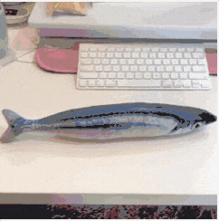
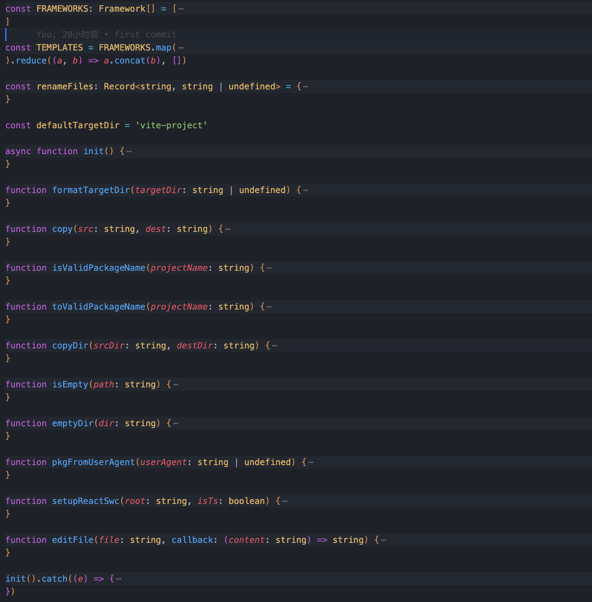
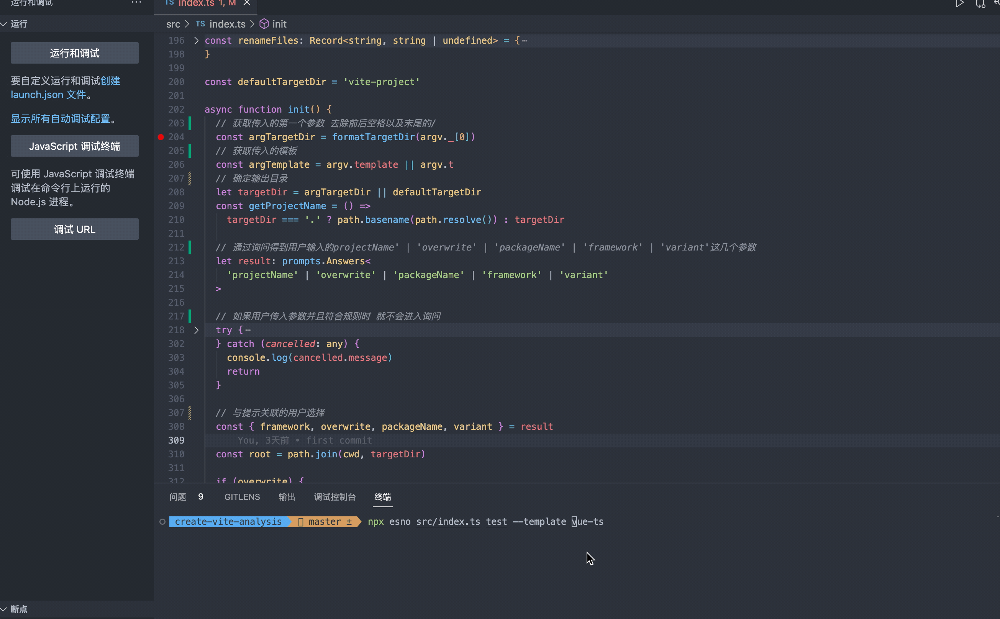
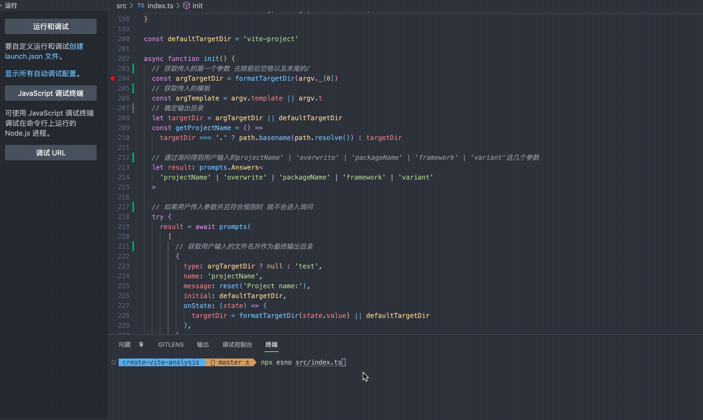
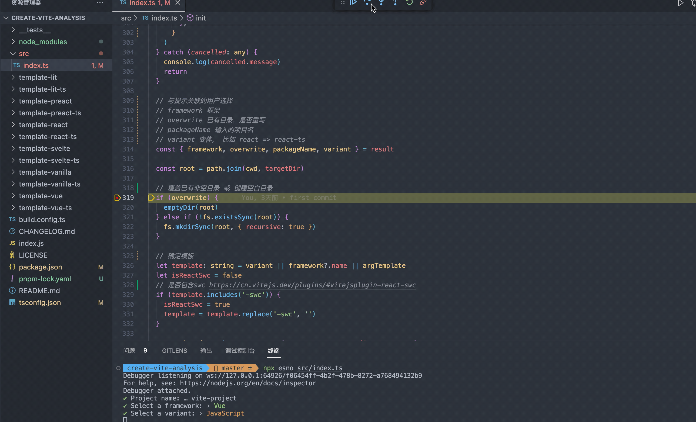
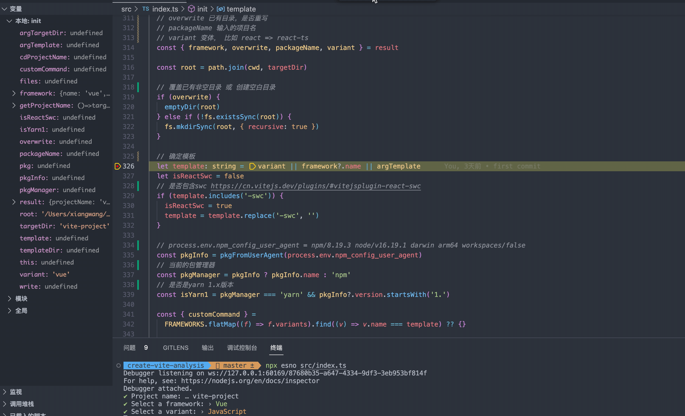
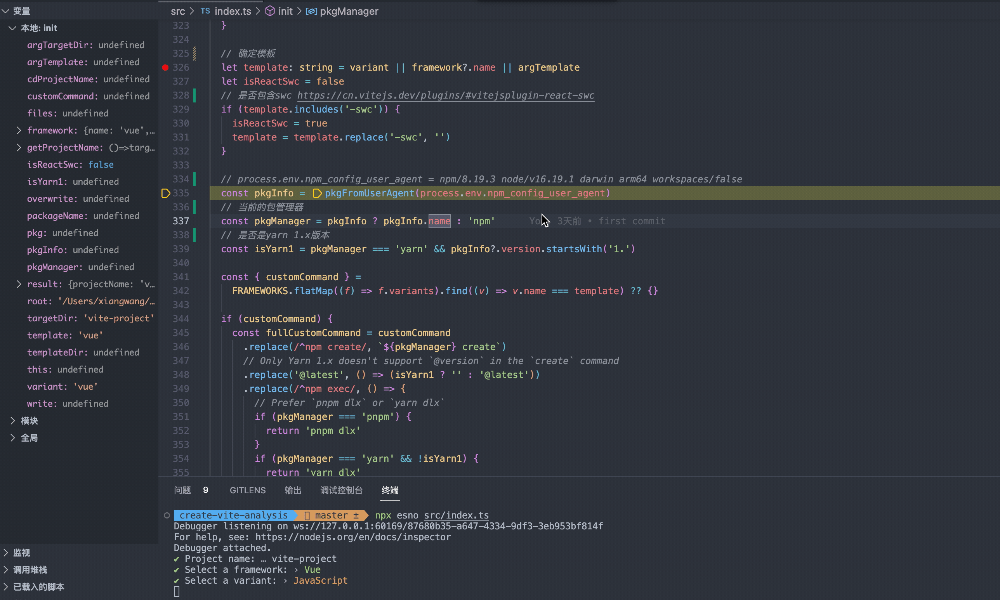
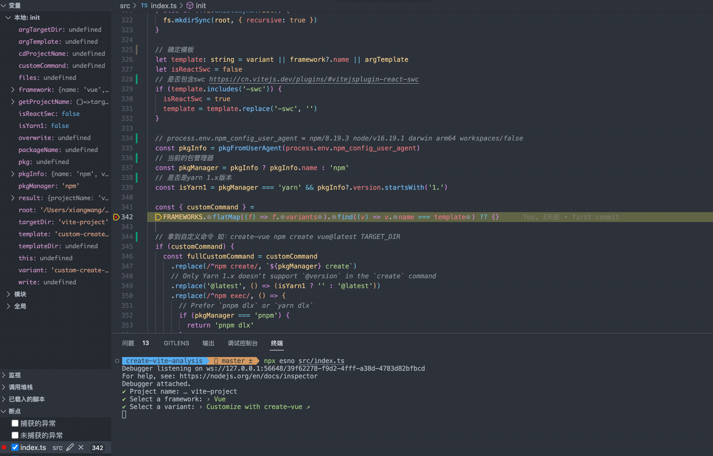
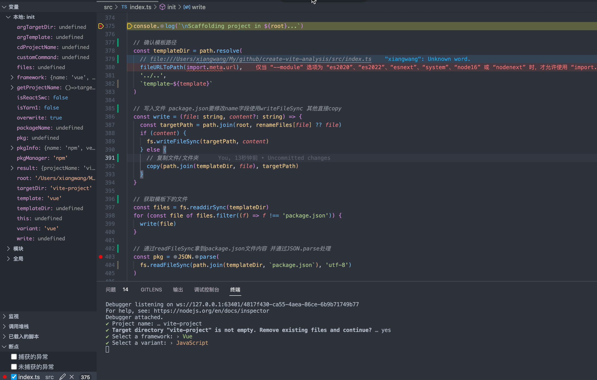
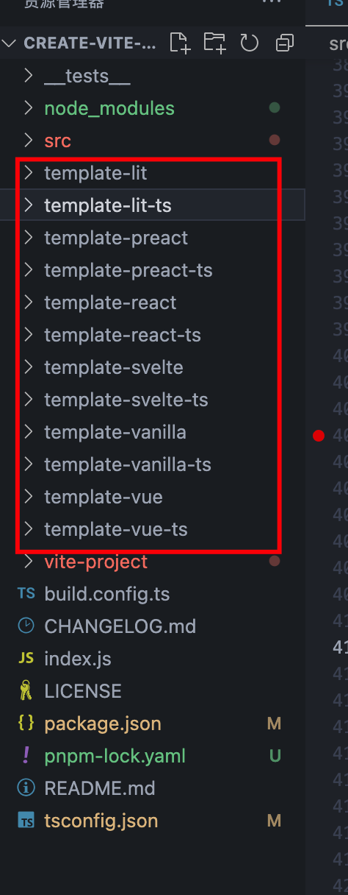

> 本文参加了由[公众号@若川视野](https://lxchuan12.gitee.io/)发起的每周源码共读活动，[点击了解详情一起参与](https://juejin.cn/post/7079706017579139102)。
> 这是源码共读的第 37 期，链接：[vite 3.0 都发布了，这次来手撕 create-vite 源码](https://juejin.cn/post/7129087028947320862/)。
> 第一次参加源码共读，有做的不好的地方，就大家多多指教。

## 前言

最近在学习[张鑫旭](https://www.zhangxinxu.com/)大佬的[技术写作指南](https://juejin.cn/book/7184663814950879270?enter_from=course_center&utm_source=course_center)，有句话我看了很有感触，“一个知识点要想深入浅出，前提就是作者本人的理解足够深入，这样即便遇到问题，也不会束手无策。

公司最近想把项目的 webpack 替换成 vite，趁这个机会一次把 vite 给整明白了，争取面试时和面试官一起探讨一下 vite。

加了很久的源码共读群，一直没时间（懒的）学习，这次难得把摸鱼的时间抽出来，花了一周时间，认真读了一遍源码并写个文章总结一下。



接下来，有请各位小伙伴同我一起敲开源码的大门吧 👏。

## 使用 vite 创建项目

> 几个月前，Vite 已经升级到 4.0 版本，此时距离 Vite 3.0 发布快一年了。4.0 版本完成 Rollup 2.0 到 3.0 的升级，同时增加了对 SWC 的支持，这是一个基于 Rust > 的打包器（bundler），声称比 Babel 有数量级的速度提升。

在开始源码之前，我们先用 [vite 创建一个项目](https://cn.vitejs.dev/guide/#scaffolding-your-first-vite-project)看看。这里我用的是 pnpm，对 pnpm 还不熟悉的同学，建议先看看[官网](https://pnpm.io/zh/)的讲解。

```bash
pnpm create vite my-vue-app
```


我们也可以通过指定模板的方式一步到位

```bash
pnpm create vite my-vue-app --template vue-ts
```


vite 可以很快速的帮我们创建一个项目，那么这些选择提示以及模板中的文件都是怎么来的呢？带着问题我们来学习一波 vite 的源码，做到**知其然，更知其所以然**。

## 项目克隆

create-vite 的源码地址在 vite 项目下：[github.com/vitejs/vite…](https://github.com/vitejs/vite/blob/HEAD/packages/create-vite/index.js)，我是把整个 vite clone 下来之后，再把 create-vite 的代码拆出来，上传到 github 上。

github 地址: https://github.com/wang1xiang/create-vite-analysis

## 确定入口

通过[npm init 文档](https://docs.npmjs.com/cli/v8/commands/npm-init#Synopsis)我们可以知道，create 就是 init 的别名。所以上面的命令`pnpm create vite`就相当于`pnpm init vite`。

继续通过[描述](https://docs.npmjs.com/cli/v8/commands/npm-init#description)了解到 init 命令会转换为 npm exec，所以`pnpm create vite`最终被转换为`pnpm exec create-vite`，即`npx create-vite`。

[关于 npx 与 npm exec 的对比](https://docs.npmjs.com/cli/v7/commands/npx#npx-vs-npm-exec)

然后通过 npm-exec 安装好 create-vite 包，接着执行其 package.json 文件中`bin`里的命令。

> bin 里的命令对应的是一个可执行的文件，通过软链接或者符号链接到指定资源的映射，这些可执行文件必须以 #!/usr/bin/env node 开头，否则脚本将在没有 node 可执行文件的情况下启动。

我们看一下 create-vite 的 package.json 文件，参考[npm 关于 package.json 中 bin 的解释](http://caibaojian.com/npm/files/package.json.html#bin)。

```json
{
  ...
  "bin": {
    "create-vite": "index.js",
    "cva": "index.js"
  },
  ...
}
```

通过以上内容，我们可以知道最终执行的是当前目录下的`index.js`文件

```js
#!/usr/bin/env node

import './dist/index.mjs'
```

这里的`./dist/index.mjs`是打包后的路径，实际执行的其实是`./src/index.ts`，即确定入口文件为`./src/index.ts`。
下面让我们通过调试的方式来对 create-vite 做一个深入的了解，不懂如何调试的小伙伴，请参考[新手向：前端程序员必学基本技能——调试 JS 代码](https://juejin.cn/post/7030584939020042254)。

## 开始调试

首先我们先通过`cmd + K cmd + 0`收起所有函数，看下整体代码如下



并不多哦，除去类型定义也就 400 行左右。

首先先看一下引入包的作用：

- 几个 Node 里面常用模块：fs 文件模块、path 路径处理模块以及 fileURLToPath 转文件路径模块；
- [cross-spawn](https://github.com/moxystudio/node-cross-spawn) 自动根据运行平台（windows、mac、linux 等）生成 shell 命令，并执行；
- [minimist](https://github.com/minimistjs/minimist) 解析命令行传入的参数；

  ```bash
  node example/parse.js test1 test2 -a beep -b boop
  # 输出 { _: [test1, test2], a: 'beep', b: 'boop' }
  ```

- [prompts](https://github.com/terkelg/prompts) 命令行交互提示；
- [kolorist](https://github.com/marvinhagemeister/kolorist) 给输入输出上颜色；

在 index.ts 最后可以看到会执行 init 函数，那么我们就从 init 函数开始调试吧！

### 确定项目名称及预设模版

```js
const defaultTargetDir = 'vite-project'

async const init = () => {
  // 获取传入的第一个参数 去除前后空格以及末尾的/
  const argTargetDir = formatTargetDir(argv._[0])
  // 获取传入的模板
  const argTemplate = argv.template || argv.t
  // 确定输出目录
  let targetDir = argTargetDir || defaultTargetDir
}
```



如上图所示，在 init 这里打个断点，使用[esno](https://github.com/esbuild-kit/esno)来运行 ts 代码。

可以看到当我们有传入项目名称以及模板时，通过 minimist 拿到了传入的参数，如果输入合法的情况下，就会跳过 prompts 询问环节，继续[下一步]()。

> 输入合法指的是：当前目录不存在输入的项目名称的文件、输入的模板合法；如果输入不合法的情况下还是会进入 prompts 询问环节

平时初始化项目，都是使用`--template`来创建指定模板，通过源码看到也可以通过`--t`来创建模板，学到了。

这里根据传入的参数得到项目名称以及预设模版，如果**未传入**时通过 prompts 来确定项目名称和预设模板。

```js
// 如果用户传入参数并且符合规则时 就不会进入询问
try {
  result = await prompts(
    [
      // 获取用户输入的文件名并作为最终输出目录
      {
        type: argTargetDir ? null : 'text',
        name: 'projectName',
        message: reset('Project name:'),
        initial: defaultTargetDir,
        onState: (state) => {
          targetDir = formatTargetDir(state.value) || defaultTargetDir
        },
      },
      // 当目录存在或目录不为空时 询问是否覆盖掉
      {
        type: () =>
          !fs.existsSync(targetDir) || isEmpty(targetDir) ? null : 'confirm',
        name: 'overwrite',
        message: () =>
          (targetDir === '.'
            ? 'Current directory'
            : `Target directory "${targetDir}"`) +
          ` is not empty. Remove existing files and continue?`,
      },
      // 二次确认是否输入的y 如果输入N（false）时直接退出
      {
        type: (_, { overwrite }: { overwrite?: boolean }) => {
          if (overwrite === false) {
            throw new Error(red('✖') + ' Operation cancelled')
          }
          return null
        },
        name: 'overwriteChecker',
        message: '',
      },
      // 判断输入的项目名是否符合 package.json 的命名规范
      {
        type: () => (isValidPackageName(getProjectName()) ? null : 'text'),
        name: 'packageName',
        message: reset('Package name:'),
        initial: () => toValidPackageName(getProjectName()),
        validate: (dir) =>
          isValidPackageName(dir) || 'Invalid package.json name',
      },
      // 通过--template传入模板存在时 不询问 否则让用户选择
      {
        type:
          argTemplate && TEMPLATES.includes(argTemplate) ? null : 'select',
        name: 'framework',
        message:
          typeof argTemplate === 'string' && !TEMPLATES.includes(argTemplate)
            ? reset(
                `"${argTemplate}" isn't a valid template. Please choose from below: `
              )
            : reset('Select a framework:'),
        initial: 0,
        choices: FRAMEWORKS.map((framework) => {
          const frameworkColor = framework.color
          return {
            title: frameworkColor(framework.display || framework.name),
            value: framework,
          }
        }),
      },
      // 判断框架是否有其他类型 如果存在时让用户选择
      {
        type: (framework: Framework) =>
          framework && framework.variants ? 'select' : null,
        name: 'variant',
        message: reset('Select a variant:'),
        choices: (framework: Framework) =>
          framework.variants.map((variant) => {
            const variantColor = variant.color
            return {
              title: variantColor(variant.display || variant.name),
              value: variant.name,
            }
          }),
      },
    ],
    {
      onCancel: () => {
        throw new Error(red('✖') + ' Operation cancelled')
      },
    }
  )
} catch (cancelled: any) {
  console.log(cancelled.message)
  return
}
```



这一步流程如下：

1. 如果传入项目名称和模板并输入合法时，不进行询问，直接到[下一步]()；
2. 未传入时，首先获取项目名；
3. 判断项目名是否存在，存在提示用户是否清空；
4. 不存在时，判断输入项目名是否符合 package.json [name 的命名规范](https://docs.npmjs.com/cli/v9/configuring-npm/package-json#name)，不符合要求用户重新输入；
5. 符合时，选择预设模板以及模板对应的变体，并将用户输入的结果保存到`result`中，进入[下一步]()。

   ```js
   const { framework, overwrite, packageName, variant } = result
   ```

### 覆盖已有目录/创建不存在的项目目录

```js
// 目录是否为空 文件数为0 或者只存在.git
function isEmpty(path: string) {
  const files = fs.readdirSync(path)
  return files.length === 0 || (files.length === 1 && files[0] === '.git')
}
// 清空目录 如果是.git时 不做处理
function emptyDir(dir: string) {
  if (!fs.existsSync(dir)) {
    return
  }
  for (const file of fs.readdirSync(dir)) {
    if (file === '.git') {
      continue
    }
    fs.rmSync(path.resolve(dir, file), { recursive: true, force: true })
  }
}
const root = path.join(cwd, targetDir)

// 覆盖已有非空目录 或 创建空白目录
if (overwrite) {
  emptyDir(root)
} else if (!fs.existsSync(root)) {
  fs.mkdirSync(root, { recursive: true })
}
```



这一步完成后，可以看到在当前目录已经创建了`vite-project`空目录。

### 确定模板 template



```js
// 确定模板
let template: string = variant || framework?.name || argTemplate
let isReactSwc = false
// 是否包含swc https://cn.vitejs.dev/plugins/#vitejsplugin-react-swc
if (template.includes('-swc')) {
  isReactSwc = true
  template = template.replace('-swc', '')
}
```

这一步确定了最终选择的模板，并且判断了是否是 SWC 类型的模板。文章开头我们提高过 vite4.0 支持[SWC](https://swc.rs/)，类似于的 Babel 代码处理插件，基于 Rust 开发，速度上比 Babel 快了很多倍，目前官方的模板仅支持在[react](https://cn.vitejs.dev/plugins/#vitejsplugin-react-swc)中使用。

### 确定包管理器 pkgManager



```js
// 通过 process.env.npm_config_user_agent 获取到当前运行脚本的包管理器和版本号
function pkgFromUserAgent(userAgent: string | undefined) {
  if (!userAgent) return undefined
  const pkgSpec = userAgent.split(' ')[0]
  const pkgSpecArr = pkgSpec.split('/')
  return {
    name: pkgSpecArr[0],
    version: pkgSpecArr[1],
  }
}
// process.env.npm_config_user_agent = npm/8.19.3 node/v16.19.1 darwin arm64 workspaces/false
const pkgInfo = pkgFromUserAgent(process.env.npm_config_user_agent)
// 当前的包管理器
const pkgManager = pkgInfo ? pkgInfo.name : 'npm'
// 是否是yarn 1.x版本
const isYarn1 = pkgManager === 'yarn' && pkgInfo?.version.startsWith('1.')
```

通过调试，可以知道 `process.env.npm_config_user_agent`是`npm/8.19.3 node/v16.19.1 darwin arm64 workspaces/false`这样的格式，通过 pkgFromUserAgent 可以获取到当前运行脚本的包管理器（npm/yarn/pnpm）和版本号。

### customCommand 自定义命令

这里我们重新选 vue 模板的变种：create-vue 进行调试



```js
const { customCommand } =
  FRAMEWORKS.flatMap((f) => f.variants).find((v) => v.name === template) ?? {}

// 拿到自定义命令 如：create-vue npm create vue@latest TARGET_DIR
if (customCommand) {
  const fullCustomCommand = customCommand...

  const [command, ...args] = fullCustomCommand.split(' ')
  // 替换TARGET_DIR为真实路径
  const replacedArgs = args.map((arg) => arg.replace('TARGET_DIR', targetDir))
  // 通过spawn.sync执行此命令
  const { status } = spawn.sync(command, replacedArgs, {
    // stdio: 'inherit'意思是继承：子进程继承当前进程的输入输出 并将输出信息同步输出在当前进程上
    stdio: 'inherit',
  })
  // 退出
  process.exit(status ?? 0)
}
```

可以看到，此时拿到对应的 customCommand 自定义命令`npm create vue@latest TARGET_DIR`，然后通过`spawn.sync`启动一个子进程来执行这个命令，完成后退出进程。

### 输出模板内容到目录

到最后一步了，坚持 ✊



```js
// 确认模板路径
const templateDir = path.resolve(
  fileURLToPath(import.meta.url), // file:///xxx/create-vite-analysis/src/index.ts
  '../..',
  `template-${template}`
)

// 写入文件 package.json要修改name字段使用writeFileSync 其他直接copy
const write = (file: string, content?: string) => {
  const targetPath = path.join(root, renameFiles[file] ?? file)
  if (content) {
    fs.writeFileSync(targetPath, content)
  } else {
    // 复制文件/文件夹
    copy(path.join(templateDir, file), targetPath)
  }
}

// 获取模板下的文件 将除了package.json的文件全部复制到输出目录中
const files = fs.readdirSync(templateDir)
for (const file of files.filter((f) => f !== 'package.json')) {
  write(file)
}

// 通过readFileSync拿到package.json文件内容 并通过JSON.parse处理
const pkg = JSON.parse(
  fs.readFileSync(path.join(templateDir, `package.json`), 'utf-8')
)

// 替换name为项目名称
pkg.name = packageName || getProjectName()
write('package.json', JSON.stringify(pkg, null, 2) + '\n')

// 选择的是react swc模板时 替换插件
if (isReactSwc) {
  setupReactSwc(root, template.endsWith('-ts'))
}

// 输出
// cd ...
// npm install
// npm run dev
```

大概流程为：

1. 通过最终模板 `template` 确认模板对应的目录，也就是这些文件夹；
   

   此处[import.meta](https://developer.mozilla.org/zh-CN/docs/Web/JavaScript/Reference/Operators/import.meta)可以获取这个模块的元数据信息，`import.meta.url`相当于`file:///Users/xxx/create-vite-analysis/src/index.ts`

2. 获取模板内的文件/文件夹，通过`write`函数将除了 package.json 的文件全部复制到输出目录`targetPath`中；
3. 将 package.json 文件的`name`字段替换为项目名`packageName || getProjectName()`，并写入输出目录中；
4. 此时还需要判断是否为 react SWC 模式，如果是的话替换相应的插件为 SWC 的插件。

最后，输出`cd ...`这些提示命令。

## 总结

create-vite 的源码我们已经调试完了，是不是有这种感觉：**原来离我们遥不可及的源码，并没那么高深莫测**，如果自己动手调试一下的话，会发现并没有那么难。

说下我自己的收获：

1. 知道了 vite4.0 的新功能，了解了一下 SWC 与 Babel 的对比；
2. 学到了 npm init/create 命令执行的过程以及 npx 与 npm exec 的区别；
3. 学会了 kolorist、prompts、minimist、cross-spawn 这几个工具的使用；
4. 学会了 vscode 如何调试 ts 代码；
5. 学会了 脚手架工具 创建项目的流程，有机会的话为公司弄一套自己的脚手架 create-xxx。

我发现有很多人是会被自己劝退，"我这种水平怎么读得了源码"、"我还没到读源码的年限"诸如此类的话，不妨动手从简单的源码试试，你并没有自己想的那么糟糕（哈哈，我就是个 🌰），

有兴趣就来参加[由公众号@若川视野发起的，每周大家一起学习 200 行左右的源码共读活动](https://juejin.cn/post/7079706017579139102)，一起进步吧。

本文项目地址，git clone https://github.com/wang1xiang/create-vite-analysis.git。欢迎 star。
