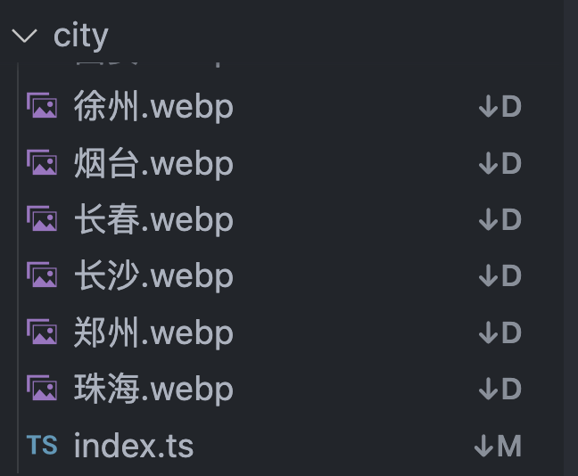
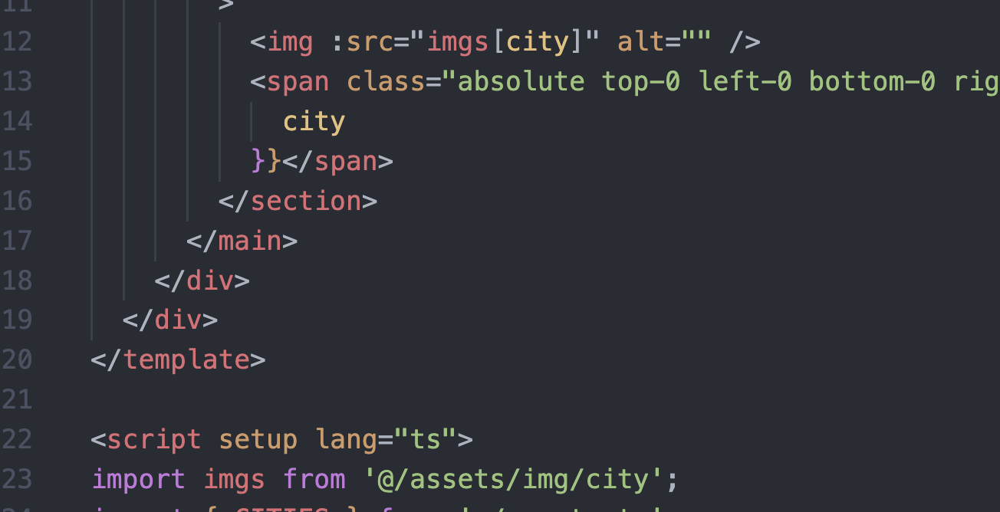

## 场景

有很多城市的图片



需要在一个列表中统一渲染：



## 导入方案

使用 `import.meta.glob` 函数从文件系统导入多个模块，然后遍历渲染。

[vite Glob 导入](https://cn.vitejs.dev/guide/features.html#glob-import)

```js
const files = import.meta.globEager('./*.png')
const modules = []
Object.keys(files).forEach((path) => {
  const name = path.replace(/^\.\/(.*)\.png$/, '$1')
  const module = files[path]
  // @ts-ignore
  modules[name] = module.default
})
export default modules
```

渲染完成后结果如下：

```js
// vite 生成的代码
const modules = {
  './a.png': () => import('./a.png'),
  './b.png': () => import('./b.png'),
  ...
}
```

最后通过对象直接匹配获取即可

新版本 vite 中 `import.meta.globEager` 已经被废弃，需要使用 `import.meta.glob('*', { eager: true })` 来代替

[https://cn.vitejs.dev](https://cn.vitejs.dev/guide/migration.html#removed-deprecated-apis)

### webpack 导入方案

webpack 提供 `require.context` 遍历文件夹下的文件，从中获取指定文件，自动导入模块

```js
const files = (require as any).context('./', false, /\.png$/); //批量读取模块文件
const modules = files.keys().reduce((modules, path) => {
  const [, name] = path.replace(/^\.\/(.*)\.png$/, '$1').split('-');
  const module = files(path);
  modules[name] = module.default;
  return modules;
}, {});
export default modules;
```
