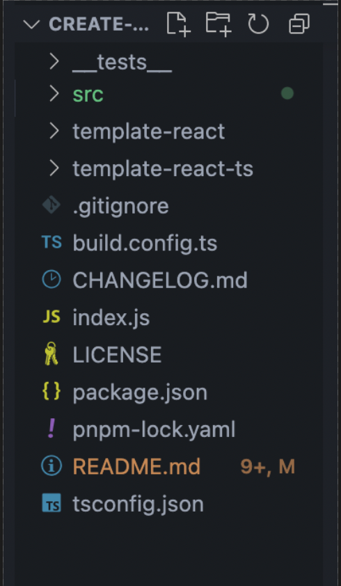
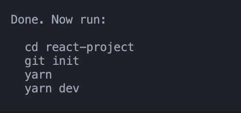
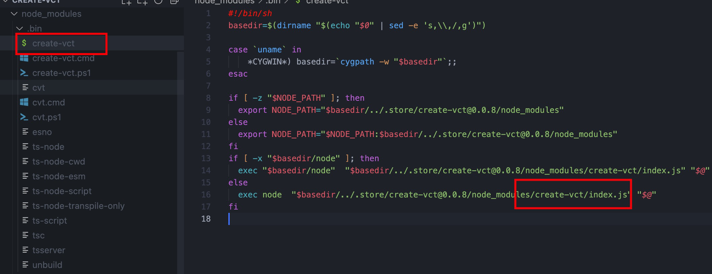

#  create-vct

这是一个用于初始化 vite + React 企业级项目的脚手架工具。

## 🔥 运行流程


## 🎁 安装 & 使用

```bash
npx create-vct

# or
npm i create-vct -g
create-vct
```

## 起因

我们公司前端都是用的 vue3，但最近有个白板项目[产品经理：客户想要个画板，你们前端能不能做？](https://juejin.cn/post/7232947178691444794)只有 react 的框架可以做，领导说让我来弄这个项目，顺便完了之后搭一个 react 脚手架工具用于以后快速开发 react 应用。Ok，接受挑战 😜。

我们整个脚手架工具是在 create-vite 的基础上修改，封装了 react 中常用到的各种包：[react-router](https://reactrouter.com/en/main)、[redux-toolkit](https://redux-toolkit.js.org/)、[react-query](https://cangsdarm.github.io/react-query-web-i18n/react/)、[antd](https://ant.design/index-cn) 等等，包含 ts 和 js 版本，同时也封装了 eslint + prettier + husky + commitlint 用于团队规范。

下面让我们来看看整个过程，篇幅较长，请耐心观看。

## 针对 create-vite 的修改


**"工欲善其事，必先利其器"**，开始之前，如果不熟悉 create-vite 源码的小伙伴，欢迎阅读这篇文章[站在巨人的肩膀上：你还不懂 create-vite 原理吗？来一起康康](https://juejin.cn/post/7217750296171118651)，顺便动动手点个赞 👍。

### 删除不需要的模块

因为我们只需要 react 的模板，所以把其他不需要的一并删除掉，最后只留下这些文件。


### 修改模板 vite.config.ts 代码

1. 配置 alias 添加别名设置；
2. 配置 server 代理服务器；

   ```ts
    // vite.config.ts
    ...
    export default defineConfig({
      plugins: [react()],
      resolve: {
        alias: {
          '@': path.resolve(__dirname, 'src'), // src 路径
        }
      },
      server: {
        port: 5173, // 开发环境启动的端口
        proxy: {
          '/api': {
            // 当遇到 /api 路径时，将其转换成 target 的值
            target: 'http://xx.xx.xx.xx:8080/api',
            changeOrigin: true,
            rewrite: (path) => path.replace(/^\/api/, ''), // 将 /api 重写为空
          },
        },
      },
    })
   ```

3. 路径别名同时需要配置 tsconfig.json，不然直接使用 ts 会报错

   ```json
   // tsconfig.json
   {
     "compilerOptions": {
       "paths": {
         "@/*": ["./src/*"]
       }
     }
   }
   ```

### 使用 sass 作为 css 预处理器

公司项目都是使用 sass，所以这个脚手架自然使用 sass 来处理 css。

1. 在 package.json 中依赖中添加`"sass": "^1.62.1"`；
2. 将.css 后缀文件修改为.scss 后缀文件；
3. 创建 src/styles/variables.scss，设置全局 sass 变量；
4. 在 vite.config.js 中配置全局 sass 变量：

```js
export default defineConfig({
  ...
  css: {
    preprocessorOptions: {
      scss: {
        additionalData: '@import "@/styles/variables.scss";',
      },
    },
  }
  ...
})
```

**注意：vite 对.sass 已经提供了内置支持，所以不再需要安装 loader 了，[官方解释](https://cn.vitejs.dev/guide/features.html#css-pre-processors)**

### 将 classnames 引入项目

个人感觉 CSS Modules 比 CSS In JS 看的更直观些，所以项目中使用 CSS Modules 的方式处理 css，当然你也可以用 CSS In JS 的方式处理，项目模板没有太多 css 代码，不会影响到你的选择。

在脚手架中只需要在 package.json 中依赖中添加`"classnames": "^2.3.2"`即可。

使用也很简单：

```js
import classNames from 'classnames/bind'
import styles from './index.module.scss'
const cx = classNames.bind(styles)

const App = () => {
  return <div className={cx('btn', 'btn-primary')}></div>
}
```

## 统一代码 & git 规范


### 使用 EditorConfig 统一 IDE 编码风格

.editorconfig 文件创建在项目根目录下：

```bash
[*]
indent_style = space
indent_size = 2
end_of_line = lf
charset = utf-8
trim_trailing_whitespace = false
insert_final_newline = false
```

### 添加 eslint & prettier 用于代码规范

eslint 和 prettier 的安装参考的是[vite-pretty-lint](https://github.com/tzsk/vite-pretty-lint)，将项目源码克隆到本地，只需要创建文件的那部分代码，其余的可删除。

### 添加 pre-commit 和 commit-msg 钩子

添加 githooks，在提交前对代码校验和格式化处理，并规范提交信息，可以参考我之前的文章：[vue3 项目添加 husky+lint-staged 配置](https://juejin.cn/post/7215454235046445112)，我们看看在一个项目中配置 git hooks 都需要哪些步骤。

1. 添加 husky 和 lint-staged 依赖

   ```bash
   yarn add lint-staged husky
   ```

2. 初始化 husky，生成.husky 文件

   ```bash
   yarn husky install
   ```

3. 在 package.json 的 scripts 中添加 prepare 个钩子

   ```json
    "scripts": {
      "dev": "vite",
      "build": "tsc && vite build",
      "preview": "vite preview",
      "lint": "eslint --ext .ts --ext .tsx src --fix",
      "prepare": "npx husky install"
    },
   ```

4. 在 package.json 中配置 lint-staged

   ```json
    "lint-staged": {
      "src/**/*.{js,jsx,ts,tsx,json,md}": [
        "eslint --fix --max-warnings=0",
        "prettier --write"
      ],
      "src/**/*.{scss,less,css}": [
        "prettier --write"
      ],
    }
   ```

5. 添加 pre-commit 钩子，会在.husky 目录下生成 pre-commit 文件

   ```bash
   npx husky add .husky/pre-commit "npx lint-staged"
   ```

   这一步完成后，在提交代码的时候就会有对暂存区的代码做 ESLint 代码校验和 Prettier 格式化处理。

6. 接着是 commitlint 规范提交信息，安装依赖

   ```bash
   yarn add @commitlint/cli @commitlint/config-conventional -D
   ```

7. 创建 commitlint.config.js 配置文件

   ```js
   module.exports = {
     extends: ['@commitlint/config-conventional'],
   }
   ```

8. 生成 pre-commit hook

   ```bash
   npx husky add .husky/commit-msg 'npx commitlint --edit'
   ```

9. 到这里，husky + lint-staged + commitlint 都配置完成了。

这一步完成后，我们同时配置了代码规范和 git 规范，添加了 husky，所以需要在项目创建完成后，首先**执行一下 git init 初始化 git 仓库，然后 husky 才能正常运行**，于是就把提示信息多加了一项 🤔，如下。



我们需要修改 create-vite 的代码，添加如下代码：

```js
if (isEslint) {
  const eslintTemplate = '../eslint-templates'
  const eslintFile = path.join(targetPath, '.eslintrc.json')
  const prettierFile = path.join(targetPath, '.prettierrc.json')
  const eslintIgnoreFile = path.join(targetPath, '.eslintignore')
  const { packages, eslintOverrides } = await import(
    `${eslintTemplate}/${template}.js`
  )

  const packageList = { ...commonPackages, ...packages }
  const eslintConfigOverrides = [...eslintConfig.overrides, ...eslintOverrides]
  const eslint = { ...eslintConfig, overrides: eslintConfigOverrides }

  const viteConfigFiles = ['vite.config.js', 'vite.config.ts']
  const [viteFile] = viteConfigFiles
    .map((file) => path.join(targetPath, file))
    .filter((file) => fs.existsSync(file))

  const viteConfig = viteEslint(fs.readFileSync(viteFile, 'utf8'))

  fs.writeFileSync(eslintFile, JSON.stringify(eslint, null, 2))
  fs.writeFileSync(prettierFile, JSON.stringify(prettierConfig, null, 2))
  fs.writeFileSync(eslintIgnoreFile, eslintIgnore.join('\n'))
  fs.writeFileSync(viteFile, viteConfig)
  const files = fs.readdirSync(eslintTemplate)
  for (const file of files.filter((f) => !f.includes('react'))) {
    write(file, eslintTemplate)
  }
  pkg.devDependencies = { ...pkg.devDependencies, ...packageList }
  pkg.scripts = { ...pkg.scripts, ...packageScripts }
  pkg['lint-staged'] = packageMore

  write('package.json', templateDir, JSON.stringify(pkg, null, 2) + '\n')
}
```

这一步会将`.husky`、`.editorconfig`、`commitlint.config.js`、`.eslintrc.json`、`.prettierrc.json`和`.eslintignore`配置添加到所创建的项目中，并修改 package.json 文件，添加 ESLint 的依赖项。

## 集成 ant design 作为 UI 库


我们可以梳理下，如果往项目中添加 Antd 需要做哪些事：

1. 需要将 Antd 依赖添加到 package.json 文件；

   ant-design@v5 版本支持 tree-shaking，就不用配置按需加载了。那么就很简单，我们只需要在 package.json 的`dependencies`字段中添加 Antd 的库。

2. 全局引入 reset.css 文件；
3. 设置 ConfigProvider 全局化配置；

   ```jsx
   import 'antd/dist/reset.css'
   import zhCN from 'antd/locale/zh_CN'
   import dayjs from 'dayjs'
   import 'dayjs/locale/zh-cn'
   import { ConfigProvider } from 'antd'

   dayjs.locale('zh-cn')

   ReactDOM.createRoot(document.getElementById('root')).render(
     <React.StrictMode>
       <ConfigProvider locale={zhCN}>
         <App />
       </ConfigProvider>
     </React.StrictMode>
   )
   ```

4. 修改 App 组件，添加一个 antd 的组件，这样启动项目就可以看到 Antd 的组件使用方法。

基于以上的步骤，我们可以仿照 ESLint 那块的代码来修改，最终实现如下：

```js
// antd配置
const fileSuffix = template.endsWith('-ts') ? '.tsx' : '.jsx'
if (isAntd) {
  const AppComponent = path.join(targetPath, `/src/App${fileSuffix}`)
  const MainComponent = path.join(targetPath, `/src/main${fileSuffix}`)
  // @ts-ignore
  const { packages, App, Main } = await import('../antd-templates/index.js')
  fs.writeFileSync(AppComponent, App)
  fs.writeFileSync(MainComponent, Main)

  pkg.dependencies = { ...pkg.dependencies, ...packages }
  write('package.json', templateDir, JSON.stringify(pkg, null, 2) + '\n')
}
```

## 集成 react-router 作为路由


这里我们使用[react-router@v6](https://reactrouter.com/zh/main)版本，v6 版本之前如果使用 typescript 时，需要同时安装`@types/react-router`、`@types/react-router-dom`、`react-router`和`react-router-dom`。

> react-router 和 react-router-dom 的关系类似于 react 和 react-dom。dom 及浏览器环境，react-router-dom 通过添加用于 DOM 的组件，可以让 react-router 运行在浏览器环境，同时还有 react-router-native，用于 native 环境。

使用 v6 时不需要额外的类型，只需要安装`react-router`和`react-router-dom`即可。

### react-router v6 说明

- `<Routes />`: 新增组件，移除 v5 的`<Switch />`组件，用`<Routes />`组件代替，用法相同；
- `<Router />`: 基础路由组件，v5 的 component={Home}改写为 element={Home}；
- `<Link />`: 导航组件；
- `<Outlet />`: 新增组件，自适应渲染组件；
- useParams: 新增 Hook，获取当前路由携带参数；
- useNavigate: 新增 Hook，类似 v5 的 useHistory，获取当前路由；
- useOutlet: 新增 Hook，获取根据路由生成的 element；
- useLocation: 获取当前 location 对象；
- useRoutes: 同`<Routes>`组件，在 js 中使用；
- useSearchParams: 获取 URL 中 search 参数。

### react-router v6 使用教程

同 Antd，首先我们先理一下将 react-router 添加到项目中的步骤。

1. 添加 react-router 和 react-router-dom 依赖；

   ```bash
   yarn add react-router-dom react-router
   ```

2. 添加 src/routes/routerConfig.ts 文件，配置路由表；

   ```js
   import ErrorPage from '@/pages/ErrorPage'
   import { lazy } from 'react'
   import { RouteObject } from 'react-router-dom'

   // 快速导入工具函数
   const lazyLoad = (moduleName: string) =>
     lazy(() => import(`@/pages/${moduleName}/index.tsx`))

   const Home = lazyLoad('Home')
   const About = lazyLoad('About')

   const routers: RouteObject[] = [
     {
       path: '/',
       element: <Home />,
       errorElement: <ErrorPage />,
     },
     {
       path: 'home',
       element: <Home />,
     },
     {
       path: 'about',
       element: <About />,
     },
   ]

   export default routers
   ```

3. 创建 src/pages 文件夹，添加 Home 和 About 组件；
4. 通过 [useRoutes](https://reactrouter.com/en/main/hooks/use-routes) 钩子将上面的路由表一一映射为路由对象

   useRoutes 也就是`<Routes />`组件的 js 实现，在路由跳转时需要增加 loading 转场，我们可以使用`<Suspense />`组件传入一个 loading 组件来实现。

   > 此处的 Loading 组件可根据项目需求来修改转场动画

   ```tsx
   import './App.scss'
   import routers from './routes/routerConfig'
   import { useRoutes } from 'react-router-dom'
   import { Suspense } from 'react'
   import { Spin } from 'antd'

   function App() {
     const elements = useRoutes(routers)
     return <Suspense fallback={<Spin />}>{elements}</Suspense>
   }

   export default App
   ```

5. 在 main.tsx 中配置`<BrowserRouter />`包裹 App 组件

   ```tsx
   import { BrowserRouter } from 'react-router-dom'

   ReactDOM.createRoot(document.getElementById('root') as HTMLElement).render(
     <React.StrictMode>
       <BrowserRouter>
         <App />
       </BrowserRouter>
     </React.StrictMode>
   )
   ```

基于以上步骤，我们实现的代码如下：

首先询问是否需要安装 react-router，并返回 isRouter 是否为 true，如果为 true 时，将 react-router 的模板文件添加到输出目录中，同时修改 App.tsx 和 main.tsx 的代码：

```ts
if (isRouter) {
  copyTemplateFile('router')
  // @ts-ignore
  let { packages, App, Main, Antd_App, Antd_Main } = await import(
    '../router-templates/index.js'
  )
  if (isAntd) {
    App = Antd_App
    Main = Antd_Main
  }
  fs.writeFileSync(AppComponent, App)
  fs.writeFileSync(MainComponent, Main)

  pkg.dependencies = { ...pkg.dependencies, ...packages }
  write('package.json', templateDir, JSON.stringify(pkg, null, 2) + '\n')
}
```

## 集成 redux toolkit 作为状态管理


### 为什么是 Redux toolkit

[Redux Toolkit](https://cn.redux.js.org/redux-toolkit/overview/) 是 Redux 官方强烈推荐，开箱即用的一个高效的 Redux 开发工具集。它旨在成为标准的 Redux 逻辑开发模式，强烈建议你使用它。

优点如下：

- 优化 Redux 中间件、各种配置以及书写目录规范等，简化操作，例如取代 Redux 中很恶心的 types、actions、reducers；
- React-Redux Hook API 取代麻烦的`connect`和`mapState`；
- Reducer 中默认使用 Immer 来更新 Immutable 数据，不用再返回 state，简单、省事；
- 封装好了 redux-devtools-extension，可直接使用；
- 已经集成 redux-thunk，不需要再次安装；
- 按 feature 组织 Redux 逻辑，更加清晰。

总体来说，Redux Toolkit 的出现让之前想尝试 Redux，但又被 Redux 各种繁琐的配置劝退的人重拾了兴趣。

### Redux Toolkit 使用教程

参考：https://redux.js.org/usage/usage-with-typescript#define-typed-hooks

1. 添加 Redux Toolkit 相关依赖；

   ```bash
   yarn add @reduxjs/toolkit react-redux
   ```

2. 创建 store 文件夹；

   store 中包含 feature（包含所有的 Slice）、hooks（封装 useSelector 和 useDispatch）、index（主入口文件）

   ```bash
   store
   │   ├── feature
   │   │   └── appSlice.ts
   │   ├── hooks.ts
   │   └── index.ts
   ```

3. index.ts 入口；

   ```ts
   import { configureStore, ThunkAction, Action } from '@reduxjs/toolkit'
   import appReducer from './feature/appSlice'
   // 创建store
   export const store = configureStore({
     // feature中创建多个子reducer 最终在这里进行合并
     reducer: {
       app: appReducer,
     },
     // 中间件
     middleware: (getDefaultMiddleware) =>
       getDefaultMiddleware({
         serializableCheck: false,
       }),
     // redux-devtools-extension何时开启
     devTools: process.env.NODE_ENV !== 'production',
   })

   export type AppDispatch = typeof store.dispatch
   export type RootState = ReturnType<typeof store.getState>
   export type AppThunk<ReturnType = void> = ThunkAction<
     ReturnType,
     RootState,
     unknown,
     Action<string>
   >
   ```

   > serializableCheck: false 关闭 serializableCheck 检查，当数据较复杂时，开启时会报错；
   > @reduxjs/toolkit 已经封装好了 redux-devtools-extension，通过 devTools: true 开启。

4. hooks.ts 钩子

   官方推荐使用 useAppSelector 来操作 store 数据，使用 useAppDispatch 触发子 store 中的 action。

   ```ts
   import { TypedUseSelectorHook, useDispatch, useSelector } from 'react-redux'
   import type { RootState, AppDispatch } from '.'

   // Use throughout your app instead of plain `useDispatch` and `useSelector`
   export const useAppDispatch = () => useDispatch<AppDispatch>()

   export const useAppSelector: TypedUseSelectorHook<RootState> = useSelector
   ```

5. 将 Redux 连接到 React

   在 main.tsx 中，使用 react-redux 的 Provider 组件将 store 注入到上下文中，和之前没有变化

   ```tsx
   import { Provider } from 'react-redux';
   import { store } from './store';
   ...
   <Provider store={store}>
   ...
   ```

6. 组件中如何使用

   在组件文件中，使用官方推荐的 useAppDispatch 和 useAppSelector，从每个子 slice 中获取 action。

   ```tsx
   import { useAppDispatch, useAppSelector } from './store/hooks'
   import {
     selectCount,
     decremented,
     incremented,
   } from './store/feature/appSlice'

   function App() {
     const elements = useRoutes(routers)
     const count = useAppSelector(selectCount)

     const dispatch = useAppDispatch()
     return (
       <>
         <div>
           <Button
             style={{ marginRight: '8px' }}
             type="primary"
             onClick={() => dispatch(incremented())}
           >
             +
           </Button>
           ...
         </div>
       </>
     )
   }
   export default App
   ```

### Redux Toolkit 异步操作

在原来的 Redux 中，如果需要异步操作则需要安装 Redux-Thunk，而 Redux Toolkit 已经内置了 Redux-Thunk，不需要另外安装和配置。

我们只需要使用 createAsyncThunk 就能完成异步 action 的创建。

下面以一个获取 github 用户列表为例：

#### 创建 userSlice

```ts
import { createSlice, createAsyncThunk } from '@reduxjs/toolkit'
import { RootState } from '..'

type UserType = { [props: string]: string | number | boolean }
export interface UserState {
  users: UserType[]
  total: number
}
const initialState: UserState = {
  users: [],
  total: 0,
}

// createAsyncThunk创建一个异步action，return出去的值，会在extraReducers中接收，有三种状态：
// pending（进行中）、fulfilled（成功）、rejected（失败）
export const getUserData = createAsyncThunk('user/getList', async () => {
  const res = await fetch('https://api.github.com/search/users?q=wang').then(
    (res) => res.json()
  )
  return res
})

// 创建一个 Slice
export const userSlice = createSlice({
  name: 'user',
  initialState,
  reducers: {
    // Reducer 中默认使用 Immer 来更新 Immutable 数据，不用再返回 state
    deleteUser: (state, { payload }) => {
      state.users = state.users.filter((user) => user.id !== payload)
      state.total -= 1
    },
  },
  // extraReducers 接受 createAsyncThunk的状态
  extraReducers(builder) {
    builder
      .addCase(getUserData.pending, () => console.log('loading...'))
      // 通常只需要接受fulfilled即可 接收到返回值在同步到state状态中即可
      .addCase(getUserData.fulfilled, (state, { payload }) => {
        state.users = payload.items
        state.total = payload.total_count
      })
      .addCase(getUserData.rejected, (_, err) => console.log('error', err))
  },
})

export const { deleteUser } = userSlice.actions
export const selectUser = (state: RootState) => state.user.users
export default userSlice.reducer
```

在 userSlice 中我们主要做了这几件事：

1. 使用 createAsyncThunk 创建一个异步 action；

   通过 createAsyncThunk return 出去的值，会在 extraReducers 中接收，有三种状态：

   - pending（进行中）
   - fulfilled（成功）
   - ejected（失败）

2. 通过 extraReducers 来接受 createAsyncThunk 的结果；

   在`addCase(getUserData.fulfilled..`中获取异步结果成功后的返回值，直接更新在 state 中

3. 还创建了一个 deleteUser action，用来删除用户

   这一步主要是为了**演示 immer 的作用**，如果对 immer 不太熟悉的同学，可以看看这篇文章：[不可变数据实现-Immer.js](https://juejin.cn/post/7047450607984541710#heading-18)。

   要是以前在 Redux 中，我们需要这样操作：

   ```ts
   deleteUser: (state, { payload }) => {
    return {
      ...state,
      users: [...state.users].filter((user) => user.id !== payload),
      count: state.total - 1
    }
   ```

   而使用 Redux Toolkit 之后，只需要这样操作：

   ```ts
   deleteUser: (state, { payload }) => {
      state.users = state.users.filter((user) => user.id !== payload);
      state.total -= 1;
    },
   ```

4. 在主入口合并到 reducer 中，和 appSlice 一样操作；
5. 使用，同上

完整代码：[github]()

基于以上步骤，我们实现的代码如下：

首先询问是否需要安装 Redux Toolkit，并返回 isRedux 是否为 true，如果为 true 时，将 redux-toolkit 的模板文件添加到输出目录中，同时修改 main.tsx 的代码：

```ts
if (isRedux) {
  copyTemplateFile('redux')
  // @ts-ignore
  let { packages, Main, Router_Main, Antd_Main, Antd_Router_Main } =
    await import('../redux-templates/index.js')
  if (isAntd) Main = Antd_Main
  if (isRouter) Main = Router_Main
  if (isAntd && isRouter) Main = Antd_Router_Main
  fs.writeFileSync(MainComponent, Main)

  pkg.dependencies = { ...pkg.dependencies, ...packages }
  write('package.json', templateDir, JSON.stringify(pkg, null, 2) + '\n')
}
```

## 集成 react-query 作为请求库


### 为什么是 react query

用官方的来说：React Query 通常被描述为 React 缺少的数据获取(data-fetching)库，但是从更广泛的角度来看，它**使 React 程序中的获取，缓存，同步和更新服务器状态变得轻而易举**。

接下来，跟着我的流程看一下，你就会发现 react query 太香了。


### react query 使用教程

[官方教程](https://cangsdarm.github.io/react-query-web-i18n/react/)
也可以看我之前写的一个教程：[react-query 系列一——基础及 useQuery 使用](https://juejin.cn/post/7162005581224968205)

1. 添加 react query 和 axios 依赖

   ```bash
   yarn add react-query axios
   ```

2. 创建 api 文件夹

   api 中包含 feature（包含所有的请求接口）、interface(类型统一管理)、query（存在 react query 相关配置）、request（简单封装 axios）

   ```bash
   ├── api
   │   ├── feature
   │   │   └── app.ts
   │   ├── interface.ts
   │   ├── query
   │   │   ├── query.client.ts
   │   │   └── query.constant.ts
   │   └── request.ts
   ```

   对于 axios，真的不想封装，网上有大把过渡封装的案例，真的使用起来会有那么复杂吗？我只是简单的添加了请求拦截和相应拦截，感觉就已经够用了。

   ```ts
   import { message } from 'antd'
   import Axios, { AxiosRequestConfig } from 'axios'
   import { resData } from './interface'

   // 统一配置
   const baseURL = ''
   export const service = Axios.create({
     baseURL,
     responseType: 'json',
     timeout: 600000,
   })

   // 请求拦截
   service.interceptors.request.use((res: any) => {
     res.headers.token = 'token'
     return res
   })

   // 拦截响应
   service.interceptors.response.use(
     (response: any) => {
       const res = response.data
       // 这块需要修改 根据请求返回成功标志
       if (res || res.success) {
         if (res.message) message.success(res.message, 3)
         return response
       } else {
         if (res.message) {
           message.error(res.message, 3)
           if (res.code === 401) {
             window.location.href = '/login'
           }
         }
         return Promise.reject(res)
       }
     },
     (err) => {
       message.error(err.message, 5)
       return Promise.reject(err)
     }
   )

   // 设置返回值和请求值范型
   export default function request<Res = any, Q = any>(
     req: AxiosRequestConfig & {
       data?: Q
     }
   ) {
     return service(req).then(
       (res) => {
         return res.data as resData<Res>
       },
       (res) => {
         return Promise.reject((res.data || res) as resData<Res>)
       }
     )
   }
   ```

   顺便看下导出的 request 方法，传入了返回和请求值的类型，然后在 app.ts 中，使用 request 发送请求时，我们只要传入后端的返回类型，这样在接口请求完成后，使用数据的时候就会方便很多。

   ```ts
   import { GithubType } from '../interface'
   import request from '../request'

   /* 用户列表 */
   export const getUserList = (searchName: string) =>
     request<GithubType>({
       url: `/api/search/users?q=${searchName}`,
       method: 'get',
     })
   ```

   

   query.client.ts 用于初始化 react query，导出 client 会在 QueryClientProvider 中进行透传。

   ```ts
   import { QueryClient } from 'react-query'
   const client = new QueryClient({})

   // client.setQueryDefaults(QUERY_CHAT_TRANSLATE_INPUT, {
   //   select: (res) => res.data,
   //   enabled: false,
   // });

   export default client
   ```

   query.constant.ts 用于统一管理 react query 所有的 key，**key 有什么用呢**？这个只要你把 react query 用起来就可以知道 key 的作用了。

   ```ts
   export const QUERY_USER_LIST = 'user/list'
   ```

3. 在 main.tsx 中配置

   ```tsx
   import { QueryClientProvider } from 'react-query'
   import client from './api/query/query.client'
   ...

   ReactDOM.createRoot(document.getElementById('root') as HTMLElement).render(
     <QueryClientProvider client={client}>
       {/* 添加devtools */}
       {process.env.NODE_ENV === 'development' ? (
         <ReactQueryDevtools
            initialIsOpen={false}
            position="bottom-right"
          />
       ) : (
         ''
       )}
       <App />
     </QueryClientProvider>
     ...
   )
   ```

4. 在组件中使用

   通过下面这个例子可以看出来，不使用 react query 的情况下，我要既要通过 useState 管理 loading 和数据状态，还得通过 useEffect 来发送请求；而使用 react-query 的情况下，各种**数据状态直接可以使用 useQuery 来代替**，简化我们的代码。

   ```tsx
   import { getUserList } from '@/api/feature/app'
   import { UserType } from '@/api/interface'
   import { QUERY_USER_LIST } from '@/api/query/query.constant'
   // import React, { useEffect, useState } from 'react';
   import { useQuery } from 'react-query'

   const QueryDemo = () => {
     // 不使用react-query时的请求
     // const [loading, setLoading] = useState(false);
     // const [users, setUsers] = useState<UserType[]>([]);
     // const getList = () => {
     //   setLoading(true);
     //   getUserList('wang')
     //     .then((res) => setUsers(res.items))
     //     .finally(() => setLoading(false));
     // };
     // useEffect(() => getList(), []);
     // 使用react-query
     const { data: users, isLoading: loading } = useQuery(
       QUERY_USER_LIST,
       () => getUserList('wang'),
       {
         select: (res) => res.items,
       }
     )
     return (
       <>
         {loading && <div>loading...</div>}
         <ul>
           {users?.map((user: UserType) => (
             <li key={user.id as string}>{user.login}</li>
           ))}
         </ul>
       </>
     )
   }

   export default QueryDemo
   ```

基于以上步骤，我们实现的代码如下：

首先询问是否需要安装 react-query，并返回 isQuery 是否为 true，如果为 true 时，将 react-query 的模板文件添加到输出目录中，同时修改 main.tsx 的代码：

```ts
if (isQuery) {
  copyTemplateFile('query')
  // 获取模板下的文件 将除了package.json的文件全部复制到输出目录中
  const MainComponent = path.join(targetPath, './src/Main.tsx')
  // @ts-ignore
  const { packages, Main } = await import('../query-templates/index.js')
  fs.writeFileSync(MainComponent, Main)

  pkg.dependencies = { ...pkg.dependencies, ...packages }
  write('package.json', templateDir, JSON.stringify(pkg, null, 2) + '\n')
}
```

🎉🎉🎉 到这里，我们需要做的事情都已经完成了！接下来就是发布 npm 包。

## 发布 npm

```json
"bin": {
  "create-vct": "index.js",
  "cvt": "index.js"
},
"files": [
  "index.js",
  "template-*",
  "*-templates",
  "dist"
],
```

这一步发布 npm 包，我们将所需要的模板文件全部发布，修改 package.json 的`files`如上所示，files 就是发不到 npm 仓库的文件。

bin 字段修改为`create-vct`，这样在执行`create-vct`命令时最终执行的文件就是 index.js。



> bin 里的命令对应的是一个可执行的文件，通过软链接或者符号链接到指定资源的映射，这些可执行文件必须以 #!/usr/bin/env node 开头，否则脚本将在没有 node 可执行文件的情况下启动。

修改完成后，执行

```bash
pnpm build
nrm use npm
npm publish
```

## 如何使用

- 全局安装

  ```bash
  npm i create-vct -g
  create-vct
  ```

  全局安装后，直接在控制台输入`create-vct`即可。

- 使用 npx

  npm 从 5.25.2 版开始，增加了 npx 命令，可以让我们在当前路径使用全局包。npx 运行时，会到当前 node_modules/.bin 路径和环境变量$PATH 里面，检查命令是否存在。如果找不到时会从 npm 上下载最新版本使用。

  ```bash
  npx create-vct
  ```

## 总结

整个流程走下来，真的是收获很多，学到了node操作文件的很多api。然后每个模块又重新学习了一遍 之前的白板要派上用场了，我用它来做每个模块的图，还学着做了一下svg的图标，收获满满。
