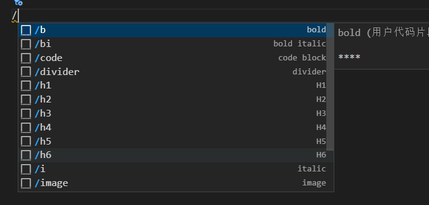

  

## 安装必要的插件

- Markdown All in One
  编写 Markdown 所需的一切（键盘快捷键、目录、自动预览等）

- markdownlint
  Visual Studio Code 的 Markdown linting 和样式检查

### 用户自定义片段

`设置 -> 用户自定义片段 -> markdown.json`，修改为如下代码

```json
{
 // Place your snippets for markdown here. Each snippet is defined under a snippet name and has a prefix, body and 
 // description. The prefix is what is used to trigger the snippet and the body will be expanded and inserted. Possible variables are:
 // $1, $2 for tab stops, $0 for the final cursor position, and ${1:label}, ${2:another} for placeholders. Placeholders with the 
 // same ids are connected.
 // Example:
 // "Print to console": {
 //  "prefix": "log",
 //  "body": [
 //   "console.log('$1');",
 //   "$2"
 //  ],
 //  "description": "Log output to console"
 // }
 "H1": {
  "prefix": ["h1", "/h1"],
  "body": [
    "# $0"
  ],
},
"H2": {
  "prefix": ["h2", "/h2"],
  "body": [
    "## $0"
  ],
},
"H3": {
  "prefix": ["h3", "/h3"],
  "body": [
    "### $0"
  ],
},
"H4": {
  "prefix": ["h4", "/h4"],
  "body": [
    "#### $0"
  ],
},
"H5": {
  "prefix": ["h5", "/h5"],
  "body": [
    "##### $0"
  ],
},
"H6": {
  "prefix": ["h6", "/h6"],
  "body": [
    "###### $0"
  ],
},
"bold": {
  "prefix": ["b", "/b"],
  "body": [
    "**$0**"
  ],
},
"italic": {
  "prefix": ["i", "/i"],
  "body": [
    "*$0*"
  ],
},
"bold italic": {
  "prefix": ["bi", "/bi"],
  "body": [
    "***$0***"
  ],
},
"divider": {
 "prefix": ["divider", "/divider"],
 "body": [
  "-----------------------------------"
 ],
},
"link": {
 "prefix": ["link", "/link"],
 "body": [
  "[$2]($1)"
 ],
},
"image": {
 "prefix": ["image", "/image"],
 "body": [
  ""
 ],
},
"inline code block": {
 "prefix": ["inlinecode", "/inlinecode"],
 "body": [
  "`$1`"
 ],
},
"code block": {
  "prefix": ["code", "/code"],
  "body": [
   "```$1"
   "$0"
   "```"
  ],
},
"ul": {
 "prefix": ["ul", "/ul"],
 "body": [
  "- $1"
 ],
},
"ol": {
 "prefix": ["ol", "/ol"],
 "body": [
  "1. $1"
 ],
},
}
```

接下来，可以在.md结尾的文档中输入`/`，看看下面这些提示，平常使用的markdown语法基本上都包括了。

<br />当然，你也可以自定义，只需要了解[snippets](https://code.visualstudio.com/docs/editor/userdefinedsnippets)的基本使用即可。


