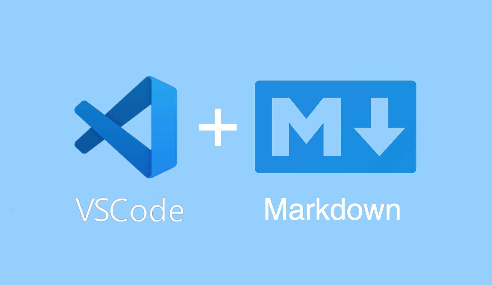

> 先调查下各位 jy 平时是用啥软件来写作的，有好的推荐麻烦在评论区吱一声 🐾。

## 前言

我最开始写作的时候，是直接在 VSCode 里写 Markdown 语法，虽然吧，也记下了不少的语法，但写起来却很慢。看到网上有人推荐 Typora，就开始用 Typora，这种实时预览的 Markdown 编辑器用起来的确很舒服，不幸的是收费了 🐎。
接着用了一段时间[Notion](https://www.notion.so/)，说实话 Notion 真的足够强大，以至于我每写一句话就想用一下它的`ASK AI`功能，尽管有时候 AI 提供的句子并不是很通顺。那我为什么放着这么好的 Notion 不用，反倒是切回 VSCode 呢？

那我们不妨来看看 VSCode 的好处：够隐蔽，因为写代码也是用 VSCode，自然而然别人就以为你在写代码而不是在写作。

那么，可不可以在 VScode 中直接像 Notion 那样通过`/`来插入各种标签呢？

于是我就想到用 Snippets 的方式去尝试一下，为了更好的开启本文，我们先来了解下 Snippets 吧！

## Snippets

Snippets 翻译过来就是"代码片段"的意思，不仅仅是在 VSCode 中，所有的主流编辑器都支持代码片段，甚至在 浏览器中也可以使用，那它有什么用呢(´•༝•`) ？

**没错，提高效率！！！**

我猜大多数人可能不知道，我们在 chrome 的控制台也是可以创建 Snippets 的 🤙！
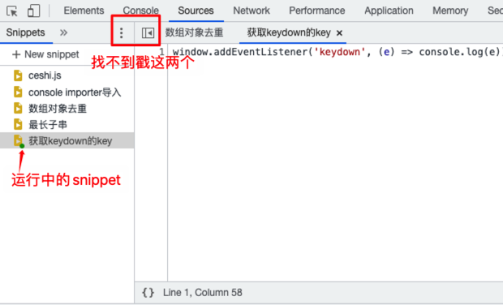
通过 Sources -> Snippets -> + New Snippet 就可以创建新的代码片段，我会将一些常用的方法放在这里，比如获取键盘 keydown 事件的 key 值：

```js
window.addEventListener('keydown', (e) => console.log(e))
```

虽然只有一行代码，但是每次要写的的话还得费时间，所以可以直接在代码片段中写好，这样当我想要知道哪个按键的 keycode 值时，只需要在任意一个网站右键 -> Run 就可以了，这不就效率提高了嘛 😂。

咱们说回 VSCode，如果还不知道 Snippets 是什么，你不妨在 VSCode 扩展中搜一下`@enabled snippets`，你会发现肯定安装了不止一种 Snippets，因为像"xxx VSCode 插件推荐..."、"xxx 精选 VSCode 插件..."这样的文章都会推荐一两款 🥱。
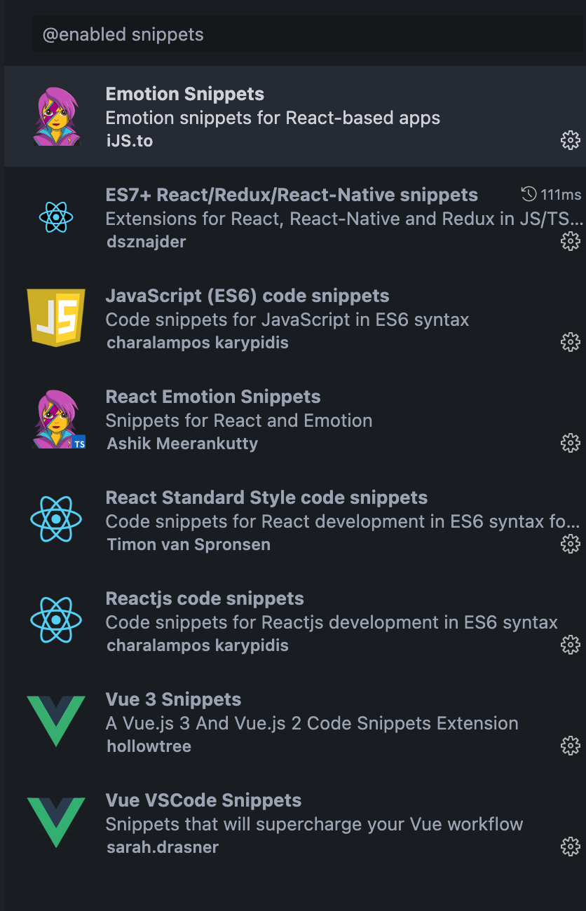

而且虽然你不知道，但你还天天用着它，比如在快速创建 vue 的单文件组件代码：
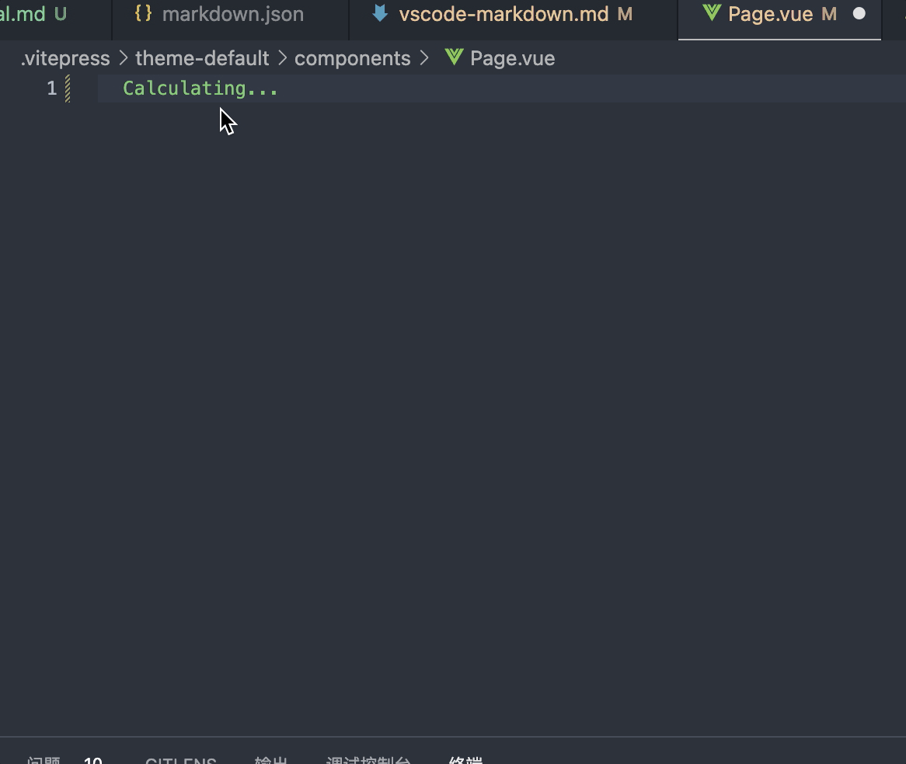

到这里，我们已经清楚了 Snippets 到底是个啥了。那我们要怎么自定义，怎么提高开发效率呢？

### 自定义 Snippet

1. 创建 snippet

   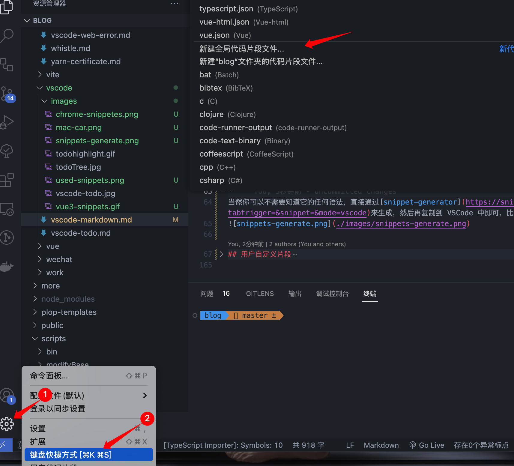

2. 修改 snippet

   我们通过第一步，创建的 snippet 如下所示（这里我已经将 Example 的注释去掉）。

   ```json
   {
     // Place your 全局 snippets here. Each snippet is defined under a snippet name and has a scope, prefix, body and
     // description. Add comma separated ids of the languages where the snippet is applicable in the scope field. If scope
     // is left empty or omitted, the snippet gets applied to all languages. The prefix is what is
     // used to trigger the snippet and the body will be expanded and inserted. Possible variables are:
     // $1, $2 for tab stops, $0 for the final cursor position, and ${1:label}, ${2:another} for placeholders.
     // Placeholders with the same ids are connected.
     // Example:
     "Print to console": {
       "scope": "javascript,typescript",
       "prefix": "log",
       "body": ["console.log('$(1)';", "$2"],
       "description": "Log output to console"
     }
   }
   ```

   此时我们什么都不修改的情况下，保存后在 js 或 ts 文件中输入`log`，就相当于输入了`console.log()`，然后按`Tab`键就可以直接跳到括号中输入，输入完成后继续按`Tab`直接换到第二行。

   我们来看下这几个 key 分别代表的意思：

   - scope: 可用范围，不指定时代表所有语言都生效
   - prefix: 触发的前缀，可以指定多个（数组）或单个（字符串）
   - body: 插入到编辑器中的内容
   - description: 描述

3. snippet 语法

   - 通过`$1`、`$2`等来定位光标光标位置

     比如上面的 snippet 中，body 部分我们定义的代码是这样：

     ```js
     "console.log('$1');", '$2'
     ```

     其中`$1`就是输入完成后光标停留的位置，`$2`是按下`Tab`键后光标的位置，还可以设置`$3`、`$4`等等。

   - 通过`${1:xxx}`定义 placeholder

     比如我们可以将上面的 body 部分改为：

     ```js
     "console.log('${1:test}');", '$2'
     ```

     这样，当我们输入`log`之后会直接将默认值显示在制定位置：
     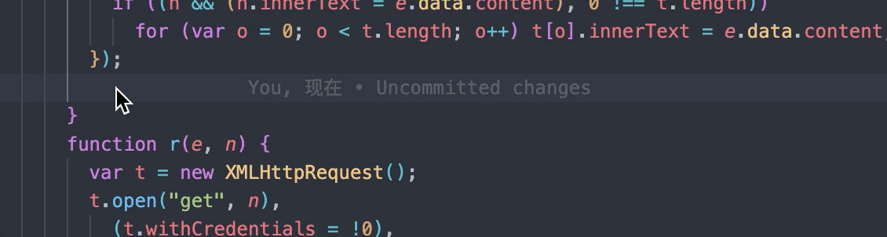

   其实只要学会这两个语法，我们就可以做很多事情了，还有其他类似：选值、变量、对变量做转换等功能。如果想了解可以到[官方教程](https://code.visualstudio.com/docs/editor/userdefinedsnippets#_assign-keybindings-to-snippets)学习。

4. 案例

   学完 snippet 的基础语法后，我们可以来创建一个可以提高效率的 snippet，这是我在 react 中用的最多的 snippet，如果你也使用 react 的话，不妨可以试试：

   ```json
   {
     "use State": {
       "prefix": "st",
       "body": ["const [${1:value}, set${2:Value}] = useState(${3:''});"],
       "description": "快速创建useState"
     }
   }
   ```

   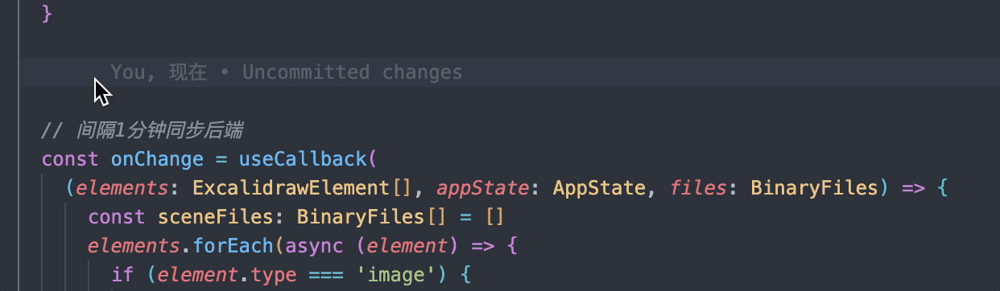

   只需要在代码中输入`st`即可快速创建 useState，比起 react snippets 用起来是不是简单了很多 👍！

### Snippet 生成工具

当然你可以不需要知道它的任何语法，直接通过[snippet-generator](https://snippet-generator.app/?description=&tabtrigger=&snippet=&mode=vscode)来生成，然后再复制到 VSCode 中即可，比如：我们创建一个 flex 布局的代码片段：

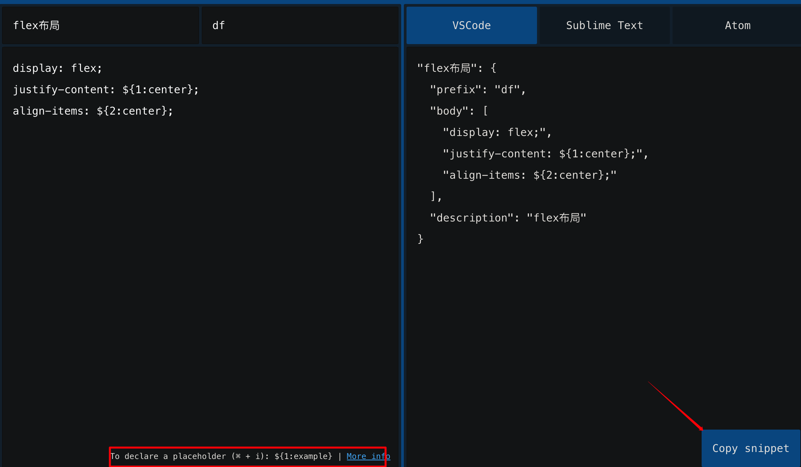

## VSCode 必装 Markdown 插件

想要在 VSCode 中更好的使用 Markdown，你可能需要安装以下几款软件。

- Markdown All in One

  编写 Markdown 所需的一切（键盘快捷键、目录、自动预览等）这些快捷方式将使编辑 Markdown 变得更加容易 😀。

- Markdown Preview Enhanced

  对 VS Code 预览功能的增强，可以改善 VS Code 的预览体验。

- markdownlint

  Visual Studio Code 的 Markdown linting 和样式检查，加上 Prettier，这也是我选择在 vscode 中写文章的原因，可能存在格式不正确的情况下，直接格式化代码即可，而这也是 Typora 这类工具所不能做到的。

- :emojisense:

  在文章中插入表情，可以直接使用 mac 输入法自带的功能：
  

  而:emojisense:插件可以提供更多的表情，只需要输入`:`就可以直接选择表情，或者输入`cmd + i`可以更方便的查找，可以帮助我们轻松将表情符号到文档中。
  [所有支持的表情列表](https://www.webfx.com/tools/emoji-cheat-sheet/)

- Markmap

  [官网](https://markmap.js.org/)，如下图所示，它可以直接将我们编写的 markdown 文档转为脑图。
  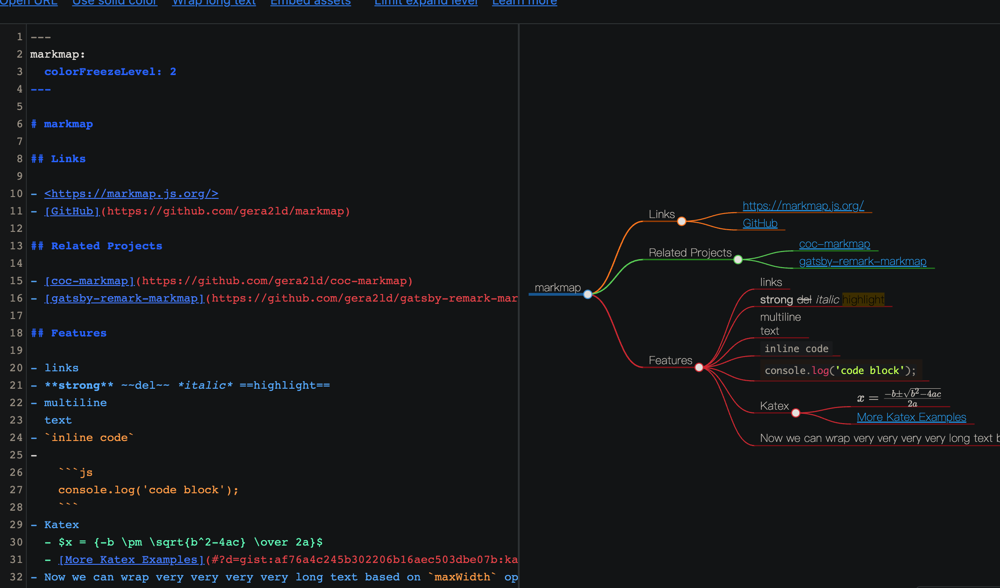

## Markdown Snippet

说回正题，我们是要利用 Snippets 在 VSCode 中打造像 Notion 那样的输入效果。那么，我们先创建一个 Markdown snippet，`用户自定义片段 -> markdown.json`，修改为如下代码：

````json
{
  "H1": {
    "prefix": "/1",
    "body": ["# $0"]
  },
  "H2": {
    "prefix": "/2",
    "body": ["## $0"]
  },
  "H3": {
    "prefix": "/3",
    "body": ["### $0"]
  },
  "H4": {
    "prefix": "/4",
    "body": ["#### $0"]
  },
  "H5": {
    "prefix": "/5",
    "body": ["##### $0"]
  },
  "H6": {
    "prefix": "/6",
    "body": ["###### $0"]
  },
  "bold粗体": {
    "prefix": "/b",
    "body": ["**$1**$2"]
  },
  "italic斜体": {
    "prefix": "/i",
    "body": ["*$1*$2"]
  },
  "underline下划线": {
    "prefix": "/u",
    "body": ["<u>$1</u>$2"]
  },
  "line-through删除线": {
    "prefix": "/x",
    "body": ["~~$1~~$2"]
  },
  "divider分割线": {
    "prefix": "/d",
    "body": ["------", "$1"]
  },
  "link链接": {
    "prefix": "/k",
    "body": ["[$2]($1)$3"]
  },
  "image图片": {
    "prefix": "/img",
    "body": ["$3"]
  },
  "inline code行内代码": {
    "prefix": "/cl",
    "body": ["`$1`$2"]
  },
  "code block代码片段": {
    "prefix": "/c",
    "body": ["```$1", "$0", "```"]
  },
  "ul有序列表": {
    "prefix": "/ul",
    "body": ["- $0"]
  },
  "ol无序列表": {
    "prefix": "/ol",
    "body": ["1. $0"]
  },
  "task任务列表": {
    "prefix": "/task",
    "body": ["- [ ] $0"]
  },
  "quote引用": {
    "prefix": "/q",
    "body": ["> $1", "$2"]
  },
  "table表格": {
    "prefix": "/t",
    "body": [
      "|  $1  |  $2  |  $3  |  $4  |",
      "| ---- | ---- | ---- | ---- |",
      "|  $5  |  $6  |  $7  |  $8  |",
      "|  $9  |  $10 |  $11 |  $12 |",
      "|  $13 |  $14 |  $15 |  $16 |"
    ]
  },
  "bash代码片段": {
    "prefix": "/bash",
    "body": ["```bash", "$0", "```"]
  },
  "html代码片段": {
    "prefix": "/html",
    "body": ["```html", "$0", "```"]
  },
  "js代码片段": {
    "prefix": "/js",
    "body": ["```js", "$0", "```"]
  },
  "css代码片段": {
    "prefix": "/css",
    "body": ["```css", "$0", "```"]
  },
  "vue代码片段": {
    "prefix": "/vue",
    "body": ["```vue", "$0", "```"]
  }
}
````

接下来，可以在 Markdown 文件中输入`/`，我们就可以不用再输入 Markdown 语法，也不用记各种快捷键，一个`/`解决所有 👍。

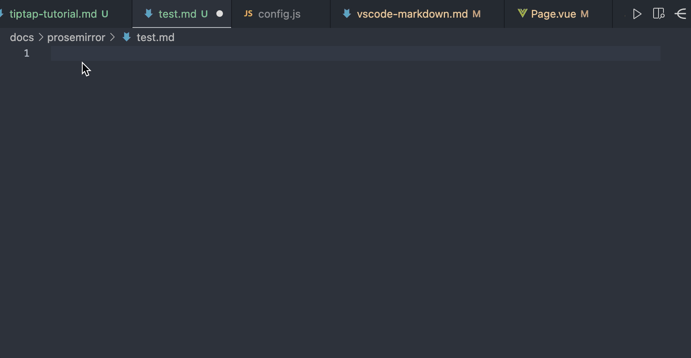

6 月 17 号更新 bash、html、js、css、vue 代码片段，使用如下：

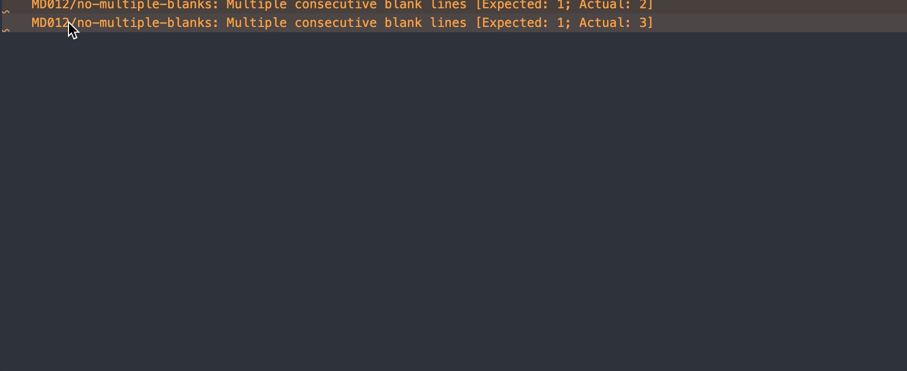

当然，如果需要导出为 pdf 或 Markdown 的话，我还是推荐 Typora，导出的格式都挺好的，比如我每次都是在 VSCode 中写完文章后，先发布到博客，接着在掘金发布，然后会通过 Typora 导出为 word 之后再发布到公司的 wiki 上。

## 总结

通过本文的介绍，相信你一定了解了 Snippets 的用法，那么你可以把平时用的比较频繁的代码片段，整理成各种快捷键，这样一来就能大大的提高开发效率，增加摸鱼时间。

而且利用 Snippets 我也打造了适合自己的一款 Markdown 写作的快捷键，可能不一定适用于每个人，但可以按照我的思路去打造自己的一套快捷键，"八仙过海,各显神通"嘛。

以上就是本文的全部内容，希望这篇文章对你有所帮助，欢迎点赞和收藏 🙏，如果发现有什么错误或者更好的解决方案及建议，欢迎随时联系。
