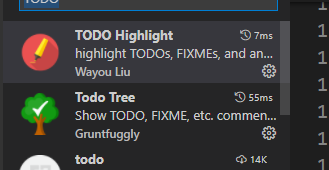
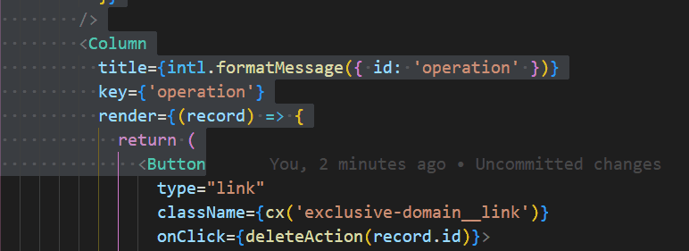
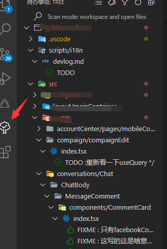

## 背景

最近有个小伙伴离职了，正好 leader 安排我接收他的项目，而且还有个问题就是他最近还被隔离，不能来公司。
我记得有句话这么说，读代码比写代码难。如果没注释的代码，但凡遇到一点逻辑复杂的，读起来都要命。

## 那么，如何更好的阅读代码呢？

vsCode 提供了两个插件，TODO Highlight & TODO Tree，直接在插件市场搜索`TODO`前两个就是



- TODOHighlight

  突出显示代码中的 TODO、FIXME 和其他注释。添加之后在代码中输入`TODO`、`FIXME`、`TIPS`等标记都会出现特殊的颜色

  

  如果想自定义颜色，可以在 setting.json 中直接编辑

  ```json
  "todohighlight.keywords": [
    {
      "text": "TIPS:",
      "color": "white",
      "backgroundColor": "rgb(103,185,154)"
    },
    {
      "text": "FIXME:",
      "color": "white",
      "backgroundColor": "rgb(244,183,65)"
    },
    {
      "text": "TODO:",
      "color": "white",
      "backgroundColor": "rgb(240,98,146)"
    }
  ],
  ```

- TODO Tree

  快速搜索工作区中的注释标记，如 TODO 和 FIXME，也就是通过 TODOHighlight 添加的标记，并将它们显示在活动栏的树视图中，点击可快速到达对应位置

  

有了这些记录，等小伙伴来了，抓他问个一天半天的，也就搞得差不多了。
