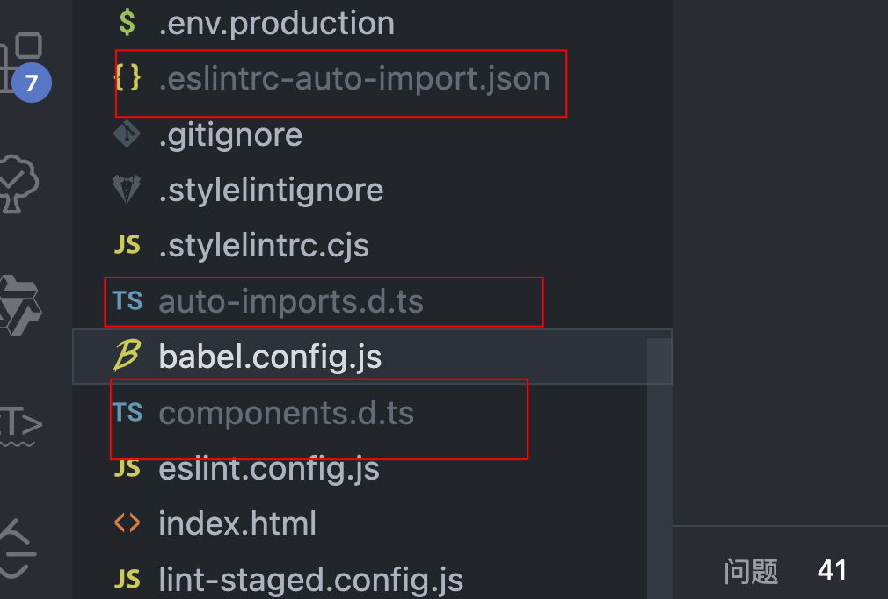

## 自动导入 API unplugin-auto-import

[unplugin](https://github.com/unplugin)

按需自动导入 API，支持 Vue、react 等流行框架

## 使用步骤

### 1. 安装依赖

```bash
npm i -D unplugin-auto-import
```

### 2. 配置

可以在 Vite、Webpack、Rspack、Rollup 和 esbuild 中进行配置

```js
// vite.config.ts
import AutoImport from 'unplugin-auto-import/vite'

export default defineConfig({
  plugins: [
    AutoImport({
      // 自动导入 Vue 3 相关函数，比如：ref, reactive, toRefs 等
      imports: ['vue', 'vue-router'],
      // 自动导入目录
      dirs: ['./src/hooks', './src/store'],
      // 生成 `auto-imports.d.ts` 声明文件
      dts: 'src/auto-imports.d.ts',
      // 使用 ESLint 插件的设置
      eslintrc: {
        enabled: true, // 默认是 false
        filepath: './.eslintrc-auto-import.json', // 默认是 './.eslintrc-auto-import.json'
        globalsPropValue: true, // 默认是 true
      },
    }),
  ],
})
```

#### import

指定需要自动导入的库或框架，比如 Vue 和 Vue Router，这样就能自动导入 Vue 的 ref、reactive 等函数，不必在使用时再引入

```js
// 未使用前
import { computed, ref } from 'vue'

const count = ref(0)
const doubled = computed(() => count.value * 2)

// 使用插件后
const count = ref(0)
const doubled = computed(() => count.value * 2)
```

import 导入分为三类：

1. 基本导入

   类似上述的基本导入，比如：vue、vue-router 等，直接使用全量 API

2. 自定义导入

   ```js
   {
      'vue': [
        'createVNode',
        'render'
      ],
      'vue-router': [
        'createRouter',
        'createWebHistory',
        'createWebHashHistory',
        'useRouter',
        'useRoute'
      ],
      'uuid': [
        ['v4', 'uuidv4']
      ],
      // 全局使用 _.xxxx()
      'lodash-es': [
        // default imports
        ['*', '_'] // import { * as _ } from 'lodash-es',
      ]
    },
   ```

   - `['v4', 'uuidv4']`：将 uuid 库中的 v4 函数导入为 uuidv4，相当于`import { v4 as uuidv4 } from 'uuid'`
   - `['*', '_']`: 将 lodash-es 库中的所有导出绑定到 _ 对象上，这相当于 `import { \* as _ } from 'lodash-es'`

3. 类型导入

   ```js
   {
     from: 'vue',
     imports: [
       'App',
       'VNode',
       'ComponentPublicInstance',
       'ComponentPublicInstanceCostom',
       'ComponentInternalInstance'
     ],
     type: true
   },
   {
     from: 'vue-router',
     imports: [
       'RouteRecordRaw',
       'RouteLocationRaw',
       'LocationQuery',
       'RouteParams',
       'RouteLocationNormalizedLoaded',
       'RouteRecordName',
       'NavigationGuard'
     ],
     type: true
   }
   ```

   这部分配置用于自动导入类型声明，使 TypeScript 能够识别这些类型，从而提供更好的类型检查和自动完成功能。

#### dirs

指定需要自动导入的目录，比如自定义的 hooks 和 store。通过指定这些目录，unplugin-auto-import 插件会自动扫描这些目录下的文件，并自动导入其中导出的内容。

```js
// src/hooks/useExample.ts
export function useExample() {}
```

在可以直接使用 useExample 函数，无需手动导入。插件会自动将这些函数导入到你的组件中。

#### dts

指定生成的 TypeScript 类型声明文件的位置

自动生成的 TypeScript 声明文件

当你运行项目时，unplugin-auto-import 会在 src 目录下生成一个 auto-imports.d.ts 文件，声明自动导入的类型。

#### eslintrc

生成 ESLint 配置文件，避免未使用导入报错

为了确保 ESLint 不会因为自动导入的变量未定义而报错，你需要在 ESLint 配置中引入自动生成的 .eslintrc-auto-import.json 文件：

#### include

include 是一个配置选项，用于指定哪些文件或文件夹应当包含在自动导入扫描范围内。

```js
AutoImport({
  include: [
    './src/**/*.js', // 包含 src 目录下的所有 .js 文件
    './components/**/*.vue', // 包含 components 目录下的所有 .vue 文件
    /\.[tj]sx?$/, // 包含所有 .ts, .tsx, .js, .jsx 文件
    /\.vue\??/ // 所有vue文件
  ],
  ...
})
```

#### vueTemplate

vueTemplate 选项是一个布尔值，用于指定是否在 Vue 组件的 ` <template>` 部分启用自动导入功能。

#### resolvers

## 自动导入组件库

搭配 unplugin-vue-components 实现 element-plus 等组件库的自动导入。

```js
import { defineConfig } from 'vite'
import vue from '@vitejs/plugin-vue'
import AutoImport from 'unplugin-auto-import/vite'
import Components from 'unplugin-vue-components/vite'
import { ElementPlusResolver } from 'unplugin-vue-components/resolvers'

export default defineConfig({
  plugins: [
    vue(),
    AutoImport({
      imports: ['vue', 'vue-router', '@vueuse/core'],
      resolvers: [ElementPlusResolver()],
      vueTemplate: true,
    }),
    Components({
      directoryAsNamespace: true,  // 使用目录作为命名空间
      collapseSamePrefixes: true  // 折叠相同前缀的组件名
      resolvers: [ElementPlusResolver()],
    }),
  ],
})
```

Components 插件: 自动注册组件，使用 ElementPlusResolver 来自动导入和注册 Element Plus 组件。

- directoryAsNamespace

  这个选项用于将目录名作为命名空间前缀。这样可以避免组件名冲突，并且在项目结构复杂时，更容易理解组件的来源。

  ```bash
  src/
  components/
    common/
      Button.vue
    admin/
      Button.vue
  ```

  启用 directoryAsNamespace: true 后，自动导入的组件名将会包含目录名，变为 CommonButton 和 AdminButton。

- collapseSamePrefixes

  这个选项用于折叠具有相同前缀的组件名。这样可以避免在目录结构中重复前缀的麻烦。

以上两种自动导入配置完成后，在启动项目时会生成以下三个文件：



- .eslintrc-auto-import.json

  这个文件包含了自动导入的配置，主要用于 ESLint。它帮助 ESLint 识别哪些 API 是自动导入的，从而避免标记为未定义的错误。

  ```json
  {
    "globals": {
      "ref": "readonly",
      "reactive": "readonly",
      "computed": "readonly",
      "defineComponent": "readonly"
    }
  }
  ```

- auto-imports.d.ts

  这个文件是 TypeScript 的声明文件，包含了自动导入的 API 的类型声明。它帮助 TypeScript 识别这些自动导入的 API，从而提供正确的类型检查和代码补全。

  ```ts
  // Generated by 'unplugin-auto-import'
  declare global {
    const ref: typeof import('vue')['ref']
    const reactive: typeof import('vue')['reactive']
    const computed: typeof import('vue')['computed']
    const defineComponent: typeof import('vue')['defineComponent']
    // more auto-imports...
  }
  ```

- components.d.ts

  这个文件也是 TypeScript 的声明文件，包含了自动导入的 Vue 组件的类型声明。它帮助 TypeScript 识别这些自动导入的组件，从而提供正确的类型检查和代码补全。

  ```ts
  // Generated by 'unplugin-vue-components'
  declare module 'vue' {
    export interface GlobalComponents {
      ElButton: typeof import('element-plus/es')['ElButton']
      ElInput: typeof import('element-plus/es')['ElInput']
      // more components...
    }
  }
  ```

通过这三个文件更好地管理和使用自动导入的 API 和组件。这些文件提供了类型声明和 ESLint 配置，从而改善开发体验。

## 自动导入 Icon 图标

### iconify 插件

Iconify 是一个开源的图标集和图标管理工具。它提供了一个庞大的图标库，包含数千个常用图标，涵盖了各种主题和风格，如 Material Design、Font Awesome、Feather 等。这些图标可以以矢量格式（SVG）使用，适用于各种项目，如网站、移动应用、桌面应用等。

[Iconify for Vue 官方文档](https://iconify.design/docs/icon-components/vue/)

[Iconify 内的 element-plus 图标](https://icon-sets.iconify.design/ep/)

[unplugin-icons](https://github.com/unplugin/unplugin-icons)

#### 安装依赖

```bash
npm install --save-dev @iconify/vue
```

#### 配置

```js
// vite.config.js
import UnpluginIcons from 'unplugin-icons/vite'
import IconsResolver from 'unplugin-icons/resolver'
...

export default defineConfig(({ mode }) => {
  return {
    ...
    plugins: [
      Components({
        directoryAsNamespace: true,
        collapseSamePrefixes: true,
        resolvers: [
          IconsResolver({
            prefix: 'AutoIcon'
          }),
          ElementPlusResolver({
            importStyle: 'sass'
          })
        ]
      }),
      // Auto use Iconify icon
      UnpluginIcons({
        autoInstall: true,
        compiler: 'vue3',
        scale: 1.2,
        defaultStyle: '',
        defaultClass: 'unplugin-icon'
      })
    ],
  }
})

```

在 vue 页面中引入组件

```js
import { Icon } from '@iconify/vue'
;<Icon icon="mdi-light:home" />
```

通过 UnoCSS 可以像 css 那样使用图标

[Vue3！Element Plus 如何像 Element UI 一样使用 Icon?](https://zhuanlan.zhihu.com/p/507462743?utm_id=0)
[Icons preset](https://unocss.dev/presets/icons)
