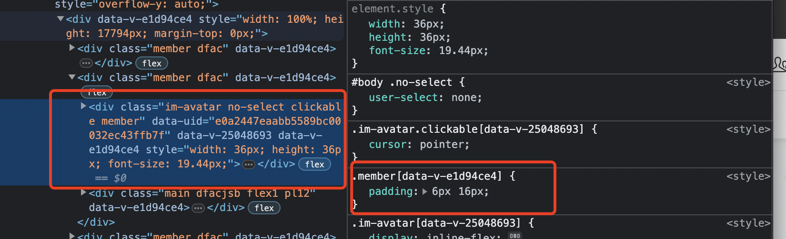

### 现象

父组件添加 scoped 样式，对子组件同类名元素生效导致子组件样式被污染

### 原因

当子组件根元素类名和父组件某一元素类名相同时，父组件类名样式即使添加了 scoped，也会对子组件根元素生效

根据查看 dom 结构及样式，发现被污染的 dom 上存在两个 data-v-id，并且污染样式来源于父组件同类名元素



对 vue 子组件根节点自动继承父组件 id 的行为，官方文档有做出说明

[使用 scoped，父组件的样式不会泄漏到子组件中。但是，子组件的根节点将同时受到父级作用域 CSS 和子级作用域 CSS 的影响。这是设计使然，以便父级可以设置子根元素的样式以实现布局目的](https://vuejs.org/api/sfc-css-features.html#scoped-css)

vue-loader 官方文档文档中也有给出同样的说明，但是该逻辑实际是在 vue 的 render 阶段而非编译阶段，具体代码在 vue 源码 renderElementVNode 方法中

```js
// core-main/packages/server-renderer/src/render.ts
function renderElementVNode(
  push: PushFn,
  vnode: VNode,
  parentComponent: ComponentInternalInstance,
  slotScopeId: string | undefined,
) {
  const tag = vnode.type as string
  let { props, children, shapeFlag, scopeId, dirs } = vnode
  let openTag = `<${tag}`
  ...
  if (scopeId) {
    openTag += ` ${scopeId}`
  }
  // inherit parent chain scope id if this is the root node
  let curParent: ComponentInternalInstance | null = parentComponent
  let curVnode = vnode
  while (curParent &amp;&amp; curVnode === curParent.subTree) {
    curVnode = curParent.vnode
    if (curVnode.scopeId) {
      openTag += ` ${curVnode.scopeId}`
    }
    curParent = curParent.parent
  }
  if (slotScopeId) {
    openTag += ` ${slotScopeId}`
  }
  push(openTag + `>`)
  ...
}
```

该部分代码在渲染子组件时会判断当前元素是否是子组件根节点，如果是则会将自己的 scopeId 和父组件 scopeId 一并添加到元素属性上，这里的 scopeId 就是浏览器控制台中看到的 dom 中的 data-v-xx

### 解决方案

父组件元素与子组件根节点避免同名、开发中慎用单字类名
