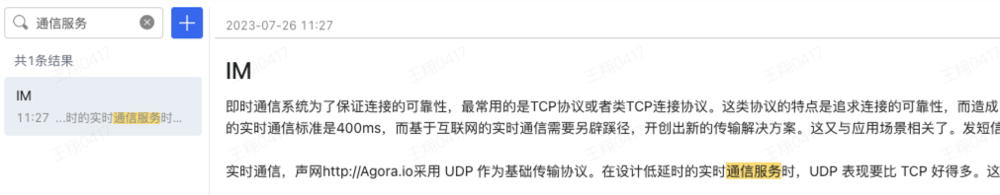
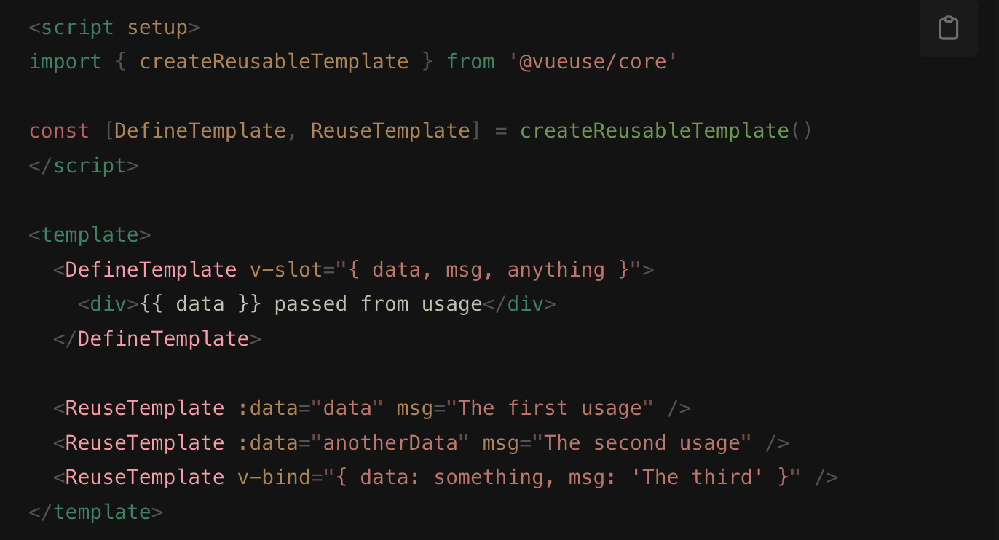

**在绝大多数情况下，Vue 推荐使用模板语法来创建应用**。

先思考一下，你平时在 Vue 中是如何写模板代码的？

在业务场景下，我会优先选择 template 语法，因为更加直观和易读。template 中 html 代码一把梭，除非遇到可复用的组件或代码量比较大的组件，会选择封装成一个组件引入。

而对于 JSX 语法，只有在极少数 template 实在不好解决的情况下才会使用，其余 **99% 的场景下都会使用 template 语法**。

## 何时使用 JSX 语法

JSX 的本质是 createVNode，`h()`函数的内部执行的也是 createVNode 来生成虚拟 DOM 的，但是由于`h()`函数比较难写，所以我们使用 JSX 来更加方便快捷的书写。

之前我们提过在绝大多（99%）情况下，Vue 推荐使用模板语法来创建应用。那么另外的 1% 使用 JSX 的情况都有哪些？

我们来看几个例子：

### 案例 1

一个巨典型的例子，通过 level prop 动态生成标题的组件时，你可能很快想到这样实现：

```vue
<template>
  <h1 v-if="level === 1">
    <slot></slot>
  </h1>
  <h2 v-else-if="level === 2">
    <slot></slot>
  </h2>
  <h3 v-else-if="level === 3">
    <slot></slot>
  </h3>
</template>
<script setup>
defineProps<
  level: number
>()
</script>
```

这里用 template 模板并不是最好的选择，在每一个级别的标题中重复书写了部分代码，不够简洁优雅。如果尝试用 JSX 来写，代码就会变得简单很多：

```jsx
const LevelHeading = () => {
  const tag = `h${this.level}`
  return <tag>{this.$slots.default}</tag>
}
```

### 案例 2

如果有这样一个场景：template 模板中包含很小并且重复的代码片段（不适合用 v-for 处理的代码），因为没有可复用性，并且代码量较少，抽出来单独封装一个组件反而代码量更大了，这种情况该如何处理呢 🧐？

#### React 中处理

如果你刚好有接触过 React 代码，那么你很快就能想到在 React 可以在一个函数式组件内声明对应的小组件，在函数式组件中可以这样写：

```jsx
const App: FC = () => {
  return (
    <>
      <Demo msg="msg1" />
      这里是个隔断，没法循环
      <Demo msg="msg2" />
    </>
  )
}
const Demo: FC<{ msg: string }> = ({ msg }) => {
  return <div>demo msg is {msg} </div>
}
```

但在 Vue 中没法直接像 React 一样在单文件中声明其他组件，如果想复用代码，只能通过抽离封装组件的方式。

可是这么点代码我还封装个组件，创建文件再引入的工作量可比我直接 CV 大多了 😝。

那有没有什么办法可以让 Vue 中也可以声明其他组件呢？
且看下面这个案例。

#### Vue 组件中定义组件


上图是我在需求中实现的一个具体案例，要求搜索的时候两边同时高亮展示搜索到的内容，先看下使用 template 语法的代码：

##### template 语法实现

```vue
<template>
  <section class="memo-list__content-item">
    <!-- 概要 -->
    <section class="item-title">
      <!-- 搜索内容超出概要可展示字符长度时前面展示... -->
      <span v-if="searchIndex > CONTENT_CUT_LENGTH"
        >{{searchIndex - 4 ? <span>...</span> : ''}}</span
      >
      <span>{{ content.slice(searchIndex - 4, searchIndex) }}</span>
      <!-- 高亮展示搜索结果 -->
      <span style="background: #fae086">{{
        content.slice(searchIndex, searchValue.length + searchIndex)
      }}</span>
      <span>{{ content.slice(searchValue.length + searchIndex) }}</span>
    </section>
    <!-- 内容 -->
    <section class="item-content">
      <span>{{ content.slice(0, searchIndex) }}</span>
      <!-- 高亮展示搜索结果 -->
      <span style="background: #fae086">{{
        content.slice(searchIndex, searchValue.length + searchIndex)
      }}</span>
      <span>{{ content.slice(searchValue.length + searchIndex) }}</span>
    </section>
  </section>
</template>

<script setup>
import { computed } from 'vue'
const searchIndex = computed(() => props.searchValue.indexOf(searchValue))
</script>
```

通过上面的代码，我们可以看到在对搜索内容进行 slice 截断处理，以展示搜索结果时，概要和内容区域做了重复性工作，而且这部分代码抽离再封装组件也不实际，要是能像 React 那样组件中再定义小组件就好了。

这时候就可以利用 JSX 来优化这部分代码。

Vue 与 React 中 JSX 语法的不同：

1. React 定义类名使用 className，而 Vue 中直接使用 class 即可；
2. Vue 中插槽的传递[passing-slots](https://cn.vuejs.org/guide/extras/render-function.html#passing-slots)等价于 React 中的 props.children + renderProps；
3. ...

##### 使用[defineComponent](https://cn.vuejs.org/api/general.html#definecomponent)搭配 JSX 创建小组件

defineComponent 搭配 Composition API 和渲染函数一起使用，接收 props 和 setup 上下文，返回值是一个渲染函数（`h()`或者 JSX）。

```vue
<template>
  <section class="memo-list__content-item">
    <!-- 概要 -->
    <section class="item-title"><SearchContent :searchValue="searchValue" :content="item.title" /></section>
    <!-- 内容 -->
    <section class="item-content"><SearchContent :searchValue="searchValue" :content="item.content" /></section>
  </section>
</template>
<script setup lang="tsx">
// 使用JSX创建组件
const SearchContent = defineComponent({
  name: 'SearchContent',
  props: {
    searchValue: {
      type: String,
      default: ''
    },
    content: {
      type: String,
      default: ''
    }
  },
  setup(props) {
    const searchValue = props.searchValue
    const content = props.content
    const index = content.indexOf(searchValue)

    if (index === -1) return content

    const searchIndex = searchValue.length + index

    // 搜索结果
    const extraContent = startIndex => (
      <>
        {startIndex ? <span>...</span> : ''}
        <span>{content.slice(startIndex, index)}</span>
        <span style='background: #fae086'>{content.slice(index, searchIndex)}</span>
        <span>{content.slice(searchIndex)}</span>
      </>
    )
    if (searchIndex > CONTENT_CUT_LENGTH) return extraContent(index - 4)
    return extraContent(0)
  }
})
</script>
```

##### `<script setup>`中更简单的写法

在`<script setup>`中既可以像上面提到的使用`defineComponent`来定义子组件，也可以直接像 React 中那样定义子组件，即一个函数式组件，参考官方文档[函数式组件](https://cn.vuejs.org/guide/extras/render-function.html#functional-components)一章，接收 props 和上下文对象，返回 JSX 或`h()`函数。

```vue
<template>
  <!-- 概要 -->
  <section class="item-title">
    <RenderSearchContent :searchValue="searchValue" :content="item.title" />
  </section>
  <!-- 内容 -->
  <section class="item-content">
    <RenderSearchContent :searchValue="searchValue" :content="item.content" />
  </section>
</template>
<script setup lang="tsx">
// 接收 props 和 setup上下文对象
const RenderSearchContent = ({ content = '', searchValue }) => {
  const index = content.indexOf(searchValue)

  if (index === -1) return content

  const searchIndex = searchValue.length + index

  // 搜索结果
  const extraContent = (startIndex) => (
    <>
      {startIndex ? <span>...</span> : ''}
      <span>{content.slice(startIndex, index)}</span>
      <span style="background: #fae086">
        {content.slice(index, searchIndex)}
      </span>
      <span>{content.slice(searchIndex)}</span>
    </>
  )
  if (searchIndex > CONTENT_CUT_LENGTH) return extraContent(index - 4)
  return extraContent(0)
}
</script>
```

这样比 defineComponent 简单，并且以函数式组件写的组件更符合我们平时的习惯，我推荐大家这样写，有宝马还要什么自行车呢。

##### createReusableTemplate

最近看到 antfu 大佬已经实现了在 .vue 模板中重复使用模板的钩子[createReusableTemplate](https://vueuse.org/core/createReusableTemplate/)，大佬就是大佬，别人还在想的事情，他就实现了 🐮。有兴趣可以尝试尝试。



关于 createReusableTemplate 的由来可以看这个讨论：https://github.com/vuejs/core/discussions/6898

## 总结

本文从一个实际例子出发，讲述了如何利用 JSX 和函数式组件来优化我们的代码，了解了`defineComponent`和函数式组件在 Vue3 中的使用，可以尝试着去在项目里使用一下。但就如本文最开始提到的“在绝大多数情况下，Vue 推荐使用模板语法来创建应用”，如果有些实在觉得不好处理的再选择使用 JSX 去解决。

以上就是本文的全部内容，希望这篇文章对你有所帮助，欢迎点赞和收藏 🙏，如果发现有什么错误或者更好的解决方案及建议，欢迎随时联系。
