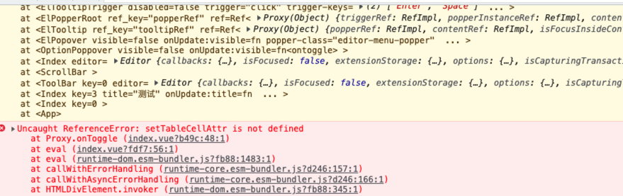
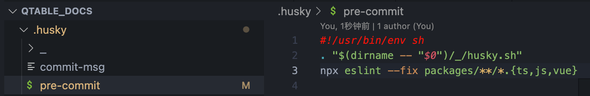
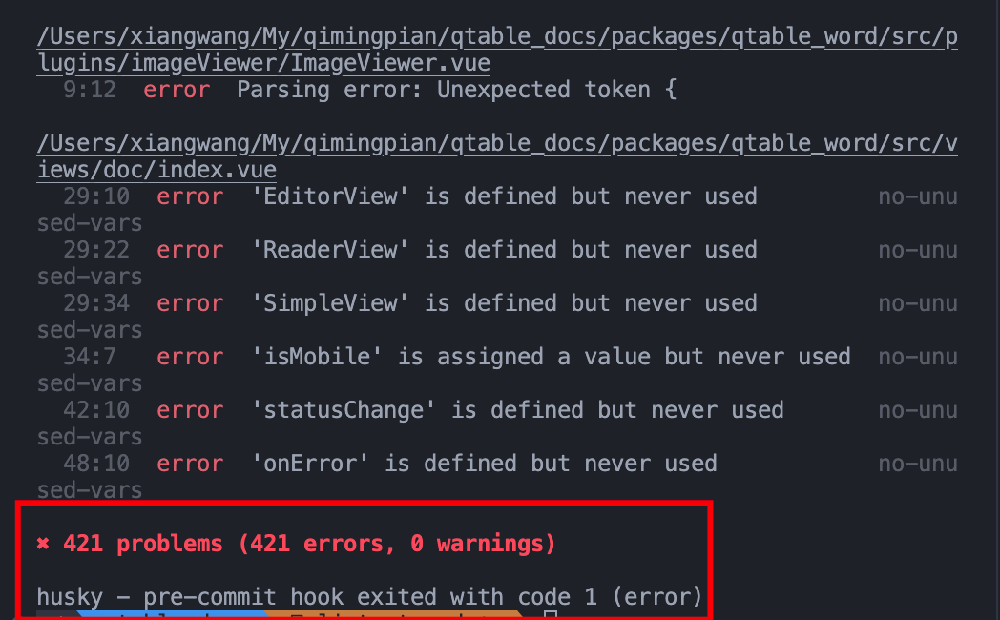
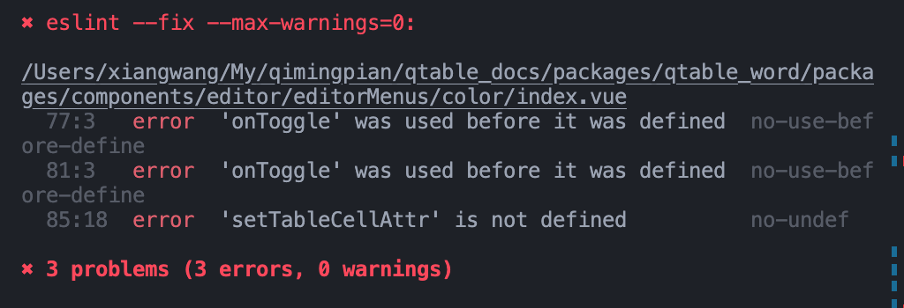

## 前言

上周在项目开发时，因为自己的疏忽造成了一个低级的线上问题，还好没有造成大的影响，不然领导会直接嘎了我（毕竟是个新人）。


**为什么会有这种低级错误呢？**
我看了一下，这项目虽然添加了 eslint，但所有的 rules 都设置成了`off`，所以不管你怎么写，代码都不会报错，wtf😪。

为了给其他人上上强度，也为了自己以后不再犯这种低级错误，拿这个项目来练练手，正好用来应付领导的盘问。

## husky

[说明文档](https://typicode.github.io/husky/#/)
简单来说，husky 是一个 git hook 工具，可以帮助我们在 git 操作之前与之后可设置自动执行的脚本，像：`pre-commit`、`commit-msg`、`pre-push` 等等支持的 [git hooks](https://git-scm.com/docs/githooks)。

那为什么不直接使用 git hook，而要使用 husky 呢？
原因很简单，git 自带的钩子需要在`.git/hooks` 目录中进行修改，而这里的文件并没有共享到代码库，无法和项目组成员共享。

- 安装

  ```bash
  npm install husky --dev
  # use yarn
  yarn add husky --dev
  ```

- 初始化 husky 配置

  执行此命令后，会在当前目录下创建.husky 目录，用于放置 husky hooks

  ```bash
  yarn husky install
  ```

- 配置 husky 自动安装，方便项目组其他成员使用

  npm 脚本有 pre 和 post 两个钩子，以便于我们在执行`npm install`、`npm publish`、`npm build`等命令之前或之后执行脚本。
  在这里我们添加 `prepare` 钩子，当执行完 `npm install` 后，将自动执行 `husky install` 初始化 husky 配置

  ```json
   "scripts": {
    "prepare": "npx husky install"
   }
  ```

  > prepare 是 NPM 操作生命周期中的一环，在执行 install 的时候会按生命周期顺序执行相应钩子：NPM7：preinstall -> install -> postinstall -> prepublish -> preprepare -> prepare -> postprepare

- 添加 pre-commit hook

  ```bash
  npx husky add .husky/pre-commit "npx eslint --fix packages/**/*.{ts,js,vue}"
  ```

  执行完成后，就会在.husky 目录下生成 pre-commit 文件
  
  这样当提交代码前，就会首先触发 pre-commit，自动执行 eslint 检查功能，并且后在校验失败时自动退出，这样可以确保本地的代码已经通过检查才能 push 到远程。
  

  这么多报错？什么鬼 👹？

  当然，如果你能确保你的代码没有任何问题又觉得 eslint 费时间，或者说这块代码是别人写的，为什么要我改，那么也可以直接跳过 husky。

  ```bash
  git commit -m "" --no-verify
  ```

  Vue3 项目 报错‘defineProps‘ is not defined 的解决方法

- [官方解决方案](https://eslint.vuejs.org/user-guide/#compiler-macros-such-as-defineprops-and-defineemits-generate-no-undef-warnings)
- [eslint global](https://eslint.org/docs/latest/use/configure/language-options#using-configuration-files-1)

## lint-staged

在前面我们使用 husky 和 eslint 对提交前的代码进行检查时，可以看到我们项目里竟然存在 400 多个 eslint 问题，可是我只改了一个文件，难不成我要把所有的问题都给修复了？
算了，还是采用`--no-verify`吧，让其他人去修。

真实项目开发中，基本都会遇到这个问题，我只改了 A 文件，结果全部文件的报错信息都冒了出来。

这时候我们就可以借助[lint-staged](https://github.com/okonet/lint-staged)对已经通过 `git add` 加入到 提交区 stage 的文件进行扫描即可。

- 安装

  ```bash
  npm install lint-staged --dev
  # use yarn
  yarn add lint-staged --dev
  ```

- 配置

  在 package.json 中配置 lint-staged

  ```json
  "lint-staged": {
    "packages/**/*.{js,jsx,ts,tsx,json,css,scss,md,vue}": [
      "eslint --fix --max-warnings=0"
    ]
  },
  ```

  这里我只开启 eslint 校验，防止代码再出现一些低级错误。

- 修改 pre-commit 钩子

  ```bash
  #!/usr/bin/env sh
  . "$(dirname -- "$0")/_/husky.sh"
  # npx eslint --fix packages/**/*.{ts,js,vue}
  npx lint-staged
  ```

这样一来，当执行 git commit 命令提交代码时，会自动执行 husky 下的 pre-commit 脚本，即执行 lint-staged 命令。对暂存区文件执行 eslint 校验，而不是针对全部文件。


解决完这几个问题，就可以愉快的提交代码了。

## TODO

- 添加 prettier 到 pre-commit 钩子，现在加上怕有很多问题，导致和代码好多冲突，等版本稳定了，全局 prettier 一下，再让大家重新拉下最新的代码。
- 添加 commitlint 规范 commit message
