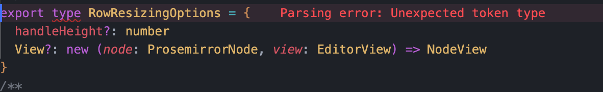
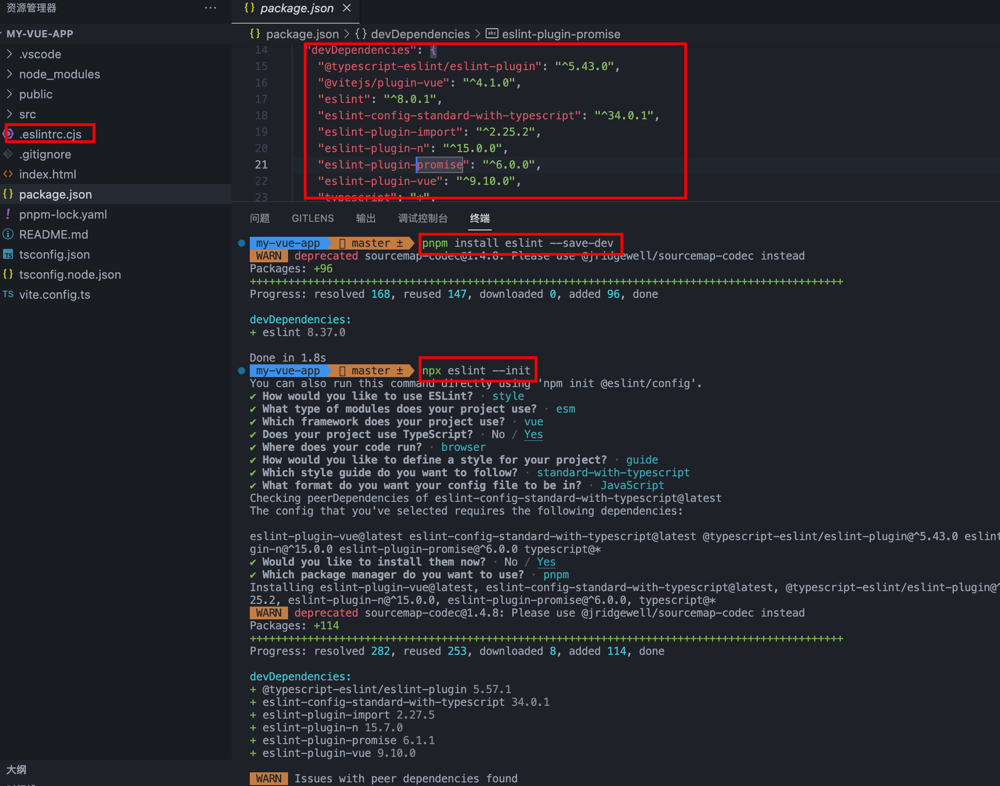
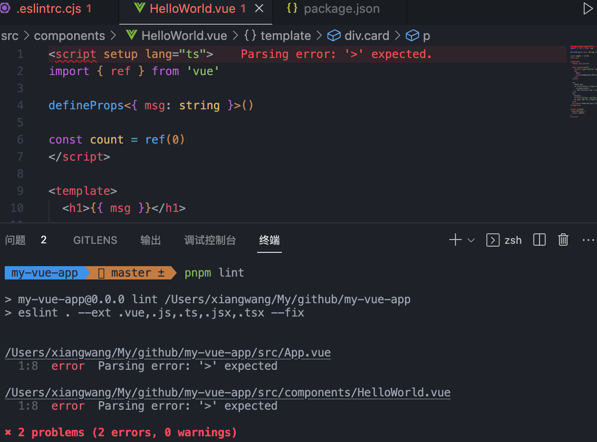
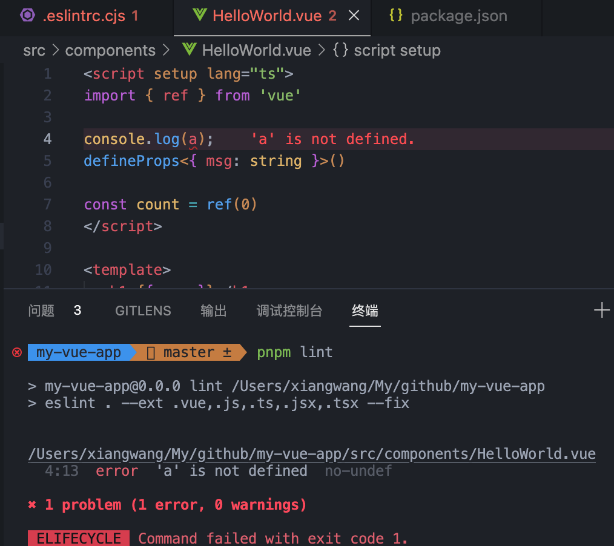
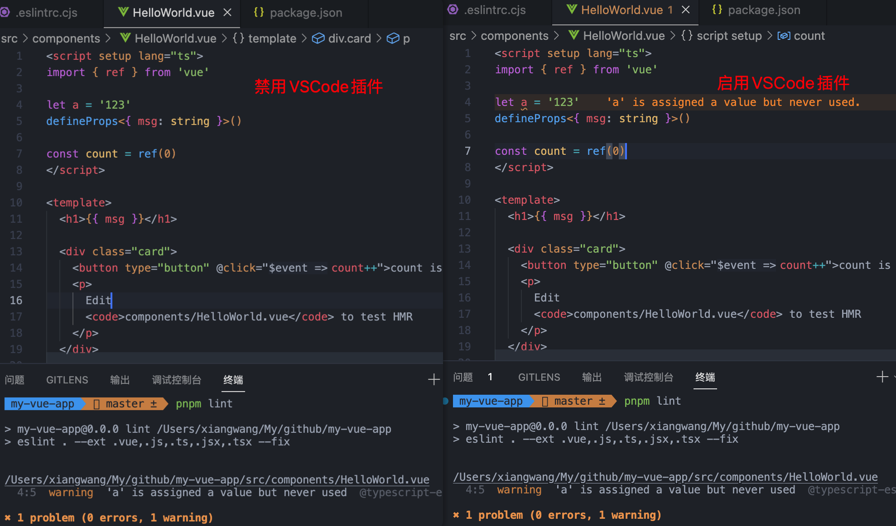
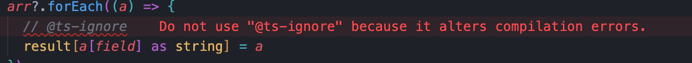

## 问题 Parsing error: Unexpected token type



## 解决方法

通过万能的百度，很快就找到了解决问题的方法，只需要在 parserOptions.parser 中配置`@typescript-eslint/parser`即可

```js
module.exports= {
  ...
  parser: 'vue-eslint-parser',
  parserOptions: {
    sourceType: 'module',
    ecmaVersion: '2021',
    parser: '@typescript-eslint/parser'
  }
  ...
}
```

看一下[官方解释](https://eslint.vuejs.org/user-guide/#how-to-use-a-custom-parser)

如果想自定义解析器，那么必须使用 parserOptions.parser 选项，而不是直接修改 parser 选项，原因是 eslint 需要 vue-eslint-parser 来解析 .vue 单文件组件，所以如果覆盖 parser 选项，vue-eslint-parser 插件就不会生效了。

很顺利，代码不报错了，问题解决了，相信大部分人到这里就停了（也包括我哈）。

**但是问题虽然解决了，eslint 的那些配置项你都懂吗？就没有兴趣深入了解一下吗？**

跟着我的步骤一起来深度探讨下 ESLint 吧！

## ESLint

不知道有多少人认真读过[ESLint 官网](https://eslint.bootcss.com/docs/user-guide/configuring)，反正我到今天前连打开都没打开过 🤦。为啥呢？因为大多数脚手架在搭建时都配置好了，我们只需要用就行，就算有问题了也可以直接在百度找到答案。所以，读什么文档，没必要啊。


确实，像 react、vue 这些框架或 ant-design、element 这些 UI 库，因为我们要靠这些来"造火箭"，所以基本都会看一遍文档，或者是有问题就会去翻文档；但 eslint 这种基本都是能用就行，用不着理解。

下面我会把我读完后觉得有用的知识点总结出来，提供给大家学习，各位小伙伴动动你的小手指给个赞吧 👍。

### 初始化项目

我们用 vite 来创建一个 vue3+ts 项目，完了之后安装 eslint

```bash
# npm
npm install eslint --save-dev
# yarn
yarn add eslint
# 安装完成后执行
npx eslint --init
```


通过执行`eslint init`初始化 eslint 配置，通过选择配置项的形式会提示安装相应的 eslint 插件，最终完成后生成`.eslintrc.cjs`文件。

接着执行 `npx eslint .`校验当前路径所有文件中的问题 或 `npx eslint . --fix` 校验并修复当前目录下所有文件中的问题。

为了方便，我们可以在 package.json 的`scripts`添加一个脚本：

```json
{
  "scripts": {
    ...
    "lint": "eslint . --ext .vue,.js,.ts,.jsx,.tsx --fix"
  }
}
```

接着咱们来执行下 lint 操作`pnpm lint`，发现报错如下：



**为什么呢？**

因为 eslint 默认不会解析.vue 单文件组件，所以需要额外的解析器`vue-eslint-parser`来解析单文件组件。修改.eslintrc.cjs 文件，将 parser 改为`vue-eslint-parser`，同时在 parserOptions 中添加字段`parser`设置为`'@typescript-eslint/parser'`，后面再做详细解释，我们先来执行下 lint 操作，看看效果如何。



可以看到，已经能正常的显示出 vue 单文件组件的报错了。

### VSCode ESLint 插件

也许很多人会纳闷，我都已经装了 ESLint npm 包，为什么还要安装 ESLint VSCode 插件呢？

我们可以尝试先把 VSCode 插件禁用掉，执行 lint 操作如下，然后再开启 VSCode 插件，对比如下：


通过对比可以看出来，这俩都是用来检验代码的格式，VSCode 的插件的作用是当出现 ESLint 问题时，在编辑器中实时显示错误。这样在我们开发的过程中就可以看到错误，并解决掉；而不是等到提交时再通过手动执行`npx eslint .`才发现错误。

**那是不是有了 VSCode 插件，就可以不需要 npm 的包了？**

当然不是，毕竟项目代码是团队合作，如果有些人本地不装 ESLint 插件，或者故意禁用掉 🤮，那么如果没有 ESLint 的约束，就不能保证项目内统一的代码规范和编码风格。所以一般会在提交前进行 ESLint 的校验，参考我的这篇文章[vue3 项目添加 husky+lint-staged 配置](https://juejin.cn/post/7215454235046445112)。

当然也可以在 VSCode 的配置中，开启 ESLint “保存时自动修复”的功能：

```json
"editor.codeActionsOnSave": {
  "source.fixAll.eslint": true
}
```

### ESLint 文件格式

ESLint 支持几种格式的配置文件：

- JavaScript - 使用 .eslintrc.js 然后输出一个配置对象。
- YAML - 使用 .eslintrc.yaml 或 .eslintrc.yml 去定义配置的结构。
- JSON - 使用 .eslintrc.json 去定义配置的结构，ESLint 的 JSåON 文件允许 JavaScript 风格的注释。
- (弃用) - 使用 .eslintrc，可以是 JSON 也可以是 YAML。
- package.json - 在 package.json 里创建一个 eslintConfig 属性，在那里定义你的配置。

它们的优先级顺序如下：`.eslintrc.js > .eslintrc.yaml > .eslintrc.yml > .eslintrc.json > .eslintrc > package.json`

### 配置项详解

通过第一步，我们初始化 eslint 后得到的配置文件如下：

```js
module.exports = {
  env: {
    browser: true,
    es2021: true,
    node: true,
  },
  extends: [
    'eslint:recommended',
    'plugin:vue/vue3-essential',
    'plugin:@typescript-eslint/recommended',
  ],
  overrides: [],
  parser: 'vue-eslint-parser',
  parserOptions: {
    ecmaVersion: 'latest',
    sourceType: 'module',
    parser: '@typescript-eslint/parser',
  },
  plugins: ['vue', '@typescript-eslint'],
  rules: {},
}
```

下面我们一一过下这些个配置。

- root

  上面配置中没有这个规则，这里稍微提一嘴。root 一般在 monorepo 项目中会比较常见，首先我们知道 ESLint 在当前目录下查找上面的几种配置文件，如果找不到的话就会在父级目录找，一直到文件系统的根目录，而如果 ESLint 配置文件中有 "root": true，就会停止在父级目录中寻找。

- env

  env 是`Environments`的简写，用来指定代码在哪种环境中运行。
  每个环境都有特定的预定义全局变量，比如上面的`env: { browser: true }`表示启用 ES12 的全局变量和类型，搭配`parserOptions: { ecmaVersion: 'latest' }`启用 ES12 的语法，这样配置 ESLint 就会支持最新的 ES 语法，ESLint 会自动校验语法上的错误。

  并且这些环境不是互斥的，可以定义多个环境，如上面的配置同时还启用了 browser 浏览器环境和 Node.js 的环境，所以 env 字段其实就是设置全局变量（多个环境）。

- extends & plugins

  这俩放一起看，先看 extends 的属性值设置，有以下几种：

  1. 字符串 eslint:recommended 或 eslint:all

     ESLint 默认实现的两种最佳实践，当配置为 eslint:recommended 表示开启 ESLint[推荐的规则](https://eslint.bootcss.com/docs/rules/)；而 eslint:all 代表开启所有的规则（官方不推荐此规则）

  2. 字符串 standard/airbnb...

     这类规则称为[可共享的配置](https://eslint.bootcss.com/docs/developer-guide/shareable-configs)，是一个 npm 包。

     这种 ESLint 配置都是继承社区整理好的配置规则，比如流行的风格指南[eslint-config-airbnb](https://github.com/airbnb/javascript/tree/master/packages/eslint-config-airbnb)和[eslint-config-standard](https://github.com/standard/eslint-config-standard)。

     写的时候可以可以省略包名的前缀 eslint-config-，直接`extends: 'airbnb'`即可。

  3. 字符串 plugin:xxx

     这类规则需要搭配[plugins](https://eslint.bootcss.com/docs/developer-guide/working-with-plugins)字段使用，插件可以是一个命名格式为 `eslint-plugin-<plugin-name>` 的 npm 模块，或者包作用域下，格式为`@<scope>/eslint-plugin-<plugin-name>`。比如上面配置中我们添加了`['vue', '@typescript-eslint']`这两个就是我们通过 npm 安装的 eslint-plugin-vue 和@typescript-eslint/eslint-plugin 这两个 ESLint 插件。

     > eslint-plugin-vue 会对 vue 项目做了一些定制的 eslint 规则，@typescript-eslint/eslint-plugin 会对 ts 项目做一些定制的 eslint 规则。

     然后需要在 extends 中配置`'plugin:vue/vue3-essential', 'plugin:@typescript-eslint/recommended'`来启用这些插件，这些插件默认和 ESLint 一样会默认实现了两种最佳实践 all 和 recommened，vue 中实现了 vue3-essential 的规则集，可以直接使用它配置好的规则集。

     书写的规则是 plugin:包名 (省略了前缀，比如 vue)/配置名称 (比如 vue3-essential)

  4. 字符串数组

     组合前面三种写法，后面的配置继承它前面的配置。

- overrides

  ESLint 配置中的规则默认是对全局生效，如果想要针对特定文件覆盖一些规则，就可以使用 overrides 属性。

  ```js
  // 关闭覆盖测试文件no-unused-expressions校验
  "overrides": [
    {
      "files": ["*-test.js","*.spec.js"],
      "rules": {
        "no-unused-expressions": "off"
      }
    }
  ]
  ```

- parser & parserOptions

  ESLint 默认使用[Espree](https://github.com/eslint/espree)作为其解析器，它是兼容 Esprima 的 JavaScript 解析器，同时兼容以下三种解析器：

  - [esprima](https://esprima.org/)：ESLint 早期的默认解析器；
  - [@babel/eslint-parser](https://www.npmjs.com/package/@babel/eslint-parser)：babel 解析器，使得 ES6 及更高级的语法能够与 ESLint 兼容；
  - [@typescript-eslint/parser](https://www.npmjs.com/package/@typescript-eslint/parser)：TS 解析器，将 TypeScript 转换成与 espree 兼容的格式，使得 TS 语法能够使用 ESLint 校验，比如上面我们为 vue3+ts 项目配置 ESLint 的时候，默认的解析器就是@typescript-eslint/parser。

  **那么 parseOptions 解析器选项又是什么东西呢？**

  如果仅从名字来看，可以知道 parseOptions 是对 parse 的补充扩展，官方的解释是：`在使用自定义解析器时，为了让 ESLint 在处理非 ECMAScript 5 特性时正常工作，配置属性 parserOptions 仍然是必须的`。我们可以看下它里面的几个特殊配置：

  - ecmaVersion：代表 ECMAScript 版本，可以是数字 6，7.. 或 latest 代表最新的 ECMAScript 版本；
  - sourceType：默认 script，如果是 ECMAScript 模块时设置为 module；
  - ecmaFeatures：对象，表示额外的语言特性，包含`globalReturn`、`jsx`、`impliedStrict`、`experimentalObjectRestSpread`几个选项，一般情况下不需要配置。

  除了以上三个配置，还有一个比较重要的配置`parser`，乍眼一看，咦！这不是上面的解析器 parser 一样吗？

  其实我一开始也不知道，然后在解决最开始的那个问题的时候，看了下[eslint-plugin-vue 官方的解决](https://eslint.vuejs.org/user-guide/#what-is-the-use-the-latest-vue-eslint-parser-error)，如果需要配置@typescript-eslint/parser 解析器时，需要将它移到`parseOptions.parser`上，这样就不会与 vue-eslint-parser 冲突。因为 ESLint 默认不会解析.vue 单文件组件，需要额外的解析器 vue-eslint-parser 来解析 .vue 单文件组件，如果使用@typescript-eslint/parser 覆盖 parser 时，eslint-plugin-vue 将不会生效，ESLint 也就不会校验.vue 单文件组件了。

  两个 parser 的区别在于，`parser`配置`vue-eslint-parser`解析器用来处理 .vue，使得 eslint 能解析.vue 单文件组件，尤其是`<template>`标记，而 `parserOptions.parser`，即@typescript-eslint/parser 用来解析单文件组件中`<script>`标签中的代码。

- rules

  ESLint 官方推荐继承`eslint:recommended`来开启[推荐的规则](https://eslint.bootcss.com/docs/rules/)，包含大量规则，而如果我们需要开启或关闭某些规则时，就需要通过 rules 配置。如果需要修改时，只需要将`规则名:规则ID`添加到 rules 配置中，规则 ID 可以配置为以下三种：

  - off 或 0 - 关闭规则；
  - warn 或 1 - 开启规则，当遇到此错误时不会报错，也不会导致程序退出；
  - error 或 2 - 开启规则，当遇到此错误时报错，并且程序会退出。

  比如默认规则如果在 ts 中使用`@ts-ignore`不校验 ts 代码时，代码是会报错的
  
  这时候就可以配置`'@typescript-eslint/ban-ts-comment': 'off'`关闭这个规则；

  有些规则如`"quotes": ["error", "double"]`还可以有自己的属性进行配置。

  并且需要注意的是，**rules 中配置的规则的权重是最大的，会覆盖掉 extends 和 plugins 中引入的配置项获插件，即我们可以通过 rules 来自定义规则，而不是完全按照官方配置中的来。**

- globals

  如果在项目中使用一个未定义的全局变量时，就会造成`no-undef`规则报错，解决它的方式就是将全局变量添加到`globals`配置中，这样再使用时就不会产生错误。

## 如何规避 ESLint 检查

- 配置.eslintignore

  根目录下创建.eslintignore 文件用于对特定文件忽略 ESLint 校验，类似于.gitignore。

  ```txt
  /test
  /dist
  /node_modules
  /public
  ```

- 单行代码注释

  `eslint-disable-line`在当前行禁用 ESLint 校验，`eslint-disable-next-line`禁用下行代码的 ESLint 校验。

  ```js
  console.log(a) // eslint-disable-line
  // console.log(a);  // eslint-disable-line no-console, no-undef
  const count = ref(0)
  // eslint-disable-next-line
  a.b
  ```

- 多行代码注释

  单独使用`/* eslint-disable */`（关闭从当前注释开启的所有行的 ESLint 校验）或搭配`/* eslint-enable */`（到此行注释前的所有行的 ESLint 校验），如下面代码所示：如果去掉`/* eslint-enable */`时`a.b`就不不会出现 ESLint 报错提示，在`a.b`上一行加上后，就只对`/* eslint-disable */`和`/* eslint-enable */`之间的代码有效，ESLint 就不再校验两个注释之间的代码问题。

  ```js
  /* eslint-disable */
  console.log(a)
  
  const count = ref(0)
  /* eslint-enable */
  a.b
  ```

  也可以设置`/* eslint-disable no-undef */`来禁用特定规则。

## 总结

当然，我们不能保证每个人都启用 ESLint 插件，所以一般会在提交前利用`git hooks`来对提交到仓库的代码统一进行 ESLint 校验，请参考我的这篇文章[vue3 项目添加 husky+lint-staged 配置](https://juejin.cn/post/7215454235046445112)。

此文从一个很常见的问题引出一系列问题，遇到问题解决了就完事，并不清楚原因，暴露出的问题就是对概念不清晰、只会用而没有理解原理。希望各位小伙伴们在读文本文之后，能养成一个好习惯：不仅仅只关注问题的表面，要深入挖掘，总会有你不懂的点，弄懂了不就学到了嘛！

以上就是本文的全部内容，希望这篇文章对你有所帮助，欢迎点赞和收藏 🙏，如果发现有什么错误或者更好的解决方案及建议，欢迎随时联系。
