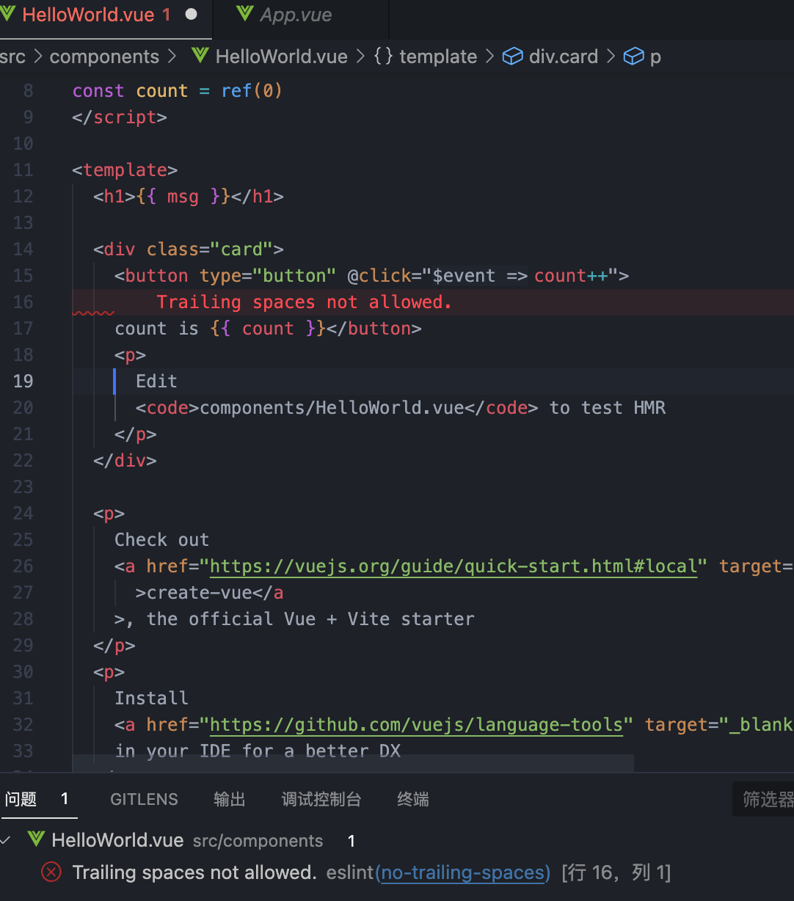

## 问题

Parsing error: Unexpected token type


## 解决方法

通过万能的谷歌，很快就找到了解决问题的方法，只需要在 parserOptions.parser 中配置`@typescript-eslint/parser`即可

```js
module.exports= {
  ...
  parser: 'vue-eslint-parser',
  parserOptions: {
    sourceType: 'module',
    ecmaVersion: '2021',
    parser: '@typescript-eslint/parser'
  }
  ...
}
```

看一下[官方解释](https://eslint.vuejs.org/user-guide/#how-to-use-a-custom-parser)

如果想自定义解析器，那么必须使用 parserOptions.parser 选项，不能修改 parser 选项。因为 eslint 需要 vue-eslint-parser 来解析 .vue 文件，所以如果覆盖 parser 选项，vue-eslint-parser 插件就不会生效了。

很顺利，代码不报错了，问题解决了，相信大部分人到这里就停了（也包括我哈）。

问题虽然解决了，eslint 的那些配置项你都懂吗？就没有兴趣深入了解一下吗？

## ESLint

不知道有多少人认真读过[ESLint 官网](https://eslint.bootcss.com/docs/user-guide/configuring)，反正我到今天前是没有读过，一般都是“拿来主义”，网上随便 copy 一份过来直接用。这让我不自觉的想起来这张图


确实，像 react、vue 这些框架或 ant-design、element 这些 UI 库，因为咱要靠这些来赚钱，所以基本都会看一遍文档，或者是有问题就会去翻文档；但 eslint 这种基本都是能用就行，用不着理解，下面我会把我读完后觉得有用的知识点总结出来，提供给大家学习。

如果你仔细看的话，我觉得读文档才是真正，你会发现你遇到的问题在文档当中都有体现，只是你没有读到而已。

### 初始化

我们用 vite 来创建一个 vue3+ts 项目，完了之后安装

很简单，是吧

```bash
# npm
npm install eslint --save-dev
# yarn
yarn add eslint
# 安装完成后执行
npx eslint init
```


通过执行`eslint init`初始化 eslint 配置，通过选择配置项的形式会提示安装相应的 eslint 插件，最终完成后生成`.eslintrc.cjs`文件。

接着执行 `npx eslint .`校验当前路径所有文件中的问题 或 `npx eslint . --fix` 校验并修复当前目录下所有文件中的问题。

### VSCode ESLint 插件

也许很多人会纳闷，为什么已经装了 ESLint npm 包，为什么还要安装 ESLint VSCode 插件呢？

为了检验代码的格式，VSCode 插件主要是自动检测不符合规范的代码，然后会出现问题



### 文件格式

首先，ESLint 支持几种格式的配置文件：

- JavaScript - 使用 .eslintrc.js 然后输出一个配置对象。
- YAML - 使用 .eslintrc.yaml 或 .eslintrc.yml 去定义配置的结构。
- JSON - 使用 .eslintrc.json 去定义配置的结构，ESLint 的 JSON 文件允许 JavaScript 风格的注释。
- (弃用) - 使用 .eslintrc，可以是 JSON 也可以是 YAML。
- package.json - 在 package.json 里创建一个 eslintConfig 属性，在那里定义你的配置。

它们的优先级顺序如下：`.eslintrc.js > .eslintrc.yaml > .eslintrc.yml > .eslintrc.json > .eslintrc > package.json`

### 配置项详解

通过第一步，我们初始化 eslint 后得到的配置文件如下：

```js
module.exports = {
  env: {
    browser: true,
    es2021: true,
  },
  extends: ['plugin:vue/vue3-essential', 'standard-with-typescript'],
  overrides: [],
  parserOptions: {
    ecmaVersion: 'latest',
    sourceType: 'module',
  },
  plugins: ['vue'],
  rules: {},
}
```

这些配置项意
