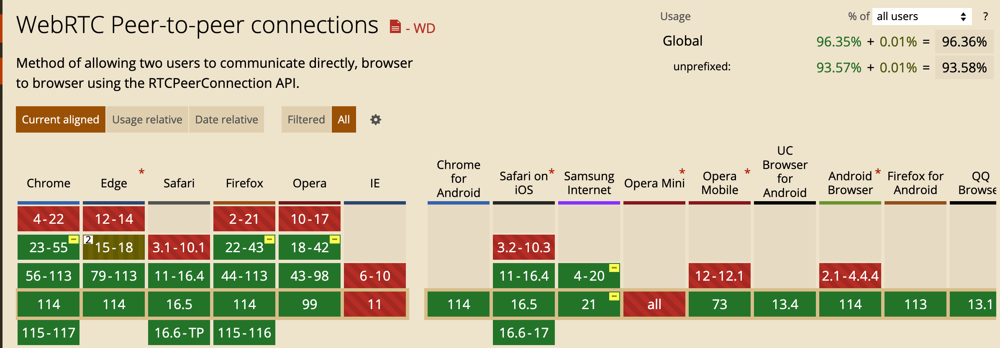

## 什么是 WebRTC

WebRTC（Web Real-Time Communications）是一项实时通讯技术，它允许网络应用或者站点，在不借助中间媒介的情况下，建立浏览器之间点对点（Peer-to-Peer）的连接，实现视频流和（或）音频流或者其他任意数据的传输。WebRTC 包含的这些标准使用户在无需安装任何插件或者第三方的软件的情况下，创建点对点（Peer-to-Peer）的数据分享和电话会议成为可能。

[WebRTC](https://developer.mozilla.org/zh-CN/docs/Web/API/WebRTC_API)

## WebRTC 发展史

2011 年开始， Google 先后收购 GIPS 和 On2，组成 GIPS 音视频引擎 + VPx 系列视频编解码器，并将其代码开源，WebRTC 项目应运而生。
2012 年，Google 将 WebRTC 集成到 Chrome 浏览器中。

## 名次解释

### ICE

### STUN

### TURN

### NAT

### SDP
